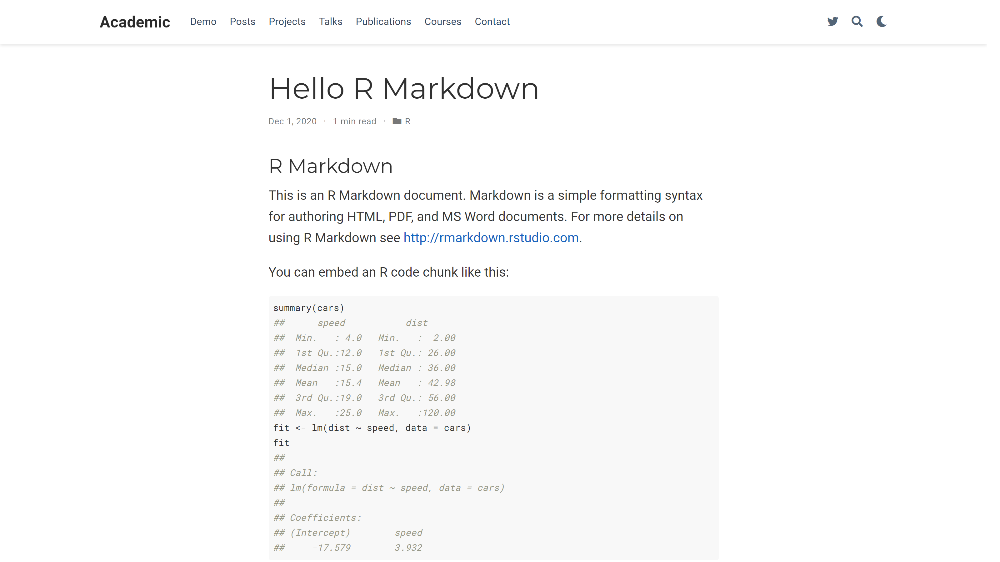
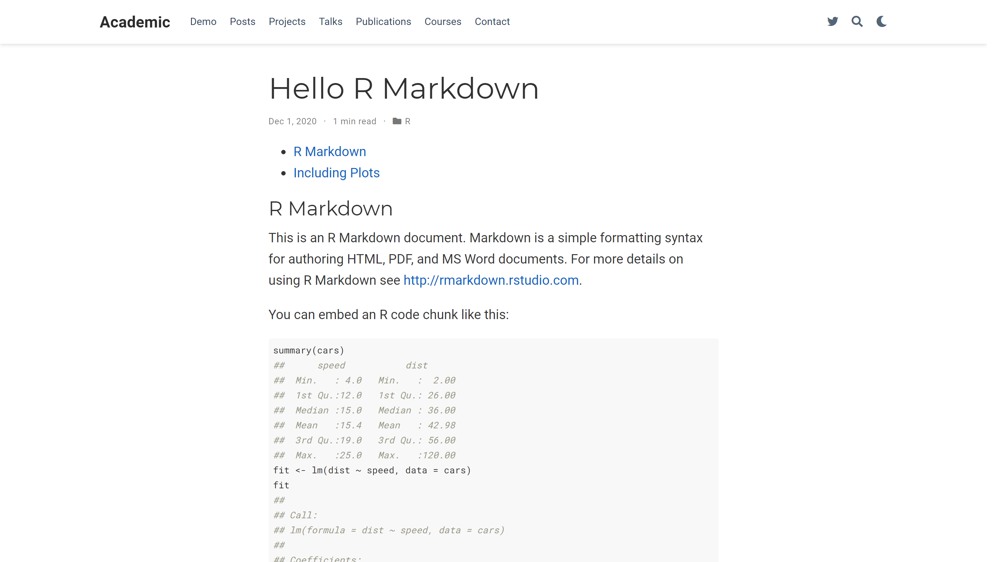

## Welcome!

Welcome to my very first blog post (_i.e._, I do not count [`ggpacman`](https://mickael.canouil.fr/post/ggpacman/)). 
The focus of this post is on `blogdown` ([github.com/rstudio/blogdown](https://github.com/rstudio/blogdown)), in particular: how to have a table of content (TOC) on either the left or the right side of a post to ease the navigation through a long post?  
In the past few weeks, I have been slowly getting my head around [`blogdown`](https://github.com/rstudio/blogdown) and [HUGO](https://gohugo.io/), to finally published online this website () about a week ago.  
One of the latest tweak I had to figure out was how to get a floating TOC
Getting a TOC is quite easy with a Rmarkdown, thus in blogdown.


```
#> ---
#> title: "Hello R Markdown"
#> author: "Frida Gomam"
#> date: 2020-12-01T21:13:14-05:00
#> categories: ["R"]
#> tags: ["R Markdown", "plot", "regression"]
#> ---
#> 
#> ```{r setup, include=FALSE}
#> knitr::opts_chunk$set(collapse = TRUE)
#> ```
#> 
#> ## R Markdown
#> 
#> This is an R Markdown document. Markdown is a simple formatting syntax for authoring HTML, PDF, and MS Word documents. For more details on using R Markdown see <http://rmarkdown.rstudio.com>.
#> 
#> You can embed an R code chunk like this:
#> 
#> ```{r cars}
#> summary(cars)
#> fit <- lm(dist ~ speed, data = cars)
#> fit
#> ```
#> 
#> ## Including Plots
#> 
#> You can also embed plots. See Figure \@ref(fig:pie) for example:
#> 
#> ```{r pie, fig.cap='A fancy pie chart.', tidy=FALSE}
#> par(mar = c(0, 1, 0, 1))
#> pie(
#>   c(280, 60, 20),
#>   c('Sky', 'Sunny side of pyramid', 'Shady side of pyramid'),
#>   col = c('#0292D8', '#F7EA39', '#C4B632'),
#>   init.angle = -50, border = NA
#> )
#> ```
```

It is rendered as in the screenshot below ("wowchemy/starter-academic" Hugo theme).  
The rendering is performed with `rmarkdown::render_site('content/post/2020-12-01-r-rmarkdown/index.en.Rmd', encoding = 'UTF-8')`.




## Default with a TOC

Let's edit the default `index.en.Rmd` file by adding three lines in the YAML header.

```markdown
---
output:
  blogdown::html_page:
    toc: true
---
```

I will also decrease headings levels to fit the default settings (see `config.yaml`).


```
#> ...
#> markup:
#>   defaultMarkdownHandler: goldmark
#>   goldmark:
#>     renderer:
#>       unsafe: true
#>   highlight:
#>     codeFences: false
#>   tableOfContents:
#>     startLevel: 2
#>     endLevel: 3
#> ...
```


With this addition, the `index.en.Rmd` looks like this (not that different, isn't it?!).


```
#> ---
#> title: "Hello R Markdown"
#> author: "Frida Gomam"
#> date: 2020-12-01T21:13:14-05:00
#> categories: ["R"]
#> tags: ["R Markdown", "plot", "regression"]
#> output:
#>   blogdown::html_page:
#>     toc: true
#> ---
#> 
#> ```{r setup, include=FALSE}
#> knitr::opts_chunk$set(collapse = TRUE)
#> ```
#> 
#> ## R Markdown
#> 
#> This is an R Markdown document. Markdown is a simple formatting syntax for authoring HTML, PDF, and MS Word documents. For more details on using R Markdown see <http://rmarkdown.rstudio.com>.
#> 
#> You can embed an R code chunk like this:
#> 
#> ```{r cars}
#> summary(cars)
#> fit <- lm(dist ~ speed, data = cars)
#> fit
#> ```
#> 
#> ## Including Plots
#> 
#> You can also embed plots. See Figure \@ref(fig:pie) for example:
#> 
#> ```{r pie, fig.cap='A fancy pie chart.', tidy=FALSE}
#> par(mar = c(0, 1, 0, 1))
#> pie(
#>   c(280, 60, 20),
#>   c('Sky', 'Sunny side of pyramid', 'Shady side of pyramid'),
#>   col = c('#0292D8', '#F7EA39', '#C4B632'),
#>   init.angle = -50, border = NA
#> )
#> ```
```

Since, we changed the YAML header, we need to render again the html file from `index.en.Rmd`.



Now we have a TOC, but it sticks to the top.

## Modify the layout of the theme ('starter-academic')

In fact, to make the TOC floating on one side, it has to be done in the theme itself (_at least a part of the solution is there_).

The basis for the answer can be found in a issue on GitHub: [wowchemy/wowchemy-hugo-modules #1520](https://github.com/wowchemy/wowchemy-hugo-modules/issues/1520).
More precisely in [@CharlieLeee](https://github.com/CharlieLeee)'s comment: [#1520#issuecomment-601982609](https://github.com/wowchemy/wowchemy-hugo-modules/issues/1520#issuecomment-601982609)

````markdown
Change the file `<root dir>/layouts/_default/single.html` as follows:

```
{{- define "main" -}}
{{ if .Params.toc }}
<div class="container-fluid docs">
    <div class="row flex-xl-nowrap">
      <div class="d-none d-xl-block col-xl-2 docs-toc">
        <ul class="nav toc-top">
          <li><a href="#" id="back_to_top" class="docs-toc-title">{{ i18n "on_this_page" </a></li>
        </ul>
        {{ .TableOfContents }}
        {{ partial "docs_toc_foot" . }}
      </div>
      <main class="col-12 col-md-0 col-xl-10 py-md-3 pl-md-5 docs-content" role="main">
{{ end }}
        <article class="article">
            {{ partial "page_header" . }}
            <div class="article-container">
              <div class="article-style">
                {{ .Content }}
              </div>
              {{ partial "page_footer" . }}
            </div>
        </article>
  {{ if .Params.toc }}
      </main>
    </div>
  </div>
  {{ end }}
{{- end -}}
```

and add the following line to the front matter of the posts you'd like to add side toc:
`toc: true`
````

What's inside the default `layouts/_default/single.html` from the 'starter-academic' theme?  
In a default installation, the file is located in the following path:  
`themes/github.com/wowchemy/wowchemy-hugo-modules/wowchemy/layouts/_default/single.html`   

```html
{{- define "main" -}}

<article class="article">

  {{ partial "page_header" . }}

  <div class="article-container">

    <div class="article-style">
      {{ .Content }}
    </div>

    {{ partial "page_footer" . }}

  </div>
</article>

{{- end -}}

```

We do not want to modify any of the files under the `themes` directory, so we will create a new file at the root directory (`layouts/_default/single.html`).  
I am not going to use the code proposed and quoted above, but instead a slight modification to make the TOC a bit more responsive. 
In this case, the TOC will use three out of the twelve columns in a wide screen.
On a smaller screen, TOC will occupy twelve columns (_i.e._, equivalent to the css `width: 100%;`) and will be wrapped after content, so it will be under the content.

To note and for later, in the code chunk below:

+ `.Content` is a Hugo variable which contains the content of the post.
+ `.TableOfContents` is a Hugo variable which contains the TOC of the post.

```html
{{- define "main" -}}

<article class="article">

  {{ partial "page_header" . }}

  <div class="article-container">

    <div class="row">
      
      <div class="col-12 col-lg-9 article-style">
        {{ .Content }}
      </div>
      
      <div class="col-12 col-lg-3 docs-toc">
        <ul class="nav toc-top">
          <li><a href="#" id="back_to_top" class="docs-toc-title">{{ i18n "on_this_page" }}</a></li>
        </ul>
    
        {{ .TableOfContents }}
        
      </div>
    </div>

    {{ partial "page_footer" . }}

  </div>
</article>

{{- end -}}

```

Again, re-rendering the `index.en.Rmd` file.


Not quite, what we could have expected ...  
The TOC from the Rmarkdown (html) file is still at the top, but there is a "Contents" on the right side (as define in `layouts/_default/single.html`).  
This "Contents" comes from our modified layout file and it is not included in a Hugo variable.

```html
        <ul class="nav toc-top">
          <li><a href="#" id="back_to_top" class="docs-toc-title">{{ i18n "on_this_page" }}</a></li>
        </ul>
```

Our layout seems to "work", but somehow, does not include the TOC of our html file (_i.e._, the output of our `index.en.Rmd`).

Let's have a look at another post in markdown (_not Rmarkdown_) from our blogdown website.

+ Before  
    
+ After  
    

It's looking great!  
In conclusion, the issue is no longer on blogdown/hugo side.

Let's have a look at the html file produced by `rmarkdown::render_site()`.


```
#> ---
#> title: "Hello R Markdown"
#> author: "Frida Gomam"
#> date: 2020-12-01T21:13:14-05:00
#> categories: ["R"]
#> tags: ["R Markdown", "plot", "regression"]
#> output:
#>   blogdown::html_page:
#>     toc: true
#> ---
#> 
#> <script src="index.en_files/header-attrs/header-attrs.js"></script>
#> 
#> <div id="TOC">
#> <ul>
#> <li><a href="#r-markdown">R Markdown</a></li>
#> <li><a href="#including-plots">Including Plots</a></li>
#> </ul>
#> </div>
#> 
#> <div id="r-markdown" class="section level2">
#> <h2>R Markdown</h2>
#> <p>This is an R Markdown document. Markdown is a simple formatting syntax for authoring HTML, PDF, and MS Word documents. For more details on using R Markdown see <a href="http://rmarkdown.rstudio.com" class="uri">http://rmarkdown.rstudio.com</a>.</p>
#> <p>You can embed an R code chunk like this:</p>
#> <pre class="r"><code>summary(cars)
#> ##      speed           dist       
#> ##  Min.   : 4.0   Min.   :  2.00  
#> ##  1st Qu.:12.0   1st Qu.: 26.00  
#> ##  Median :15.0   Median : 36.00  
#> ##  Mean   :15.4   Mean   : 42.98  
#> ##  3rd Qu.:19.0   3rd Qu.: 56.00  
#> ##  Max.   :25.0   Max.   :120.00
#> fit &lt;- lm(dist ~ speed, data = cars)
#> fit
#> ## 
#> ## Call:
#> ## lm(formula = dist ~ speed, data = cars)
#> ## 
#> ## Coefficients:
#> ## (Intercept)        speed  
#> ##     -17.579        3.932</code></pre>
#> </div>
#> <div id="including-plots" class="section level2">
#> <h2>Including Plots</h2>
#> <p>You can also embed plots. See Figure <a href="#fig:pie">1</a> for example:</p>
#> <pre class="r"><code>par(mar = c(0, 1, 0, 1))
#> pie(
#>   c(280, 60, 20),
#>   c(&#39;Sky&#39;, &#39;Sunny side of pyramid&#39;, &#39;Shady side of pyramid&#39;),
#>   col = c(&#39;#0292D8&#39;, &#39;#F7EA39&#39;, &#39;#C4B632&#39;),
#>   init.angle = -50, border = NA
#> )</code></pre>
#> <div class="figure"><span id="fig:pie"></span>
#> }}index.en_files/figure-html/pie-1.png" alt="A fancy pie chart." width="672" />
#> <p class="caption">
#> Figure 1: A fancy pie chart.
#> </p>
#> </div>
#> </div>
```

Since, we are only interested in the TOC part, let's remove all other parts.


```
#> <div id="TOC">
#> <ul>
#> <li><a href="#r-markdown">R Markdown</a></li>
#> <li><a href="#including-plots">Including Plots</a></li>
#> </ul>
#> </div>
```

In this part, we are interested in the `id` of the div which includes the TOC.
We can see that the `id` is `"TOC"`. 
You might not know and you will after reading this, but Hugo parse the headings from markdown (_i.e._, `#`, `##`, etc.) and stores all those headings in an html structure with `id="TableOfContents"`. 
Seems familiar?! It is the Hugo variable which contains the TOC.
To know this, well you have to check Hugo's documentation website (https://gohugo.io/content-management/toc/).

You might not see where all this is going. 

Let me clarify all the information we have:

+ Hugo translate markdown file to html file.
+ Hugo has a variable/id for the TOC.
+ We can change the layout of the Hugo theme to include TOC (if the theme does not already include it as for "starter-academic").
    + It works on plain markdown posts.
    + It does not on html posts produced from `.Rmd` file.

## Fixing Rmarkdown posts

Blogdown provides an add-in to easily creates new post (`blogdown:::new_post_addin()`), in which you can decide what is the file format/extension you want to use.  
You can change the default in your `.Rprofile` with `options(blogdown.ext = ".Rmd")` for example.

You are probably (as I am) more familiar with `Rmd` extension.

+ `.Rmd` produces `.html` with `rmarkdown::render_site()`.  
    And floating TOC is not working in that case.
    

Let's modify the extension to `Rmarkdown`.

+ `.Rmarkdown` produces `.markdown` (basically the same as `.md`) with `rmarkdown::render_site()`.


## tl;dr


