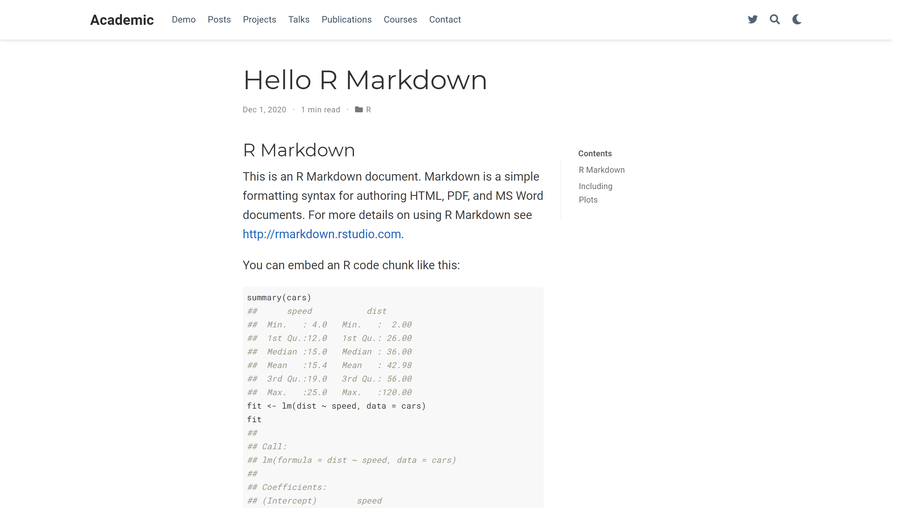

## Welcome!

Welcome to my very first blog post (_i.e._,&nbsp;I do not count [ggpacman](https://mickael.canouil.fr/post/ggpacman/)).

The focus of this post is on `blogdown` ([github.com/rstudio/blogdown](https://github.com/rstudio/blogdown)), in particular on how to have a table of contents (TOC) on either the left or the right side of a post to ease the navigation through a long post.  
In the past few weeks, I have been slowly getting my head around [`blogdown`](https://github.com/rstudio/blogdown) and [HUGO](https://gohugo.io/), to finally published this website about a week ago.  
One of the latest tweak I had to figure out was: how to get a floating TOC.  
Getting a TOC is quite easy with an Rmarkdown, thus it should be the same in `blogdown`.

```markdown
---
output:
  rmarkdown::html_document:
    toc: true
---
```

For the remaining of this post, I will use the "[wowchemy/starter-academic](https://github.com/wowchemy/starter-academic)" HUGO theme within a new default `blogdown` website created with the following function call.


```r
blogdown::new_site(theme = "wowchemy/starter-academic")
```

## TL;DR

Within a `blogdown` installation based on the "[wowchemy/starter-academic](https://github.com/wowchemy/starter-academic)" HUGO theme:

1. Create `<root>/layouts/_default/single.html`.  
    
    ```r
    writeLines(
      text = c(
        '{{- define "main" -}}',
        '<article class="article">',
        '  {{ partial "page_header" . }}',
        '  <div class="article-container">',
        '    <div class="row">',
        '      <div class="col-12 col-lg-9 article-style">',
        '        {{ .Content }}',
        '      </div>',
        '      <div class="col-12 col-lg-3 docs-toc">',
        '        <ul class="nav toc-top">',
        '          <li>',
        '            <a href="#" id="back_to_top" class="docs-toc-title">',
        '              {{ i18n "on_this_page" }}',
        '            </a>',
        '          </li>',
        '        </ul>',
        '        {{ .TableOfContents }}',
        '      </div>',
        '    </div>',
        '    {{ partial "page_footer" . }}',
        '  </div>',
        '</article>',
        '{{- end -}}'
      ), 
      con = "layouts/_default/single.html"
    )
    ```

2. Add to your `<root>/.Rprofile`.  
    
    ```r
    options(blogdown.method = "markdown")
    ```

3. Write your posts in an `Rmd` or `Rmarkdown` file (_it Makes no difference now_) with the following in the YAML header.  
    ```
    output:
      blogdown::html_page:
        toc: true
    ```
4. You are all set!

_Note_: To a more complete setup workflow for `blogdown`, I recommend to have a look at [Alison Hill](https://alison.rbind.io/)'s blog post: "[Up & Running with Blogdown in 2021](https://alison.rbind.io/post/new-year-new-blogdown/)".

## Default Rmarkdown Post

Once installed, several default posts are available, including simple markdown file, Jupyter notebook file and Rmarkdown file.  
Most of this post will focus on the Rmarkdown file with `.Rmd` extension.

The default Rmarkdown file can be found at `content/post/2020-12-01-r-rmarkdown/index.en.Rmd` from the root directory of the website.


````
---
title: "Hello R Markdown"
author: "Frida Gomam"
date: 2020-12-01T21:13:14-05:00
categories: ["R"]
tags: ["R Markdown", "plot", "regression"]
---

```{r setup, include=FALSE}
knitr::opts_chunk$set(collapse = TRUE)
```

## R Markdown

This is an R Markdown document. Markdown is a simple formatting syntax for authoring HTML, PDF, and MS Word documents. For more details on using R Markdown see <http://rmarkdown.rstudio.com>.

You can embed an R code chunk like this:

```{r cars}
summary(cars)
fit <- lm(dist ~ speed, data = cars)
fit
```

## Including Plots

You can also embed plots. See Figure \@ref(fig:pie) for example:

```{r pie, fig.cap='A fancy pie chart.', tidy=FALSE}
par(mar = c(0, 1, 0, 1))
pie(
  c(280, 60, 20),
  c('Sky', 'Sunny side of pyramid', 'Shady side of pyramid'),
  col = c('#0292D8', '#F7EA39', '#C4B632'),
  init.angle = -50, border = NA
)
```
````

To be fair, the above document is not exactly the default Rmarkdown file.  
In fact, I decreased the headings level, or increase the number of `#`, by one.  
The reason for this small modification comes from the default configuration of HUGO within the `config.yaml` file.


```
...
markup:
  defaultMarkdownHandler: goldmark
  goldmark:
    renderer:
      unsafe: true
  highlight:
    codeFences: false
  tableOfContents:
    startLevel: 2
    endLevel: 3
...
```

As you can see, the TOC is defined to include from level 2 to level 3, so by default, the changes we are going to make would not have any effect for this particular document which only contains level 1 headings.

Posts and any other Rmarkdown contents are rendered with `rmarkdown::render_site()`, hence, for our default Rmarkdown (`content/post/2020-12-01-r-rmarkdown/index.en.Rmd`), the rendering is done with `rmarkdown::render_site('content/post/2020-12-01-r-rmarkdown/index.en.Rmd', encoding = 'UTF-8')`.


_Note_: In this case, `rmarkdown::render_site` produces a HTML file: `index.en.html`.

## Default with a TOC

First, let's edit the default `index.en.Rmd` file by adding three lines. in the YAML header as we would have done in a regular `remarkdown::html_document` to add a TOC.  
For a `blogdown` post, the output format is `blogdown::html_page`.  
This output format produces a headless HTML file (_i.e._,&nbsp;there is no need for header/body part, since the file is going to be included as a part of another HTML file).

```markdown
output:
  blogdown::html_page:
    toc: true
```

With this addition, the `index.en.Rmd` looks like this (_not that different, isn't it?!_).


````
---
title: "Hello R Markdown"
author: "Frida Gomam"
date: 2020-12-01T21:13:14-05:00
categories: ["R"]
tags: ["R Markdown", "plot", "regression"]
output:
  blogdown::html_page:
    toc: true
---

```{r setup, include=FALSE}
knitr::opts_chunk$set(collapse = TRUE)
```

## R Markdown

This is an R Markdown document. Markdown is a simple formatting syntax for authoring HTML, PDF, and MS Word documents. For more details on using R Markdown see <http://rmarkdown.rstudio.com>.

You can embed an R code chunk like this:

```{r cars}
summary(cars)
fit <- lm(dist ~ speed, data = cars)
fit
```

## Including Plots

You can also embed plots. See Figure \@ref(fig:pie) for example:

```{r pie, fig.cap='A fancy pie chart.', tidy=FALSE}
par(mar = c(0, 1, 0, 1))
pie(
  c(280, 60, 20),
  c('Sky', 'Sunny side of pyramid', 'Shady side of pyramid'),
  col = c('#0292D8', '#F7EA39', '#C4B632'),
  init.angle = -50, border = NA
)
```
````

Since, we changed the YAML header, we need to render again, with `rmarkdown::render_site`, the HTML file from `index.en.Rmd`.


Now we have a TOC, but it sticks to the top.  
At this stage, we did all we could in the Rmarkdown file `index.en.Rmd`.

## Modify the Layout

Because everything that relates to the structure of the pages on the website are defined in HTML template files stored in a `layouts` directory, the answer to our "problem" should be there.  
And that is the case, as stated in a issue opened on GitHub ([wowchemy/wowchemy-hugo-modules #1520](https://github.com/wowchemy/wowchemy-hugo-modules/issues/1520)). 
More precisely in [@CharlieLeee](https://github.com/wowchemy/wowchemy-hugo-modules/issues/1520#issuecomment-601982609)'s comment.

As mentioned in the comment, we need to modify a particular file, namely `layouts/_default/single.html`, but what is inside this `layouts/_default/single.html` file from the "[wowchemy/starter-academic](https://github.com/wowchemy/starter-academic)" theme?  
In a default installation, the file is located in the following path 
`themes/github.com/wowchemy/wowchemy-hugo-modules/wowchemy/layouts/_default/single.html` and it includes the following HTML/code.

```html
{{- define "main" -}}

<article class="article">

  {{ partial "page_header" . }}

  <div class="article-container">

    <div class="article-style">
      {{ .Content }}
    </div>

    {{ partial "page_footer" . }}

  </div>
</article>

{{- end -}}
```

_Note_: Have a look at [HUGO website](https://gohugo.io/templates/introduction/) for the HUDO templating syntax.

We do not want to modify any of the files in the `themes` directory, so we will create a new file at the root directory of our `blogdown` website (`layouts/_default/single.html`).  
I am not going to use the code proposed in [@CharlieLeee](https://github.com/wowchemy/wowchemy-hugo-modules/issues/1520#issuecomment-601982609)'s comment, but instead a slight modification to make the TOC a bit more responsive.

In this case, the TOC will use three out of the twelve columns in a wide screen (_i.e._,&nbsp;grid layout).
On a smaller screen, the TOC will occupy twelve columns (_i.e._,&nbsp;equivalent to the css `width: 100%;`) and will be wrapped after the contents, hence it will be under.

To note and for later, in the code chunk below:

+ `.Content` is a HUGO variable which contains the content of the post.
+ `.TableOfContents` is a HUGO variable which contains the TOC of the post.

```html
{{- define "main" -}}

<article class="article">

  {{ partial "page_header" . }}

  <div class="article-container">

    <div class="row">
      
      <div class="col-12 col-lg-9 article-style">
        {{ .Content }} <!-- HUGO variable which contains the content of the post -->
      </div>
      
      <div class="col-12 col-lg-3 docs-toc">
        <ul class="nav toc-top">
          <li>
            <a href="#" id="back_to_top" class="docs-toc-title">
              {{ i18n "on_this_page" }}
            </a>
          </li>
        </ul>
    
        {{ .TableOfContents }} <!-- HUGO variable which contains the TOC of the post -->
        
      </div>
    </div>

    {{ partial "page_footer" . }}

  </div>
</article>

{{- end -}}
```

Again, we need to render the `index.en.Rmd` file, or to restart the website (`blogdown::stop_server()`/`blogdown::serve_site()`) to ensure all modifications are taken into account.


Not quite, what we could have expected ...

The TOC from the Rmarkdown (HTML) file is still at the top, but there is a "Contents" on the right side (as define in `layouts/_default/single.html`).  
This "Contents" comes from our modified layout file and it is not included in a HUGO variable.  
This TOC header is a hypertext reference to the top of the current page.

```html
<ul class="nav toc-top">
  <li>
    <a href="#" id="back_to_top" class="docs-toc-title">
      {{ i18n "on_this_page" }}
    </a>
  </li>
</ul>
```

Our layout seems to "work", but somehow, does not include the TOC of our HTML file generated from the `index.en.Rmd` file.

Let's have a look at another post in plain markdown from our `blogdown` website.

+ Before the modifications of the layout  
    

+ After the modifications of the layout  
    

It's looking great for the markdown post!

In conclusion and since we modified the page layout, the issue no longer seems to be on the HUGO side.

If we take a look at the HTML file produced by `rmarkdown::render_site()`.


```
---
title: "Hello R Markdown"
author: "Frida Gomam"
date: 2020-12-01T21:13:14-05:00
categories: ["R"]
tags: ["R Markdown", "plot", "regression"]
output:
  blogdown::html_page:
    toc: true
---

<script src="index.en_files/header-attrs/header-attrs.js"></script>

<div id="TOC">
<ul>
<li><a href="#r-markdown">R Markdown</a></li>
<li><a href="#including-plots">Including Plots</a></li>
</ul>
</div>

<div id="r-markdown" class="section level2">
<h2>R Markdown</h2>
<p>This is an R Markdown document. Markdown is a simple formatting syntax for authoring HTML, PDF, and MS Word documents. For more details on using R Markdown see <a href="http://rmarkdown.rstudio.com" class="uri">http://rmarkdown.rstudio.com</a>.</p>
<p>You can embed an R code chunk like this:</p>
<pre class="r"><code>summary(cars)
##      speed           dist       
##  Min.   : 4.0   Min.   :  2.00  
##  1st Qu.:12.0   1st Qu.: 26.00  
##  Median :15.0   Median : 36.00  
##  Mean   :15.4   Mean   : 42.98  
##  3rd Qu.:19.0   3rd Qu.: 56.00  
##  Max.   :25.0   Max.   :120.00
fit &lt;- lm(dist ~ speed, data = cars)
fit
## 
## Call:
## lm(formula = dist ~ speed, data = cars)
## 
## Coefficients:
## (Intercept)        speed  
##     -17.579        3.932</code></pre>
</div>
<div id="including-plots" class="section level2">
<h2>Including Plots</h2>
<p>You can also embed plots. See Figure <a href="#fig:pie">1</a> for example:</p>
<pre class="r"><code>par(mar = c(0, 1, 0, 1))
pie(
  c(280, 60, 20),
  c(&#39;Sky&#39;, &#39;Sunny side of pyramid&#39;, &#39;Shady side of pyramid&#39;),
  col = c(&#39;#0292D8&#39;, &#39;#F7EA39&#39;, &#39;#C4B632&#39;),
  init.angle = -50, border = NA
)</code></pre>
<div class="figure"><span id="fig:pie"></span>
}}index.en_files/figure-html/pie-1.png" alt="A fancy pie chart." width="672" />
<p class="caption">
Figure 1: A fancy pie chart.
</p>
</div>
</div>
```

To narrow down where to look a little bit, I remove all parts not related to the TOC generated in the HTML file.


```
<div id="TOC">
<ul>
<li><a href="#r-markdown">R Markdown</a></li>
<li><a href="#including-plots">Including Plots</a></li>
</ul>
</div>
```

In this part, we are interested in the `div` which includes the TOC and we can see that the `id` is `"TOC"`.

You might not know and you will after reading this, but HUGO parses the headings from markdown (_i.e._,&nbsp;`#`, `##`, etc.) and stores all those headings in an HTML structure (_i.e._,&nbsp;`nav`) with `id="TableOfContents"`.  
Seems familiar?! It is the HUGO variable seen earlier, which contains the TOC.  
To know this, well you have to read [HUGO's documentation](https://gohugo.io/content-management/toc/).

At this point, you might not see where all this is going. 

Let me clarify all the information we have:

+ HUGO translate markdown files to HTML files.
+ HUGO has a variable/id for the TOC, named `TableOfContents`
+ We can change the layout of the HUGO theme to include TOC (if the theme does not already include it as for "[wowchemy/starter-academic](https://github.com/wowchemy/starter-academic)").
    + It works on plain markdown posts.
    + It does not on HTML posts produced from `.Rmd` files.
    
In conclusion, there is something wrong with the HTML files produced from `.Rmd` files.

## Fixing `.Rmd`/`.html` Posts

`blogdown` provides an add-in to easily creates new post (`blogdown:::new_post_addin()`), in which you can decide what is the file format/extension you want to use.  
You can change the default in your `.Rprofile` with, for example `.Rmd`, as your default using `options(blogdown.ext = ".Rmd")`.

You are probably (_as I am_) more familiar with the `Rmd` extension.

+ `.Rmd` produces `.html` with `rmarkdown::render_site()`.  
    And the floating TOC is not working in that case.  
    

Let's modify the extension to `Rmarkdown`.

+ `.Rmarkdown` produces `.markdown` (_basically the same as `.md`_) with `rmarkdown::render_site()`.  
    

It works!  
We have a floating TOC when using `.Rmarkdown` extension, thus when we do not use pandoc to translate markdown to HTML.

## I Want `Rmd`, not `Rmarkdown`!

We could only use `.Rmarkdown` file and stop right there, but what if we wanted to keep our favourite `.Rmd` extension everywhere?  
The solution to this is quite simple!

1. In the `.Rprofile` at the root of your `blogdown` website, change the default rendering method to `"markdown"` using `options(blogdown.method = "markdown")`.
2. Restart R.
3. You are all set! `rmarkdown::render_site()` will only produce markdown file when used with `blogdown`.

## Conclusion

If you want a floating TOC, you should not generates HTML files from your Rmarkdown files and you need to add the HUGO variable `.TableOfContents` in the layout HTML file controlling the type of content you want the floating TOC to be.

_Note_: To a more complete setup workflow for `blogdown`, I recommend to have a look at [Alison Hill](https://alison.rbind.io/)'s blog post: "[Up & Running with Blogdown in 2021](https://alison.rbind.io/post/new-year-new-blogdown/)".

## Going in Style


<div style = "margin-bottom: 2rem; margin-top: -2rem; text-align: center;">
<em>
Cinephile, I am ... (Source: <a href = "https://www.imdb.com/title/tt2568862/">IMDb</a>)
</em>
</div>

Because, the TOC as an `id` which is `TableOfContents`, you can control the style of the TOC with (s)css (_i.e._,&nbsp;`#TableOfContents`!

For example, to get the left border going up including the "Contents" header.


```css
#TableOfContents, .docs-toc-title {
  border-left: 1px solid $sta-primary;
  /* "$sta-primary" is the primary colour from the theme (sass/scss) */
}
```

You might also want to increase the width of the article container, because you now have TOC sharing the space with the article itself.


```css
.article-container {
  max-width: 960px;
}
```


