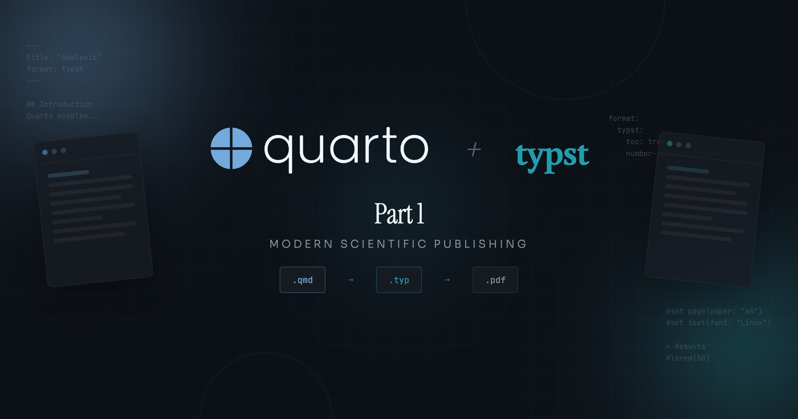
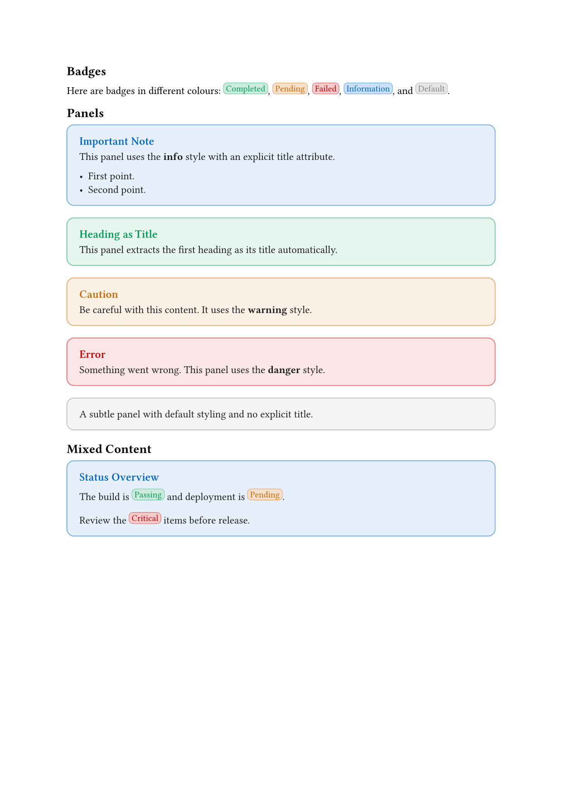

{
  .img-featured
  .img-fluid
  fig-align="center"
  fig-alt=''
  width="600px"
}

::: {.callout-important}

## Quarto Version

This tutorial was written and tested with **Quarto CLI 1.9.23 (pre-release)**.
Some APIs, template syntax, or extension behaviours may differ in earlier stable releases.

:::

## Why PDF Branding Matters

In professional environments, document presentation is not merely aesthetic; it is a reflection of organisational identity and credibility.
Whether you are producing academic papers, corporate reports, client proposals, or technical documentation, consistent branding transforms disparate documents into a cohesive portfolio that reinforces trust and recognition.

Yet achieving this consistency manually is fraught with challenges.
Copy-pasting styles between documents introduces errors.
Updating a colour scheme across dozens of files becomes a maintenance nightmare.
And when multiple team members contribute to documents, stylistic drift is inevitable.

::: {.highlight}

**Reproducible branding** through code eliminates manual styling errors and ensures every document reflects your organisation's identity automatically.

:::

This is where programmatic document styling becomes valuable.

Typst offers a modern, programmable alternative to LaTeX for PDF generation.
Its syntax is cleaner, compilation is faster, and its scripting capabilities make complex layouts achievable without the arcane incantations that LaTeX often requires.
When paired with Quarto's publishing ecosystem, Typst becomes a powerful foundation for branded document production.

## Prior Art: Getting Started with Typst and Quarto

Before diving into advanced techniques, it is worth acknowledging excellent foundational resources recently published.
David Keyes wrote a comprehensive introduction to using Typst with Quarto at [R for the Rest of Us](https://rfortherestofus.com/2025/11/quarto-typst-pdf).
If you are new to Typst or want a gentler introduction, that post provides an excellent starting point.

This tutorial builds upon that foundation.
Where David's post shows how to use Typst templates with Quarto, this tutorial explores how to _build_ sophisticated templates that pair Lua filters with Typst rendering functions.
What does this mean in practice?
It means creating reusable components like badges, panels, and quote cards that authors can invoke with simple markdown syntax instead of writing Typst code directly.

In this tutorial, you will learn the architectural patterns that enable rich, interactive components whilst maintaining clean, extensible code.

::: {.callout-note}

This is **Part 1** of a two-part series.
This part covers the foundational concepts; Part 2 explores advanced patterns including handler factories, configuration systems, and WCAG-compliant styling.

The examples here are generic, but the ['mcanouil' Quarto extension](https://github.com/mcanouil/quarto-mcanouil) demonstrates these patterns in a production context.

:::

## The Problem: Bridging Markdown and Typst

Consider a simple scenario: you want users to write badges in their Quarto documents using familiar markdown syntax, but have them render as styled components in Typst.

```markdown
The task is [Completed]{.badge colour="success"} and ready for review.
```

This should produce a styled badge in the PDF output.
But here is the challenge: Typst templates alone cannot intercept and transform markdown elements.
Typst receives content _after_ Quarto and Pandoc have processed it.
Without a Lua filter, Pandoc's default Typst writer simply drops the `.badge` class and outputs the text content with no styling; your Typst template never sees the class at all.

The solution requires two layers working in concert:

1. **Lua filters** that intercept markdown elements during Pandoc processing and generate Typst code.
2. **Typst functions** that receive that generated code and render styled output.

The transformation looks like this:

```{mermaid}
%%| label: fig-bridge
%%| fig-cap: "The bridge between markdown and Typst."
%%| fig-alt: "Diagram showing the transformation of markdown syntax `[Completed]{.badge colour='success'}` through Pandoc AST processing by Lua filter into Typst code `#simple-badge(colour: 'success', mode: effective-brand-mode)[Completed]` which is then rendered by Typst function into a styled badge component."
flowchart LR
    A["[Completed]{.badge colour='success'}"] --> B[Pandoc AST]
    B --> C[Lua Filter]
    C --> D["#simple-badge(colour: 'success', mode: effective-brand-mode)[Completed]"]
    D --> E[Typst Function]
    E --> F[Styled Badge]
```

## The Dual-Layer Architecture

This tutorial explores a dual-layer architecture where Lua handles document transformation and Typst handles rendering.

### Layer 1: Document Processing (Lua)

Lua filters operate on Pandoc's Abstract Syntax Tree (AST), the intermediate representation of your document after Quarto parses the markdown.
At this stage, you can:

- Identify elements by their classes (_e.g._, `.badge`, `.panel`).
- Extract attributes (_e.g._, `colour="success"`).
- Generate raw Typst code to replace those elements.

The key Pandoc functions for this bridge are:

```{.lua filename="(conceptual) raw element API"}
-- For block-level elements (divs, paragraphs)
pandoc.RawBlock('typst', '#my-function[content]') -- <1>

-- For inline elements (spans, text)
pandoc.RawInline('typst', '#my-function[content]') -- <2>
```

1. Creates a block-level raw element; see [Pandoc Lua types](https://pandoc.org/lua-filters.html#type-rawblock).
2. Creates an inline raw element; see [Pandoc Lua types](https://pandoc.org/lua-filters.html#type-rawinline).

These functions tell Pandoc to pass the string directly to Typst without further processing.

### Layer 2: Template Rendering (Typst)

On the Typst side, you define functions that receive the generated code and produce styled output.
These functions have access to:

- The document's colour scheme and typography settings.
- Page dimensions and layout context.
- Typst's full styling capabilities.

A simple Typst function might look like:

```{.typst filename="(conceptual) simple Typst function"}
#let simple-badge(content, colour: "neutral") = { // <1>
  box( // <2>
    fill: luma(230), // <3>
    radius: 4pt,
    inset: 0.25em,
    text(size: 0.85em, content)
  )
}
```

1. Function definition with content parameter and optional named parameter.
2. [`box`](https://typst.app/docs/reference/layout/box/) creates an inline container.
3. [`luma`](https://typst.app/docs/reference/visualize/color/#definitions-luma) creates a greyscale colour (0-255).

### Why This Separation?

This dual-layer approach offers several advantages:

- **Separation of concerns**: Lua handles "what to transform", Typst handles "how to render".
- **Flexibility**: Change the rendering without touching the transformation logic, or vice versa.
- **Testability**: Each layer can be developed and tested independently.
- **Reusability**: Typst functions can be called directly in Typst code, not just through the Lua bridge.

## Extension Structure Overview

Before diving into component implementation, let us establish the minimal file organisation needed for a Typst extension.

```txt
_extensions/my-extension/
├── _extension.yml       # Extension manifest
├── template.typ         # Main Typst template
├── typst-show.typ       # Wrapper functions for components
├── components.typ       # Component rendering functions
├── wrapper.lua          # Shared wrapper helpers loaded by filter.lua
└── filter.lua           # Lua filter entrypoint
```

The `_extension.yml` manifest declares how these pieces fit together:

```{.yaml filename="_extensions/my-extension/_extension.yml"}
title: My Extension
version: 1.0.0
contributes:
  formats:
    typst:
      template: template.typ
      template-partials:
        - typst-show.typ
        - components.typ
      filters:
        - filter.lua
```

The `template.typ` file is the main Typst entry point.
It includes the component definitions and wrapper functions via Pandoc template syntax, and defines any shared helpers.
For this tutorial, it defines the `get-colours` helper that the wrapper functions rely on:

```{.typst filename="_extensions/my-extension/template.typ"}
// Include component definitions via template partial
$components.typ()$ // <1>

// Colour scheme for the document
#let get-colours(mode: "light") = { // <2>
  if mode == "dark" {
    (background: luma(30), foreground: luma(230), muted: luma(150))
  } else {
    (background: luma(255), foreground: luma(30), muted: luma(100))
  }
}

// Include wrapper functions via template partial
$typst-show.typ()$ // <3>

$for(header-includes)$
$header-includes$
$endfor$ // <4>

$body$
```

1. Pandoc template syntax `$partial()$` includes another file; `components.typ` must be declared before `typst-show.typ` so the rendering functions are in scope when the wrappers reference them.
2. `get-colours` returns a dictionary with `background`, `foreground`, and `muted` keys; `typst-show.typ`'s wrapper functions call this at render time.
3. Wrapper functions are included after `get-colours` is defined so they can call it.
4. Pandoc's template loop injects any per-document Typst preamble content (e.g., items declared via `include-in-header` in document YAML) before the body.

::: {.highlight}

Production extensions like [quarto-mcanouil](https://github.com/mcanouil/quarto-mcanouil) use more elaborate structures with shared modules and component libraries.
Part 2 covers those architectural patterns.

:::

With this foundation established, we can now explore how to build components, starting with simple inline badges and progressing to block-level panels.

## First Component: Badges (Inline Elements)

Badges are compact inline indicators, perfect for showing status, categories, or tags.
They represent the simplest component type: a span element with optional attributes that transforms into a styled box.

### Understanding Pandoc Span Elements

When you write `[Completed]{.badge colour="success"}` in your Quarto document, Pandoc parses this into a Span element in its AST.
The Span contains:

- **`span.content`**: The text content ("Completed").
- **`span.classes`**: A list of classes (["badge"]).
- **`span.attributes`**: A table of key-value pairs (`{colour="success"}`).

A Lua filter can inspect these properties and decide how to transform the element.

### Building the Typst Function: Start Simple

Let us begin with the simplest possible badge function in Typst:

```{.typst filename="(conceptual) badges.typ v1"}
#let simple-badge(content) = {
  box(
    fill: luma(230),
    radius: 4pt,
    inset: 0.25em,
    text(size: 0.85em, content)
  )
}
```

This creates a grey box with rounded corners around any content.
It works, but it lacks colour customisation and accessibility considerations.

### Adding Colour Support

Next, let us add colour support with predefined semantic colours:

```{.typst filename="(conceptual) badges.typ v2"}
#let get-badge-colour(colour-name, mode: "light") = { // <1>
  let is-dark = mode == "dark"
  if colour-name == "success" {
    if is-dark { rgb("#33cc88") } else { rgb("#009955") }
  } else if colour-name == "warning" {
    if is-dark { rgb("#ee9944") } else { rgb("#cc6600") }
  } else if colour-name == "danger" {
    if is-dark { rgb("#ff5555") } else { rgb("#cc0000") }
  } else if colour-name == "info" {
    if is-dark { rgb("#5599ee") } else { rgb("#0066cc") }
  } else {
    if is-dark { luma(170) } else { luma(128) }  // neutral default
  }
}

#let simple-badge(content, colour: "neutral", mode: "light") = {
  let base = get-badge-colour(colour, mode: mode)
  box(
    fill: base.lighten(80%),
    stroke: 0.5pt + base.lighten(40%),
    radius: 4pt,
    inset: 0.25em,
    text(size: 0.85em, fill: base, content)
  )
}
```

1. Here, colours are hard-coded for simplicity; in a production extension you could retrieve them from `_brand.yml` (Quarto's brand configuration file that centralises colours, fonts, and logos for consistent styling) using the Quarto Brand Lua API (see @nte-brand-lua).

Now users can specify `colour: "success"` and get a green badge.
The `mode` parameter selects light or dark colour palettes.

### Building the Lua Handler

With the Typst function ready, we need a Lua handler to generate calls to it.
In Typst, function calls use the pattern `#function-name(named-arg: value)[content]`: `#` marks a function call, named arguments go in parentheses, and the content the function wraps goes in square brackets.
Unlike a plain string, square brackets in Typst create a *content block*: a distinct type that Typst renders as formatted output, preserving nested markup such as bold, italic, and inner function calls.
The Lua handler builds this string and hands it to Pandoc as raw Typst code.
Here is the simplest approach:

```{.lua filename="(conceptual) badges.lua v1"}
function Span(span) -- <1>
  -- Only process spans with the 'badge' class
  if not span.classes:includes('badge') then -- <2>
    return span
  end

  -- Extract content as plain text
  local content = pandoc.utils.stringify(span.content) -- <3>

  -- Get the colour attribute (default to neutral)
  local colour = span.attributes.colour or 'neutral' -- <4>

  -- Generate Typst function call
  local typst_code = string.format( -- <5>
    '#simple-badge(colour: "%s", mode: effective-brand-mode)[%s]',
    colour,
    content
  )

  return pandoc.RawInline('typst', typst_code) -- <6>
end
```

1. [Span filter function](https://pandoc.org/lua-filters.html#type-span) receives each span element.
2. Check if span has the target class; return unchanged if not.
3. [`stringify`](https://pandoc.org/lua-filters.html#pandoc.utils.stringify) converts AST content to plain text, stripping all inline formatting (bold, italic, links); for badge labels this is intentional because short status words do not need inline formatting.
4. Access attributes as a Lua table; provide default value.
5. Build the Typst function call string with parameters; `effective-brand-mode` is a Typst variable name defined in `typst-show.typ` via Pandoc template syntax. Quarto resolves it before passing the file to Typst, so its value is never known to Lua. It is introduced and explained in the next section.
6. Return raw Typst code that Pandoc passes through unchanged.

This works for our simple use case.
The Lua filter checks if a span has the `badge` class, extracts its content and attributes, and generates a Typst function call.

::: {.callout-note}

The attribute value here is always a Lua string because Pandoc exposes HTML attributes as strings.
Typst syntax distinguishes strings (`"hello"`), numbers (`42`), and keywords (`none`, `true`); passing the wrong form produces a syntax error.
The `wrapper.lua` module includes a minimal `typst_value` helper that handles these common cases: string pass-through for Typst keywords (`"none"`, `"true"`, `"false"`), passing Lua numbers as bare values (so `42` becomes `42` in Typst, not `"42"`), and wrapping everything else in quotes.
Part 2 replaces this with a more robust implementation that also handles actual Lua booleans, `nil`, and Typst measurement units like `1em` or `2.5pt`.

This handler also does not escape Typst special characters in `content`.
Badge labels containing `[`, `]`, or `#` would produce broken Typst syntax because Typst interprets those characters as markup inside `[...]` content blocks.
For typical short labels like `"Completed"` or `"v1.2.0"` this is not an issue, but a production implementation would *escape* those characters before inserting content into the generated code: replacing `]` with `\]`, `[` with `\[`, and `#` with `\#` so Typst does not treat them as markup.

:::

### Resolving Brand Mode at Render Time

There is one more piece to the puzzle.
The Typst rendering function needs to know whether the document uses a light or dark colour scheme, but Lua generates code at parse time before that value is resolved.
The solution is a **template variable** in `typst-show.typ`.

::: {.callout-tip}

## Quarto Template Syntax

Quarto's Typst partials use Pandoc template syntax for variable interpolation:

- `$variable$` inserts a metadata value.
- `$if(variable)$...$endif$` conditionally includes content.
- `$if(variable)$...$else$...$endif$` provides a fallback value.

These are resolved at render time, not parse time.
See [Typst partials](https://quarto.org/docs/journals/templates.html#typst-partials) for details.

:::

```{.typst filename="_extensions/my-extension/typst-show.typ"}
// Define brand mode with default fallback
#let effective-brand-mode = "$if(brand-mode)$$brand-mode$$else$light$endif$" // <1>
```

1. Quarto template syntax (`$if()$`) resolves at render time.
If `brand-mode` is not set in the document's YAML front matter, this expression falls back to `"light"`.
To use dark mode, add `brand-mode: dark` to the document YAML.
See [Typst partials](https://quarto.org/docs/journals/templates.html#typst-partials).

The Lua filter generates code that references `effective-brand-mode` by name (_e.g._, `#simple-badge(colour: "success", mode: effective-brand-mode)[Completed]`).
At render time, Typst resolves the variable and `simple-badge` passes it to `get-badge-colour` to select the right colour palette.

::: {.highlight}

The Lua filter generates code that references `effective-brand-mode` **by name**.
Typst resolves the variable at render time via Pandoc template syntax, so each badge picks the right colour palette without Lua needing to know the mode.

:::

::: {.callout-note #nte-brand-lua}

## Quarto Brand Lua API

Quarto also exposes a `quarto.brand` Lua module that lets filters query `_brand.yml` values directly at parse time:

- `quarto.brand.has_mode(mode)`: returns `true` if the document has a brand definition for the given mode (`"light"` or `"dark"`).
- `quarto.brand.get_color(mode, name)`: returns a brand colour by name in the output format (_e.g._, `quarto.brand.get_color("light", "primary")`).
- `quarto.brand.get_color_css(mode, name)`: returns the colour in CSS format.
- `quarto.brand.get_typography(mode, name)`: returns a table of typography options (family, size, weight, etc.) for the given element.
- `quarto.brand.get_logo(mode, name)`: returns logo resource paths and alt text.

This approach is useful when you need brand values _inside_ the Lua filter itself, for instance to compute contrast ratios or choose between different rendering strategies before emitting Typst code.
In this tutorial, we pass the mode to Typst instead, keeping colour logic in a single layer.

As a rule of thumb: use `quarto.brand` when the Lua filter itself needs to act on a brand value (computation, branching); use a template variable when the Typst rendering function should resolve the value at render time.

:::

## Block Components: Panels (Wrapped Content)

Badges are inline elements with simple text content.
Panels are block elements that can contain rich, nested content: paragraphs, lists, images, even code blocks.
This introduces a new challenge: how do we preserve and pass through complex content whilst still wrapping it in our Typst function?

### Understanding Pandoc Div Elements

When you write a fenced div in Quarto:

```markdown
::: {.panel style="info" title="Important Note"}
This panel contains **rich content** including:

- Bullet points.
- _Formatted text_.
- And more.
  :::
```

Pandoc parses this into a Div element with:

- **`div.content`**: An array of block elements (paragraphs, lists, etc.).
- **`div.classes`**: A list of classes (["panel"]).
- **`div.attributes`**: A table of key-value pairs.

The critical difference from spans: `div.content` is not simple text but a list of Pandoc AST nodes that need further processing.

### The Wrapped Content Pattern

Unlike badges where we convert content to plain text, panels need to preserve their content structure.
The solution is to wrap the content with opening and closing Typst code:

```{.lua filename="(conceptual) wrapped content pattern"}
-- Instead of: #panel[plain text]
-- We generate:
-- #panel(style: "info")[
--   <original content passes through>
-- ]

local result = {
  pandoc.RawBlock('typst', '#my-panel(style: "info")['),  -- Opening
  -- Original div.content elements go here
  pandoc.RawBlock('typst', ']')  -- Closing
}
```

For example, given this markdown:

```markdown
::: {.panel style="info"}
This note contains **bold** text.
:::
```

The filter builds this structure, with Pandoc converting the inner content to Typst:

```typst
#my-panel(style: "info")[
  This note contains *bold* text.
]
```

This approach lets Pandoc continue processing the inner content (converting markdown to Typst), whilst our wrapper provides the styling context.

### Building the Wrapped Content Handler

`wrapper.lua` uses the standard Lua module pattern.
A `local M = {}` table is created at the top of the file, public functions are attached to it as `function M.fn_name(...)`, and `return M` at the end exports them.
When `filter.lua` loads the module with `require_local("wrapper.lua")`, it gets back that table and calls `wrapper.build_wrapped_content(...)`.
Private helper functions (like `attributes_to_table` and `build_attribute_string`) remain as plain `local function` inside the file and are not visible outside it.

The wrapper module provides two public utilities for this pattern:

```{.lua filename="_extensions/my-extension/wrapper.lua (excerpt)"}
local M = {}

--- Build Typst block wrappers with optional attributes
function M.build_typst_block_wrappers(config, attrs)
  local has_attributes = next(attrs) ~= nil

  if has_attributes or config.arguments then -- <1>
    local attr_string = build_attribute_string(attrs)
    return string.format('#%s(%s)[', config.wrapper, attr_string), ']' -- <2>
  else
    return string.format('#%s[', config.wrapper), ']'
  end
end

--- Build wrapped content for components
function M.build_wrapped_content(div, config, extract_title)
  local attrs = attributes_to_table(div)

  -- Optionally extract first heading as title attribute
  if extract_title then
    M.extract_first_heading_as_title(div, attrs) -- <3>
  end

  local opening, closing = M.build_typst_block_wrappers(config, attrs)

  -- Build result: opening wrapper, content, closing wrapper
  local result = { pandoc.RawBlock('typst', opening) } -- <4>
  for _, item in ipairs(div.content) do -- <5>
    table.insert(result, item)
  end
  table.insert(result, pandoc.RawBlock('typst', closing)) -- <6>

  return result
end
```

1. Generate parameter list when attributes exist _or_ when the config mandates it (`arguments = true`); without the `or config.arguments` branch, an empty attribute list would never be generated even when the Typst function expects it.
2. Returns two values: opening bracket with function call, closing bracket.
3. Public functions within the module call each other via `M.fn_name`; this ensures the call always hits the module's own implementation.
4. Opening wrapper becomes first element in result list.
5. Original content passes through; Pandoc continues processing nested markdown.
6. Closing bracket completes the Typst function call.

### Title Extraction: A Useful Pattern

Many block components benefit from extracting the first heading as a title.
Instead of requiring users to write:

```markdown
::: {.panel title="My Title"}
Content here.
:::
```

You can let them write:

```markdown
::: {.panel}

# My Title

Content here.
:::
```

The `extract_first_heading_as_title` function handles this:

```{.lua filename="_extensions/my-extension/wrapper.lua (excerpt)"}
function M.extract_first_heading_as_title(el, attrs)
  if not attrs['title'] and #el.content > 0 then -- <1>
    local first_elem = el.content[1]
    if first_elem.t == 'Header' then -- <2>
      -- Extract header text as title attribute
      attrs['title'] = pandoc.utils.stringify(first_elem.content) -- <3>
      -- Remove header from content
      local new_content = {}
      for i = 2, #el.content do -- <4>
        table.insert(new_content, el.content[i])
      end
      el.content = new_content
    end
  end
end

return M
```

1. Skip if title already provided via attributes or div is empty.
2. `.t` is the element type; see [Pandoc AST types](https://pandoc.org/lua-filters.html#element-types).
3. Convert header inline content to plain string for the title attribute.
4. Rebuild content list without the first element (the extracted header).

### The Typst Panel Function

On the Typst side, the panel function receives the attributes and content:

```{.typst filename="(conceptual) panels.typ excerpt"}
#let render-panel(
  content, // <1>
  title: none,
  style: "subtle",
  icon: none,
  colours: (:), // <2>
  breakable: false,
) = {
  let panel-colours = get-panel-colours(style) // <3>

  // Build optional title display
  let title-display = if has-content(title) { // <4>
    block(
      below: 0.8em,
      text(
        size: 1.1em,
        weight: "semibold",
        fill: panel-colours.title,
        title
      )
    )
  }

  // Render the panel
  block( // <5>
    width: 100%,
    fill: panel-colours.background,
    stroke: 1pt + panel-colours.border,
    radius: 8pt,
    inset: 1.2em,
    breakable: breakable, // <6>
    {
      if title-display != none { title-display }
      text(fill: panel-colours.content, content)
    }
  )
}
```

1. First positional parameter receives the wrapped content from the Lua filter.
2. Empty dictionary `(:)` as default; the parameter is declared now to keep the function signature stable, so Part 2 can add colour-aware logic without changing any call sites. The wrapper function in `typst-show.typ` injects the actual colour scheme, but this simplified Part 1 version of `get-panel-colours` ignores it.
3. Returns a [dictionary](https://typst.app/docs/reference/foundations/dictionary/) with background, border, title, and content colours based purely on the `style` name; Part 2 upgrades this to also use the injected `colours` for theme-aware text.
4. Conditional returns `none` if title is empty; Typst's `if` is an expression.
5. [`block`](https://typst.app/docs/reference/layout/block/) creates a block-level container with styling.
6. `breakable: false` prevents the panel from splitting across page breaks.

The `breakable: false` default prevents panels from splitting across pages, avoiding awkward orphaned titles or content fragments.

### The Panel Wrapper: Injecting the Colour Scheme

Unlike badges, where the Lua handler passes `effective-brand-mode` directly to `simple-badge`, panels need a richer colour dictionary.
The `render-panel` function accepts a `colours` parameter that the Lua filter cannot populate at parse time.
A wrapper function in `typst-show.typ` bridges this gap:

```{.typst filename="_extensions/my-extension/typst-show.typ"}
#let my-panel(content, ..args) = {
  render-panel(
    content,
    colours: get-colours(mode: effective-brand-mode), // <1>
    ..args, // <2>
  )
}
```

1. Injects the full colour dictionary resolved from `effective-brand-mode` at render time.
2. Forwards all other named arguments (`title`, `style`, etc.) unchanged.

The Lua handler generates `#my-panel(style: "info")[...]`, and at render time `my-panel` resolves the colour scheme before delegating to `render-panel`.

::: {.highlight}

For badges, passing `mode` directly to the Typst function is sufficient.
For panels, a **wrapper function** injects a full colour dictionary that depends on runtime context.
Choose the simpler approach when it works; use a wrapper when the rendering function needs derived values the Lua filter cannot provide.

:::

### The Filter Entrypoint

The conceptual snippets from earlier sections are real code from `filter.lua`, the Pandoc entrypoint that registers the `Span` and `Div` filter functions and loads `wrapper.lua`.

```{.lua filename="_extensions/my-extension/filter.lua"}
local function require_local(path) -- <1>
  return require(quarto.utils.resolve_path(path):gsub('%.lua$', ''))
end

local wrapper = require_local("wrapper.lua") -- <2>

--- Badge handler for inline .badge spans
function Span(span) -- <3>
  if not quarto.doc.is_format('typst') then
    return span
  end

  if not span.classes:includes('badge') then
    return span
  end

  local content = pandoc.utils.stringify(span.content)
  local colour = span.attributes.colour or 'neutral'

  local typst_code = string.format(
    '#simple-badge(colour: "%s", mode: effective-brand-mode)[%s]',
    colour,
    content
  )

  return pandoc.RawInline('typst', typst_code)
end

--- Panel handler for block .panel divs
function Div(div) -- <4>
  if not quarto.doc.is_format('typst') then
    return div
  end

  if not div.classes:includes('panel') then
    return div
  end

  local config = { wrapper = 'my-panel', arguments = true } -- <5>
  return wrapper.build_wrapped_content(div, config, true)
end
```

1. `require_local` wraps `quarto.utils.resolve_path` so paths resolve relative to the extension root regardless of where Quarto is run from.
2. `wrapper.lua` is required at the top level; Lua caches the module, so every filter function shares the same instance.
3. `Span` is the Pandoc filter hook; Pandoc calls it for every span in the document.
4. `Div` is the Pandoc filter hook for block-level divs; both hooks are defined in the same file.
5. The `config` table matches the shape used in Part 2's configuration system: `wrapper` is the Typst function name, `arguments = true` ensures the parameter list is always generated.

::: {layout-ncol="2"}
{
  .img-fluid
  fig-align="center"
  fig-alt="Example output showing a badge and a panel rendered in a PDF document. The badge is a green box with the text 'Completed'. The panel has a light blue background, a title 'Important Note', and body text describing the panel content."
}

```{.markdown include="assets/_example.qmd" filename="example.qmd"}
```
:::

## Conclusion

This tutorial introduced the dual-layer architecture for building Quarto Typst templates.
You have learned how Lua filters and Typst functions work together to transform markdown elements into styled PDF components.

You can download the complete code for this part of the tutorial as a zip file containing a minimal extension with badges and panels.

::: {style="text-align: center;"}
[Part 1 (ZIP)](./tutorial-part1.zip){
  .btn
  .btn-outline-light
  target="_blank"
  rel="noopener noreferrer"
}
:::

### Key Concepts Recap

The dual-layer architecture separates concerns effectively:

1. **Lua filters** intercept markdown elements and generate Typst function calls using `pandoc.RawBlock` and `pandoc.RawInline`.
2. **Typst functions** receive that generated code and render styled output with access to document context.
3. **Pandoc template variables** (like `effective-brand-mode`) bridge parse-time (Lua) and render-time (Typst). Lua references the variable by name in the generated code; Typst resolves its value when rendering.

For inline elements like badges, Lua extracts content and attributes, then generates a Typst function call.
For block elements like panels, Lua wraps the content with opening and closing Typst code, preserving nested structure.

### What Comes Next

Part 2 builds on these foundations with advanced patterns:

- Handler factories for reducing repetitive code.
- Configuration systems for user-extensible mappings.
- Value conversion and type safety between Lua and Typst.
- WCAG accessibility compliance for colour contrast.
- Shortcodes for components without natural markdown syntax.
- A complete quote card example tying all patterns together.

### Further Resources

- [Quarto Documentation: Creating Extensions](https://quarto.org/docs/extensions/creating.html).
- [Pandoc Lua Filters](https://pandoc.org/lua-filters.html).
- [Typst Documentation](https://typst.app/docs/).
- [`mcanouil` Extension](https://github.com/mcanouil/quarto-mcanouil).
- [R for the Rest of Us: Typst + Quarto](https://rfortherestofus.com/2025/11/quarto-typst-pdf).
