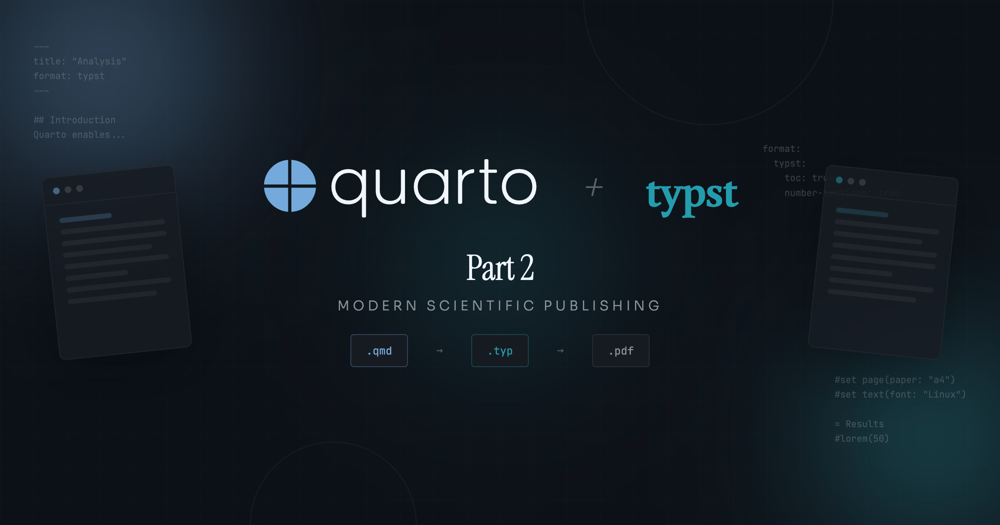
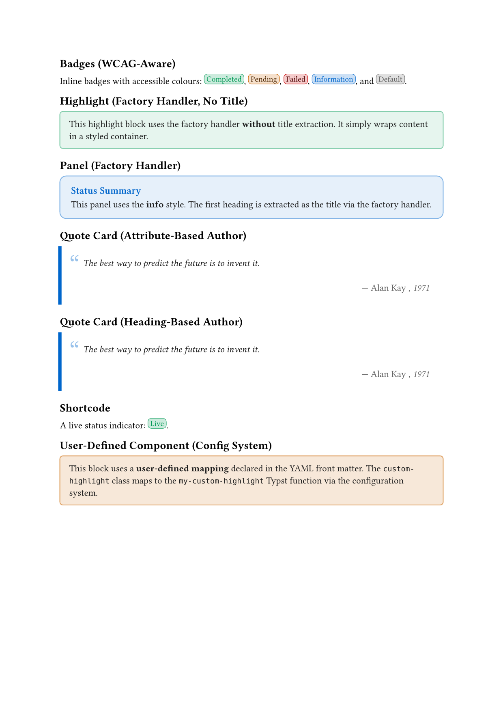

{
  .img-featured
  .img-fluid
  fig-align="center"
  fig-alt=''
  width="600px"
}

## Continuing from Part 1

[Part 1](/posts/2026-02-27-typst-template-tutorial-part1/) introduced the dual-layer architecture for building Quarto Typst templates.
Here is a brief recap of the building blocks this tutorial relies on:

- **Lua filters** intercept Pandoc AST elements (spans, divs) and generate raw Typst code via `pandoc.RawBlock` and `pandoc.RawInline`.
- **Typst rendering functions** receive that generated code and produce styled output with access to document context.
- **Wrapper functions** in `typst-show.typ` bridge parse-time (Lua) and render-time (Typst), injecting runtime context such as colour schemes.
- **`build_wrapped_content`** handles the common pattern of wrapping div content with opening and closing Typst function calls, optionally extracting a title from the first heading.

This tutorial builds on those foundations with advanced patterns for production-quality extensions.

::: {.callout-note}

Part 1 used `filter.lua` as the filter filename in its conceptual examples.
Part 2 uses `typst-markdown.lua`, which is the production filename used in the downloadable extension.
The role is identical: it is the Pandoc filter entrypoint that loads shared modules and registers the `Div` and `Span` handlers.
When building your own extension, you can choose any descriptive name; just ensure it matches the filename declared under `filters:` in `_extension.yml`.

:::

To keep the article and downloadable zip perfectly aligned, source-backed code blocks below show the full file content from the assets bundle.
Each section highlights the exact functions to focus on, so you can scan purposefully instead of reading every line top-to-bottom.

::: {.callout-note}

This is **Part 2** of a two-part series.
If you have not read [Part 1](/posts/2026-02-27-typst-template-tutorial-part1/), start there first to understand the basic concepts of Lua filters, Typst functions, and wrapper patterns.

The ['mcanouil' Quarto extension](https://github.com/mcanouil/quarto-mcanouil) demonstrates all patterns covered in this tutorial.

:::

## Handler Factories: Reducing Repetition

As you add components, the same handler structure keeps appearing.
Part 1's panel handler called `build_wrapped_content` directly.
With one or two components that is fine, but each new handler duplicates the same boilerplate:

```{.lua filename="(conceptual) without factories"}
local DIV_HANDLERS = {
  ['panel'] = function(div, config)
    return build_wrapped_content(div, config, true) -- <1>
  end,
  ['highlight'] = function(div, config)
    return build_wrapped_content(div, config, false) -- <2>
  end,
}
```

1. Extract title from first heading.
2. No title extraction; every new wrapped component repeats this same structure.

The only thing that varies is the `extract_title` flag.
A factory function captures that variation in a [closure](https://www.lua.org/pil/6.1.html), eliminating the repetition entirely.
A closure is a function that remembers variables from the scope where it was created.
When `create_wrapped_handler(true)` returns a new function, that function carries `should_extract_title = true` inside it, so every call to the returned handler automatically uses the correct flag without it needing to be passed again.
This is necessary because the filter loop (shown below in "Using Factories") calls each handler as `DIV_FACTORY_HANDLERS[class](div, class_config)`, passing only the div element and the class config; the flag is never passed.
By baking the flag into the closure at declaration time, each entry in `DIV_FACTORY_HANDLERS` becomes a self-contained handler with no extra parameters to manage.

### The Factory Pattern

In this file, focus on `create_wrapped_handler` and how it forwards to `build_wrapped_content`; the rest are shared helpers used by multiple components.

```{.lua filename="_extensions/my-extension/_modules/wrapper.lua"}
local typst_utils = require(quarto.utils.resolve_path("_modules/typst-utils.lua"):gsub('%.lua$', ''))

local M = {
  attributes_to_table = typst_utils.attributes_to_table,
}

--- Extract first heading as title attribute
function M.extract_first_heading_as_title(el, attrs)
  if not attrs['title'] and #el.content > 0 then
    local first_elem = el.content[1]
    if first_elem.t == 'Header' then
      attrs['title'] = pandoc.utils.stringify(first_elem.content)
      local new_content = {}
      for i = 2, #el.content do
        table.insert(new_content, el.content[i])
      end
      el.content = new_content
    end
  end
end

--- Build Typst block wrappers with optional attributes
function M.build_typst_block_wrappers(config, attrs)
  local has_attributes = next(attrs) ~= nil

  if has_attributes or config.arguments then
    local attr_string = typst_utils.build_attribute_string(attrs)
    return string.format('#%s(%s)[', config.wrapper, attr_string), ']'
  else
    return string.format('#%s[', config.wrapper), ']'
  end
end

--- Build wrapped content for a div
function M.build_wrapped_content(div, config, should_extract_title)
  local attrs = typst_utils.attributes_to_table(div)
  if should_extract_title then
    M.extract_first_heading_as_title(div, attrs)
  end

  local opening, closing = M.build_typst_block_wrappers(config, attrs)
  local result = { pandoc.RawBlock('typst', opening) }
  for _, item in ipairs(div.content) do
    table.insert(result, item)
  end
  table.insert(result, pandoc.RawBlock('typst', closing))
  return result
end

--- Factory: create handler for wrapped content components
function M.create_wrapped_handler(should_extract_title) -- <1>
  return function(div, config) -- <2>
    return M.build_wrapped_content(div, config, should_extract_title)
  end
end

return M
```

1. `should_extract_title` is captured in the returned closure; each call to `create_wrapped_handler` produces a distinct handler locked to that flag value.
2. The returned function takes `div` (the Pandoc div element passed by the dispatcher) and `config` (the mapping entry for this class, e.g., `{ wrapper = 'my-panel', arguments = true }`); this signature matches exactly what the dispatcher passes when it calls `DIV_FACTORY_HANDLERS[class](div, class_config)`.

### Using Factories

These factories let you declare handlers concisely.
`DIV_FACTORY_HANDLERS` is where each class opts into title extraction or content-only wrapping; `DIV_HANDLERS` is reserved for components that need custom extraction logic.

```{.lua filename="_extensions/my-extension/typst-markdown.lua (handler tables excerpt)"}
local DIV_HANDLERS = {
  ['quote-card'] = quote_card.process_div, -- <1>
}

local DIV_FACTORY_HANDLERS = {
  ['panel'] = wrapper.create_wrapped_handler(true), -- <2>
  ['highlight'] = wrapper.create_wrapped_handler(false), -- <3>
}
```

1. Custom handler: handles component-specific extraction logic (author from heading).
2. Factory handler with title extraction enabled; the first heading inside the div becomes the `title` argument.
3. Factory handler without title extraction; content passes through unchanged.

The dispatcher checks each div class in priority order: custom handlers first, factory handlers second, and the default wrapper last.

```{.lua filename="_extensions/my-extension/typst-markdown.lua (Div filter excerpt)"}
for _, class in ipairs(div.classes) do
  local class_config = merged_div_config[class]
  if class_config then
    if DIV_HANDLERS[class] then -- <1>
      return DIV_HANDLERS[class](div, class_config)
    end

    if DIV_FACTORY_HANDLERS[class] then -- <2>
      return DIV_FACTORY_HANDLERS[class](div, class_config)
    end

    return wrapper.build_wrapped_content(div, class_config, false) -- <3>
  end
end
```

1. Custom handlers run first, before factory or default logic.
2. Factory-generated handlers run next.
3. Default fallback: simple content wrap, no title extraction.
User-defined mappings added via YAML always reach this default branch; they cannot opt into title extraction or custom logic without a corresponding factory or custom handler in the extension code.

::: {.highlight}

**Handler factories** encapsulate common patterns.
Use `create_wrapped_handler(true)` for components with titles and `create_wrapped_handler(false)` for content-only wrappers.

:::

### The Span Dispatcher

Inline spans (badges and custom highlights) use a simpler dispatcher than divs.
There are no factory handlers or custom handlers for spans: every inline class goes through the same lookup-and-format loop.

```{.lua filename="_extensions/my-extension/typst-markdown.lua (Span filter excerpt)"}
for _, class in ipairs(span.classes) do -- <1>
  local class_config = merged_span_config[class]
  if class_config then
    local content = pandoc.utils.stringify(span.content) -- <2>
    local attrs = typst_utils.attributes_to_table(span)
    local attr_string = typst_utils.build_attribute_string(attrs) -- <3>

    local typst_code
    if attr_string ~= '' then
      typst_code = string.format('#%s(%s)[%s]', class_config.wrapper, attr_string, content) -- <4>
    else
      typst_code = string.format('#%s[%s]', class_config.wrapper, content)
    end

    return pandoc.RawInline('typst', typst_code) -- <5>
  end
end
```

1. Spans can carry multiple classes (e.g., `[text]{.badge .highlight}`); `span.classes` preserves declaration order (left to right as written in the markdown), so iterating finds the first mapped class and `return` exits immediately, ensuring only one handler fires per span.
2. Span content is flattened to plain text; inline elements cannot preserve nested structure the way block divs can.
3. Build the attribute string from any key-value pairs on the span (e.g., `colour="success"` becomes `colour: "success"`).
4. If attributes are present, generate `#wrapper(attr: value)[content]`; otherwise use the shorter `#wrapper[content]` form.
5. Return `RawInline` (not `RawBlock`) so the result sits inline within the surrounding paragraph, not on its own line.

### Choosing Your Approach

When building a new component, consider:

- **No handler (default)**: Simple wrapper around content; just add a mapping in document YAML.
- **`create_wrapped_handler(true)`**: Wraps content and extracts title from first heading (e.g., panels with titles).
- **`create_wrapped_handler(false)`**: Wraps content without title extraction (e.g., simple content wrappers).
- **Custom handler**: Complex data extraction from nested elements (e.g., quote cards with author attribution).
- **Shortcode**: No natural markdown syntax; uses explicit `` syntax.

## The Configuration System {#sec-config}

A key design goal for reusable extensions is extensibility.
Users should be able to add their own components or override built-in ones without modifying the extension's source code.
The [configuration system](https://github.com/mcanouil/quarto-mcanouil/blob/main/_extensions/mcanouil/typst/_modules/config.lua) enables this through metadata-driven element mappings.

### Built-in Mappings

The extension defines default mappings for all its components.
`get_builtin_mappings()` is the canonical baseline before any user metadata overrides are merged.

```{.lua filename="_extensions/my-extension/_modules/config.lua (built-in mappings excerpt)"}
--- Return default div/span mappings for all components
function M.get_builtin_mappings()
  return {
    div = {
      ['highlight'] = { wrapper = 'my-highlight', arguments = false }, -- <1>
      ['panel'] = { wrapper = 'my-panel', arguments = true }, -- <2>
      ['quote-card'] = { wrapper = 'quote-card', arguments = true },
    },
    span = {
      ['badge'] = { wrapper = 'my-badge', arguments = true },
    },
  }
end
```

1. `arguments = false`: parameter list generated only when attributes are present.
2. `arguments = true`: parameter list always generated, even when empty, because the Typst function always expects named arguments.

Each mapping specifies:

- **`wrapper`**: The Typst function name to call.
- **`arguments`**: Whether to always pass attributes (even if empty).

### User Configuration via Metadata

Users can extend or override mappings through document metadata:

```{.yaml filename="(conceptual) document.qmd"}
---
title: "My Document"
extensions:
  typst-markdown: # <1>
    divs:
      my-callout: my-custom-callout # <2>
      my-box: # <3>
        function: my-custom-box
        arguments: true
    spans:
      my-highlight: my-text-highlight
---
```

1. User mappings live under the `extensions.typst-markdown` namespace.
2. Simple format: class name maps directly to a Typst function name.
3. Detailed format: allows setting `arguments: true` to always generate a parameter list.
Both `function:` and `wrapper:` are accepted as the key name in the detailed format and are true aliases; `wrapper:` matches the internal Lua variable name, whilst `function:` is more descriptive in a YAML context, so `function:` is preferred.
Use either the simple or detailed format for each class; they are not combined: a class entry is either a bare string or an object, not both.

::: {.callout-important}

The YAML mapping tells the Lua dispatcher _which Typst function to call_, but you must also **provide that function's implementation**.
The extension has no built-in `my-custom-box` or `my-custom-callout`; those names are placeholders you define yourself.
Add the Typst function to your document's Typst preamble via `include-in-header`:

```{.yaml filename="(conceptual) document.qmd front matter"}
include-in-header:
  - text: |
      #let my-custom-box(content) = {
        block(fill: luma(240), radius: 4pt, inset: 1em, content)
      }
```

Alternatively, place the function in a `.typ` file and include it the same way.
The function signature must match the arguments the dispatcher will generate based on your `arguments` setting.

:::

::: {.callout-note}
If you want another real-world comparison, [`christopherkenny/typst-function`](https://github.com/christopherkenny/typst-function) uses a similar metadata-driven mapping idea with different naming and module structure.
Comparing both implementations is useful for understanding which parts are pattern-level versus project-specific choices.
:::

### Loading User Configuration

The configuration module parses user settings from metadata.
Two helpers keep the logic simple and robust:

- `meta_get(...)` reads metadata maps safely, whether keys are plain strings or Pandoc metadata objects.
- `parse_mapping(...)` normalises both supported user formats into one internal shape (`{wrapper=..., arguments=...}`).

```{.lua filename="_extensions/my-extension/_modules/config.lua (user config excerpt)"}
local function meta_get(meta_map, wanted_key)
  if type(meta_map) ~= 'table' then return nil end
  if meta_map[wanted_key] ~= nil then return meta_map[wanted_key] end
  -- Pandoc meta maps may use non-string key objects; normalise via stringify.
  for key, value in pairs(meta_map) do
    if pandoc.utils.stringify(key) == wanted_key then return value end
  end
  return nil
end

--- Parse simple or detailed config format
local function parse_mapping(config)
  if type(config) == 'string' then -- <1>
    return { wrapper = config, arguments = false }
  end

  local fn_name = meta_get(config, 'function') or meta_get(config, 'wrapper') -- <2>
  if fn_name then
    local arg_value = meta_get(config, 'arguments')
    return {
      wrapper = pandoc.utils.stringify(fn_name),
      arguments = arg_value and pandoc.utils.stringify(arg_value) == 'true' or false,
    }
  end

  -- Simple form: `custom-highlight: my-custom-highlight`.
  local simple_fn = pandoc.utils.stringify(config) -- <3>
  if simple_fn ~= '' then
    return { wrapper = simple_fn, arguments = false }
  end

  return nil
end
```

1. Simple string mapping: `my-callout: my-custom-callout`.
2. Detailed mapping: both `function` and `wrapper` are accepted as the key name, normalised to `wrapper` internally; `arguments = arg_value and ... or false` is the Lua ternary idiom (`condition and x or y`) since Lua has no `?:` operator, and the value is stringified before comparison because Pandoc delivers YAML booleans as metadata strings, not Lua booleans.
3. Fallback: Pandoc may wrap a plain string in a metadata object; `stringify` unwraps it.

### Merging Configurations

User configuration overrides built-in defaults.
`merge_configurations(...)` performs a simple two-pass merge: built-ins first, then user mappings which overwrite any matching key.

```{.lua filename="_extensions/my-extension/_modules/config.lua (merge excerpt)"}
--- Merge configurations: user overrides built-in
function M.merge_configurations(builtin, user)
  local merged = {}
  for class, cfg in pairs(builtin) do -- <1>
    merged[class] = cfg
  end
  for class, cfg in pairs(user) do -- <2>
    merged[class] = cfg
  end
  return merged
end
```

1. Copy all built-in mappings first.
2. User mappings overwrite built-in ones with the same key; new keys are added as extensions.

## Value Conversion and Type Safety {#sec-value-conversion}

When passing values from Lua to Typst, type conversion matters.
Strings need quoting.
Numbers should not.
Booleans map to Typst's `true`/`false`.
Getting this wrong produces syntax errors or unexpected behaviour.

### The `typst_value` Function

The [`typst-utils` module](https://github.com/mcanouil/quarto-mcanouil/blob/main/_extensions/mcanouil/typst/_modules/typst-utils.lua) provides a `typst_value` function that handles conversion.

Focus on `typst_value(...)`: it is the single conversion gate between Lua values and valid Typst syntax.

```{.lua filename="_extensions/my-extension/_modules/typst-utils.lua"}
local M = {}

--- Convert a Lua value to Typst syntax
function M.typst_value(value) -- <1>
  if value == nil then
    return 'none'
  elseif type(value) == 'boolean' then
    return value and 'true' or 'false' -- <2>
  elseif type(value) == 'number' then
    return tostring(value)
  elseif type(value) == 'string' then
    if value == 'none' or value == 'auto' or value == 'true' or value == 'false' then -- <3>
      return value
    end
    if value:match('^%-?%d+%.?%d*[a-z%%]+$') then -- <4>
      return value
    end
    return '"' .. value:gsub('"', '\\"') .. '"' -- <5>
  else
    return '"' .. tostring(value):gsub('"', '\\"') .. '"'
  end
end

--- Convert element attributes to a plain Lua table
function M.attributes_to_table(element)
  local attrs = {}
  for key, value in pairs(element.attributes) do
    attrs[key] = value
  end
  return attrs
end

--- Build attribute string for Typst function calls
function M.build_attribute_string(attrs)
  local parts = {}
  for key, value in pairs(attrs) do
    local typst_key = key
    local typst_val = M.typst_value(value)
    table.insert(parts, string.format('%s: %s', typst_key, typst_val))
  end
  return table.concat(parts, ', ')
end

return M
```

1. Entry point: dispatches on Lua type; all paths return a string of valid Typst syntax.
2. Ternary pattern: `condition and true_value or false_value`.
3. Typst keywords (`none`, `auto`, `true`, `false`) passed through without quotes.
4. [Lua pattern](https://www.lua.org/manual/5.4/manual.html#6.4.1) matches Typst measurement values like `1em`, `2.5pt`, `100%`.
5. Escape double quotes inside string values to prevent broken Typst syntax.

### Usage Examples

```{.lua}
typst_value(nil) -- <1>
typst_value(true) -- <2>
typst_value(42) -- <3>
typst_value("hello") -- <4>
typst_value("1em") -- <5>
typst_value('none') -- <6>
typst_value('Say "hi"') -- <7>
```

1. Returns: `none`.
2. Returns: `true`.
3. Returns: `42`.
4. Returns: `"hello"`.
5. Returns: `1em` (Typst length unit, not quoted).
6. Returns: `none` (Typst keyword, not quoted).
7. Returns: `"Say \"hi\""` (escaped quotes).

### Building Attribute Strings

When generating Typst function calls, attributes need proper formatting.
`build_attribute_string(...)` in `typst-utils.lua` centralises this so handlers never duplicate the logic.

```{.lua filename="_extensions/my-extension/_modules/typst-utils.lua (attribute string excerpt)"}
--- Build attribute string for Typst function calls
function M.build_attribute_string(attrs)
  local parts = {}
  for key, value in pairs(attrs) do -- <1>
    local typst_key = key -- <2>
    local typst_val = M.typst_value(value)
    table.insert(parts, string.format('%s: %s', typst_key, typst_val))
  end
  return table.concat(parts, ', ') -- <3>
end
```

1. Iterate over all attribute key-value pairs.
2. Attribute keys are passed through unchanged; rename here if your Typst function uses a different parameter name.
3. Join with comma separator for Typst named arguments.

## WCAG Compliance for Badges

Production-quality badges need accessible colour contrast.
The WCAG AA standard requires 4.5:1 contrast ratio for small text.

### Colour Calculation

`get-badge-colours` calls two helper functions defined earlier in `components.typ`.
`get-accent-colour` maps semantic names (`"success"`, `"warning"`, `"danger"`, `"info"`) to a fixed palette of Quarto callout colours.
`ensure-contrast` iteratively lightens or darkens a foreground colour until the perceived contrast against the background is sufficient.
Both helpers are in the full `components.typ` file from the zip.

```{.typst filename="_extensions/my-extension/components.typ (badges excerpt)"}
// Compute badge colours with dark-mode support
#let get-badge-colours(colour, colours) = {
  let fg-components = colours.foreground.components()
  let is-dark-mode = fg-components.at(0, default: 0%) > 50% // <1>

  let base = if colour == "success" { get-accent-colour("tip") }
    else if colour == "warning" { get-accent-colour("warning") }
    else if colour == "danger" { get-accent-colour("important") }
    else if colour == "info" { get-accent-colour("note") }
    else { colours.muted } // <2>

  let background = if is-dark-mode { base.darken(60%) }
    else { base.lighten(80%) } // <3>

  let text-colour = ensure-contrast(base, background, min-ratio: 4.5) // <4>

  (background: background, border: base, text: text-colour) // <5>
}
```

1. Detect dark mode: light foreground (`> 50%` lightness) means the page background is dark.
2. Map semantic colour names to Quarto's [callout theme colours](https://quarto.org/docs/authoring/callouts.html); fall back to `muted` for unknown names.
3. Darken base colour for dark mode backgrounds; lighten for light mode.
4. Adjust text colour iteratively until the contrast ratio meets the 4.5:1 WCAG AA threshold.
5. Return a [dictionary](https://typst.app/docs/reference/foundations/dictionary/) with background, border, and text colours.

### Integrating `get-badge-colours` in the Component

Use `get-badge-colours` inside the badge component, then inject runtime colours from the wrapper.

Focus on the handoff: `my-badge` resolves runtime theme colours once, and `simple-badge` consumes the resulting dictionary.

```{.typst filename="_extensions/my-extension/typst-show.typ (badge wrapper excerpt)"}
// Badge wrapper (WCAG-aware)
#let my-badge(content, colour: "neutral") = { // <1>
  simple-badge(
    content,
    colour: colour,
    colours: get-colours(mode: effective-brand-mode), // <2>
  )
}
```

1. `my-badge` is the public function Lua calls; it resolves the colour scheme once and passes it into `simple-badge`.
2. `effective-brand-mode` is the Pandoc template variable introduced in Part 1 that Quarto resolves at render time; `get-colours(mode: ...)` returns the full colour dictionary, and `simple-badge` delegates palette computation to `get-badge-colours`.

::: {.highlight}

**WCAG AA compliance** requires 4.5:1 contrast ratio for small text (below 14pt bold or 18pt regular).
Badge text at 0.85em typically falls into this category.

:::

## Shortcodes: An Alternative Approach

For components without a natural markdown representation, shortcodes provide explicit syntax.

### When to Use Shortcodes

Shortcodes work well for:

- Components with many required parameters.
- Elements that do not map naturally to divs or spans.
- Functionality that needs explicit invocation.

### Basic Shortcode Structure

Focus on the returned raw Typst call: shortcode code should stay thin and delegate visual logic to shared Typst wrappers.

```{.lua filename="_extensions/my-extension/shortcodes.lua"}
return {
  ['status-badge'] = function(args, kwargs, meta) -- <1>
    if not quarto.doc.is_format('typst') then
      return pandoc.Null()
    end

    local label = pandoc.utils.stringify(kwargs['label'] or 'Status') -- <2>
    local style = pandoc.utils.stringify(kwargs['style'] or 'info') -- <2>

    local typst_code = string.format(
      '#my-badge(colour: "%s")[%s]', -- <3>
      style,
      label
    )

    return pandoc.RawInline('typst', typst_code) -- <4>
  end,
}
```

1. Shortcode name maps directly to the handler function; `args` are positional values, `kwargs` are named.
2. Always stringify metadata values to handle Pandoc's `MetaInlines` type; the `or` default is a plain Lua string, so `stringify` on it is harmless.
3. The shortcode's `style` attribute maps to `my-badge`'s `colour` parameter; both name the same semantic concept but follow different naming conventions (HTML attribute names versus Typst parameter names).
4. Return `RawInline` for inline output; use `RawBlock` for block-level shortcodes.

### Usage

```markdown

```

## Complete Example: Quote Card

Let us build a complete quote card component from scratch, demonstrating all patterns covered.

### Step 1: Design the Markdown Syntax

```markdown
::: {.quote-card author="Alan Kay" source="1971"}
The best way to predict the future is to invent it.
:::
```

Alternatively, support heading-based author attribution:

```markdown
::: {.quote-card source="1971"}
The best way to predict the future is to invent it.

## Alan Kay

:::
```

### Step 2: Create the Typst Rendering Function

Focus on `render-quote-card(...)` and its conditional attribution block; the badge and panel functions already exist from earlier sections.

```{.typst filename="_extensions/my-extension/components.typ (quote-card excerpt)"}
#let QUOTE-CARD-RADIUS = 8pt
#let QUOTE-CARD-INSET = 1.5em
#let QUOTE-MARK-SIZE = 3em

// Render a styled quote card
#let render-quote-card(
  content,
  author: none,
  source: none,
  colours: (:),
) = {
  let bg = colours.at("background", default: luma(250))
  let fg = colours.at("foreground", default: luma(50))
  let muted = colours.at("muted", default: luma(128))
  let accent = get-accent-colour("note")

  block(
    width: 100%,
    fill: bg,
    stroke: (left: 4pt + accent), -- <1>
    radius: (right: QUOTE-CARD-RADIUS), -- <2>
    inset: QUOTE-CARD-INSET,
    {
      // Opening quote mark
      place( -- <3>
        top + left,
        dx: -0.5em,
        dy: -0.3em,
        text(size: QUOTE-MARK-SIZE, fill: accent.lighten(60%), sym.quote.l.double),
      )

      // Quote content
      pad(left: 1em, right: 1em)[
        #text(style: "italic", fill: fg, content) -- <4>
      ]

      // Attribution line
      if author != none or source != none { -- <5>
        v(0.8em)
        align(right)[
          #text(fill: muted)[
            #sym.dash.em
            #if author != none { [ #author] }
            #if source != none { [, #emph(source)] }
          ]
        ]
      }
    },
  )
}
```

1. [Directional stroke](https://typst.app/docs/reference/visualize/stroke/): only the left edge has a border.
2. [Directional radius](https://typst.app/docs/reference/layout/block/#parameters-radius): rounds only the right corners.
3. [`place`](https://typst.app/docs/reference/layout/place/) positions the opening quote mark absolutely within the container.
4. Quote content rendered in italic with the foreground colour.
5. Attribution line conditionally displayed when author or source is provided.

### Step 3: Create the Wrapper Function

Focus on argument forwarding (`..args`) and runtime colour injection; this keeps Lua extraction and Typst rendering concerns cleanly separated.

```{.typst filename="_extensions/my-extension/typst-show.typ (quote-card wrapper excerpt)"}
// Quote card wrapper
#let quote-card(content, ..args) = { // <1>
  render-quote-card(
    content,
    colours: get-colours(mode: effective-brand-mode), // <2>
    ..args, // <3>
  )
}
```

1. Wrapper captures all extra named arguments via [sink parameter](https://typst.app/docs/reference/foundations/arguments/) `..args`.
2. Injects the runtime colour scheme; Lua cannot know this at parse time.
3. [Spread operator](https://typst.app/docs/reference/foundations/arguments/#spreading) forwards `author`, `source`, and any other arguments to the rendering function.

### Step 4: Create the Lua Handler

Focus on the last-header extraction branch and the shared wrapper reuse, which avoids reimplementing block wrapper assembly.

This handler reuses the same wrapped content pattern from Part 1's panel, with one twist: instead of extracting the *first* heading as a title, it looks for a heading at the *end* of the content as an author attribution line.
This kind of component-specific extraction logic is why some components need a custom handler rather than a factory-generated one.

```{.lua filename="_extensions/my-extension/_modules/quote-card.lua"}
local wrapper = require(quarto.utils.resolve_path("_modules/wrapper.lua"):gsub('%.lua$', '')) -- <1>

local M = {}

--- Process quote card: extract author from last heading or attributes
function M.process_div(div, config)
  local attrs = wrapper.attributes_to_table(div) -- <2>

  if not attrs['author'] and #div.content > 0 then
    local last_elem = div.content[#div.content] -- <3>
    if last_elem.t == 'Header' then
      attrs['author'] = pandoc.utils.stringify(last_elem.content)
      local new_content = {}
      for i = 1, #div.content - 1 do
        table.insert(new_content, div.content[i])
      end
      div.content = new_content
    end
  end

  local opening, closing = wrapper.build_typst_block_wrappers(config, attrs) -- <4>
  local result = { pandoc.RawBlock('typst', opening) }
  for _, item in ipairs(div.content) do
    table.insert(result, item)
  end
  table.insert(result, pandoc.RawBlock('typst', closing))
  return result
end

return M
```

1. Load the shared wrapper module using Quarto's path resolution from the extension root.
2. Pandoc's `div.attributes` is a metadata map, not a plain Lua table; this conversion produces a standard key-value table that can be iterated and passed to `build_attribute_string`.
3. Check the *last* element, unlike panel's first-heading extraction; this supports the `## Author Name` syntax at the end of the div.
4. Delegates to the shared wrapper module; the opening/closing pattern is identical to Part 1's panels.

### Step 5: Register the Component

Add the `quote-card` entry to `get_builtin_mappings()` in `config.lua`:

```{.lua filename="_extensions/my-extension/_modules/config.lua (registration excerpt)"}
function M.get_builtin_mappings()
  return {
    div = {
      ['highlight'] = { wrapper = 'my-highlight', arguments = false },
      ['panel'] = { wrapper = 'my-panel', arguments = true },
      ['quote-card'] = { wrapper = 'quote-card', arguments = true }, -- <1>
    },
    span = {
      ['badge'] = { wrapper = 'my-badge', arguments = true },
    },
  }
end
```

1. `arguments = true` ensures the parameter list is always generated, which is needed because `quote-card` always passes at least `colours:` via the wrapper function.

Then register the custom handler in `typst-markdown.lua`:

```{.lua filename="_extensions/my-extension/typst-markdown.lua (handler registration excerpt)"}
local DIV_HANDLERS = {
  ['quote-card'] = quote_card.process_div, -- <1>
}
```

1. `DIV_HANDLERS` maps class names to custom handler functions; the quote card goes here because it has component-specific extraction logic (last-heading author) that a factory cannot express.

## Advanced Topics

### Checking Output Format

Filters should only run for Typst output; without this guard, transformation logic leaks into HTML, DOCX, and other targets.

```{.lua filename="_extensions/my-extension/typst-markdown.lua (format guard excerpt)"}
Div = function(div)
  if not quarto.doc.is_format('typst') then -- <1>
    return div
  end
  -- ... transformation logic
end,
```

1. [`quarto.doc.is_format()`](https://quarto.org/docs/extensions/lua-api.html#quarto.doc.is_format) checks the current render target; returning the element unchanged lets Pandoc handle it normally for non-Typst outputs.

### Module Loading

Load shared modules using Quarto's path resolution.

The `require_local(...)` helper keeps imports consistent and reduces repeated path-normalisation boilerplate.

```{.lua filename="_extensions/my-extension/typst-markdown.lua (module loading excerpt)"}
local function require_local(path) -- <1>
  return require(quarto.utils.resolve_path(path):gsub('%.lua$', ''))
end

local config      = require_local("_modules/config.lua") -- <2>
local quote_card  = require_local("_modules/quote-card.lua")
local wrapper     = require_local("_modules/wrapper.lua")
local typst_utils = require_local("_modules/typst-utils.lua")
```

1. `require_local` wraps [`quarto.utils.resolve_path`](https://quarto.org/docs/extensions/lua-api.html#quarto.utils.resolve_path) to anchor paths at the extension root; `gsub` strips `.lua` because `require` resolves by module name, not file path.
2. With a top-level `typst-markdown.lua`, all shared modules live under `_modules/`; adjust this prefix if your structure differs.

### Filter Ordering

When using multiple filters, order matters.
Declare filters in `_extension.yml`:

```{.yaml filename="_extensions/my-extension/_extension.yml"}
title: My Extension
version: 2.0.0
contributes:
  formats:
    typst:
      template: template.typ
      template-partials:
        - typst-show.typ
        - components.typ
      filters:
        - typst-markdown.lua # <1>
  shortcodes:
    - shortcodes.lua
```

1. A single filter entry; a Lua filter file can return a table containing multiple filter tables rather than one flat filter table.
Here `typst-markdown.lua` returns `{ {Meta=...}, {Div=..., Span=...} }`, an array of two filter tables.
Pandoc applies each inner table as a separate pass in order; both passes operate on the same document.
The first pass runs the `Meta` handler, which reads configuration from document metadata and stores it in module-level variables.
The second pass runs the element handlers (`Div`, `Span`), which can then read the already-loaded configuration.

### Debugging Tips

Use `quarto.log.warning()` to inspect values during development:

```{.lua filename="(conceptual) debugging logs"}
quarto.log.warning('Processing div with classes: ' .. table.concat(div.classes, ', ')) -- <1>
quarto.log.warning('Attributes: ' .. pandoc.utils.stringify(pandoc.MetaMap(attrs))) -- <2>
```

1. [`table.concat`](https://www.lua.org/manual/5.4/manual.html#pdf-table.concat) joins the class list into a readable string.
2. Wrap the attributes table in [`pandoc.MetaMap`](https://pandoc.org/lua-filters.html#type-metamap) so `stringify` can serialise it.

Output appears in the Quarto render log.

::: {layout-ncol="2"}
{
  .img-fluid
  fig-align="center"
  fig-alt="Example output showing a badge and a panel rendered in a PDF document. The badge is a green box with the text 'Completed'. The panel has a light blue background, a title 'Important Note', and body text describing the panel content."
}

```{.markdown include="assets/_example.qmd" filename="example.qmd"}
---
title: "Part 2 Extension Demo"
format:
  my-extension-typst:
    syntax-highlighting: idiomatic
extensions:
  typst-markdown:
    divs:
      custom-highlight: my-custom-highlight
---

## Badges (WCAG-Aware)

Inline badges with accessible colours:
[Completed]{.badge colour="success"},
[Pending]{.badge colour="warning"},
[Failed]{.badge colour="danger"},
[Information]{.badge colour="info"},
and [Default]{.badge}.

## Highlight (Factory Handler, No Title)

::: {.highlight}
This highlight block uses the factory handler **without** title extraction.
It simply wraps content in a styled container.
:::

## Panel (Factory Handler)

::: {.panel style="info"}

# Status Summary

This panel uses the **info** style.
The first heading is extracted as the title via the factory handler.

:::

## Quote Card (Attribute-Based Author)

::: {.quote-card author="Alan Kay" source="1971"}
The best way to predict the future is to invent it.
:::

## Quote Card (Heading-Based Author)

::: {.quote-card source="1971"}
The best way to predict the future is to invent it.

## Alan Kay

:::

## Shortcode

A live status indicator: .

## User-Defined Component (Config System)

::: {.custom-highlight}
This block uses a **user-defined mapping** declared in the YAML front matter.
The `custom-highlight` class maps to the `my-custom-highlight` Typst function via the configuration system.
:::
```
:::

## Conclusion

This tutorial covered advanced patterns for building production-quality Quarto Typst extensions:

1. **Handler factories** reduce repetition by generating handlers with configured behaviour.
2. **Configuration systems** enable user extensibility through metadata-driven mappings.
3. **Type-safe value conversion** prevents syntax errors when passing values between Lua and Typst.
4. **WCAG compliance** ensures accessible colour contrast in styled components.
5. **Shortcodes** provide explicit syntax for components without natural markdown representation.

You can download the complete code for this part of the tutorial as a zip file containing the extension with all components covered above.

::: {style="text-align: center;"}

[Part 2 (ZIP)](./tutorial-part2.zip){
  .btn
  .btn-outline-light
  .btn-lg
  target="_blank"
  rel="noopener noreferrer"
}

:::

::: {.highlight}

The separation of concerns between Lua (transformation) and Typst (rendering) enables flexibility, testability, and maintainability as your extension grows.

:::

### Further Resources

- [Quarto Documentation: Creating Extensions](https://quarto.org/docs/extensions/creating.html).
- [Pandoc Lua Filters](https://pandoc.org/lua-filters.html).
- [Typst Documentation](https://typst.app/docs/).
- [quarto-mcanouil Extension](https://github.com/mcanouil/quarto-mcanouil).
- [Part 1: The Lua-Typst Bridge](/posts/2026-02-27-typst-template-tutorial-part1/).
