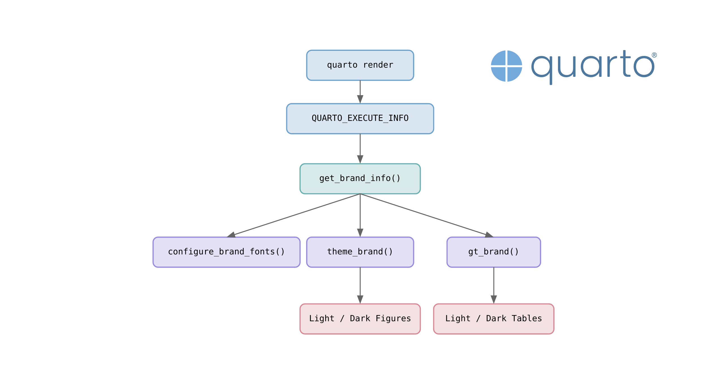
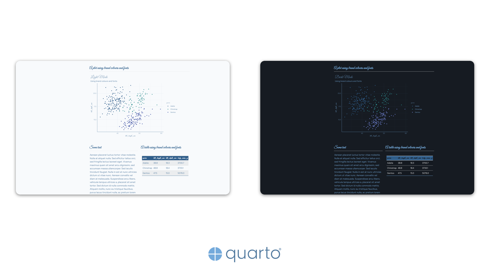
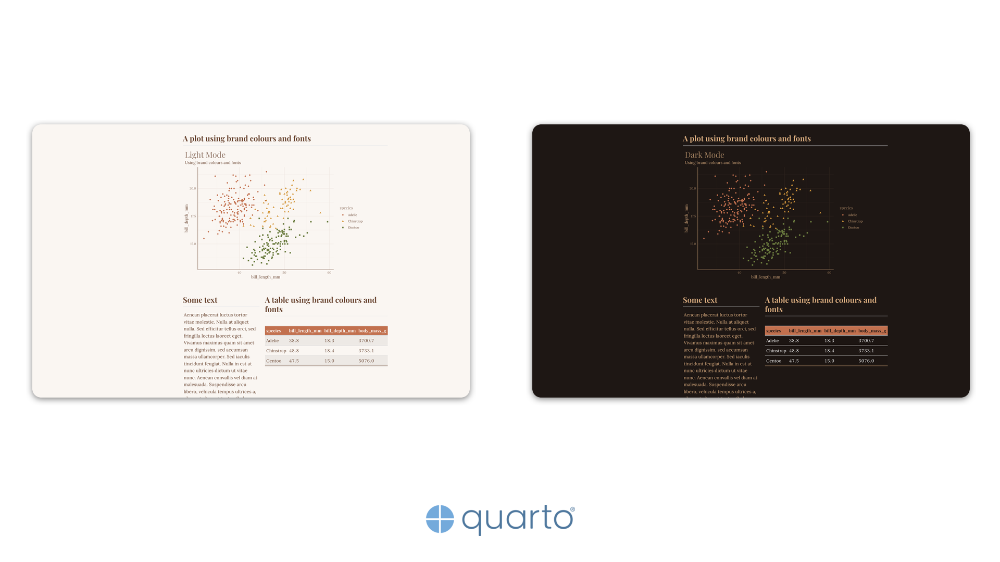
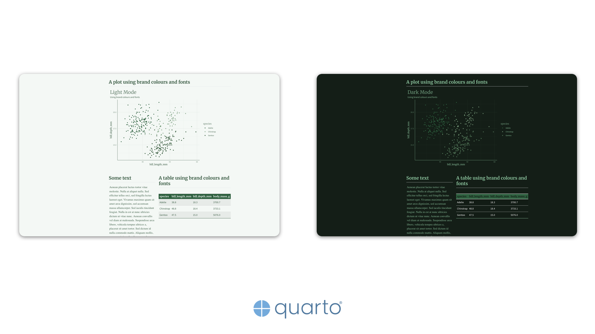
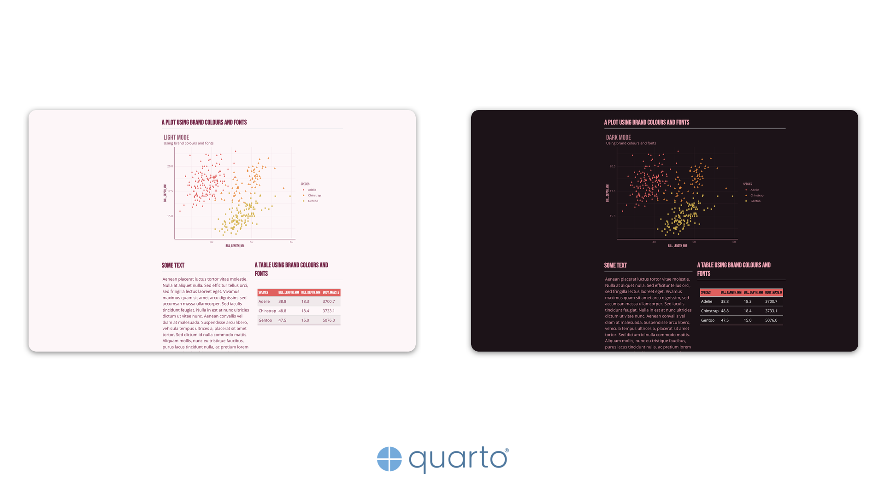
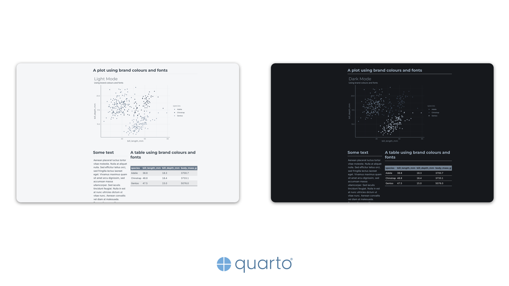
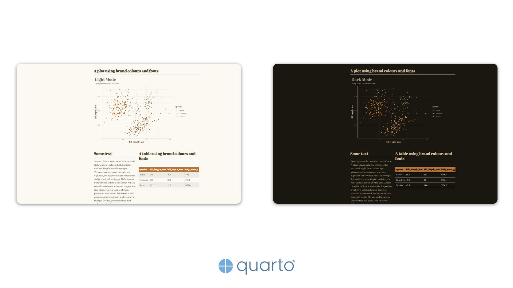

{
  .img-featured
  .img-fluid
  fig-align="center"
  fig-alt=''
  width="600px"
}

::: {.callout-important}

## Quarto Version

This post was written and tested with **Quarto CLI 1.9.37**.
Some APIs or behaviours may differ in earlier stable releases.

:::

Quarto's `brand` feature is a convenient way to keep a document's look consistent across formats: define your colours, fonts, and logos once in a `_brand.yml` file, and everything from the navbar to the code blocks picks them up automatically.
Code-generated outputs, however, are a different story.
A `ggplot2` scatter plot or a `gt` summary table will cheerfully ignore your brand and render with their own defaults.
This post walks through one approach to close that gap: reading the resolved brand configuration at render time and applying it to every figure and table your code produces.

::: {.callout-tip}

## Key Principles

- Quarto sets `QUARTO_EXECUTE_INFO` for every code cell; parse it for brand colours, fonts, and palettes.
- Register web fonts before any plotting; graphics devices do not see brand-defined fonts by default.
- Wrap the styling logic in `theme_brand()` (figures) and `gt_brand()` (tables) so every output inherits brand values.
- Use `renderings: [light, dark]` and `.light-content`/`.dark-content` to match the reader's selected theme automatically.
- The companion repository [mcanouil/demo-quarto-brand-renderings](https://github.com/mcanouil/demo-quarto-brand-renderings) has production-ready implementations with full error handling.

:::

## The Problem

The goal is to make every visual output match the document's brand without hardcoding hex values or font names.
Here is what branded outputs look like across six different brand configurations, each with light and dark variants:

```{=html}
<section class="featured-carousel-section" aria-label="Branded outputs preview">
  <div class="featured-carousel featured-carousel--media featured-carousel--n6" role="region" aria-roledescription="carousel" aria-label="Branded outputs across six brand configurations">
    <div class="featured-track" style="--total: 7;">
      <a class="lightbox" href="assets/_featured-brand-1.png" data-gallery="brand-carousel"></a>
      <a class="lightbox" href="assets/_featured-brand-2.png" data-gallery="brand-carousel"></a>
      <a class="lightbox" href="assets/_featured-brand-3.png" data-gallery="brand-carousel"></a>
      <a class="lightbox" href="assets/_featured-brand-4.png" data-gallery="brand-carousel"></a>
      <a class="lightbox" href="assets/_featured-brand-5.png" data-gallery="brand-carousel"></a>
      <a class="lightbox" href="assets/_featured-brand-6.png" data-gallery="brand-carousel"></a>
      <a aria-hidden="true" tabindex="-1" href="assets/_featured-brand-1.png"></a>
    </div>
  </div>
  <ol class="featured-marker featured-marker--n6" aria-hidden="true">
    <li></li><li></li><li></li><li></li><li></li><li></li>
  </ol>
</section>
```

::: {.callout-note}

## Alternative Approaches

There is no single right way to achieve branded outputs in R and Python.
The [`brand.yml`](https://posit-dev.github.io/brand-yml/) project provides dedicated [R](https://posit-dev.github.io/brand-yml/pkg/r/) and [Python](https://posit-dev.github.io/brand-yml/pkg/py/) packages that read a `_brand.yml` file directly and are the recommended starting point for most projects.
At the time of writing, however, the `brand.yml` packages do not support font registration for graphics devices.
You could also write your own wrappers, hard-code a shared palette, or use any other strategy that suits your workflow.
This post demonstrates one particular approach: reading the resolved brand data from `QUARTO_EXECUTE_INFO` at render time, making it independent of external packages and portable across languages, with full font registration support.

:::

## The `QUARTO_EXECUTE_INFO` Approach

When Quarto renders a document, it sets the `QUARTO_EXECUTE_INFO` environment variable for every code cell.
This variable points to a JSON file containing document metadata, format settings, and, crucially, the resolved brand configuration.

The brand data lives at `format.render.brand` in the JSON, with separate entries for each colour mode (`light`, `dark`).
Reading it requires only a JSON parser.

::: {.panel-tabset group="language"}

###  R {.active}

```{.r}
get_brand_info <- function() {
  jsonlite::fromJSON(                              # <2>
    Sys.getenv("QUARTO_EXECUTE_INFO", unset = "")  # <1>
  )
}
```

1. Read the environment variable set by Quarto.
2. Parse the JSON string into an R list.

###  Python

```{.python}
import json
import os
import pathlib

def get_brand_info() -> dict:
    raw = os.environ.get("QUARTO_EXECUTE_INFO", "")   # <1>
    if not raw:
        return {}
    path = pathlib.Path(raw)
    if path.is_file():                                # <2>
        return json.loads(path.read_text())
    return json.loads(raw)
```

1. Read the environment variable set by Quarto.
2. The value may be a file path or a raw JSON string; check which.

:::

::: {.callout-tip}

## Exploring the Structure

During development, print the full JSON to see what is available:

::: {.panel-tabset group="language"}

###  R {.active}

```{.r}
info <- get_brand_info()
cat(jsonlite::toJSON(info[["format"]][["render"]][["brand"]], pretty = TRUE))
```

###  Python

```{.python}
info = get_brand_info()
print(json.dumps(info["format"]["render"]["brand"], indent=2))
```

:::

:::

## Brand Data Structure

The brand object under `format.render.brand` contains one entry per colour mode.
Each mode holds a `data` object with colour and typography definitions.

```{.json}
{
  "light": {
    "data": {
      "color": {
        "palette": {
          "anchor-blue": "#2f5d8a",
          "harbour-teal": "#2d8c8f",
          "strait-violet": "#5f6fb3"
        },
        "foreground": "#4f789e",
        "background": "#f8fafc"
      },
      "typography": {
        "base": "Chakra Petch",
        "headings": "Great Vibes",
        "monospace": "JetBrains Mono",
        "fonts": [
          { "family": "Chakra Petch", "source": "bunny" }
        ]
      }
    }
  },
  "dark": {
    "data": { "..." }
  }
}
```

The key fields are:

- `color.palette`: named colour values used for data series and accents.
- `color.foreground` / `color.background`: ink and paper colours for the given mode.
- `typography.base` / `typography.headings`: font family names.
- `typography.fonts`: font specifications including source (`bunny`, `google`, `file`, or `system`).

The diagrams below summarise how each helper function fits into the rendering pipeline.

::: {.panel-tabset group="language"}

###  R {.active}

```{typst}
//| label: fig-workflow-r
//| cap: "R workflow for branded figures and tables."
//| alt: "Diagram showing the R workflow: quarto render sets QUARTO_EXECUTE_INFO, which is parsed by get_brand_info(). That feeds configure_brand_fonts() using systemfonts, theme_brand() using ggplot2 and scales, and gt_brand() using gt, producing light/dark figures and tables."
//| classes: "img-fluid w-75 mx-auto d-block"
//| fig-align: center
//| preamble: workflow-diagram.typ

#brand-workflow(
  [jsonlite],
  [systemfonts],
  [ggplot2 + scales],
  [gt],
)
```

###  Python

```{typst}
//| label: fig-workflow-py
//| cap: "Python workflow for branded figures and tables."
//| alt: "Diagram showing the Python workflow: quarto render sets QUARTO_EXECUTE_INFO, which is parsed by get_brand_info(). That feeds configure_brand_fonts() using pyfonts and matplotlib, theme_brand() using plotnine, and gt_brand() using great_tables, producing light/dark figures and tables."
//| classes: "img-fluid w-75 mx-auto d-block"
//| fig-align: center
//| preamble: workflow-diagram.typ

#brand-workflow(
  [json + os],
  [pyfonts + matplotlib],
  [plotnine],
  [great\_tables],
)
```

:::

## Dependencies

This approach relies on a handful of packages for each language.

::: {.panel-tabset group="language"}

###  R {.active}

- [`jsonlite`](https://cran.r-project.org/package=jsonlite): parse the `QUARTO_EXECUTE_INFO` JSON.
- [`ggplot2`](https://ggplot2.tidyverse.org/): the `ink`, `paper`, `accent`, and `palette.*` theme elements used by `theme_brand()` are not yet on CRAN.
- [`gt`](https://gt.rstudio.com/): table styling.
- [`scales`](https://scales.r-lib.org/): colour blending via `col_mix()`.
- [`systemfonts`](https://systemfonts.r-lib.org/): font discovery, registration, and web font embedding for SVG output.

###  Python

- [`plotnine`](https://plotnine.org/): `ggplot2`-style plotting.
- [`great_tables`](https://posit-dev.github.io/great-tables/): table styling.
- [`polars`](https://pola.rs/): data manipulation.
- [`pyfonts`](https://github.com/y-sunflower/pyfonts): font loading from Bunny Fonts and Google Fonts, created by [Joseph Barbier](https://github.com/JosephBARBIERDARNAL).
  The companion repository uses a development version of `pyfonts` for improved font subset selection.

:::

## Font Registration

Web fonts defined in a brand configuration are not available to R or Python graphics devices by default.
Before creating any plots or tables, a `configure_brand_fonts()` function registers each font so that graphics devices can find them.
Call it once in a setup chunk at the top of your document.

::: {.panel-tabset group="language"}

###  R {.active}

The `systemfonts` package handles font discovery and registration.

```{.r}
configure_brand_fonts <- function(brand_mode = "light") {
  info <- get_brand_info()
  brand <- info[["format"]][["render"]][["brand"]]
  doc_dir <- dirname(info[["document-path"]])                                   # <1>

  for (mode in intersect(c("light", "dark"), names(brand))) {
    fonts <- brand[[mode]][["data"]][["typography"]][["fonts"]]
    for (ifont in seq_len(nrow(fonts))) {
      family <- fonts[["family"]][[ifont]]
      source <- fonts[["source"]][[ifont]]

      if (identical(source, "file")) {
        files <- fonts[["files"]][[ifont]]
        for (fp in as.character(files[["path"]])) {
          resolved <- file.path(doc_dir, fp)                                    # <2>
          systemfonts::register_font(family, plain = resolved)                  # <3>
        }
      } else {
        systemfonts::require_font(family, repositories = "Bunny Fonts")         # <4>
      }
    }
  }
  systemfonts::reset_font_cache()                                               # <5>
}
```

1. Resolve the document directory from `QUARTO_EXECUTE_INFO` for relative font paths.
2. Build the full path to each local font file.
3. Register local font files with `systemfonts::register_font()`.
4. Download web fonts from Bunny Fonts (or Google Fonts) with `systemfonts::require_font()`.
5. Reset the font cache so newly registered fonts become available.

###  Python

The `matplotlib.font_manager` module handles font registration, with `pyfonts` for downloading web fonts.

```{.python}
import matplotlib.font_manager as fm
import pyfonts

def configure_brand_fonts() -> None:
    info = get_brand_info()
    brand = info["format"]["render"]["brand"]
    doc_dir = pathlib.Path(info["document-path"]).parent   # <1>

    for mode in ["light", "dark"]:
        if mode not in brand:
            continue
        fonts = brand[mode]["data"]["typography"]["fonts"]
        for font_spec in fonts:
            family = font_spec["family"]
            source = font_spec["source"]

            if source == "file":
                for f in font_spec.get("files", []):
                    resolved = doc_dir / f["path"]         # <2>
                    fm.fontManager.addfont(str(resolved))  # <3>
            elif source in ("bunny", "google"):
                if source == "bunny":
                    props = pyfonts.load_bunny_font(family)
                else:
                    props = pyfonts.load_google_font(family)
                fm.fontManager.addfont(props.get_file())   # <4>
```

1. Resolve the document directory for relative font paths.
2. Build the full path to each local font file.
3. Register local font files with `matplotlib.font_manager`.
4. Download web fonts using `pyfonts` and register them.

:::

::: {.callout-note}

## SVG Font Rendering

When generating figures as SVG, the SVG files must be inlined directly into the HTML page for fonts to render correctly.
An SVG file referenced via an `` tag is treated as an isolated document by the browser: it cannot access the page's stylesheets or `@import` rules, so any `@font-face` declarations inside the SVG that reference external URLs are silently ignored.
Inlining the SVG into the page DOM removes this boundary, allowing the browser to resolve font imports just like any other CSS resource.

The companion repository includes an `inline-svglite.lua` Lua filter that replaces `` references with raw SVG content automatically.
See the [companion repository](https://github.com/mcanouil/demo-quarto-brand-renderings) for the full implementation.

:::

## Branded Figures

The `theme_brand()` function extracts colours and fonts from the brand data and builds a complete `ggplot2` or plotnine theme.
The idea is straightforward: pull out the ink (foreground), paper (background), and palette colours, then pass them to the theme constructor.
In R, the latest `ggplot2` supports `ink`, `paper`, and `accent` parameters directly in `theme_minimal()`; in Python, each theme element is styled individually.

::: {.panel-tabset group="language"}

###  R {.active}

```{.r}
theme_brand <- function(base_size = 11, brand_mode = "light") {
  info <- get_brand_info()
  brand <- info[["format"]][["render"]][["brand"]]
  brand_data <- brand[[brand_mode]][["data"]]
  colors <- brand_data[["color"]]
  typography <- brand_data[["typography"]]
  palette_values <- unname(unlist(colors[["palette"]]))  # <1>

  ink <- colors[["foreground"]]                          # <2>
  paper <- colors[["background"]]                        # <2>
  accent <- scales::col_mix(ink, paper, amount = 0.25)   # <3>

  ggplot2::theme_minimal(
    base_size = base_size,
    base_family = typography[["base"]],                  # <4>
    header_family = typography[["headings"]],            # <4>
    ink = ink,                                           # <5>
    paper = paper,                                       # <5>
    accent = accent                                      # <5>
  ) +
    ggplot2::theme(
      plot.title = ggplot2::element_text(
        colour = accent,
        size = ggplot2::rel(2)
      ),
      palette.colour.discrete = palette_values,          # <6>
      palette.fill.discrete = palette_values             # <6>
    )
}
```

1. Flatten the named palette into a character vector.
2. Extract foreground (ink) and background (paper) from the brand colours.
3. Blend ink and paper to create an accent colour for titles and axes.
4. Apply brand fonts to body text and headings.
5. Pass ink, paper, and accent to `theme_minimal()`.
6. Set the discrete colour palette for geoms.

###  Python

R uses `scales::col_mix()` to blend colours.
Python needs a small helper since there is no equivalent in plotnine:

```{.python}
def _col_mix(a: str, b: str, amount: float = 0.25) -> str:
    ra, ga, ba = int(a[1:3], 16), int(a[3:5], 16), int(a[5:7], 16)
    rb, gb, bb = int(b[1:3], 16), int(b[3:5], 16), int(b[5:7], 16)
    r = int(ra + (rb - ra) * amount)
    g = int(ga + (gb - ga) * amount)
    b_val = int(ba + (bb - ba) * amount)
    return f"#{r:02x}{g:02x}{b_val:02x}"
```

Because `plotnine` does not support `palette.*` theme elements, a separate helper extracts the colour palette for use with `scale_color_manual()`:

```{.python}
def get_brand_palette(brand_mode: str = "light") -> list[str]:
    info = get_brand_info()
    brand = info["format"]["render"]["brand"]
    palette = brand[brand_mode]["data"]["color"]["palette"]
    return list(palette.values())
```

```{.python}
from plotnine import (
    element_line, element_rect, element_text, theme, theme_minimal
)

def theme_brand(base_size: int = 11, brand_mode: str = "light") -> theme:
    info = get_brand_info()
    brand = info["format"]["render"]["brand"]
    brand_data = brand[brand_mode]["data"]
    colors = brand_data["color"]
    typography = brand_data["typography"]

    ink = colors["foreground"]                                                  # <1>
    paper = colors["background"]                                                # <1>
    accent = _col_mix(ink, paper, 0.25)                                         # <2>
    base_family = typography["base"]
    heading_family = typography["headings"]

    base_line_size = base_size / 22
    grid_major_colour = _col_mix(ink, paper, 0.8)
    grid_minor_colour = _col_mix(ink, paper, 0.9)

    return theme_minimal(
        base_size=base_size,
        base_family=base_family                                                 # <3>
    ) + theme(
        plot_background=element_rect(fill=paper, colour="none"),
        panel_background=element_rect(fill=paper, colour="none"),
        panel_grid_major=element_line(colour=grid_major_colour, size=base_line_size),
        panel_grid_minor=element_line(colour=grid_minor_colour, size=base_line_size * 0.5),
        text=element_text(colour=ink),
        axis_title=element_text(family=heading_family),
        axis_line_x=element_line(colour=accent),
        axis_line_y=element_line(colour=accent),
        plot_title=element_text(
            family=heading_family,                                              # <3>
            colour=accent,
            size=base_size * 2,
        ),
        plot_subtitle=element_text(colour=ink),
        legend_title=element_text(family=heading_family, colour=accent),
        legend_background=element_rect(fill=paper, colour="none"),
    )
```

1. Extract foreground (ink) and background (paper) from the brand colours.
2. Blend ink and paper to create an accent colour (custom `_col_mix()` helper).
3. Apply brand fonts to body text and headings.

:::

::: {.callout-note}

The latest version of `ggplot2` supports `ink`, `paper`, `accent`, and `palette.*` theme elements natively.
`plotnine` does not have these parameters, so each element must be styled individually.

:::

::: {.callout-tip}

## Companion Repository

The code samples in this post are intentionally simplified.
The [companion repository](https://github.com/mcanouil/demo-quarto-brand-renderings) contains production-ready versions with full error handling, defensive `.get()` fallbacks, and additional styling such as continuous palette support in R.

:::

### Usage

With `theme_brand()` defined, applying it to a plot is straightforward.

::: {.panel-tabset group="language"}

###  R {.active}

```{.r}
library(ggplot2)
penguins <- read.csv("penguins.csv")

ggplot(penguins) +
  aes(x = bill_length_mm, y = bill_depth_mm, colour = species) +
  geom_point(na.rm = TRUE) +
  theme_brand(brand_mode = "light") +
  labs(title = "Light Mode", subtitle = "Using brand colours and fonts")
```

###  Python

```{.python}
import polars as pl
from plotnine import aes, geom_point, ggplot, labs, scale_color_manual

penguins = pl.read_csv("penguins.csv", null_values="NA").drop_nulls(
    ["bill_length_mm", "bill_depth_mm"]
)

palette = get_brand_palette("light")

(
    ggplot(penguins.to_pandas())
    + aes(x="bill_length_mm", y="bill_depth_mm", color="species")
    + geom_point()
    + theme_brand(brand_mode="light")
    + scale_color_manual(values=palette)
    + labs(title="Light Mode", subtitle="Using brand colours and fonts")
)
```

:::

## Branded Tables

The `gt_brand()` function follows the same pattern: extract brand colours and fonts, then apply them to the table.
Column headers get the first palette colour as a background, body borders use an accent derived from blending ink and paper, and the base and heading fonts are applied throughout.

::: {.panel-tabset group="language"}

###  R {.active}

```{.r}
gt_brand <- function(data, brand_mode = "light") {
  info <- get_brand_info()
  brand <- info[["format"]][["render"]][["brand"]]
  brand_data <- brand[[brand_mode]][["data"]]
  colors <- brand_data[["color"]]
  typography <- brand_data[["typography"]]
  palette <- unname(unlist(colors[["palette"]]))

  ink <- colors[["foreground"]]
  paper <- colors[["background"]]
  accent <- scales::col_mix(ink, paper, amount = 0.25)

  gt::gt(data) |>
    gt::opt_table_font(font = typography[["base"]]) |>                          # <1>
    gt::tab_options(
      table.background.color = paper,                                           # <2>
      table.font.color = ink,                                                   # <2>
      column_labels.background.color = palette[[1L]],                           # <3>
      column_labels.font.weight = "bold",
      table_body.border.top.color = accent,                                     # <4>
      table_body.border.bottom.color = accent                                   # <4>
    ) |>
    gt::tab_style(
      style = gt::cell_text(font = typography[["headings"]], color = paper),    # <5>
      locations = gt::cells_column_labels()
    )
}
```

1. Set the base font for the entire table.
2. Apply brand background and text colours.
3. Use the first palette colour for column header background.
4. Use the accent colour for table body borders.
5. Style column labels with the heading font and contrasting colour.

###  Python

```{.python}
from great_tables import GT, loc, style

def gt_brand(data, brand_mode: str = "light") -> GT:
    info = get_brand_info()
    brand = info["format"]["render"]["brand"]
    brand_data = brand[brand_mode]["data"]
    colors = brand_data["color"]
    typography = brand_data["typography"]
    palette = list(colors["palette"].values())

    ink = colors["foreground"]
    paper = colors["background"]
    accent = _col_mix(ink, paper, 0.25)

    return (
        GT(data)
        .tab_options(
            table_font_names=typography["base"],                                # <1>
            table_font_color=ink,                                               # <2>
            table_background_color=paper,                                       # <2>
            column_labels_background_color=palette[0] if palette else accent,   # <3>
            column_labels_font_weight="bold",
            table_body_border_top_color=accent,                                 # <4>
            table_body_border_bottom_color=accent,                              # <4>
        )
        .tab_style(
            style=style.text(
                font=typography["headings"],
                color=paper,
                weight="bold",                                                  # <5>
            ),
            locations=loc.column_labels(),
        )
    )
```

1. Set the base font for the entire table.
2. Apply brand background and text colours.
3. Use the first palette colour for column header background.
4. Use the accent colour for table body borders.
5. Style column labels with the heading font and contrasting colour.

:::

## Light and Dark Mode

Quarto supports light and dark colour modes, and the brand data includes separate colour definitions for each.
The helper functions accept a `brand_mode` parameter to select which variant to use.

For figures, Quarto's `renderings` cell option generates both variants from a single code cell.

```
#| renderings: [light, dark]
```

The code loops over both modes and prints each plot.
Quarto then displays the correct one based on the reader's selected theme.

For tables, use Quarto's `.light-content` and `.dark-content` CSS classes to conditionally display the appropriate version.

```{.markdown}
::: {.light-content}
Table rendered with `brand_mode = "light"`.
:::

::: {.dark-content}
Table rendered with `brand_mode = "dark"`.
:::
```

::: {.callout-tip}

## Automatic Theme Matching

Combining `renderings: [light, dark]` with branded themes means figures and tables automatically match the reader's selected theme without any JavaScript.

:::

## Putting It All Together

The full workflow boils down to four steps:

1. Call `configure_brand_fonts()` once in a hidden setup chunk (`#| include: false`) to register brand fonts before any plotting.
2. Apply `theme_brand(brand_mode = ...)` to every `ggplot2` or `plotnine` figure.
3. Pass your data through `gt_brand(data, brand_mode = ...)` for every `gt` or `great_tables` table.
4. Use `renderings: [light, dark]` on figure cells and `.light-content`/`.dark-content` divs on tables so the reader's theme preference is respected automatically.

That is the entire pattern.
Every helper reads from the same `QUARTO_EXECUTE_INFO` source, so switching to a different brand configuration is just a matter of changing your `_brand.yml` file; no code changes are needed.

## Conclusion

The `QUARTO_EXECUTE_INFO` environment variable provides language-agnostic access to Quarto's resolved brand configuration at render time.
With a small set of helper functions, you can apply consistent brand colours, fonts, and palettes to every figure and table your code produces.

This is one approach among several (see the note on `brand.yml` packages above), but it has the advantage of working identically in R and Python, supporting full font registration, and requiring no dependencies beyond a JSON parser and the plotting libraries you are already using.
Browse the [companion repository](https://github.com/mcanouil/demo-quarto-brand-renderings) for six complete brand configurations with production-ready implementations, and feel free to adapt the helpers to your own projects.

## Further Resources

- [Multiformat Branding with `_brand.yml`](https://quarto.org/docs/authoring/brand.html): the official Quarto documentation on the brand feature.
- [Execution Context Information](https://quarto.org/docs/advanced/quarto-execute-info.html): how `QUARTO_EXECUTE_INFO` works and what data it exposes.
- [Execution Options](https://quarto.org/docs/computations/execution-options.html): code cell options including `renderings` for light/dark mode.
- [HTML Theming](https://quarto.org/docs/output-formats/html-themes.html): customising HTML themes, Sass variables, and dark mode support.
- [`brand.yml` Specification](https://posit-dev.github.io/brand-yml/): the full specification and documentation for `_brand.yml` files.
