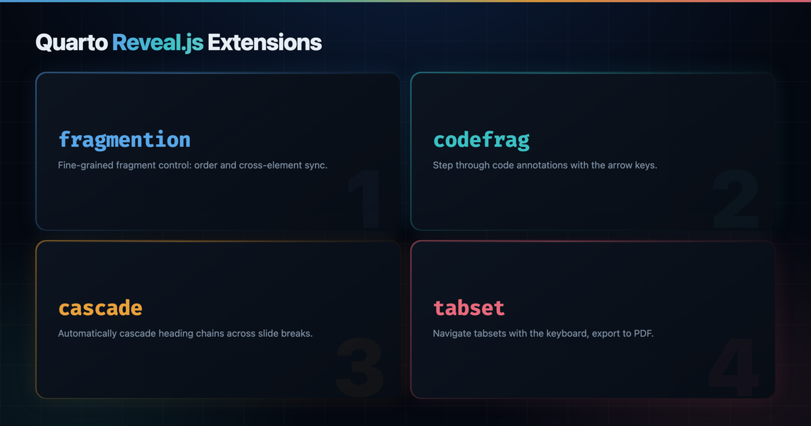

{
  .img-featured
  .img-fluid
  fig-align="center"
  fig-alt=''
  width="600px"
}

## Introduction

Reveal.js is a flexible slide engine, but a few rough edges show up again and again when writing slides in Quarto.
List fragments need a marker on every item, code annotations stay static, long talks repeat the same heading on continuation slides, and tabsets need a mouse click to advance.
Each of the four small extensions below closes one of those gaps, and they compose cleanly on a single slidedeck.

Every section installs one extension, shows the minimal front-matter and body needed to activate it, and embeds a focused slidedeck you can step through with the arrow keys.

::: {.callout-note}

## Four extensions at a glance

- [`quarto-revealjs-fragmention`](https://github.com/mcanouil/quarto-revealjs-fragmention) hoists `.fragment` markers onto list items.
- [`quarto-revealjs-codefrag`](https://github.com/mcanouil/quarto-revealjs-codefrag) turns code annotations into navigable fragments.
- [`quarto-revealjs-cascade`](https://github.com/mcanouil/quarto-revealjs-cascade) repeats heading chains after slide breaks.
- [`quarto-revealjs-tabset`](https://github.com/mcanouil/quarto-revealjs-tabset) makes `.panel-tabset` blocks keyboard and PDF friendly.

:::

## Fragmention

`quarto-revealjs-fragmention` lets you animate a whole list item as a single fragment.
You place an empty span with the `.fragment` class (and optional `fragment-index`) at the start of the item, and the filter hoists those attributes onto the parent `<li>`, so there is no stray marker left in the rendered slide.

### Install

```{.bash}
quarto add mcanouil/quarto-revealjs-fragmention
```

### Activate in the front-matter

```{.yaml include="assets/_slides-src/demo-fragmention.qmd" start-line=4 end-line=5}
```

### Mark up your list

```{.markdown include="assets/_slides-src/demo-fragmention.qmd" start-line=8 end-line=20 shortcodes="false"}
```

### Live demo

::: {style="text-align: center;"}

{
  .hero-art
  .slide-deck
  loading="lazy"
  title="Fragmention demo slidedeck"
}

:::

## Codefrag

`quarto-revealjs-codefrag` pairs naturally with Quarto's `code-annotations: select` mode.
Each `# <n>` marker becomes a Reveal.js fragment, so the matching annotation appears step by step as you press the arrow keys, and the tooltip stays in sync with the current annotation.

### Install

```{.bash}
quarto add mcanouil/quarto-revealjs-codefrag
```

### Activate in the front-matter

```{.yaml include="assets/_slides-src/demo-codefrag.qmd" start-line=5 end-line=6}
```

### Annotate your code

```{.markdown include="assets/_slides-src/demo-codefrag.qmd" start-line=9 end-line=23 shortcodes="false"}
```

### Live demo

::: {style="text-align: center;"}

{
  .hero-art
  .slide-deck
  loading="lazy"
  title="Codefrag demo slidedeck"
}

:::

## Cascade

`quarto-revealjs-cascade` repeats the current heading chain whenever a `---` slide break creates a continuation slide.
You keep one section heading (and optional subsection) at the top of a topic, then use `---` to start fresh slides without retyping the title.

### Install

```{.bash}
quarto add mcanouil/quarto-revealjs-cascade
```

### Activate in the front-matter

```{.yaml include="assets/_slides-src/demo-cascade.qmd" start-line=4 end-line=5}
```

### Chain your headings

```{.markdown include="assets/_slides-src/demo-cascade.qmd" start-line=8 end-line=32 shortcodes="false"}
```

### Live demo

::: {style="text-align: center;"}

{
  .hero-art
  .slide-deck
  loading="lazy"
  title="Cascade demo slidedeck"
}

:::

## Tabset

`quarto-revealjs-tabset` turns a `.panel-tabset` block into a keyboard-driven tabset.
Each tab becomes a Reveal.js fragment, so the arrow keys cycle through them, and PDF export lays every tab out on its own page instead of collapsing them to the active one.

### Install

```{.bash}
quarto add mcanouil/quarto-revealjs-tabset
```

### Activate in the front-matter

```{.yaml include="assets/_slides-src/demo-tabset.qmd" start-line=4 end-line=5}
```

### Wrap your tabs

```{.markdown include="assets/_slides-src/demo-tabset.qmd" start-line=8 end-line=29 shortcodes="false"}
```

### Live demo

::: {style="text-align: center;"}

{
  .hero-art
  .slide-deck
  loading="lazy"
  title="Tabset demo slidedeck"
}

:::

## All four together

The four extensions compose without fuss on a single slidedeck.
You declare the two filters, the two plugins, and `code-annotations: select`, then use each feature where it fits the story.

```{.yaml include="assets/_slides-src/demo-combined.qmd" start-line=5 end-line=10}
```

::: {style="text-align: center;"}

{
  .hero-art
  .slide-deck
  loading="lazy"
  title="Combined demo slidedeck"
}

:::

## Wrap-up

Each extension is small, focused, and targets a friction point rather than a whole workflow.
Install the ones you need, keep the rest out of your front-matter, and your next slidedeck can lean a little more on the keyboard and a little less on the mouse.

Repositories for the curious:

- [`quarto-revealjs-fragmention`](https://github.com/mcanouil/quarto-revealjs-fragmention).
- [`quarto-revealjs-codefrag`](https://github.com/mcanouil/quarto-revealjs-codefrag).
- [`quarto-revealjs-cascade`](https://github.com/mcanouil/quarto-revealjs-cascade).
- [`quarto-revealjs-tabset`](https://github.com/mcanouil/quarto-revealjs-tabset).
