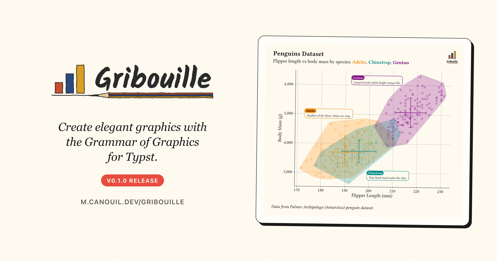

{
  .img-featured
  .img-fluid
  fig-align="center"
  fig-alt=''
  width="600px"
}

## Introduction

Typst has grown from a curious newcomer to a credible alternative for scientific writing, reports, and slide decks.
What it still lacked, until today, was a real grammar of graphics: a way to declare a figure with the same vocabulary you would reach for in [`ggplot2`](https://ggplot2.tidyverse.org), then have it draw, lay out, and align with the rest of the document.

[Gribouille](https://github.com/mcanouil/gribouille) (French for *scribble*) is the first cut of that library.
Version 0.1.0 lands on [Typst Universe](https://typst.app/universe/package/gribouille) with this announcement, modelled closely on `ggplot2`, drawing on top of [`cetz`](https://cetz-package.github.io/), and shipped with a documentation site that is itself a Quarto project rendered by the [`quarto-typst-render`](https://github.com/mcanouil/quarto-typst-render) extension.
Every figure in this post is a real, freshly compiled plot.

::: {.callout-note}

## At a glance

- [Gribouille](https://github.com/mcanouil/gribouille) v0.1.0 on Typst Universe: `#import "@preview/gribouille:0.1.0": *`.
- Forty-four geoms and twenty-seven stats, scores of scales across twelve aesthetics, eight built-in themes, and full facet support.
- [`compose()`](https://m.canouil.dev/gribouille/reference/core/compose.html) orchestrates several plots into a single figure with a shared, hoisted legend, fed by a new `defer: true` flag on [`plot()`](https://m.canouil.dev/gribouille/reference/core/plot.html).
- [`quarto-typst-render`](https://github.com/mcanouil/quarto-typst-render) v0.13.1 ships `typst_define()`, the Python and R helper that streams arbitrary values, scalars, lists, dictionaries, and full data frames alike, straight into Typst code blocks.

:::

## Why a grammar of graphics for Typst

Until now, producing a figure inside a Typst document meant taking a detour through another language.
You would leave Typst to call out to `ggplot2`, [`matplotlib`](https://matplotlib.org), or [`plotnine`](https://plotnine.org), save a PNG or SVG, and import it back.
That works, but it splits the toolchain in two: one font system on the page, another inside the figure; one colour palette in the report, another in the chart; one render pass that knows about the layout, another that does not.

`cetz` already gives Typst a robust low-level drawing API, but the declarative layer that turns a dataset, a mapping, and a few layers into a publication-quality figure was missing.
That is exactly the gap Gribouille fills.

The pay-off is a single toolchain.
A Gribouille figure is a Typst `figure` element with `kind: "gribouille-plot"`, so you can attach show rules, captions, or cross-references to every plot in one place, and it shares the document's fonts, palette, and geometry.
The YAML front-matter of this very post wires its `background:` and `foreground:` to the site's light and dark colours, and every figure below reacts automatically when you toggle the theme.
Compilation is deterministic, offline-friendly, and produces a PDF straight out of Typst with no Python or R runtime required.

## A respectful nod to ggplot2

A short personal aside.
I have been using `ggplot2` since almost its first release, and a large part of how I think about data visualisation comes from that work.
This release would not exist without Hadley Wickham's original vision, nor without the people carrying it forward today, in particular Thomas Lin Pedersen and Teun van den Brand, and the wider community of contributors who keep shaping the package through to the recent v4 release.

Gribouille is, in many ways, a port of `ggplot2`'s vocabulary into Typst.
The names line up: [`plot()`](https://m.canouil.dev/gribouille/reference/core/plot.html) instead of `ggplot()`, `geom-point()` for `geom_point()`, `facet-wrap()`, `scale-colour-*()`, [`theme-minimal()`](https://m.canouil.dev/gribouille/reference/themes/theme-minimal.html), and so on.
Where the two part ways, it is because Typst is a different language, with no lazy evaluation, no plot object you can mutate after the fact, and no `ggsave()` output pipeline.
Column names are plain strings.
Per-aesthetic type coercion is done inline with [`as-factor()`](https://m.canouil.dev/gribouille/reference/helpers/as-factor.html) and [`as-numeric()`](https://m.canouil.dev/gribouille/reference/helpers/as-numeric.html).
These are opinionated departures, but the mental model is the same one you already have.

## Build a penguins plot, one layer at a time

The library ships the [Palmer Penguins](https://allisonhorst.github.io/palmerpenguins/) dataset under the [`penguins`](https://m.canouil.dev/gribouille/reference/datasets/penguins.html) symbol.
The walk-through below builds a single figure end to end, one grammar concept at a time, with brief notes on alternatives at each step.
It is a tighter version of the [Get Started](https://m.canouil.dev/gribouille/get-started/) page on the documentation site.

Every plot you build composes the same pieces.
[`plot()`](https://m.canouil.dev/gribouille/reference/core/plot.html) wraps a stack of layers, each sheet sitting on the one below, from data and mapping at the foundation up through theme and labels.

```{typst}
//| echo: false
//| output-filename: "grammar.svg"
//| style: "display: block; margin-inline: auto;"
//| alt: "A plot() container surrounding six stacked parallax sheets representing the grammar layers, from bottom to top: data plus aes(), layer (geom plus stat plus position), scale-*, coord-*, facet-*, and theme plus labs."
#import "@preview/cetz:0.5.0": canvas, draw

#let ink = if _typst_render_foreground != none {
  _typst_render_foreground
} else {
  rgb("#1f2328")
}
#let accent = rgb("#3366FF")

#canvas(length: 1cm, {
  import draw: *

  set-style(content: (frame: none))

  let w = 7
  let h = 0.9
  let s = 0.6
  let gap = 0.15
  let n = 6
  let pad = 0.5
  let total-h = n * (h + gap) - gap

  let palette = (
    rgb("#E69F00"),
    rgb("#009E73"),
    rgb("#56B4E9"),
    rgb("#D55E00"),
    rgb("#0072B2"),
    rgb("#F4B740"),
  )

  line(
    (-pad, -pad),
    (w + pad, -pad),
    (w + pad + s, total-h + pad),
    (-pad + s, total-h + pad),
    close: true,
    stroke: 0.8pt + accent,
    fill: accent.transparentize(92%),
  )
  content(
    ((w + 2 * s) / 2, total-h + pad + 0.35),
    align(center, text(size: 9pt, weight: "bold", fill: accent)[`plot()`]),
  )

  let sheet(i, name, sub: none) = {
    let y = i * (h + gap)
    let col = palette.at(i)
    line(
      (0, y),
      (w, y),
      (w + s, y + h),
      (s, y + h),
      close: true,
      stroke: 0.8pt + col,
      fill: col.transparentize(80%),
    )
    let body = if sub == none {
      text(size: 9pt, fill: ink)[#name]
    } else {
      text(size: 9pt, fill: ink)[
        #name \
        #text(size: 7.5pt)[#sub]
      ]
    }
    content((w / 2 + s / 2, y + h / 2), align(center, body))
  }

  sheet(0, [data + `aes()`])
  sheet(1, [layer], sub: [(geom + stat + position)])
  sheet(2, [`scale-*`])
  sheet(3, [`coord-*`])
  sheet(4, [`facet-*`])
  sheet(5, [theme + labs])
})
```

The post's YAML points the `typst-render` extension at a one-line preamble file so every `{typst}` block has the library in scope:

```yaml
extensions:
  typst-render:
    preamble: _preamble.typ
```

And `_preamble.typ` contains:

```typst
#import "@preview/gribouille:0.1.0": *
```

You would write the same `#import` once at the top of your own Typst document.

### Data and aesthetics

Every plot starts with a dataset and an [`aes()`](https://m.canouil.dev/gribouille/reference/core/aes.html) mapping that binds column names to visual channels.
At a minimum, [`geom-point()`](https://m.canouil.dev/gribouille/reference/geoms/geom-point.html) needs `x` and `y`.

::: {layout-ncol="2" layout-valign="center"}

```{typst}
//| echo: true
//| output-filename: "step-1.svg"
//| alt: "Scatter of penguin body mass against flipper length, every point in the default theme ink colour, no legend."
#plot(
  data: penguins,
  mapping: aes(x: "flipper-len", y: "body-mass"),
  layers: (geom-point(size: 2pt),),
  width: 12cm,
  height: 9cm,
)
```

:::

The plot-level `mapping` is inherited by every layer.
If only one layer needs a given mapping, you can also pass it inside that layer's `mapping:` argument and keep the plot-level mapping minimal.

### Encode a third variable with colour

Add `colour: "species"` and the points split visually by group.

::: {layout-ncol="2" layout-valign="center"}

```{typst}
//| echo: true
//| output-filename: "step-2a.svg"
//| alt: "Scatter of body mass against flipper length, points coloured by species (Adelie, Chinstrap, Gentoo) with a species legend on the right."
#plot(
  data: penguins,
  mapping: aes(
    x: "flipper-len",
    y: "body-mass",
    colour: "species",
  ),
  layers: (geom-point(size: 2pt, alpha: 0.85),),
  width: 12cm,
  height: 9cm,
)
```

:::

If your figure must remain legible in greyscale, swap `colour: "species"` for `shape: "species"` and the same grouping rides the point shape instead.
Both aesthetics can be combined when accessibility matters.

::: {layout-ncol="2" layout-valign="center"}

```{typst}
//| echo: true
//| output-filename: "step-2b.svg"
//| alt: "Scatter of body mass against flipper length, monochrome with point glyphs distinguishing species: open circles for Adelie, triangles for Chinstrap, squares for Gentoo, with a species shape legend on the right."
#plot(
  data: penguins,
  mapping: aes(
    x: "flipper-len",
    y: "body-mass",
    shape: "species",
  ),
  layers: (geom-point(size: 2pt, alpha: 0.85),),
  width: 12cm,
  height: 9cm,
)
```

:::

### Stack a second layer

Layers stack in the order you list them.
Adding [`geom-smooth()`](https://m.canouil.dev/gribouille/reference/geoms/geom-smooth.html) draws one fitted line per colour group, because the `colour` aesthetic is inherited from the plot-level mapping.

::: {.callout-note}
Only `method: "lm"` is supported in this release; LOESS is deferred for the reason listed in the [limitations section](#sec-limitations).
:::

::: {layout-ncol="2" layout-valign="center"}

```{typst}
//| echo: true
//| output-filename: "step-3.svg"
//| alt: "Per-species scatter coloured by species with one linear fit and confidence ribbon per group, and a species legend on the right."
#plot(
  data: penguins,
  mapping: aes(
    x: "flipper-len",
    y: "body-mass",
    colour: "species",
    fill: "species",
  ),
  layers: (
    geom-point(size: 2pt, alpha: 0.6),
    geom-smooth(method: "lm", alpha: 0.2),
  ),
  width: 12cm,
  height: 9cm,
)
```

:::

### Pick a palette

[`scale-colour-discrete()`](https://m.canouil.dev/gribouille/reference/scales/scale-colour-discrete.html) replaces the default palette.
A matching [`scale-fill-discrete()`](https://m.canouil.dev/gribouille/reference/scales/scale-fill-discrete.html) keeps the confidence ribbons in step with the points.

::: {layout-ncol="2" layout-valign="center"}

```{typst}
//| echo: true
//| output-filename: "step-4.svg"
//| alt: "Same per-species scatter and linear fits as step 3, now using a colour-blind-friendly Okabe-Ito palette (blue, vermillion, bluish green)."
#let cb = (
  rgb("#0072B2"),
  rgb("#D55E00"),
  rgb("#009E73"),
)

#plot(
  data: penguins,
  mapping: aes(
    x: "flipper-len",
    y: "body-mass",
    colour: "species",
    fill: "species",
  ),
  layers: (
    geom-point(size: 2pt, alpha: 0.6),
    geom-smooth(method: "lm", alpha: 0.2),
  ),
  scales: (
    scale-colour-discrete(palette: cb),
    scale-fill-discrete(palette: cb),
  ),
  width: 12cm,
  height: 9cm,
)
```

:::

::: {.callout-tip}
[`scale-colour-okabe-ito()`](https://m.canouil.dev/gribouille/reference/scales/scale-colour-okabe-ito.html) exposes the same Okabe-Ito palette used in the example but as a one-liner if you do not want to spell out the colour codes.
:::

### Split into small multiples

[`facet-wrap()`](https://m.canouil.dev/gribouille/reference/facets/facet-wrap.html) lays out one panel per level of a discrete column, sharing scales across panels.

::: {layout-ncol="2" layout-valign="center"}

```{typst}
//| echo: true
//| output-filename: "step-5.svg"
//| alt: "Three panels (Torgersen, Biscoe, Dream) arranged on a two-column grid, one per island, sharing colour and axis scales."
#let cb = (
  rgb("#0072B2"),
  rgb("#D55E00"),
  rgb("#009E73"),
)

#plot(
  data: penguins,
  mapping: aes(
    x: "flipper-len",
    y: "body-mass",
    colour: "species",
    fill: "species",
  ),
  layers: (
    geom-point(size: 2pt, alpha: 0.6),
    geom-smooth(method: "lm", alpha: 0.2),
  ),
  scales: (
    scale-colour-discrete(palette: cb),
    scale-fill-discrete(palette: cb),
  ),
  facet: facet-wrap("island"),
  width: 12cm,
  height: 9cm,
)
```

:::

::: {.callout-tip}
For two crossed factors, [`facet-grid()`](https://m.canouil.dev/gribouille/reference/facets/facet-grid.html) produces a matrix of panels instead.
:::

### Polish

A theme, axis labels, and the figure is ready for the page.

[`format-comma()`](https://m.canouil.dev/gribouille/reference/helpers/format-comma.html), passed to `scale-y-continuous(labels: ...)`, turns `5000` into `5,000` on the y-axis.
Sibling helpers cover number, percent, currency, scientific notation, and case or wrap formatting.

[`element-typst()`](https://m.canouil.dev/gribouille/reference/themes/element-typst.html) wires the subtitle to render as Typst markup, so the linear-fit formula `$hat(y) = beta_0 + beta_1 dot.c x$` and the per-species names appear with maths and inline colour without leaving the string.

A single `species-colours` dictionary feeds both [`scale-colour-discrete()`](https://m.canouil.dev/gribouille/reference/scales/scale-colour-discrete.html) (`limits:` plus `palette:`) and the second subtitle line.
The entries are mapped to coloured `#text(...)` snippets, joined into one Typst-markup string.

Legend placement is controlled with [`guides()`](https://m.canouil.dev/gribouille/reference/guides/guides.html) bound to [`guide-legend(position: ...)`](https://m.canouil.dev/gribouille/reference/guides/guide-legend.html).
`position:` accepts the side strings `"top"`, `"right"`, `"bottom"`, `"left"`, a Typst alignment like `bottom + right` for an inside-panel corner, or a `(dx:, dy:)` offset for arbitrary placement.

The same constructor exposes `direction`, `byrow`, `nrow`, and `ncolumn` for swatch layout, and a `"top"` or `"bottom"` placement automatically lays a colourbar or size ladder out horizontally.
The `ncol` argument was renamed to `ncolumn` in the run-up to this release, so older snippets need updating before they compile.

::: {layout-ncol="2" layout-valign="center"}

```{typst}
//| echo: true
//| output-filename: "step-6.svg"
//| alt: "Polished faceted scatter on a minimal theme with bold title, a subtitle pairing the linear-fit formula with the three species names rendered in their respective colours, thousands-separated y ticks, title-cased axis labels, and the species legend tucked inside the empty bottom-right facet panel."
#let species-colours = (
  Adelie:    rgb("#0072B2"),
  Chinstrap: rgb("#D55E00"),
  Gentoo:    rgb("#009E73"),
)

#plot(
  data: penguins,
  mapping: aes(
    x: "flipper-len",
    y: "body-mass",
    colour: "species",
    fill: "species",
    shape: "species",
  ),
  layers: (
    geom-point(size: 2pt, alpha: 0.6),
    geom-smooth(method: "lm", alpha: 0.2),
  ),
  scales: (
    scale-colour-discrete(
      limits: species-colours.keys(),
      palette: species-colours.values(),
    ),
    scale-fill-discrete(
      limits: species-colours.keys(),
      palette: species-colours.values(),
    ),
    scale-y-continuous(labels: format-comma()),
  ),
  facet: facet-wrap("island"),
  guides: guides(
    colour: guide-legend(position: bottom + right),
    fill: guide-legend(position: bottom + right),
    shape: guide-legend(position: bottom + right),
  ),
  labs: labs(
    title: "Penguin Body Mass Scales with Flipper Length",
    subtitle: {
      [Linear fit $hat(y) = beta_0 + beta_1 dot.c x$ on every island for three species: ]
      species-colours.pairs()
        .map(p => text(fill: p.at(1), weight: "bold", p.at(0)))
        .join(", ")
    },
    x: "Flipper Length (mm)",
    y: "Body Mass (g)",
    colour: "Species",
    fill: "Species",
    shape: "Species",
  ),
  theme: theme-minimal(
    plot-title: element-text(size: 12pt, weight: "bold"),
    plot-subtitle: element-typst(size: 9pt),
  ),
  width: 12cm,
  height: 9cm,
)
```

:::

## Compose multiple plots

Sometimes a story needs more than one panel.
[`compose()`](https://m.canouil.dev/gribouille/reference/core/compose.html) takes several deferred plots, lays them out on a grid or stack, and hoists their shared legend into a single guide block at the edge of the figure.
The deferred plots are produced by passing `defer: true` to [`plot()`](https://m.canouil.dev/gribouille/reference/core/plot.html), which returns a spec dictionary instead of rendering immediately.

::: {layout-ncol="2" layout-valign="center"}

```{typst}
//| echo: true
//| output-filename: "compose.svg"
//| alt: "Two side-by-side scatter plots, the left of penguin body mass against flipper length and the right against bill length, points coloured by species (Adelie, Chinstrap, Gentoo), with a single shared species legend on the right of the pair."
#let panel(mapping) = plot(
  data: penguins,
  mapping: mapping,
  layers: (geom-point(size: 2pt, alpha: 0.85),),
  width: 6cm,
  height: 4.5cm,
  defer: true,
)

#compose(
  panel(aes(x: "flipper-len", y: "body-mass", colour: "species")),
  panel(aes(x: "bill-len", y: "body-mass", colour: "species")),
  layout: "grid",
  columns: 2,
)
```

:::

::: {.callout-tip}

## Hoisting knobs

The hoisting is configurable.
`collect:` controls which aesthetics are merged: `auto` hoists every legend identical across panels, `none` keeps each panel's own legend in place, and an array such as `("colour",)` whitelists specific aesthetics.
`guides-placement:` sits the shared legend on `"right"`, `"left"`, `"top"`, or `"bottom"`.
`layout:` switches between `"grid"` (with `columns:` and `gutter:`) and `"stack"` (with `direction:` such as `ttb` or `ltr`).

:::

## Drive Gribouille from any computation

`Typst Render` 0.13.1 adds a small but powerful helper called `typst_define()`, available from both R and Python.
It lets a code cell hand any value to every `{typst}` block in the document under a single Typst dictionary named `typst_define`.
A scalar, a list, a dictionary, a NumPy array, a Polars DataFrame, anything JSON-serialisable, lands in Typst as the corresponding native value.

The mechanism is deliberately plain.
The helper serialises the values you give it to JSON, hex-encodes them, and emits a tiny Pandoc metadata block of the form `---\ntypst-define: <hex>\n---\n`.
The extension's Lua filter, which runs at the `pre-quarto` stage, decodes that block and injects a `#let typst_define = (...)` preamble in front of every Typst compilation.
You compute on one side, read `typst_define.something` on the other, and the two stay in step regardless of which language did the work.

That bridge is what makes the rest of this section possible.
The example below uses Python with [`polars`](https://pola.rs), but the same approach works with R (`typst_define()` ships in both languages), with plain Python collections, with database queries, with REST calls, or with anything else that can produce a value.
Python and Polars are one concrete illustration, not a requirement.

### A Python example

The Python helper has explicit converters for `polars.DataFrame` and `numpy.ndarray`, which is what keeps the example short.

::: {.callout-important}

## Source the helper yourself

`typst_define()` is not auto-injected.
Quarto runs the computational engine *before* any filter or shortcode, so the extension cannot stage the helper into the kernel for you.
You must source it explicitly, typically inside a setup code cell marked `#| include: false`, by extending `sys.path` (Python) or `source()`-ing the file (R) from `_extensions/mcanouil/typst-render/_resources/`:

```{.python}
#| include: false
import os, sys
sys.path.insert(0, os.path.join(
  os.environ.get("QUARTO_PROJECT_DIR", "."),
  "_extensions", "mcanouil", "typst-render", "_resources",
))
from typst_define import typst_define
```

The code cell below inlines the same bootstrap with `#| echo: true` so you can read it in context.

:::

```{python}
#| echo: true

import os
import sys

import polars as pl

project_dir = os.environ.get("QUARTO_PROJECT_DIR", "../..")
sys.pycache_prefix = os.path.join(project_dir, ".cache", "pycache")
extension_resources = os.path.join(
  project_dir,
  "_extensions",
  "mcanouil",
  "typst-render",
  "_resources",
)
sys.path.insert(0, extension_resources)
from typst_define import typst_define

# Network read at render time; swap for a local CSV or the `palmerpenguins`
# Python package when working offline.
penguins = pl.read_csv(
  "https://raw.githubusercontent.com/allisonhorst/palmerpenguins/main/inst/extdata/penguins.csv",
  null_values="NA",
).with_columns(
  pl.col("flipper_length_mm").cast(pl.Float64),
  pl.col("body_mass_g").cast(pl.Float64),
)

summary = (
  penguins
  .drop_nulls(["flipper_length_mm", "body_mass_g"])
  .group_by("species")
  .agg(
    pl.col("flipper_length_mm").mean().round(1).alias("flipper_mean"),
    pl.col("body_mass_g").mean().round(0).cast(pl.Int64).alias("body_mass_mean"),
    pl.len().alias("n"),
  )
  .sort("species")
)

typst_define(summary=summary)
summary
```

The trailing `summary` is there on purpose, so Jupyter prints the DataFrame in the rendered output and the reader can see exactly what crossed the language boundary.
The same `plot()` call you wrote in the previous section now reads its data from `typst_define.summary` instead of the bundled `penguins` symbol.

::: {layout-ncol="2" layout-valign="center"}

```{typst}
//| echo: true
//| output-filename: "polars-summary.svg"
//| alt: "Bar chart of mean body mass per species (Adelie, Chinstrap, Gentoo), three coloured bars on a minimal theme with bold title, sentence-case subtitle 'Computed in Polars, drawn in Gribouille', and a species legend on the right."
#let cb = (
  rgb("#0072B2"),
  rgb("#D55E00"),
  rgb("#009E73"),
)

#plot(
  data: typst_define.summary,
  mapping: aes(
    x: "species",
    y: "body_mass_mean",
    fill: "species",
  ),
  layers: (geom-col(width: 0.6),),
  scales: (scale-fill-discrete(palette: cb),),
  labs: labs(
    title: "Mean Body Mass per Species",
    subtitle: "Computed in Polars, drawn in Gribouille",
    x: "Species",
    y: "Body Mass (g)",
    fill: "Species",
  ),
  theme: theme-minimal(),
  width: 12cm,
  height: 7cm,
)
```

:::

::: {.callout-tip}

## Rendering notes

- Set `engine: jupyter` explicitly in the post YAML so the Python code cells run via Jupyter.
- Pin the kernel with `jupyter: <name>` (this post uses `python3`, but a dedicated kernel such as `gribouille-post` makes the env reproducible).
- The Python environment needs `polars` and [`IPython`](https://ipython.org) available.
- The Lua filter runs before any Quarto rendering, so `typst_define` is in scope for every `{typst}` block from that point in the document onward.

:::

## Current limitations {#sec-limitations}

This first release is deliberately focused.
Some `ggplot2`/`plotnine` features are out of scope by design; others are pending while the project matures.

- No `geom-violin()`, `geom-density()`, or `geom-density-2d()`.
  Kernel density estimation needs numerical machinery that pure Typst cannot run efficiently, and the realistic escape hatch is a WebAssembly helper.
  That route is on hold for now because I do not yet have enough hands-on WASM experience to build and ship one with confidence, and the help I have had from LLMs has not closed that gap to a level I am comfortable releasing.
- `geom-smooth()` and [`stat-smooth()`](https://m.canouil.dev/gribouille/reference/stats/stat-smooth.html) support `method: "lm"` only.
  LOESS is deferred for the same reason.
- [`geom-dotplot()`](https://m.canouil.dev/gribouille/reference/geoms/geom-dotplot.html) is `method: "histodot"` only; dynamic dot density is deferred.
- Maps and spatial geometries (ggplot2's `sf` integration) are currently out of scope.

## Wrap-up

Gribouille is small, focused, and modelled on the library that has shaped a generation of data visualisation.

- Repository: <https://github.com/mcanouil/gribouille>.
- Documentation: <https://m.canouil.dev/gribouille>.

Next on the list is filling in more geoms, more themes, and more worked examples, and chasing feedback from the people writing Typst documents day to day.

::: {.callout-tip}

## A note on contributions

Gribouille is an unfunded spare-time project, and the API is still settling.
Bug reports and ideas are very welcome on the issue tracker.
Pull requests are not being accepted for now: the internals shift between releases, every review costs time I have to take from the work that moves the library forward, and I am being especially careful in the current climate of unreviewed LLM-authored patches.
Once the surface is stable I will revisit and open the door.
Thanks in advance for your patience.

:::
