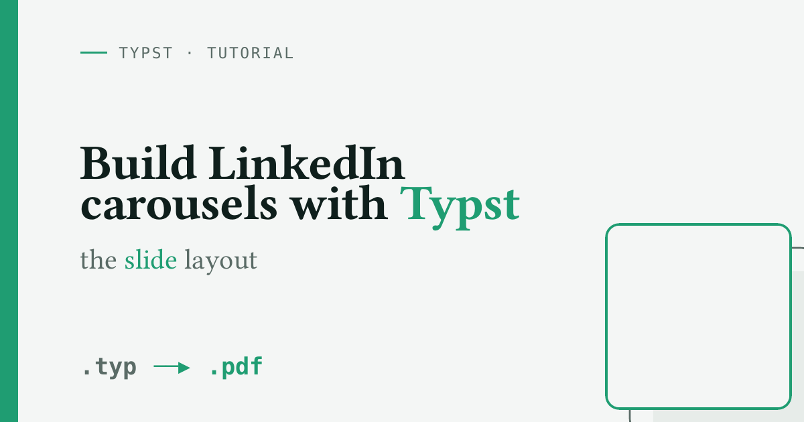
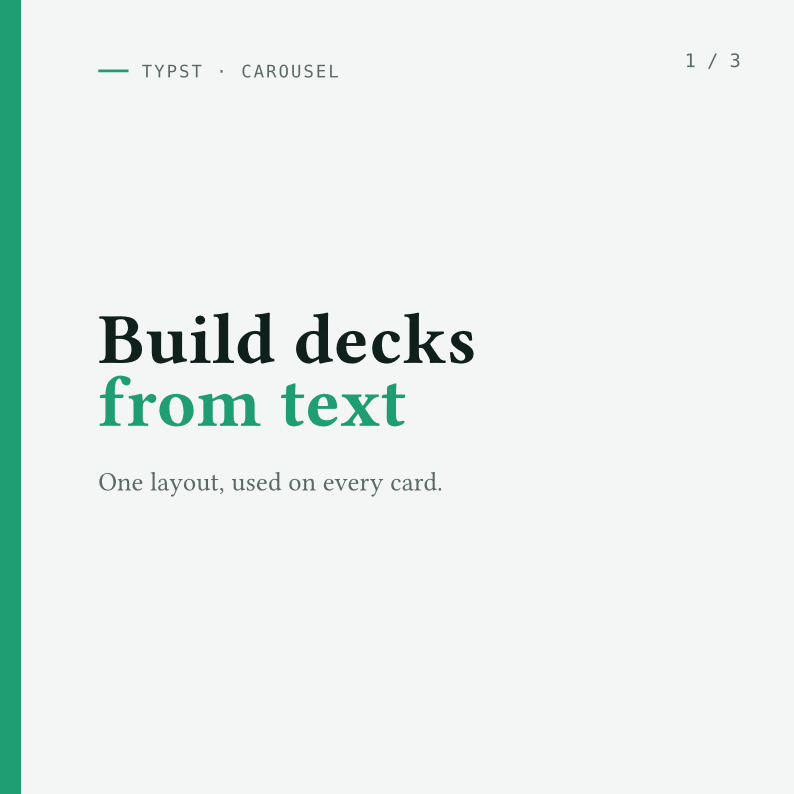

{
  .img-featured
  .img-fluid
  fig-align="center"
  fig-alt=''
  width="600px"
}

## Introduction

Since January 2026 I have made the [carousels for my LinkedIn posts](https://www.linkedin.com/in/mickaelcanouil/recent-activity/all/) with Typst.
It has worked well, so here is how I do it.

A LinkedIn carousel is not a special thing.
It is a multi-page document that the feed turns into swipeable cards, and you upload it as a single PDF.
So if you can make a multi-page PDF, you can make a carousel.

[Typst](https://typst.app) is a fine tool for exactly that.
You describe each page in plain text, compile to PDF in a fraction of a second, and keep the source under version control like any other code.
No design tool, no manual export, no moving boxes around by hand.

This post shows the one helper I use to make this easy: a small `slide` helper that gives every page a full-bleed background with consistent padding.
Every slide shown below is a real Typst compilation, rendered to SVG by the [`Typst Render` Quarto extension](https://github.com/mcanouil/quarto-typst-render), so you see the code and its result side by side.

::: {.callout-note}

## At a glance

- This deck uses a square 1:1 page, the format LinkedIn shows carousels in.
- Set the page margin to `0cm` so backgrounds reach every edge.
- A `slide` layout adds a rail, a page number, and the padding to every card.
- Compile with `typst compile`, then upload the PDF or export PNG frames.

:::

## Setting up the page

Start by setting the page geometry once, at the top of the file.

```typst
#set document(title: "My Carousel", author: "Your Name")
#set text(lang: "en")
#set page(width: 21cm, height: 21cm, margin: 0cm)
```

The 21cm by 21cm size is a square 1:1.
LinkedIn shows carousels as a square 1080 by 1080, or a 4:5 portrait, per the [LinkedIn image size guide](https://www.linkedin.com/pulse/linkedin-image-size-guide-2026-jan-van-musscher-wslwe/).
The exact dimensions do not matter, only the ratio does, so any square pair works.

The important line is `margin: 0cm`.

::: {.highlight}

**Zero page margin is the trick:** the background reaches every edge, and the `slide` helper adds the padding back inside.

:::

Carousel slides want colour and imagery that reach every edge, and a page margin would fence the content into a smaller box with white gutters.
Removing the margin gives you the full page, and you add the padding back yourself.
That is what the `slide` helper does.

## The `slide` layout

A `slide` helper can do more than add padding.
It can also draw the parts that repeat on every card.
The layout below draws a full-height accent rail down the left edge, adds a page number in the top-right corner, then lays out your content in the space that is left.
Here it is, defined and then called with an empty body so you can see the rail and the padded area where `body` goes.

```{typst}
//| echo: true
//| output-filename: "layout.svg"
//| alt: "An otherwise empty slide showing what the layout draws on its own: the emerald rail down the left edge and a dashed outline marking the padded content area where the body is placed."
#let slide(index: none, fill: paper, body) = page(fill: fill, { // <1>
  place(left + top, rect(width: 0.55cm, height: 100%, fill: accent)) // <2>
  if index != none { // <3>
    place(
      top + right, dx: -1.4cm, dy: 1.4cm,
      text(font: mono, size: 14pt, fill: ink-soft, index)
    )
  }
  block( // <4>
    width: 100%, height: 100%, inset: (left: 2.6cm, right: 1.7cm, y: 1.7cm), // <4>
    body // <4>
  ) // <4>
}) // <5>

#slide({
  block(
    width: 100%, height: 100%,
    stroke: (paint: ink-soft, thickness: 1pt, dash: "dashed"),
    radius: 8pt,
    align(center + horizon, text(font: mono, fill: ink-soft, "body goes here")),
  )
})
```

1. Start a fresh page and paint its background with `fill`, so each call is one card in the carousel.
2. Draw the rail: a thin rectangle pinned to the left edge, the full height of the page. With `margin: 0cm` it reaches the top, bottom, and side.
3. Add a small page number like `2 / 3` in the top-right, but only when an `index` is passed.
4. Add back the padding that `margin: 0cm` removed, with a wider left inset so the content clears the rail.
5. `body` is a trailing content argument, so the helper is called as `#slide({ ... })` with the card's content in the braces.

The helper is optional: a bare `#page(...)` would work too.
Defining `slide` once is what keeps the rail, the page number, and the padding identical on every card, and every call site short.

::: {.highlight}

**Define the layout once, and every card matches** without repeating the setup.

:::

The page geometry, a small palette, the fonts, this `slide` layout, and a ruled `kicker` label are the file's setup.
In this post they live in a shared preamble, so each live example below shows only the card it draws.

## Slides, live

The cover card passes an `index`, adds a `kicker` at the top, and centres the headline.
The rail and the page number come from the layout.

```{typst}
//| echo: true
//| output-filename: "cover.svg"
//| alt: "Cover card with an emerald rail down the left edge, a '1 / 3' index top-right, a ruled 'TYPST · CAROUSEL' kicker, and a large two-line headline 'Build decks from text'."
#slide(index: "1 / 3", {
  kicker("Typst · Carousel")
  v(1fr)
  block(width: 16cm, {
    text(font: display, size: 54pt, weight: "bold", fill: ink, "Build decks")
    linebreak()
    text(font: display, size: 54pt, weight: "bold", fill: accent, "from text")
    v(0.4cm)
    text(size: 20pt, fill: ink-soft, "One layout, used on every card.")
  })
  v(1fr)
})
```

A content card stacks a few numbered rows with a `grid` to keep the numbers and text aligned.

```{typst}
//| echo: true
//| output-filename: "content.svg"
//| alt: "Content card with the rail, a '2 / 3' index, the heading 'Three reasons it fits carousels.', and a numbered list of three short benefits."
#slide(index: "2 / 3", {
  kicker("Why Typst")
  v(0.5cm)
  block(
    width: 16cm,
    text(
      font: display, size: 32pt, weight: "bold", fill: ink,
      "Three reasons it fits carousels."
    )
  )
  v(0.7cm)

  let row(n, t) = grid(
    columns: (1.3cm, 1fr),
    align: (left + horizon, left + horizon),
    text(font: mono, size: 22pt, weight: "bold", fill: accent, str(n)),
    block(width: 15cm, text(size: 18pt, fill: ink, t)),
  )

  stack(
    dir: ttb,
    spacing: 0.7cm,
    row(1, "Plain text in, PDF out. Diff it, version it, regenerate it."),
    row(2, "One layout sets the look of every page at once."),
    row(3, "No design tool, no manual export, no pixel pushing."),
  )
})
```

The closing card changes the background with the `fill` parameter.
The rail and the page number stay the same.

```{typst}
//| echo: true
//| output-filename: "cta.svg"
//| alt: "Closing card on a dark green-black background with the rail and a '3 / 3' index, reading 'Compile and post.' above the command to compile the carousel to PDF."
#slide(index: "3 / 3", fill: ink, {
  v(1fr)
  kicker("Ship it")
  v(0.5cm)
  text(
    font: display, size: 46pt, weight: "bold", fill: paper,
    "Compile and post."
  )
  v(0.6cm)
  text(
    font: mono, size: 17pt, fill: rgb("#8fa49d"),
    "typst compile carousel.typ carousel.pdf"
  )
  v(1fr)
})
```

Each card renders as a true square, so what you see is what the feed will show.

## Compile the whole deck

Stack your slides in one `carousel.typ` file, then compile it.
Each `#slide(...)` becomes one page, and the PDF is the carousel.

```bash
# Each #slide is one page; the PDF is the carousel
typst compile carousel.typ carousel.pdf

# Typst can also export one PNG per page, no extra tool needed
typst compile carousel.typ "carousel-{p}.png" --ppi 144
```

Upload `carousel.pdf` to LinkedIn as a document post, and keep the PNG frames for a preview.

## Want a GIF for another platform?

LinkedIn takes the PDF, but some places want a GIF.
Build one from the PNG frames with [ImageMagick](https://imagemagick.org).

```bash
# Assemble the exported PNG frames into a looping GIF
magick -delay 250 -loop 0 carousel-*.png carousel.gif
```

`-delay 250` holds each frame for 2.5 seconds, and `-loop 0` loops forever.

Here is this post's deck as a looping GIF.

{.hero-art fig-align="center" fig-alt="A looping GIF cycling through three square carousel cards: the cover 'Build decks from text', a 'Three reasons it fits carousels' list, and a dark closing 'Compile and post.' card, each with the emerald rail and a page number."}

::: {.callout-tip}

## A few design tips

- Keep body text at 14pt or larger so it stays legible at thumbnail size.
- Aim for five to seven slides: a cover, the content, and a closing call to action.
- Use one visual idea per deck: a palette, a font pairing, a single motif.
- Avoid copy-pasting the previous carousel, so each one looks different.

:::

## Bonus: an LLM prompt

If you would rather start from a draft, paste the prompt below into your assistant of choice.
It encodes the geometry, the `slide` helper, and the design constraints, so the output compiles with the `typst` CLI.

```text
You are designing a LinkedIn carousel as a Typst document.
Produce a single self-contained carousel.typ that compiles with `typst compile`.

Hard requirements:

- Page geometry: #set page(width: 21cm, height: 21cm, margin: 0cm).
  This is a square 1:1 (LinkedIn shows carousels at 1080 by 1080); keep the ratio.
- Define one `slide` layout and use it for every card.
  Build it from a full-page block with zero page margin and an inset, so the background reaches every edge and the content keeps consistent padding:
    #let slide(fill: <default-bg>, body) = page(fill: fill, {
      block(width: 100%, height: 100%, inset: 1.7cm, body)
    })
  Add any repeated parts you want on top of that (a header, a page number, ...).
- Invent a small palette (background, ink, soft ink, one accent) and a font trio (display, body, mono).
  Prefer legible fonts.
- Five to seven cards following the arc: cover, then content, then a closing call to action.
  Use one card with `fill: <accent-or-dark>` to invert the look.
- Body text at least 14pt; headlines 30 to 56pt, so everything reads at thumbnail size.
  Use place, grid, stack, and v()/h() for layout.

Then tell me the two `typst compile` commands to export it to PDF and to one PNG per page.

The topic of the carousel is: <describe your announcement here>.
Layout and style (optional): <describe any layout or look you want, for example a side rail, page numbers, a colour band, a serif or a sans display; leave blank to let you pick a clean design>.
```

::: {.highlight}

**It comes down to one idea:** a single `slide` helper turns a blank page into a carousel page, and the rest is the content you put on it.

:::

Now build a deck for your next post.
If you make one, tag me on [LinkedIn](https://www.linkedin.com/in/mickaelcanouil/) so I can see it.
