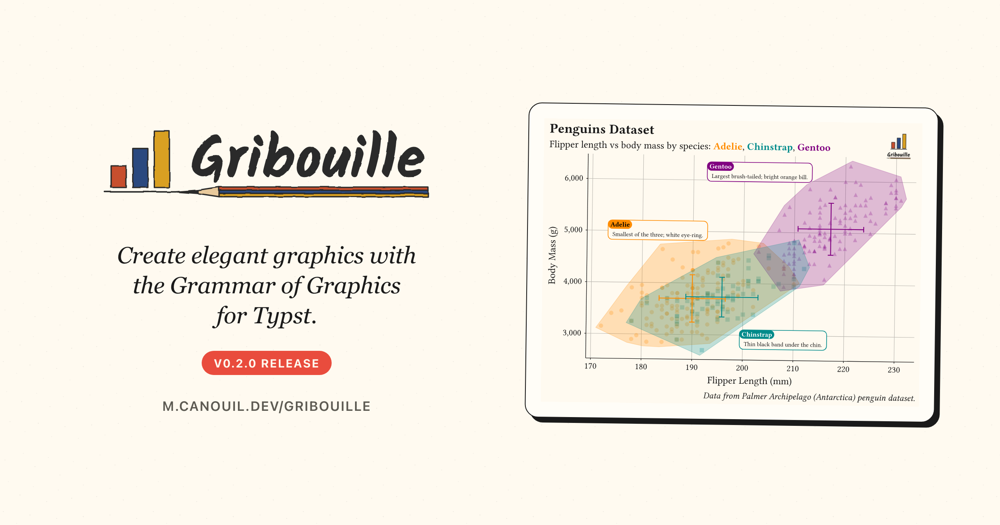

{
  .img-featured
  .img-fluid
  fig-align="center"
  fig-alt=''
  width="600px"
}

## Introduction

[Gribouille](https://github.com/mcanouil/gribouille) shipped its [first version](../2026-05-20-gribouille-grammar-of-graphics-for-typst/index.qmd) ten days ago.
This is the first feature update, and it has two faces.
On the surface, [`compose()`](https://m.canouil.dev/gribouille/reference/core/compose.html) learned to number, nest, title, and share a legend across panels, `facet-grid()` got free scales, and labels and guides became easier to control.
Underneath, most of the time went into the internals, turning a long list of panics into clear errors and correct output.

Every figure in this post is a real, freshly compiled plot.

::: {.callout-note}

## At a glance

- [Gribouille](https://github.com/mcanouil/gribouille) 0.2.0 on Typst Universe: `#import "@preview/gribouille:0.2.0": *`.
- [`compose()`](https://m.canouil.dev/gribouille/reference/core/compose.html) can tag panels (`A`, `1`, `i`, ...), nest into another `compose()`, carry its own `labs`, control the shared legend through `guides`, and size itself with `width`/`height` and relative `widths`/`heights`.
- [`facet-grid(scales: ...)`](https://m.canouil.dev/gribouille/reference/facets/facet-grid.html) supports `"free_x"`, `"free_y"`, and `"free"`, matching `ggplot2`.
- A layer's `data` accepts a function applied to the plot data, for per-layer subsets or transforms without a second dataset.
- [`guides()`](https://m.canouil.dev/gribouille/reference/guides/guides.html) gains a `default` entry, a fallback inherited by every aesthetic without its own override.
- [`labs()`](https://m.canouil.dev/gribouille/reference/labs/labs.html) fields default to `auto`; pass `none` to drop an axis or legend title and reclaim the space it reserved.
- A long internals pass: many operations that used to panic now report a clear error or handle the edge, and `after-scale`/`stage` channels resolve correctly.

:::

Every `{typst}` block below pulls the library in through a one-line preamble, `#import "@preview/gribouille:0.2.0": *`, exactly as the [launch post](../2026-05-20-gribouille-grammar-of-graphics-for-typst/index.qmd) explained.

## Compose grew up

The launch already had [`compose()`](https://m.canouil.dev/gribouille/reference/core/compose.html): pass a few deferred plots, get them laid out on a grid with their shared legend hoisted to the edge.
This release turns it into a small layout language of its own, close in spirit to `patchwork`.

Panels can be numbered with `tag-levels`, the composition can carry its own title through `labs`, and the shared legend's side is set once with a `default` guide.

```{typst}
//| echo: true
//| align: center
//| output-filename: "compose.svg"
//| alt: "Two side-by-side scatter plots tagged (1) Body Mass and (2) Bill Length against flipper length, points coloured by species, with a single shared species legend below both panels and a title across the top reading 'Two Views, One Shared Legend'."
#let panel(y, title) = plot(
  data: penguins,
  mapping: aes(x: "flipper-len", y: y, colour: "species"),
  layers: (geom-point(size: 2pt, alpha: 0.85),),
  labs: labs(title: title, x: none, y: none),                 // <1>
  theme: theme-minimal(),
  defer: true,                                                // <2>
)

#compose(
  panel("body-mass", "Body Mass"),
  panel("bill-len", "Bill Length"),
  columns: 2,
  tag-levels: "1",                                            // <3>
  tag-prefix: "(",
  tag-suffix: ")",
  tag-corner: "top-right",
  guides: guides(default: guide-legend(position: "bottom")),  // <4>
  labs: labs(title: "Two Views, One Shared Legend"),          // <5>
  width: 18cm,
  height: 8cm,
)
```

1. `x: none` and `y: none` drop the per-panel axis titles and give the space back to the data.
2. `defer: true` returns a spec instead of drawing, so `compose()` can place it.
3. `tag-levels: "1"` numbers the panels in order; `"A"`, `"a"`, `"I"`, and `"i"` give the other styles.
4. The `default` guide sets the legend side once, and every aesthetic without its own guide inherits it.
5. A composition-level `labs()` writes one title above the whole figure.

Three things here are new.
`tag-levels`, with `tag-prefix`, `tag-suffix`, and `tag-corner`, labels each panel and styles the tag through a new `plot-tag` theme element.
A composition now accepts its own `labs` (title, subtitle, caption) and `alt` text, so the figure reads as one unit.
The shared legend is steered through `guides` instead of the old `guides-placement` argument, which is removed.

::: {.callout-tip}

## Nesting

A `compose()` call also accepts `defer: true`, so it can become a panel inside another `compose()`.
A per-depth `tag-levels` array then continues the numbering down the tree, giving tags such as `B.1` and `B.2`.

:::

## Free the facet scales

[`facet-grid()`](https://m.canouil.dev/gribouille/reference/facets/facet-grid.html) used to share one pair of axes across every panel.
It now takes a `scales` argument, matching `ggplot2`: `"free_x"` frees the x-axis per column, `"free_y"` frees the y-axis per row, and `"free"` frees both.
Non-positional scales such as colour stay shared, and the panels keep an equal size.

```{typst}
//| echo: true
//| align: center
//| output-filename: "facet-free.svg"
//| alt: "Three stacked panels, one per species (Adelie, Chinstrap, Gentoo), each a scatter of body mass against flipper length with its own y-axis range, sharing the colour scale."
#plot(
  data: penguins,
  mapping: aes(x: "flipper-len", y: "body-mass", colour: "species"),
  layers: (geom-point(size: 2pt, alpha: 0.7),),
  facet: facet-grid(rows: "species", scales: "free_y"),
  theme: theme-minimal(),
  width: 12cm,
  height: 14cm,
)
```

Each row now picks its own y-range, so a group sitting in a narrow band no longer wastes most of its panel on empty space.

## Highlight a subset without a second dataset

A layer's `data` now takes a function as well as a frame.
The function receives the plot data and returns the rows that layer should draw.
So one dataset can feed a faint base layer and a sharp highlight on top, with no second table to keep in step.

```{typst}
//| echo: true
//| align: center
//| output-filename: "layer-data.svg"
//| alt: "Penguin scatter of body mass against flipper length, every point faint, with the heaviest individuals at 5,500 grams and above re-drawn as larger orange markers."
#plot(
  data: penguins,
  mapping: aes(x: "flipper-len", y: "body-mass"),
  layers: (
    geom-point(size: 2pt, alpha: 0.35),
    geom-point(
      data: rows => rows.filter(r => {                    // <1>
        let mass = r.at("body-mass", default: none)
        mass != none and mass >= 5500
      }),
      size: 3pt,
      colour: rgb("#D55E00"),
    ),
  ),
  labs: labs(
    title: "One Dataset, One Layer Highlighted",
    x: "Flipper Length (mm)",
    y: "Body Mass (g)",
  ),
  theme: theme-minimal(),
  width: 12cm,
  height: 8cm,
)
```

1. The function gets the plot data as an array of rows and returns the subset to draw, here the penguins at 5,500 grams and above.

The same trick covers per-layer transforms, not just filtering.
Return a reshaped frame and that layer draws it, while the rest of the plot keeps the original data.

## Tidier labels and guides

Two smaller changes remove a recurring annoyance.

First, every [`labs()`](https://m.canouil.dev/gribouille/reference/labs/labs.html) field defaults to `auto`.
Passing `none` now drops an axis or legend title and reclaims the margin it reserved, instead of leaving an empty gap.
[`element-blank()`](https://m.canouil.dev/gribouille/reference/themes/element-blank.html) on a text surface does the same from the theme side.

```{typst}
//| echo: true
//| align: center
//| output-filename: "labs-none.svg"
//| alt: "A scatter of body mass against flipper length with no axis titles, the plot area reaching closer to the edges, under a single bold title."
#plot(
  data: penguins,
  mapping: aes(x: "flipper-len", y: "body-mass"),
  layers: (geom-point(size: 2pt, alpha: 0.7),),
  labs: labs(
    title: "Axis Titles Off, Space Reclaimed",
    x: none,
    y: none,
  ),
  theme: theme-minimal(),
  width: 12cm,
  height: 8cm,
)
```

Second, [`guides()`](https://m.canouil.dev/gribouille/reference/guides/guides.html) takes a `default` entry.
It holds the fallback guide options, the legend side most often, and any aesthetic without its own guide inherits from it.
You saw it above feeding the shared legend in `compose()`; it works the same on a single `plot()`.
Legend labels also honour the `legend-text` alignment now, and [`element-text()`](https://m.canouil.dev/gribouille/reference/themes/element-text.html)/[`element-typst()`](https://m.canouil.dev/gribouille/reference/themes/element-typst.html) gained an `align` argument and a working `angle`, so tick labels and titles rotate as asked.

## The heavy lifting was underneath

The list above is the visible part.
The larger share of this release is a pass over the internals, and it is the kind of work that does not show up in a screenshot.

A whole class of inputs that used to crash the compile now behaves.
A `geom-col()` on a continuous axis with a single distinct value, an empty `values` array in a `scale-*-manual()`, a non-positive `bins`, a sparse contour grid, or `width: auto` on an unbounded page: each of these used to panic, and each now either draws or reports a clear, actionable error.

::: {.highlight}

**Most of 0.2.0 is invisible:** the figures look the same, but far fewer inputs make the compiler give up.

:::

A second group is about getting the right answer rather than not crashing.

- `after-scale` and `stage` channels now train on the marker's source column, so grouped geoms such as [`geom-smooth()`](https://m.canouil.dev/gribouille/reference/geoms/geom-smooth.html), and [`geom-errorbar()`](https://m.canouil.dev/gribouille/reference/geoms/geom-errorbar.html) or [`geom-rug()`](https://m.canouil.dev/gribouille/reference/geoms/geom-rug.html), resolve a mapped colour instead of panicking.
- [`coord-cartesian(xlim:, ylim:)`](https://m.canouil.dev/gribouille/reference/coord/coord-cartesian.html) zooms the axes instead of being ignored, and [`coord-flip(reverse: true)`](https://m.canouil.dev/gribouille/reference/coord/coord-flip.html) keeps a `log10` or `sqrt` transform.
- A column mapped to both a positional and a grouping aesthetic, for example `aes(x: "species", fill: "species")`, now resolves the grouping across aggregating stats instead of drawing every mark in the ink colour with an empty guide.
- Number formatters round correctly, so `0.9999995` no longer renders as `0.1`, and continuous scales honour an explicit `breaks`.

A third group, and a big one, is about layout space: what a plot reserves, and what it reclaims when it is not needed.
The `labs(none)` and `element-blank()` controls shown above are the visible handles, but most of the work was below them, deciding how much room each part of a figure should take.

- A standalone plot no longer keeps a fixed empty margin on its top and right edges; the panel grows into that space.
- A missing axis title reclaims the band it would have reserved, on the x-axis side as well as the y-axis side.
- `width` and `height` now bound the whole image, title, subtitle, caption, and background padding included, so the data panel shrinks to fit and long titles wrap instead of overflowing.
- Legends reserve the room a label actually needs, measuring multi-line and wider-than-usual labels across swatches, size ladders, and colourbars, so nothing clips or overlaps.

None of this changes the API.
Documents that compiled before still compile, and the plots that were already correct look the same.
What changed is the long tail of inputs that did not.

## Typst Render moved too

The figures here are compiled by the [`quarto-typst-render`](https://github.com/mcanouil/quarto-typst-render) extension, which had its own run of releases since the launch post.
Three are worth knowing about for a documentation-heavy project.

- `code-fold` and `code-summary` collapse the echoed Typst source into a `<details>` block, so a long example does not push the figure off the screen.
- Quarto code annotations now work on echoed Typst source: the `// <1>` markers and the numbered list under the `compose()` block above are exactly that feature.
- `output-source` writes the compiled Typst source, preamble and colour bindings included, next to each saved image, which is handy when you want to reproduce a figure outside Quarto.

## Wrap-up

::: {.highlight}

**A composition language on top, a sturdier core underneath.**

:::

Next on the list is more geoms, a wider set of worked examples, and feedback from the people writing Typst documents day to day.

- Gribouille
  - Repository: <https://github.com/mcanouil/gribouille>.
  - Documentation: <https://m.canouil.dev/gribouille>.
  - Typst Universe: <https://typst.app/universe/package/gribouille>.
- Typst Render
  - Repository: <https://github.com/mcanouil/quarto-typst-render>.
  - Documentation: <https://m.canouil.dev/quarto-typst-render>.

::: {.callout-tip}

## A note on contributions

Gribouille is an unfunded spare-time project, and the API is still settling.
Bug reports and ideas are very welcome on the issue tracker.
Pull requests are not being accepted for now, for the reasons set out in the launch post.
Thanks in advance for your patience.

:::
