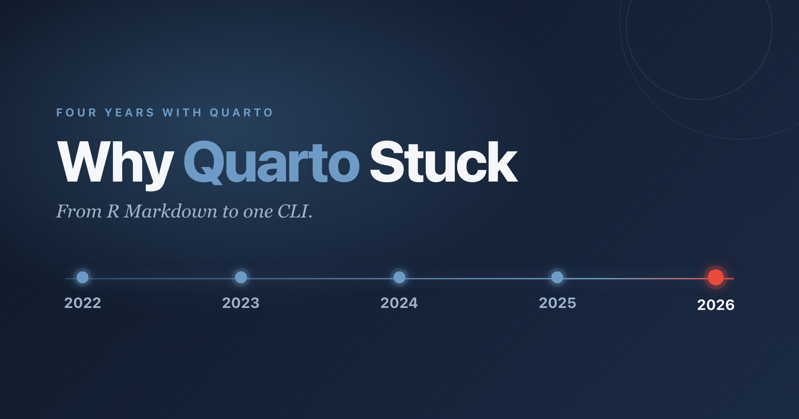

After four years of using Quarto every day, I want to explain why it stuck as my go-to for reports, slides, websites, and books.
Before Quarto, that work was spread across R Markdown, `bookdown`, `xaringan`, and `distill`.
Quarto folded all of that into one command line tool, and I have not looked back since the early days before v1.

{
  .img-featured
  .img-fluid
  fig-align="center"
  fig-alt=''
  width="600px"
}

::: {.callout-note}
## At a Glance

- Four years of daily Quarto use.
- Close to 14,000 contributions on `quarto-dev/quarto-cli` across discussions, issues, and pull requests.
- One CLI replaced a fragmented R Markdown toolchain for reports, slides, websites, and books.
- The extension system turned Quarto into a platform: more than 40 extensions built and maintained.
- Typst for PDF: fast compilation, readable programming model, no more LaTeX friction.
- [Gribouille](https://github.com/mcanouil/gribouille): a grammar of graphics in pure Typst, so plots compile where the document does.
:::

## It Started by Helping Out

My time with Quarto began before v1: back-and-forth between the issue/discussion tracker and real document use in my research on the genetics of type 2 diabetes and obesity, when the CLI was still finding its shape.
I still spend time in the [`quarto-dev/quarto-cli`](https://github.com/quarto-dev/quarto-cli) repository, answering questions, helping people troubleshoot, surfacing gaps in the documentation, and guiding the same R Markdown and `bookdown` migration I once made myself.

_The figure below (@fig-activity) traces that involvement month by month, split across discussions, issues, and pull requests, and it is itself drawn with [Gribouille](https://github.com/mcanouil/gribouille) through the [`quarto-typst-render`](https://github.com/mcanouil/quarto-typst-render) extension._[^figure-data]

[^figure-data]: The counts come from my own [`quarto-cli-activity`](https://github.com/mcanouil/quarto-cli-activity) data for `quarto-dev/quarto-cli`.

```{typst}
//| label: fig-activity
//| fig-cap: "Monthly contributions to `quarto-dev/quarto-cli` from mid-2022 to mid-2026, split across discussions, issues, and pull requests."
//| echo: false
//| align: center
//| output-filename: "quarto-cli-activity.svg"
//| alt: "Stacked area chart of my monthly activity on quarto-dev/quarto-cli from mid-2022 to mid-2026, split by thread type into discussions, issues, and pull requests. Discussions are the largest band throughout, issues second, pull requests a thin top band; activity climbs through 2023, peaks across 2023 and 2024, then eases, with the final months of 2026 partial."
//| width: 16cm
//| height: 8cm
#let kind-colours = (
  "Discussions Comments": rgb("#0072B2"),
  "Issues Comments":      rgb("#D55E00"),
  "PRs Comments":         rgb("#009E73"),
)

#let activity = csv("assets/data/quarto-cli-activity.csv", row-type: dictionary).map(row => (
  x: float(row.x),
  kind: row.kind,
  count: int(row.count),
))

#plot(
  data: activity,
  mapping: aes(x: "x", y: "count", fill: "kind"),
  layers: (geom-area(position: "stack", alpha: 0.9),),
  scales: (
    scale-x-continuous(
      breaks: (2022, 2023, 2024, 2025, 2026),
      labels: format-number(big-mark: ""),
    ),
    scale-y-continuous(expand: (0, 5%), labels: format-comma()),
    scale-fill-manual(values: kind-colours.values()),
  ),
  guides: guides(fill: guide-none()),
  labs: labs(
    title: [Helping Out On `quarto-dev/quarto-cli`],
    subtitle: {
      [Activity split across ]
      kind-colours.pairs()
        .map(p => text(fill: p.at(1), weight: "bold", p.at(0)))
        .join([, ])
      [.]
    },
    x: none,
    y: "Comments & Replies",
    fill: none,
  ),
  theme: theme-minimal(
    plot-subtitle: element-typst(size: 9pt),
  ),
  width: auto,
  height: auto,
)
```

The totals still catch me off guard.
Close to 14,000 contributions in all: comments, replies, pull requests, issues, and discussions across four years.

::: {.highlight}

**Close to 14,000 contributions** across discussions, issues, and pull requests: that is a lot of people who were stuck and then were not.

:::

Working through those threads deepened my understanding of what Quarto does well and where it falls short, which shaped how I use it for my own work today.

## From R Markdown to One CLI

The first thing that won me over was the scope of a single tool.
With R Markdown I kept a small mental map of which package produced which output.
With Quarto I write `quarto render`, and the same project gives me an HTML report, a PDF through Typst, a Reveal.js deck, a website, or a book.
The fragmented toolchain became one CLI, and that alone changed how I work.

```{typst}
//| echo: false
//| align: center
//| output-filename: "one-source.svg"
//| alt: "A diagram: a single source document, a .qmd file, with an arrow pointing to five output labels, HTML, PDF, Reveal.js, Website, and Book."
#let fg = if _typst_render_foreground != none { _typst_render_foreground } else {
  rgb("#111827")
}
#let accent = rgb("#447099")
#set text(fill: fg, size: 11pt)

#let chip(body) = box(
  stroke: 0.75pt + fg.transparentize(55%),
  radius: 1em,
  inset: (x: 10pt, y: 6pt),
  body,
)
#let source = box(
  stroke: 1.5pt + accent,
  radius: 6pt,
  inset: (x: 12pt, y: 9pt),
  align(center)[*one source* \ #raw(".qmd")],
)

#stack(
  dir: ltr,
  spacing: 16pt,
  align(horizon, source),
  align(horizon, text(fill: accent, size: 20pt)[#sym.arrow.r]),
  align(horizon, stack(
    dir: ltr,
    spacing: 8pt,
    chip[HTML], chip[PDF], chip[Reveal.js], chip[Website], chip[Book],
  )),
)
```

The defaults are also less surprising.
Format options live under a single `format:` key, so an HTML and a PDF variant of the same document sit side by side instead of fighting each other.
Even the format names are more intuitive: `html`, `pdf`, `revealjs`, `website`, and `book` are easier to remember than the R Markdown equivalents (_also way less typing_), and they are consistent across formats, so I do not have to remember that `html_document` is for HTML but `pdf_document` is for PDF.
A project/directory-level `_metadata.yml` sets shared options once, and conditional content with `{.content-visible when-format="html"}` reads far more clearly than the output checks I used to scatter through R Markdown code cells.
None of this is magic, it is just less surprising, and after years of small surprises that matters.

Multi-language support is also native in Quarto.
I move between R and Python in the same workflow, even if not yet in the same document (_I have strong hopes for **Quarto 2** ongoing developments_).

::: {.callout-note}
R and Python still live in separate documents within a project, not in one shared session.
For my work that boundary has never been a real problem.
When both languages were needed, I relied on `reticulate` to call Python from R.
:::

The look and feel out of the box is, in my opinion, simply better, especially for HTML.
And because R is no longer mandatory, writing notes or plain prose is a first-class use case, not an afterthought.
That is also what makes Quarto easy to recommend: I have helped colleagues and clients move from R and `bookdown`, without asking them to change how they think.

## Building My Own

If one feature made Quarto really stick, it is the extension system.
An extension adds shortcodes, filters, formats, or whole project types without forking or hacking the core.
That single idea turned Quarto from a better R Markdown[^rmarkdown] into a platform I build on.

[^rmarkdown]: To be fair, R Markdown supports templates and filters, but to me they always felt like afterthoughts, not first-class features.

I know this because I keep building on it with tools that began as solutions to my own needs but that I share in the spirit of open source.

```{=html}
<ol class="qx-timeline">
  <li class="qx-more"><span class="qx-more-inner"><span class="qx-when">2022 Q3</span><a href="https://github.com/mcanouil/quarto-revealjs-storybook">Storybook</a>, <a href="https://github.com/mcanouil/quarto-revealjs-coeos">Coeos</a>, <a href="https://github.com/mcanouil/quarto-iconify">Iconify</a>, <a href="https://github.com/mcanouil/quarto-letter">Letter</a>, <a href="https://github.com/mcanouil/quarto-animate">Animate</a>, and <a href="https://github.com/mcanouil/quarto-elevator">Elevator</a>, my first handful while learning the format.</span></li>
  <li class="qx-more"><span class="qx-more-inner"><span class="qx-when">2022 Q4</span><a href="https://github.com/mcanouil/quarto-masonry">Masonry</a>.</span></li>
  <li class="qx-more"><span class="qx-more-inner"><span class="qx-when">2023 Q1</span><a href="https://github.com/mcanouil/quarto-lua-env">Lua Env</a> and <a href="https://github.com/mcanouil/quarto-revealjs-spotlight">Spotlight</a>.</span></li>
  <li class="qx-card qx-left"><div class="qx-box"><a href="https://github.com/mcanouil/quarto-preview-colour">Preview Colour</a> shows an inline swatch next to a hex, RGB, or HSL code. <span class="qx-extra">Also <a href="https://github.com/mcanouil/quarto-badge">Version Badge</a>.</span></div><div class="qx-tick">2023 Q2</div></li>
  <li class="qx-card qx-right"><div class="qx-box"><a href="https://github.com/mcanouil/quarto-invoice">Invoice</a> is a Typst template I actually send to clients.</div><div class="qx-tick">2023 Q4</div></li>
  <li class="qx-card qx-left"><div class="qx-box"><a href="https://github.com/mcanouil/quarto-highlight-text">Highlight Text</a> highlights text across HTML, Typst, Reveal.js, and Docx.</div><div class="qx-tick">2024 Q2</div></li>
  <li class="qx-more"><span class="qx-more-inner"><span class="qx-when">2024 Q3</span><a href="https://github.com/mcanouil/quarto-github">GitHub</a>, later replaced by Git Link.</span></li>
  <li class="qx-card qx-right"><div class="qx-box"><a href="https://github.com/mcanouil/quarto-wizard">Quarto Wizard</a> manages extensions from VS Code and Positron.</div><div class="qx-tick">2024 Q4</div></li>
  <li class="qx-more"><span class="qx-more-inner"><span class="qx-when">2025 Q1</span><a href="https://github.com/mcanouil/quarto-div-reuse">Div Reuse</a> and <a href="https://github.com/mcanouil/quarto-language-cell-decorator">Language Cell Decorator</a>.</span></li>
  <li class="qx-card qx-left"><div class="qx-box"><a href="https://github.com/mcanouil/quarto-mcanouil">quarto-mcanouil</a> brings <code>brand.yml</code> theming to HTML, Typst, and Reveal.js, and <a href="https://github.com/mcanouil/quarto-gitlink">Git Link</a> turns issue, pull request, and commit references into links. <span class="qx-extra">Also <a href="https://github.com/mcanouil/quarto-external">External</a>, <a href="https://github.com/mcanouil/quarto-modal">Modal</a>, and <a href="https://github.com/mcanouil/quarto-toc-depth">TOC Depth</a>.</span></div><div class="qx-tick">2025 Q3</div></li>
  <li class="qx-card qx-right"><div class="qx-box"><a href="https://github.com/mcanouil/quarto-extensions-updater">Extensions Updater</a> updates a project's extensions automatically, like Dependabot. <span class="qx-extra">Also <a href="https://github.com/mcanouil/quarto-collapse-output">Collapse Output</a>, <a href="https://github.com/mcanouil/quarto-remember">Remember</a>, <a href="https://github.com/mcanouil/quarto-revealjs-tabset">Tabset</a>, and <a href="https://github.com/mcanouil/quarto-offcanvas">Offcanvas</a>.</span></div><div class="qx-tick">2025 Q4</div></li>
  <li class="qx-card qx-left"><div class="qx-box"><a href="https://github.com/mcanouil/quarto-code-window">Code Window</a> dresses code blocks as macOS or Windows windows, and <a href="https://github.com/mcanouil/quarto-typst-render">Typst Render</a> compiles Typst blocks to images for any format. <span class="qx-extra">Also <a href="https://github.com/mcanouil/quarto-revealjs-a11y">A11y</a>.</span></div><div class="qx-tick">2026 Q1</div></li>
  <li class="qx-card qx-right"><div class="qx-box"><a href="https://github.com/mcanouil/quarto-prism">Prism</a> attaches format-specific values to a single Div, Span, or CodeBlock. <span class="qx-extra">Also <a href="https://github.com/mcanouil/quarto-revealjs-fragmention">Fragmention</a>, <a href="https://github.com/mcanouil/quarto-revealjs-cascade">Cascade</a>, and <a href="https://github.com/mcanouil/quarto-revealjs-codefrag">Code Annotation Fragments</a>.</span></div><div class="qx-tick">2026 Q2</div></li>
</ol>
```

::: {.highlight}

**The extension system is the real unlock:** it let me shape the authoring experience around my work instead of waiting for the core to grow a feature.

:::

The same mechanism scales up.
Embedding a Quarto format extension inside an R package gives a large organisation branded, client-ready HTML, PDF, and Reveal.js with its corporate identity baked in.
My needs as a biostatistician and consultant drove most of this, and some of it the community adopted.
[Quarto Wizard](https://github.com/mcanouil/quarto-wizard) manages extensions from VS Code and Positron, and the [Quarto Extensions](https://github.com/mcanouil/quarto-extensions) directory lists more than 300 of them through the GitHub API.
I also maintain that directory as a community resource that stands apart from the core team, so anyone can find an extension without knowing it exists first.
I have written before about the Wizard ([1.0.0](../2025-10-20-quarto-wizard-1-0-0/index.qmd) and [2.0.0](../2026-01-12-quarto-wizard-2-0-0/index.qmd)), about [keeping extensions updated](../2025-12-12-quarto-extensions-updater/index.qmd), and about [the Lua behind Quarto extensions](../2025-11-06-quarto-extensions-lua/index.qmd).

## Then Came Typst

Building all of this kept pulling me toward one format in particular, and that format is Typst.
It has become my most recent rabbit hole, both standalone with `typst compile` and through Quarto's native `typst` output.
For PDF it is a genuine step up from LaTeX: compilation is fast, the programming model is readable, and layout control is far more direct.
I no longer dread a page that needs precise placement.

Out of that work came [Gribouille](../2026-05-20-gribouille-grammar-of-graphics-for-typst/index.qmd), a grammar of graphics written in pure Typst, so I can draw a plot where the document is compiled rather than importing a rendered image.
The chart above (@fig-activity), the one tracing my time on `quarto-cli`, is one of its outputs.
The non-obvious lesson, for me, was how little I missed LaTeX once the small frictions were gone.
The other was that Typst's documentation is remarkably easy to search: the model is consistent enough that the right page turns up before I have finished typing the query.
My tutorials on building Typst templates for Quarto ([Part 1](../2026-02-27-typst-template-tutorial-part1/index.qmd) and [Part 2](../2026-03-05-typst-template-tutorial-part2/index.qmd)) document those experiments, from [document dispatching](../2026-01-19-typst-document-dispatcher/index.qmd) to [the Gribouille releases](../2026-06-03-gribouille-0-2/index.qmd), and most recently [building LinkedIn carousels with Typst](../2026-05-28-typst-linkedin-carousels/index.qmd), which showed that the same source-to-output loop works for social content as well as technical documents.

## Four Years On

Quarto stuck for a plain reason: it stopped getting in my way.
What began as answering other people's questions turned into building my own tools, and then into a new way to make PDFs altogether.
Four years on, that is still why I open it every day.

There is also something coming I'm excited about, namely Quarto 2, a ground-up rewrite in Rust: faster compilation, a tree-sitter parser with real error messages, and a collaborative editor built on Automerge.
I cannot wait, even though backwards compatibility is one of the main goals, some breaking changes are likely to occur in favour of a better experience, and I am sure it will be worth it.

Happy publishing!
