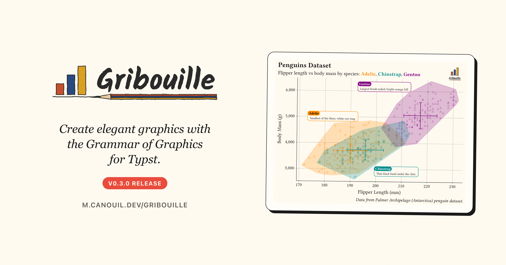

Another week, another [Gribouille](https://github.com/mcanouil/gribouille) release.
Gribouille 0.3.0 is narrower in scope than [0.2](../2026-06-03-gribouille-0-2/index.qmd), but it brings some wanted controls.
The headline is guide control: a single argument now hides axis ticks and legends without touching the theme.
Alongside that, `compose()` gains a `theme:` parameter, `defer()` replaces `plot(..., defer: true)`, `geom-area()` stacks by default, and `annotate()` can let marks overflow the panel.

{
  .img-featured
  .img-fluid
  fig-align="center"
  fig-alt=''
  width="600px"
}

::: {.callout-note}

## At a glance

- [Gribouille](https://github.com/mcanouil/gribouille) 0.3.0 on Typst Universe: `#import "@preview/gribouille:0.3.0": *`.
- [`guides(x: none)`](https://m.canouil.dev/gribouille/reference/guides/guides.html) / `guides(y: none)` hide tick marks and tick labels; the axis line, grid, and title stay. Remove the title separately with `labs(x: none)`.
- [`guides(default: none)`](https://m.canouil.dev/gribouille/reference/guides/guides.html) hides every legend without its own override.
- Under [`coord-radial`](https://m.canouil.dev/gribouille/reference/coord/coord-radial.html), `guides(theta: none)` hides the full angular axis and `guides(r: none)` hides radial tick labels.
- `guides(none)` replaces the removed `guide-none()`; `guides(auto)` restores the default.
- [`compose()`](https://m.canouil.dev/gribouille/reference/core/compose.html) gains `theme:`, which styles the composition chrome and propagates into panels with no theme of their own.
- **Breaking change**: `plot(..., defer: true)` is replaced by `defer(plot, ...)`. Panels inside a `compose()` also no longer accept their own `width`/`height`.
- [`geom-area()`](https://m.canouil.dev/gribouille/reference/geoms/geom-area.html) defaults to `stat: "align"` and `position: "stack"`; groups with mismatched x values are resampled automatically.
- [`annotate()`](https://m.canouil.dev/gribouille/reference/layers/annotate.html) gains `clip:` (default `true`); `clip: false` lets a mark overflow the panel.

:::

Every figure in this post is a real, freshly compiled plot.

## Guide controls

The biggest visible change is a new layer of control over what guides draw.

Before 0.3.0, hiding an axis's tick marks and labels meant reaching into `theme()` for the right element surface.
Now, `guides(x: none)` does it directly.
The axis line, the vertical grid lines, and the axis title all stay.
To drop the title too, add `labs(x: none)` alongside it.

```{typst}
//| echo: true
//| align: center
//| output-filename: "guides-x-none.svg"
//| alt: "Penguin scatter of body mass against flipper length with no x-axis tick marks or labels. The vertical grid lines and the axis title 'Flipper Length (mm)' remain."
#plot(
  data: penguins,
  mapping: aes(x: "flipper-len", y: "body-mass", colour: "species"),
  layers: (geom-point(size: 2pt, alpha: 0.7),),
  guides: guides(x: none),           // <1>
  labs: labs(
    title: "Ticks Off, Grid Stays",
    x: "Flipper Length (mm)",
    y: "Body Mass (g)",
  ),
  theme: theme-minimal(),
  width: 12cm,
  height: 8cm,
)
```

1. `guides(x: none)` removes tick marks and labels. The line, grid, and title are untouched. `guides(y: none)` does the same for the y-axis.

The same syntax now controls legends too.
`guides(none)` hides a legend; `guides(auto)` restores the default.
Both replace the removed `guide-none()`.

When you want all legends gone at once, `guides(default: none)` sets the fallback for every aesthetic without its own override.

```{typst}
//| echo: true
//| align: center
//| output-filename: "guides-default-none.svg"
//| alt: "Penguin scatter of body mass against flipper length, coloured by species, with no legend shown."
#plot(
  data: penguins,
  mapping: aes(x: "flipper-len", y: "body-mass", colour: "species"),
  layers: (geom-point(size: 2pt, alpha: 0.7),),
  guides: guides(default: none),     // <1>
  labs: labs(
    title: "No Legends",
    x: "Flipper Length (mm)",
    y: "Body Mass (g)",
  ),
  theme: theme-minimal(),
  width: 12cm,
  height: 8cm,
)
```

1. Every aesthetic without an explicit guide inherits `none`; the colour legend disappears and the plot area fills the freed space.

## Radial guide controls

The same guide syntax extends to `coord-radial`.
`guides(theta: none)` hides the full angular axis, the arc, minor ticks, and tick labels together.
`guides(r: none)` hides only the radial tick labels, leaving the spokes and circles in place.

```{typst}
//| echo: true
//| align: center
//| output-filename: "guides-radial.svg"
//| alt: "A coxcomb chart of penguin counts by species using coord-radial, with the angular tick labels hidden. Only the radial grid is visible."
#plot(
  data: penguins,
  mapping: aes(x: "species", fill: "species"),
  layers: (geom-bar(),),
  coord: coord-radial(),
  guides: guides(theta: none, default: none),  // <1>
  labs: labs(
    title: "Angular Axis Hidden",
    x: none,
    y: "Count",
  ),
  theme: theme-minimal(),
  width: 10cm,
  height: 10cm,
)
```

1. `theta: none` removes the angular ring and labels. `default: none` also drops the fill legend, leaving the radial grid as the only scale reference.

## Compose gets a theme

Two changes landed in `compose()` together.

The first is a `theme:` parameter.
Pass a theme and it styles the composition chrome: the shared title, the hoisted legend, and the panel tags.
It also propagates into any panel that has no theme of its own, so you can set one theme once and let it cascade instead of repeating it across every panel.

The second is the `defer()` helper.

::: {.callout-warning}

## Breaking change

`plot(..., defer: true)` is removed.
Replace `plot(data: ..., ..., defer: true)` with `defer(plot, data: ..., ...)`.
Panels inside a `compose()` also no longer accept their own `width`/`height`; the composition sizes each cell.

:::

```{typst}
//| echo: true
//| align: center
//| output-filename: "compose-theme.svg"
//| alt: "Two scatter panels side by side, tagged (1) Body Mass and (2) Bill Length, sharing a species legend at the bottom and a title across the top. The minimal theme is set once on compose()."
#let panel(y, title) = defer(plot,       // <1>
  data: penguins,
  mapping: aes(x: "flipper-len", y: y, colour: "species"),
  layers: (geom-point(size: 2pt, alpha: 0.85),),
  labs: labs(title: title, x: none, y: none),
)

#compose(
  panel("body-mass", "Body Mass"),
  panel("bill-len", "Bill Length"),
  columns: 2,
  tag-levels: "1",
  tag-prefix: "(",
  tag-suffix: ")",
  guides: guides(default: guide-legend(position: "bottom")),
  labs: labs(title: "One Theme, Two Panels"),
  theme: theme-minimal(),              // <2>
  width: 18cm,
  height: 8cm,
)
```

1. `defer(plot, ...)` replaces `plot(..., defer: true)`. The panel no longer sets `width`/`height`.
2. `theme: theme-minimal()` styles the title, legend, and tags, and propagates into both panels because neither sets its own theme.

## Area stacks by default

`geom-area()` now defaults to `stat: "align"` and `position: "stack"`.

Before 0.3.0, stacking a multi-group area chart needed both arguments spelled out.
Now they are the defaults.
`stat: "align"` also handles groups that have different x values: it resamples each group onto a shared grid before stacking, so the x values do not need to match.

```{typst}
//| echo: true
//| align: center
//| output-filename: "geom-area-stack.svg"
//| alt: "Stacked area chart with three groups A, B, and C over x values 0 to 4. Groups A and B have different x breakpoints; stat-align resamples them onto a shared grid before stacking."
#let series = (
  (x: 0, y: 5, g: "A"), (x: 1, y: 8, g: "A"), (x: 3, y: 6, g: "A"), (x: 4, y: 9, g: "A"),
  (x: 0, y: 3, g: "B"), (x: 2, y: 5, g: "B"), (x: 3, y: 4, g: "B"), (x: 4, y: 6, g: "B"),
  (x: 0, y: 2, g: "C"), (x: 1, y: 3, g: "C"), (x: 2, y: 2, g: "C"), (x: 4, y: 4, g: "C"),
)

#plot(
  data: series,
  mapping: aes(x: "x", y: "y", fill: "g"),
  layers: (geom-area(),),              // <1>
  labs: labs(
    title: "Stacked by Default",
    x: "x",
    y: "y",
    fill: "Group",
  ),
  theme: theme-minimal(),
  width: 12cm,
  height: 8cm,
)
```

1. No `stat:` or `position:` needed. Groups A, B, and C have different x breakpoints; `stat: "align"` resamples them onto a shared grid before stacking.

## Annotations can overflow

`annotate()` gains a `clip` argument.
The default is `true`, which preserves the existing behaviour: marks outside the panel are clipped.
Set `clip: false` and the mark is drawn even if it sits past the axis limits.

This is useful for corner insets, labels anchored outside the data range, or decorations that belong in the margin.
A paired fix ensures that an `annotate(clip: false)` placed outside the scale `limits` actually draws.
Before 0.3.0, the out-of-range pre-pass silently dropped it.

```typst
#plot(
  data: penguins,
  mapping: aes(x: "flipper-len", y: "body-mass"),
  layers: (
    geom-point(size: 2pt, alpha: 0.6),
    annotate(
      geom-text(label: "← past the edge"),
      x: 235,
      y: 5000,
      clip: false,                     // <1>
    ),
  ),
  labs: labs(
    title: "Annotation Outside the Panel",
    x: "Flipper Length (mm)",
    y: "Body Mass (g)",
  ),
  theme: theme-minimal(),
  width: 12cm,
  height: 8cm,
)
```

1. `clip: false` keeps the mark visible even though `x = 235` sits past the panel boundary.

## Under the hood

As with 0.2, a large share of the release is fixes rather than features.
Legend layout was the main focus.

- Horizontal legends with centred or right `align` now centre or right-justify the key graphic under the title, instead of leaving it pinned to the left while the title moved.
- `guide-legend(nrow:)` and `guide-legend(ncolumn:)` now work for continuous size legends, laying keys out in a grid as they do for discrete swatch legends.
- `guide-legend(align:)` now aligns the legend title as well as the entry labels.
  Passing a plain string such as `"left"` also reports a clear error instead of being silently ignored.
- `legend-background` now inherits the base `rect` element, so `theme(rect: ...)` cascades to it as it does for every other `*-background` surface.
- A hoisted `compose()` legend that leaves no room for the panels, or a left/right legend that would overrun the caption, now reports a clear layout error instead of silently overprinting.

A second group cleans up statistics and scale behaviour.

- `stat-bin-2d` and `stat-bin-hex` `_density` is now the cell's fraction of the total count, matching ggplot2, instead of an undocumented count-per-cell-area value.
- `sqrt` and `log10` transforms validate their domain and report clear errors for out-of-range data.
  The `sqrt` inverse also clamps padded view bounds at zero so the axis stays monotone and shows the `0` break.
- The out-of-range filter now respects scale `expand`, so points and annotations inside the expansion headroom are kept.
  Reversed `limits` (a flipped axis) no longer drop every row.
- `geom-linerange()` honours its `alpha` parameter, which was always documented but never applied.

::: {.highlight}

**Most of the legend fixes are invisible at a glance:** existing plots look the same, but the cases that used to produce overlapping keys, misaligned titles, or silent layout glitches now behave correctly.

:::

## Editor support: Tinymist docstrings

The published package now ships Tinymist-friendly docstrings.
Hovering over a gribouille function in a compatible editor shows formatted parameters, return values, and examples, instead of the raw `@`-tag comments.
Variadic sinks such as `guides()` and `theme()` list their accepted keys explicitly, so you can see which aesthetics or element surfaces each function takes without opening the reference.

## Wrap-up

::: {.highlight}

**Guide control moved one level up: hide ticks and legends with one argument, no theme surgery needed.**

:::

Next on the list is more geoms and worked examples.
If you run into something unexpected, the issue tracker is the right place for it.

- Gribouille
  - Repository: <https://github.com/mcanouil/gribouille>.
  - Documentation: <https://m.canouil.dev/gribouille>.
  - Typst Universe: <https://typst.app/universe/package/gribouille>.
- Typst Render
  - Repository: <https://github.com/mcanouil/quarto-typst-render>.
  - Documentation: <https://m.canouil.dev/quarto-typst-render>.

::: {.callout-tip}

## A note on contributions

Gribouille is an unfunded spare-time project, and the API is still settling.
Bug reports and ideas are very welcome on the issue tracker.
Pull requests are not being accepted for now, for the reasons set out in the [launch post](../2026-05-20-gribouille-grammar-of-graphics-for-typst/index.qmd).
Thanks in advance for your patience.

:::
