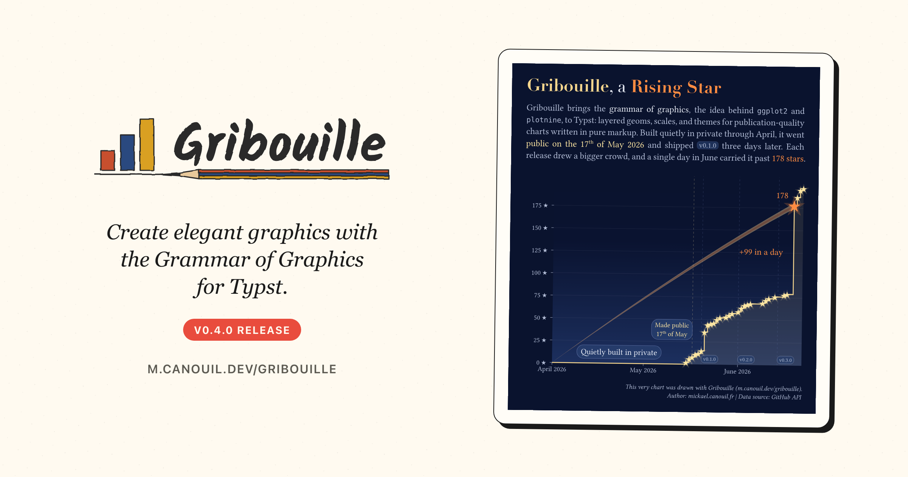

Another [Gribouille](https://github.com/mcanouil/gribouille) release.
Gribouille 0.4.0 is mostly about time and detail.
Scales now read dates and times from plain ISO strings, so you no longer convert to epoch days by hand.
The `shape` aesthetic accepts any character, so a letter or an emoji can be the point marker.
The panel grid splits into a major and minor cascade, with minor gridlines drawn by default.
And `labs()` is renamed to `labels()`, the largest of a handful of breaking renames.

{
  .img-featured
  .img-fluid
  fig-align="center"
  fig-alt=''
  width="600px"
}

::: {.callout-note}

## At a glance

- [Gribouille](https://github.com/mcanouil/gribouille) 0.4.0 on Typst Universe: `#import "@preview/gribouille:0.4.0": *`.
- Continuous scale `limits`, `breaks`, and the `geom-vline`/`geom-hline`/`geom-abline` intercepts accept ISO-8601 date, datetime, and time strings under a temporal scale.
- The `shape` aesthetic accepts any character; a value outside the eight built-in keywords renders as a literal glyph, so letters or emoji work as markers.
- [`geom-area()`](https://m.canouil.dev/gribouille/reference/geoms/geom-area.html) gains a `direction` parameter (`"hv"` or `"vh"`) that steps the filled top edge like [`geom-step()`](https://m.canouil.dev/gribouille/reference/geoms/geom-step.html).
- Panel gridlines cascade `panel-grid` to `panel-grid-major` / `panel-grid-minor` to `-x` / `-y`; continuous axes draw minor gridlines by default.
- Scale `limits` and `expand` accept `auto` on one side, keeping the trained bound or per-scale default for the other.
- Bundled datasets (`penguins`, `economics`, `mpg`) ship as row-store arrays, so `penguins.filter(...)` and `.map(...)` work directly.
- **Breaking renames**: `labs()` to `labels()`, `col-mix()` to `colour-mix()`, `xlim`/`ylim` to `x-limits`/`y-limits`, the `dx`/`dy` offsets to `nudge-x`/`nudge-y` aesthetics, and `clip` to a boolean.

:::

Every figure in this post is a real, freshly compiled plot.

## Breaking changes

This release tidies a few names before they settle for good.
None of them change what a plot does, only how you spell it.

::: {.callout-warning}

## Migrate these names

- Rename `labs(...)` to `labels(...)`, and the `plot()` / `compose()` `labs:` argument to `labels:`. There is no `labs` alias.
- Rename `col-mix(...)` to `colour-mix(...)`; its arguments are now `colour1` and `colour2`.
- In `coord-cartesian()`, `stat-function()`, and `geom-function()`, rename `xlim`/`ylim` to `x-limits`/`y-limits`.
- In `coord-cartesian()` and `coord-radial()`, pass `clip` as a boolean (`true`/`false`) instead of the strings `"on"`/`"off"`.
- In `geom-text`, `geom-label`, and `geom-typst`, drop `dx`/`dy`; use the `nudge-x`/`nudge-y` aesthetics instead, where a number shifts in data units and a Typst length shifts in canvas units.

:::

## Scales that read dates and times

Before 0.4.0, putting a date on an axis meant converting it to a number first, usually days since some epoch.
Now a temporal scale reads ISO-8601 strings directly.
The scale `limits` and `breaks` take them, and so do the `geom-vline`, `geom-hline`, and `geom-abline` intercepts.

```{typst}
//| echo: true
//| align: center
//| output-filename: "date-strings.svg"
//| alt: "A line chart of visits over the first three months of 2026, with a dashed orange vertical line marking the 14th of February. The x-axis ticks fall on the first of each month."
#let visits = (
  (day: "2026-01-05", n: 12),
  (day: "2026-01-20", n: 19),
  (day: "2026-02-08", n: 27),
  (day: "2026-02-25", n: 41),
  (day: "2026-03-10", n: 58),
  (day: "2026-03-28", n: 64),
)

#plot(
  data: visits,
  mapping: aes(x: "day", y: "n"),
  layers: (
    geom-line(),
    geom-point(size: 2pt),
    geom-vline(                                          // <1>
      xintercept: "2026-02-14",
      linetype: "dashed",
      colour: rgb("#D55E00"),
    ),
  ),
  scales: (
    scale-x-date(
      limits: ("2026-01-01", "2026-04-01"),             // <2>
      breaks: ("2026-01-01", "2026-02-01", "2026-03-01", "2026-04-01"),
      date-format: "[month repr:short]",
    ),
  ),
  labels: labels(                                        // <3>
    title: "Dates Straight From Strings",
    x: "Month",
    y: "Visits",
  ),
  theme: theme-minimal(),
  width: 12cm,
  height: 7cm,
)
```

1. `geom-vline` reads a plain ISO date string as its intercept under a date scale; no epoch maths.
2. `limits` and `breaks` take ISO-8601 strings too. The same works for datetimes and times.
3. `labs()` is now `labels()`. This is the headline breaking rename.

## A marker from any character

The `shape` aesthetic used to take one of eight built-in keywords.
Now any other value renders as a literal glyph, so a letter, a symbol, or an emoji becomes the marker.
Here the species initials stand in for the usual point shapes.

```{typst}
//| echo: true
//| align: center
//| output-filename: "any-glyph.svg"
//| alt: "Penguin scatter of body mass against flipper length, with each species drawn as its initial letter, A, C, or G, instead of a point glyph, and a shape legend on the right."
#plot(
  data: penguins,
  mapping: aes(x: "flipper-len", y: "body-mass", shape: "species"),
  layers: (geom-point(size: 9pt),),
  scales: (
    scale-shape-manual(values: ("A", "🐧", "star")),        // <1>
  ),
  labels: labels(
    title: "Markers From Any Character",
    x: "Flipper Length (mm)",
    y: "Body Mass (g)",
    shape: "Species",
  ),
  theme: theme-minimal(),
  width: 12cm,
  height: 8cm,
)
```

1. Each value outside the eight keywords renders as a literal glyph. A font set in `theme(text: ...)` reaches these markers too.

## Stepped areas

`geom-area()` gains a `direction` parameter.
The default keeps the smooth filled area.
Pass `"hv"` or `"vh"` and the filled top edge steps like `geom-step()`, which suits counts and other quantities that hold flat between observations.

```{typst}
//| echo: true
//| align: center
//| output-filename: "stepped-area.svg"
//| alt: "A filled area chart whose top edge rises and falls in right-angled steps rather than straight diagonals, over x values 0 to 4."
#let series = (
  (x: 0, y: 2), (x: 1, y: 5), (x: 2, y: 3), (x: 3, y: 6), (x: 4, y: 4),
)

#plot(
  data: series,
  mapping: aes(x: "x", y: "y"),
  layers: (geom-area(direction: "hv", alpha: 0.5),),    // <1>
  labels: labels(title: "A Stepped Area", x: "x", y: "y"),
  theme: theme-minimal(),
  width: 12cm,
  height: 7cm,
)
```

1. `direction: "hv"` steps the top edge; `"vh"` steps it the other way round, and the default `none` keeps the smooth area.

## A grid cascade and minor gridlines

Continuous axes now draw minor gridlines by default, halfway between the major lines.
The grid also splits into a cascade you can style one piece at a time: `panel-grid` feeds `panel-grid-major` and `panel-grid-minor`, and each of those feeds an `-x` and a `-y` variant.
So you can thicken the major Y lines and blank only the minor X lines without touching anything else.

```{typst}
//| echo: true
//| align: center
//| output-filename: "grid-cascade.svg"
//| alt: "Penguin scatter of body mass against flipper length coloured by species. The horizontal major gridlines are noticeably thicker, the minor vertical gridlines are absent, and faint minor horizontal gridlines sit between the major ones."
#plot(
  data: penguins,
  mapping: aes(x: "flipper-len", y: "body-mass", fill: "species"),
  layers: (geom-point(size: 2pt, alpha: 0.7),),
  labels: labels(
    title: "Major and Minor, Styled Apart",
    x: "Flipper Length (mm)",
    y: "Body Mass (g)",
    fill: "Species",
  ),
  theme: theme-minimal(
    panel-grid-major-y: element-line(stroke: 1pt),      // <1>
    panel-grid-minor-x: element-blank(),                // <2>
  ),
  width: 12cm,
  height: 8cm,
)
```

1. The major horizontal lines are thickened on their own. `scale-*-continuous` also accepts `minor-breaks` and `n-minor` to place the minor lines.
2. Only the minor vertical lines are blanked; the minor horizontal lines stay on by default.

## Filter, pin, and auto bounds

A few smaller changes make everyday plotting shorter.
The bundled datasets are plain row-store arrays now, so you can `filter` and `map` them in place before they reach `plot()`.
Any aesthetic can be pinned as a constant straight on a geom.
And a scale `limit` or `expand` accepts `auto` on one side, keeping the trained value for the other.

```{typst}
//| echo: true
//| align: center
//| output-filename: "filter-pin-auto.svg"
//| alt: "Scatter of body mass against flipper length for Gentoo penguins only, every point a fixed blue, with the y-axis capped at 6500 grams while its lower bound is left to the data."
#plot(
  data: penguins.filter(row => row.species == "Gentoo"),  // <1>
  mapping: aes(x: "flipper-len", y: "body-mass"),
  layers: (geom-point(fill: rgb("#0072B2"), alpha: 0.6),),  // <2>
  scales: (
    scale-y-continuous(limits: (auto, 6500)),             // <3>
  ),
  labels: labels(
    title: "Filter, Pin, and Auto Bounds",
    x: "Flipper Length (mm)",
    y: "Body Mass (g)",
  ),
  theme: theme-minimal(),
  width: 12cm,
  height: 8cm,
)
```

1. `penguins` is a row-store array, so `.filter(...)` and `.map(...)` work before `plot()` ever sees it.
2. `colour` is pinned as a constant on the geom; any aesthetic key can be set this way.
3. `limits: (auto, 6500)` fixes the upper bound and leaves the lower one trained on the data.

There is more in the same vein.
`element-text()` and `element-typst()` honour `angle` on axis titles, strip text, and legend labels now, not only tick labels and the plot title.
A single `legend-position` theme entry sets a global side for every legend.
And `guide-legend(key-size:)` resizes the discrete legend key glyphs, with the row spacing growing to match.

## An advanced example: a star-history chart

To pull these together, here is a real chart: Gribouille's own GitHub star history, drawn with Gribouille.
The data comes from two small scripts shipped alongside this post under `assets/star-history/`.
[`star-history.sh`](assets/star-history/star-history.sh) walks the stargazers API into a daily-cumulative `date,stars` CSV, and [`release-history.sh`](assets/star-history/release-history.sh) lists the tagged releases.
The plot then reads both CSVs straight from Typst.

It leans on a good share of this release:

- Temporal date strings everywhere: `scale-x-date` breaks on the first of each month, a gold `geom-vline` at the public-release date, and dashed `geom-vline` markers at each tagged release, all from plain ISO strings.
- Markers from a character: every daily count is a `sym.star` glyph, and the spike is a hotter amber star.
- A stepped fill: `geom-area(direction: "hv")` lays a faint glow under the cumulative `geom-step` trail.
- A tuned grid: the `panel-grid` cascade blanks the major X lines and the minor lines, keeping only faint major Y lines.
- A boolean `coord-cartesian(clip: false)` so the count annotation can float above the panel.
- `labels()` for the title, subtitle, and caption, and the bundled-array `.filter`/`.map` to lift and halo the star glyphs.

```{typst}
//| echo: true
//| code-fold: true
//| code-summary: "Show the full Typst source"
//| align: center
//| output-filename: "star-history.svg"
//| alt: "Midnight-sky line chart of Gribouille's cumulative GitHub stars per day from April to June 2026, titled 'Gribouille, a Rising Star'. A luminous gold step trail rises from zero across a long flat run labelled 'Quietly built in private', lifts at a gold dashed marker labelled 'Made public 17th of May', then climbs through dashed release markers to a final amber spike annotated with a one-day jump."
// Loads a daily-cumulative star count and release markers from CSV and plots
// them as a midnight-sky step trail: a luminous staircase whose daily counts
// read like a constellation, with the final spike glowing brightest.

// Named palette: colours reused across several layers. One-off shades (the panel
// gradient, point rim, release tint, transparent bloom ink) stay inline at use.
#let palette = (
  sky-deep: rgb("#0a132e"), // plot margin: a shade darker, to gather the figure
  trail: rgb("#f4d58d"), // cumulative curve: luminous starlight gold
  star: rgb("#ffe7a3"), // daily-count points: bright warm star
  peak: rgb("#ff8c42"), // the spike: hotter amber, separates from the gold
  ink: rgb("#e8ecf5"), // foreground text: soft starlight white
  muted: rgb("#b3bdd6"), // secondary text and ticks
  cloud: rgb("#28406f"), // annotation boxes: moonlit cloud, lighter than the sky
  cloud-edge: rgb("#6b7cb0"), // faint rim catching the moonlight
)

#set page(width: 16cm, height: 18cm, margin: 0cm, fill: palette.sky-deep)

#let raw-stars = csv("/assets/star-history/star-history.csv", row-type: dictionary).map(row => (
  date: row.date,
  stars: float(row.stars),
))

// Snap the leading 0-star baseline to the first of the creation month so the
// flat segment starts on the first month tick rather than mid-month.
#let stars = (
  (..raw-stars.first(), date: raw-stars.first().date.slice(0, 7) + "-01"),
  ..raw-stars.slice(1),
)

// The fan geometry interpolates between numeric x positions, so the head and tail
// dates are converted to days since the 2000-01-01 epoch scale-x-date trains against;
// the count annotations pinned to the fan apex reuse that numeric head-x as well.
// Vline intercepts, scale breaks, and narrative annotation x values take ISO strings
// directly.
#let epoch = datetime(year: 2000, month: 1, day: 1)
#let to-days(iso) = (
  datetime(
    year: int(iso.slice(0, 4)),
    month: int(iso.slice(5, 7)),
    day: int(iso.slice(8, 10)),
  )
    - epoch
).days()

#let star-max = stars.map(row => row.stars).fold(0, calc.max)

// One releases dataset (minor/major only, patch dropped): x in epoch days, y just
// above the x-axis baseline so the tiny tags sit clear of the trail and the peak.
#let releases = (
  csv("/assets/star-history/release-history.csv", row-type: dictionary)
    .filter(row => row.tag.split(".").last() == "0")
    .map(row => (
      x: row.date,
      y: 6,
      tag: "v" + row.tag,
    ))
)

// The 2026-06-19 row carries the spike; it drives the peak marker and its labels.
#let peak-idx = stars.position(row => row.date == "2026-06-19")
#let peak = stars.at(peak-idx)
#let peak-jump = int(peak.stars - stars.at(peak-idx - 1).stars)

// Shooting-star fan: one solid gold band tapering from a point at the first date
// (the tail tip) up to the star at the head, where it spans the star's height.
// Both edges are arcs sharing the tip; the top edge meets the star's top point and
// the lower edge its lower-left peak.
#let head-x = to-days(peak.date)
#let head-y = peak.stars
#let tail-x = to-days(stars.first().date) // first date: where the tail tip lands
#let fan-sag = 30 // stars the edges drop from the head down to the tip
#let fan-arc = 1.7 // >1 keeps the edges flat at the head, steep toward the tip
#let head-top = head-y + 2.5 // top edge meets the star's top point
#let head-bot = head-y - 3.5 // lower edge meets the star's lower-left peak
#let tip-y = 0 // y of the tail tip at the first date
// An arc through (tail-x, tip-y) at the tip and (head-x, hy) at the head.
#let arc-y(x, hy) = {
  let t = (x - tail-x) / (head-x - tail-x)
  hy - fan-sag * calc.pow(1 - t, fan-arc) + (tip-y - hy + fan-sag) * (1 - t)
}
#let fan-band(n) = range(n + 1).map(i => {
  let x = tail-x + (head-x - tail-x) * i / n
  (x: x, ymax: arc-y(x, head-top), ymin: arc-y(x, head-bot))
})

// A cross-thickness gradient cannot ride a single ribbon (a Typst gradient maps to
// the whole bounding box, not the band's local thickness), so the fan is sliced
// into thin sub-bands stacked from the lower to the upper edge, each filled by
// sampling a light -> peak -> light gradient: the amber peak colour runs as a
// bright line down the middle and lightens toward both edges.
#let fan-slices = 32
#let fan-grad = gradient.linear(
  palette.star.transparentize(50%),
  palette.peak.transparentize(50%),
  palette.star.transparentize(50%),
)
#let fan-layers = {
  let rows = fan-band(40)
  range(fan-slices).map(k => {
    let flo = k / fan-slices
    let fhi = (k + 1) / fan-slices
    geom-ribbon(
      data: rows.map(r => (
        x: r.x,
        ymin: r.ymin + (r.ymax - r.ymin) * flo,
        ymax: r.ymin + (r.ymax - r.ymin) * fhi,
      )),
      mapping: aes(x: "x", ymin: "ymin", ymax: "ymax"),
      inherit-aes: false,
      fill: fan-grad.sample((flo + fhi) / 2 * 100%),
      stroke: none,
      alpha: 0.95,
    )
  })
}

#let y-step = 25
#let y-breaks = range(0, calc.floor(star-max / y-step) + 1).map(i => i * y-step)

// One x break per month (first of the month) so the short-month label never
// repeats, unlike the auto breaks that fall mid-month within a single month.
#let month-firsts = stars.map(row => row.date.slice(0, 7) + "-01").dedup()

#plot(
  data: stars,
  mapping: aes(x: "date", y: "stars"),
  layers: (
    // Faint luminous glow beneath the trail.
    geom-area(
      stat: "identity",
      direction: "hv",
      fill: palette.trail,
      alpha: 0.1,
      stroke: none,
    ),
    // Releases recede into the sky: thin dashed verticals plus tiny tags set in
    // the empty upper-left, so the trail stays the hero.
    geom-vline(
      data: releases,
      mapping: aes(xintercept: "x"),
      colour: rgb("#6677aa"),
      stroke: 0.4pt,
      linetype: "dashed",
      alpha: 0.45,
    ),
    geom-label(
      data: releases,
      mapping: aes(x: "x", y: "y", label: "tag"),
      inherit-aes: false,
      colour: palette.muted,
      fill: palette.cloud.transparentize(35%),
      stroke: 0.25pt,
      size: 8pt,
      inset: 3pt,
      radius: 5pt,
      anchor: "west",
    ),
    // The day the repository went public: a warm gold marker, distinct from the
    // cool release lines.
    annotate(
      "vline",
      xintercept: "2026-05-17",
      colour: palette.star,
      stroke: 0.5pt,
      linetype: "dashed",
      alpha: 0.4,
    ),
    // The cumulative trail.
    geom-step(stroke: 1.4pt, colour: palette.trail),
    // Each daily count is a star glyph: a soft halo under a bright sparkle. The
    // glyph's optical centre sits low, so the larger glow is lifted to stay
    // concentric with the bright star (geom-point has no nudge).
    geom-point(
      data: d => d
        .filter(row => row.stars != 0)
        .map(row => (
          ..row,
          stars: row.stars + 0.25,
        )),
      shape: sym.star,
      size: 24pt,
      fill: palette.star,
      alpha: 0.16,
    ),
    geom-point(
      data: d => d.filter(row => row.stars != 0),
      shape: sym.star,
      size: 14pt,
      fill: palette.star,
    ),
    // Shooting-star fan sweeping down-left from behind the head: sliced sub-bands
    // give it an amber centre-line lightening to the edges; drawn before the peak
    // star so the amber head sits over its apex.
    ..fan-layers,
    // The spike glows brightest: its own (lifted) halo, then a hot amber star.
    geom-point(
      data: ((..peak, stars: peak.stars + 1.25),),
      shape: sym.star,
      size: 46pt,
      fill: palette.peak,
      alpha: 0.22,
    ),
    geom-point(
      data: ((..peak, stars: peak.stars + 0.25),),
      shape: sym.star,
      size: 26pt,
      fill: palette.peak,
    ),
    // The count floats in clear sky just above the head, clear of the gold fan.
    annotate(
      "typst",
      x: head-x - 4,
      y: head-y + 8,
      label: [#str(int(peak.stars))],
      colour: palette.peak,
      size: 13pt,
      anchor: "south",
    ),
    annotate(
      "typst",
      x: head-x - 3.5,
      y: 125,
      label: [+#str(peak-jump) in a day],
      colour: palette.peak,
      size: 13pt,
      anchor: "east",
    ),
    // Narrative beats: the private build over the flat run, and the public day.
    annotate(
      "label",
      x: "2026-04-23",
      y: 11.5,
      label: "Quietly built in private",
      colour: palette.ink,
      fill: palette.cloud.transparentize(20%),
      stroke: 0.6pt + palette.cloud-edge.transparentize(30%),
      size: 12pt,
      inset: 6pt,
      radius: 10pt,
    ),
    annotate(
      "label",
      x: "2026-05-17",
      y: 37.5,
      label: [#align(center)[Made public \ 17#super[th] of May]],
      colour: palette.star,
      fill: palette.cloud.transparentize(20%),
      stroke: 0.6pt + palette.cloud-edge.transparentize(30%),
      size: 10pt,
      inset: 5pt,
      radius: 10pt,
      anchor: "east",
    ),
  ),
  scales: (
    scale-x-date(
      breaks: month-firsts,
      date-format: "[month repr:long] [year]",
      expand: (0%, 0%),
    ),
    scale-y-continuous(
      breaks: y-breaks,
      labels: y => [#box(baseline: -0.4em)[#str(int(y))]#text(
          size: 2em,
        )[#sym.star]],
      expand: (0%, 6%),
    ),
  ),
  coord: coord-cartesian(clip: false),
  labels: labels(
    title: [
      #text(fill: palette.trail, weight: "bold")[Gribouille], a #text(fill: palette.peak, weight: "bold")[Rising Star]
    ],
    subtitle: [
      #set par(justify: true)
      Gribouille brings the #text(fill: palette.ink)[grammar of graphics], the idea behind `ggplot2` and `plotnine`, to Typst: layered geoms, scales, and themes for publication-quality charts written in pure markup. Built quietly in private through April, it went #text(fill: palette.star)[public on the 17#super[th] of May 2026] and shipped #box(
        fill: palette.cloud.transparentize(35%),
        stroke: 0.25pt + palette.cloud-edge.transparentize(30%),
        inset: (x: 3pt, y: 1pt),
        outset: (y: 1pt),
        radius: 4pt,
      )[#text(size: 0.82em, fill: palette.muted)[v0.1.0]] three days later. Each release drew a bigger crowd, and a single day in June carried it past #text(fill: palette.peak)[#str(int(peak.stars)) stars].
    ],
    x: none,
    y: none,
    caption: [
      This very chart was drawn with Gribouille (#link("https://m.canouil.dev/gribouille")[m.canouil.dev/gribouille]). \
      Author: #link("https://mickael.canouil.fr")[mickael.canouil.fr] | Data source: GitHub API
    ],
  ),
  theme: theme-minimal(
    ink: palette.ink,
    paper: palette.sky-deep,
    text: element-text(font: ("Libertinus Serif", "DejaVu Sans Mono")),
    tick-length: 0.12cm,
    panel-background: element-rect(fill: gradient.linear(
      // Hold the dark top longer so it blends into the sky-deep frame, then
      // lighten only toward the lower half of the panel.
      (palette.sky-deep, 0%),
      (rgb("#0a1330"), 35%),
      (rgb("#1c2f5e"), 100%),
      dir: ttb,
    )),
    panel-grid-major-x: element-blank(),
    panel-grid-minor: element-blank(),
    panel-grid-major-y: element-line(colour: palette.ink.transparentize(88%)),
    axis-ticks: element-line(colour: palette.muted),
    axis-text: element-text(colour: palette.muted, size: 10pt),
    axis-title: element-text(colour: palette.ink, size: 12pt),
    axis-title-y: element-text(margin: margin(right: 14pt)),
    plot-title: element-text(
      font: "Didot",
      colour: palette.ink,
      size: 25.5pt,
      weight: "regular",
      margin: margin(top: 6pt, bottom: 20pt),
    ),
    plot-subtitle: element-text(
      colour: palette.muted,
      size: 13.3pt,
      margin: margin(bottom: 24pt),
    ),
    plot-caption: element-text(
      colour: palette.muted,
      size: 9.5pt,
      margin: margin(top: 16pt),
    ),
    // Outer frame: pad the whole figure so it breathes inside the page.
    plot-background: element-rect(
      fill: palette.sky-deep,
      inset: margin(top: 22pt, right: 22pt, bottom: 22pt, left: 22pt),
    ),
  ),
  width: auto,
  height: auto,
)
```

The full, unedited source is in the repository under [`.github/star-history/`](https://github.com/mcanouil/gribouille/tree/main/.github/star-history).

## Under the hood

As with every release, a good share of the work is fixes rather than features.

The theme cascade is the largest of them.
Setting the base `line` or `rect` stroke in `theme()` now reaches every line and rect surface: the panel grid, axis lines, ticks, and legend marks.
Setting the base `text` size cascades to every text surface in the same way.
On top of that, `element-line`, `element-rect`, and `element-text` accept a ratio such as `80%` to scale a single surface against its parent, while an absolute length still pins one outright.

A second group lines up marks and positions.

- `position: "dodge"` now shifts text, labels, points, lines, paths, steps, point ranges, and line ranges side by side, matching the dodged bars instead of staying on the category centre.
- The scalar and Typst-length `nudge-x`/`nudge-y` values apply to `geom-text`, `geom-label`, and `geom-typst`, which used to be a silent no-op.

A third group cleans up scales and presets.

- Explicit continuous `breaks` expand the axis range so the requested ticks stay visible, unless a side is pinned by an explicit `limit`.
- `theme-grey()` now matches ggplot2's `theme_grey()`, with white gridlines and no axis lines.

::: {.highlight}

**The theme cascade got more honest:** set the base line, rect, or text once and every surface inherits it, with ratios to scale a single surface against its parent.

:::

## Wrap-up

::: {.highlight}

**Dates as strings, any glyph as a marker, and a grid you can tune major and minor apart.**

:::

Next on the list is more geoms and more worked examples.
If you run into something unexpected, the issue tracker is the right place for it.

- Gribouille
  - Repository: <https://github.com/mcanouil/gribouille>.
  - Documentation: <https://m.canouil.dev/gribouille>.
  - Typst Universe: <https://typst.app/universe/package/gribouille>.
- Typst Render
  - Repository: <https://github.com/mcanouil/quarto-typst-render>.
  - Documentation: <https://m.canouil.dev/quarto-typst-render>.

::: {.callout-tip}

## A note on contributions

Gribouille is an unfunded spare-time project, and the API is still settling.
Bug reports and ideas are very welcome on the issue tracker.
Pull requests are not being accepted for now, for the reasons set out in the [launch post](../2026-05-20-gribouille-grammar-of-graphics-for-typst/index.qmd).
Thanks in advance for your patience.

:::
