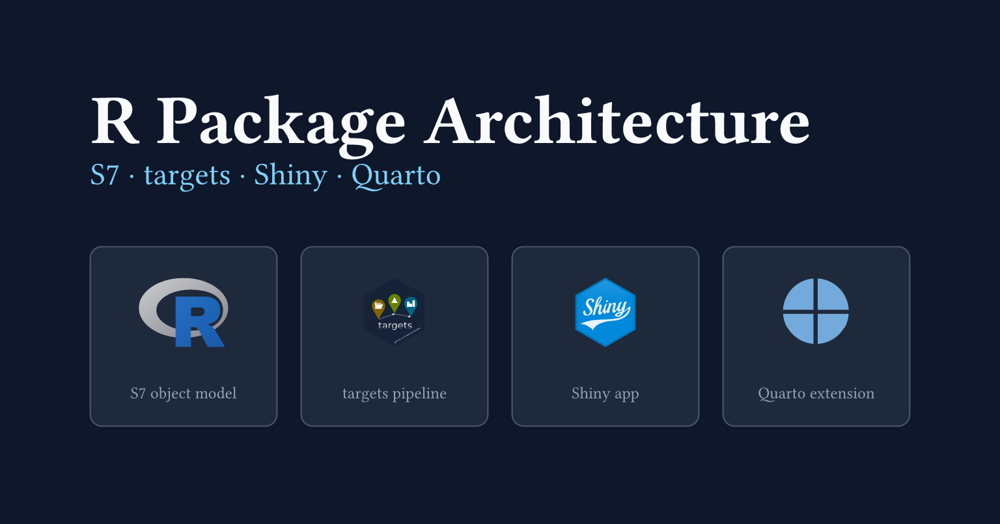
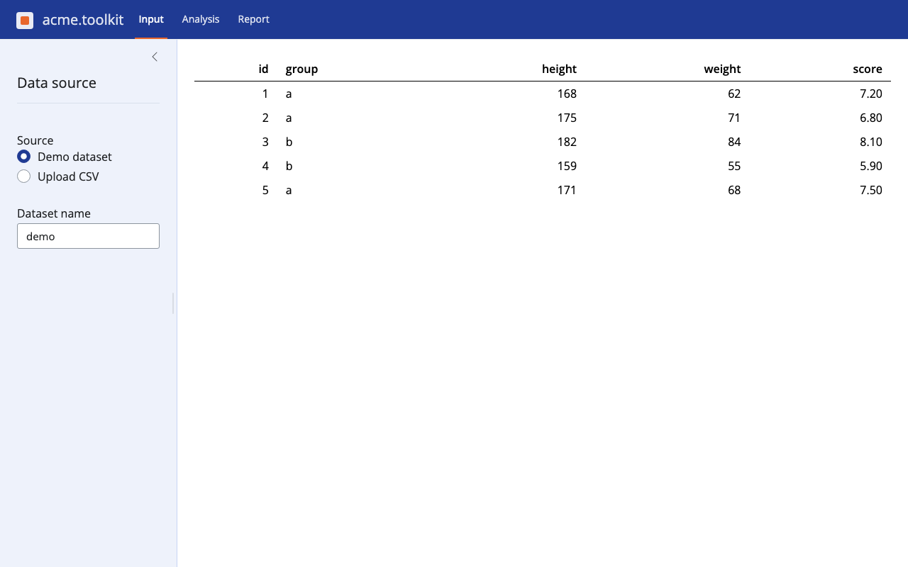

My recent posts have all been about Quarto and Typst.
This one is different: it is about R (*yet, still a bit about Quarto too*).
My day job is to conduct statistical analysis of omics data, and most of it is spent writing R code through packages, Shiny apps, scripts, things used by everyone from data scientists to clinicians who never open a terminal.
This post is about the package shape I settled on in my most recent projects, where the analysis logic, the interactive app, and the report all need to share the same code.

{
  .img-featured
  .img-fluid
  fig-align="center"
  fig-alt=''
  width="600px"
}

## When does this pattern fit?

The pattern earns its complexity when several things are true at once.
You have a domain object that several verbs operate on, such as load, summarise, and export.
You want the same logic available interactively, in a batch pipeline, and in a report.
You need branded, consistent output across formats: HTML, PDF, slides.

If you only need a handful of functions, this is too much structure.
The cost is worth paying once the object model and the reporting start to repeat.

## The four pillars

The package rests on four parts that compose cleanly.

```{typst}
//| label: fig-architecture
//| fig-cap: "The four pillars of acme.toolkit. S7 objects are the shared currency: the pipeline, the report, and the Shiny app all pass them around."
//| echo: false
//| alt: "Architecture diagram with four boxes inside a border labelled acme.toolkit. Top row: S7 object model on the left connected by a right arrow to targets pipeline on the right. Bottom row: Shiny app on the left, Quarto extension on the right. Vertical down arrows connect the top row to the bottom row in each column."
//| width: 13cm
//| height: 7.5cm
#let fg = if _typst_render_foreground != none { _typst_render_foreground } else { rgb("#111827") }
#let bg = if _typst_render_background != none { _typst_render_background } else { white }
#let primary = color.mix((rgb("#1f3a93"), 60%), (fg, 40%))
#let muted = color.mix((fg, 65%), (bg, 35%))
#let box-fill = color.mix((bg, 90%), (fg, 10%))
#let box-stroke = color.mix((fg, 20%), (bg, 80%)) + 0.5pt
#let arrow-col = color.mix((fg, 65%), (bg, 35%))

#let pillar(title, detail) = rect(
  fill: box-fill, stroke: box-stroke, radius: 3pt,
  inset: (x: 9pt, y: 0pt), width: 100%, height: 100%,
)[
  #align(center + horizon)[
    #stack(spacing: 5pt,
      text(weight: "bold", fill: fg)[#title],
      text(size: 7pt, fill: muted)[#detail],
    )
  ]
]

#let arr = text(size: 13pt, fill: arrow-col)[→]
#let arr-dn = text(size: 13pt, fill: arrow-col)[↓]

#layout(avail => {
  let top-inset    = 9pt
  let bottom-inset = 12pt
  let title-h      = 16pt
  let spacing      = 10pt
  let arrow-row    = 20pt

  let grid-h   = avail.height - top-inset - title-h - spacing - bottom-inset
  let box-row-h = (grid-h - arrow-row) / 2

  rect(
    width: avail.width, height: avail.height,
    fill: bg, stroke: primary + 1.5pt, radius: 5pt,
    inset: (x: 12pt, top: top-inset, bottom: bottom-inset),
  )[
    #align(center)[
      #text(size: 11pt, weight: "bold", fill: primary)[acme.toolkit]
    ]
    #v(spacing)
    #grid(
      columns: (1fr, 22pt, 1fr),
      rows: (box-row-h, arrow-row, box-row-h),
      align: center + horizon,
      gutter: 0pt,

      pillar("S7 object model",   "Dataset · AnalysisResult · Project"),
      arr,
      pillar("targets pipeline",  "generate · run · report"),

      arr-dn, [], arr-dn,

      pillar("Shiny app",         "mod_input · mod_analysis · mod_report"),
      [],
      pillar("Quarto extension",  "acme-html · acme-typst · acme-revealjs"),
    )
  ]
})
```

Each pillar is a distinct tool with a different job.
[S7](https://rconsortium.github.io/S7/) defines the typed data structures the rest of the package operates on.
[targets](https://docs.ropensci.org/targets/) is a build system: it caches intermediate results and only re-runs steps whose inputs have changed.
[Shiny](https://shiny.posit.co/r/) turns R functions into an interactive web app, with no JavaScript needed.
Quarto renders documents from a single source file: HTML pages, PDFs, slide decks, all from the same prose and code.

The S7 objects are the currency that flows between the four parts.
The pipeline, the report, and the Shiny app all pass them around and call the same generics.

## An S7 object model

R is a functional language, but it lets you define your own types.
A class is a named structure with rules: it says what fields a value must have, what types those fields must be, and what makes a value valid.
Once you have a class, you can write functions whose behaviour changes depending on what type of object you pass them.
That is the whole idea.

[S7](https://rconsortium.github.io/S7/) is the R Consortium's current answer to "how should R do this".
It replaces the older S3 and S4 systems with a cleaner API: you declare properties (the fields), a validator (the rules), and a constructor (how to build one).
You call `@` to read a field, just like `$` for a list.

The package has three classes.
`Dataset` wraps a `data.frame` and records when it was created.
`AnalysisResult` holds the summary table and method name produced by one analysis run.
`Project` owns a dataset and an ordered list of results.

```{.r filename="R/aab-classes.R"}
Dataset <- S7::new_class(
  name = "Dataset",
  properties = list( # <1>
    data = S7::class_any, # <2>
    name = S7::new_property(class = S7::class_character, default = ""), # <3>
    created = S7::new_property(class = S7::class_any, default = NULL)
  ),
  validator = function(self) { # <4>
    if (!is.null(self@data) && !is.data.frame(self@data)) {
      return("@data must be a data.frame or NULL")
    }
    if (length(self@name) != 1L) {
      return("@name must be a single string")
    }
    NULL
  },
  constructor = function(data = NULL, name = "") { # <5>
    S7::new_object(
      S7::S7_object(),
      data = data,
      name = name,
      created = Sys.time()
    )
  }
)
```

1. Properties are typed slots; every instance must carry a value for each.
2. `class_any` accepts any R object with no type check.
3. `new_property()` adds a class constraint and a default value; omitting `name` gives `""`.
4. All invariants go in `validator`; returning a string fails construction with that message.
5. The constructor stamps `created` automatically; callers only supply `data` and `name`.

Verbs are S7 generics.
A generic is a function that looks at the type of its first argument and calls the right implementation.
You define the generic once, then attach a separate implementation for each class.
Generics go in `aaa-generics.R`, before the class files, so the implementations can attach to them when R loads the package.

```{.r filename="R/aaa-generics.R"}
analyse <- S7::new_generic(
  "analyse",
  "object", # <1>
  function(object, method = "describe", ...) {
    S7::S7_dispatch() # <2>
  }
)
```

1. The dispatch argument: S7 picks the method based on the class of `object`.
2. Must call `S7_dispatch()` in the body; this triggers method lookup and execution.

The `Project` method delegates to the `Dataset` method, stores the result, and updates the timestamp.

```{.r filename="R/analyse.R"}
S7::method(analyse, Project) <- function(object, method = "describe", ...) { # <1>
  result <- analyse(object@data, method = method, ...) # <2>
  object@results <- c(object@results, list(result))
  object@modified <- Sys.time() # <3>
  object
}
```

1. Attaches a method to the `analyse` generic specifically for `Project` objects.
2. Delegates to the `Dataset` method by passing `object@data`; no logic is duplicated.
3. S7 slot assignment uses `@<-`, the same accessor as reading (`@`).

One more thing worth keeping: the `filter()` generic uses a search-path fallback so the package's own `filter()` method works on `Dataset` objects while [dplyr](https://dplyr.tidyverse.org/)'s `filter()` still works on data frames.
The default method walks the search path and delegates to the next plain function of the same name.

::: {.highlight}

**One generic, many callers:** `analyse(dataset)` and `analyse(project)` look identical at the call site.
S7 routes each to the right implementation.
No type-checking `if` branches anywhere in the calling code.

:::

## A config-driven pipeline

Most people who run an analysis are not R developers.
They know what data they have and what question they want to answer, but they should not need to open a `.R` file to say so.

A YAML config makes this possible.
It reads like plain English: here is the data file, here are the analyses to run, here is what the report should be called.
No R syntax, no package knowledge, no risk of accidentally breaking the pipeline logic.
The package owns the code; the config owns the decisions.

R developers who want more control are not forced through the config.
They can call `Dataset()`, `analyse()`, and the rest of the verbs directly, compose them however they like, and build their own pipeline.
The config-driven workflow is a convenience layer on top, not a gate.

`generate_pipeline()` validates the config, fills a [whisker](https://cran.r-project.org/package=whisker)/Mustache template, and writes a `_targets.R` file.
`run_pipeline()` calls [targets](https://docs.ropensci.org/targets/)' `tar_make()` to execute it.
`report_pipeline()` renders the Quarto report from the store.

```{.yaml filename="pipeline-config.yml"}
data:
  file: demo.csv
  name: demo
analyses:
  summary:
    method: describe
  pairs:
    method: correlate
report:
  title: "Acme Analysis Report"
  formats:
    - acme-html
```

The template is the interesting part.
Each analysis in the config becomes one `targets` target.
The whisker `{{#analyses}} ... {{/analyses}}` section expands once per entry.

```{.r filename="inst/templates/_targets.R"}
list(
  tar_target(input_file, "{{{data_file}}}", format = "file"),
  tar_target(
    dataset,
    acme.toolkit::Dataset(data = utils::read.csv(input_file), name = "{{{data_name}}}")
  ){{#analyses}},
  tar_target(
    {{name}},
    acme.toolkit::analyse(dataset, method = "{{method}}")
  ){{/analyses}}
)
```

The leading comma belongs at the start of each repeated block, after the always-present `dataset` target.
This avoids a trailing comma in the generated list, which would be a parse error.

::: {.callout-note}
The config hash is written into the file header at generation time.
If the config drifts from what was used to generate the pipeline, a later run can warn about it.
:::

## A bundled Quarto extension

Branding lives in exactly one place: a Quarto extension under `inst/_extensions/acme/`.
One `_extension.yml` defines three formats.

```{.yaml filename="inst/_extensions/acme/_extension.yml"}
title: Acme
version: 0.1.0
quarto-required: ">=1.5.0"
contributes:
  metadata:
    project:
      brand: _brand.yml
  formats:
    common:
      filters:
        - filters/prose-divs.lua
        - filters/copyright-year.lua
      toc: true
      number-sections: true
    html:
      theme: [cosmo, brand, acme.scss]
      embed-resources: true
      title-block-banner: true
    typst:
      papersize: a4
      margin: {top: 2.5cm, bottom: 2.5cm, left: 2cm, right: 2cm}
    revealjs:
      theme: [default, brand, revealjs/theme.scss]
      embed-resources: true
```

A document opts in with one line.

```{.yaml}
format: acme-html
```

Colours, fonts, and logos live in `_brand.yml`.
Quarto's native brand support feeds them into every format, so the SCSS files only add layout rules.

The extension ships inside the package at `inst/_extensions/acme/`.
When the pipeline is generated, `.install_acme_extension()` copies it into the project directory.
Quarto resolves `_extensions/` from the document's directory, so the copy must be local.
Re-skinning the whole system means editing three files: `_brand.yml`, `acme.scss`, and `revealjs/theme.scss`.

::: {.highlight}

**One extension, three formats:** `acme-html`, `acme-typst`, and `acme-revealjs` all draw from the same `_brand.yml`.
Swap the palette once and every output follows.

:::

## A modular Shiny app

The [Shiny](https://shiny.posit.co/r/) app reuses the package's analysis code.
It does not re-implement it.
The modules call `analyse()`, the same generic the batch pipeline calls.

Shiny modules exist to solve a scoping problem.
In a plain Shiny app, every input and output shares a single namespace, so names clash as the app grows.
A module wraps a piece of UI and its server logic into an isolated unit with its own namespace.
You can drop it into any app by calling two functions: one for the UI, one for the server.

That last point matters here.
The three modules are not just internal implementation details of this package's bundled app.
They are the public interface for other [Shiny](https://shiny.posit.co/r/) apps.
If you already have a Shiny app and you want to add an acme.toolkit analysis panel to it, you call `mod_analysis_ui()` and `mod_analysis_server()` and you are done.
No copy-pasting, no re-implementing the analysis logic.

::: {.highlight}

**Modules as a public API:** the three modules ship as the embeddable interface for any Shiny app.
Drop them into an existing app the same way you drop them into the bundled one.

:::

`mod_input` loads a CSV and writes a `Dataset` into shared state.
`mod_analysis` reads the dataset, runs `analyse()`, and writes the result.
`mod_report` reads the result and offers a Quarto report as a download.

The top-level server owns the shared state and passes it into each module.

```{.r filename="R/app_server.R"}
app_server <- function(input, output, session) {
  dataset <- shiny::reactiveVal(NULL) # <1>
  result <- shiny::reactiveVal(NULL) # <1>

  mod_input_server("input", dataset = dataset)
  mod_analysis_server("analysis", dataset = dataset, result = result)
  mod_report_server("report", result = result)

  invisible(NULL)
}
```

1. Shared state lives here. Modules never reach into each other.

The data flows in a straight line.

```{typst}
//| label: fig-data-flow
//| fig-cap: "Data flows in one direction through shared reactive state. Modules never reach into each other."
//| echo: false
//| alt: "Horizontal flow diagram. Five boxes left to right: mod_input, dataset, mod_analysis, result, mod_report. Each consecutive pair is connected by an arrow labelled writes or reads."
//| width: 13cm
//| height: 1.1cm
#let fg = if _typst_render_foreground != none { _typst_render_foreground } else { rgb("#111827") }
#let bg = if _typst_render_background != none { _typst_render_background } else { white }
#let accent = rgb("#e8662c")
#let mod-fill   = color.mix((bg, 90%), (fg, 10%))
#let mod-stroke = color.mix((fg, 20%), (bg, 80%)) + 0.5pt
#let state-fill   = color.mix((accent, 12%), (bg, 88%))
#let state-stroke = color.mix((accent, 50%), (bg, 50%)) + 0.8pt
#let state-text   = color.mix((accent, 55%), (fg, 45%))
#let arrow-col = color.mix((fg, 65%), (bg, 35%))
#let verb-col  = color.mix((fg, 65%), (bg, 35%))

#let mod-box(name) = rect(
  fill: mod-fill, stroke: mod-stroke, radius: 3pt,
  inset: (x: 8pt, y: 7pt), width: 100%,
)[#align(center)[#text(size: 8pt, fill: fg)[#raw(name)]]]

#let state-box(name) = rect(
  fill: state-fill, stroke: state-stroke, radius: 3pt,
  inset: (x: 8pt, y: 7pt), width: 100%,
)[#align(center)[#text(size: 8pt, fill: state-text)[#raw(name)]]]

#let arr(verb) = align(center + horizon)[
  #stack(spacing: 1pt,
    text(size: 6.5pt, fill: verb-col)[#verb],
    text(size: 12pt, fill: arrow-col)[→],
  )
]

#grid(
  columns: (1fr, auto, 1fr, auto, 1fr, auto, 1fr, auto, 1fr),
  column-gutter: 4pt,
  align: center + horizon,
  mod-box("mod_input"),   arr("writes"),
  state-box("dataset"),   arr("reads"),
  mod-box("mod_analysis"), arr("writes"),
  state-box("result"),    arr("reads"),
  mod-box("mod_report"),
)
```

Inside `mod_analysis`, the call is simply:

```{.r filename="R/mod_analysis.R"}
shiny::observeEvent(input[["run"]], {
  ds <- dataset()
  if (is.null(ds)) {
    shiny::showNotification("Load a dataset first.", type = "warning")
    return()
  }
  result(analyse(ds, method = input[["method"]])) # <1>
})
```

1. Same `analyse()` generic as the pipeline. No logic is duplicated.

The module does not know how `analyse()` works.
If you update the analysis logic inside the package, both the pipeline and the Shiny app pick it up.

{fig-alt="Screenshot of the acme.toolkit Shiny app. The navbar has a navy blue background showing the Acme logo mark (a white square with an orange inner square) followed by 'acme.toolkit' in white and tabs Input, Analysis, Report. The active Input tab is underlined in orange. The left sidebar has a light blue background and shows a Data source section with Demo dataset selected, an Upload CSV option, and a Dataset name field. The main area shows a table with columns id, group, height, weight, and score."}

## Putting it all together

Depending on who you are, you interact with the package differently.

If you are a clinician or analyst who does not write R, you fill in a YAML config file.
You say which data to use, which analyses to run, and what to call the report.
Then you call `run_pipeline()`.
A branded HTML or PDF report appears in your project folder.
You never open a `.R` file.

If you want to explore the data interactively, you open the Shiny app with `run_app()`.
You upload a CSV, pick an analysis method, and download the result.
The app calls the same `analyse()` function the batch pipeline calls.

If you are an R developer who wants to extend or customise the analysis, you work directly with the S7 classes and generics.
You write a new method, add a property, or compose the verbs in a custom script.
The change flows into the pipeline, the Shiny app, and the report without touching any of those.

That is what the architecture is for.
The same analysis logic runs in a terminal, in a browser, and in a PDF.
Keeping it in one place is the only way to keep it consistent.

The full working package is at [mcanouil/demo-r-package-shiny-quarto](https://github.com/mcanouil/demo-r-package-shiny-quarto).
It builds clean with zero errors, warnings, and notes.

Happy coding!
