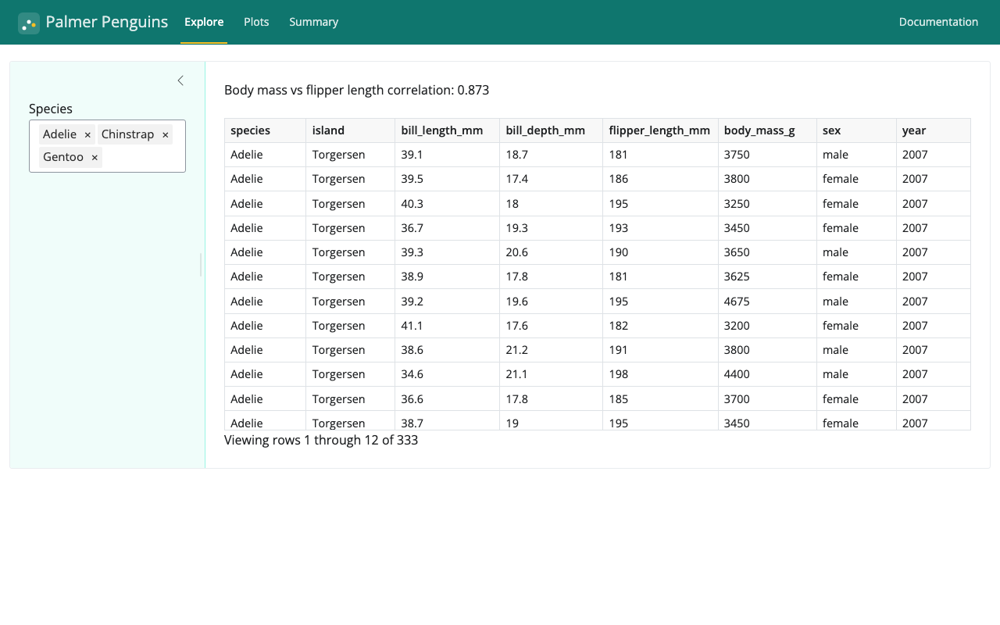

When a Shiny app and its package documentation live as two separate services, you get two URLs to keep in sync and two processes to run.
This post shows how to put both at the same origin: the app at `/` and the API reference at `/docs/`, launched with a single command.

{
  .img-featured
  .img-fluid
  fig-align="center"
  fig-alt=''
  width="600px"
}

The companion repository is [mcanouil/demo-shiny-great-docs](https://github.com/mcanouil/demo-shiny-great-docs).
The package is a small Palmer Penguins analysis module; the pattern is the point, not the subject matter.

## The documentation: great-docs

[great-docs](https://posit-dev.github.io/great-docs/) is Posit's API documentation tool for Python packages.
You point it at a module, give it a small YAML config, and it generates a Quarto-based site from your docstrings.
The result is close to what pkgdown gives you for R: a landing page, an API reference, and whatever extra pages you add.

The config for this project is short.

```{.yaml filename="great-docs.yml"}
parser: numpy

authors:
  - name: Mickaël Canouil
    role: Author

reference:
  - title: Functions
    desc: Utility functions
    contents:
      - body_mass_distribution
      - load_penguins
      - mass_flipper_corr
      - mass_vs_flipper
      - species_counts
      - summarise_by_species
```

`parser: numpy` tells great-docs how to read the docstrings.
The `reference:` block controls which names appear in the generated API page and in what order.

Building the site copies the output into a `docs/` folder the app will serve.

```{.bash filename="scripts/build-docs.sh"}
uv run great-docs build
rm -rf docs
cp -R great-docs/_site docs
```

## The app: Shiny for Python

The `penguin_analysis` module loads the dataset with `polars`, computes summaries, and draws `plotnine` plots.
The Shiny app wraps those functions in an interactive UI.

```{.python filename="app.py"}
app_ui = ui.page_navbar(
    ui.nav_panel(
        "Explore",
        ui.layout_sidebar(
            ui.sidebar(
                ui.input_selectize("species", "Species", choices=_SPECIES,
                                   selected=_SPECIES, multiple=True),
            ),
            ui.output_text("correlation"),
            ui.output_data_frame("table"),
        ),
    ),
    ui.nav_panel("Plots",
        ui.output_plot("scatter"),
        ui.output_plot("distribution"),
    ),
    ui.nav_panel("Summary", ui.output_data_frame("summary")),
    ui.nav_spacer(),
    ui.nav_control(ui.a("Documentation", href="/docs/", target="_blank")),
    title="Palmer Penguins",
)
```

The navbar links to `/docs/` so the user can jump from the app to the reference without leaving the same origin.

{fig-alt="Screenshot of the Palmer Penguins Shiny app. The navbar has a teal background showing the scatter-plot logo mark (glass-effect square with white and amber dots) followed by 'Palmer Penguins' in white and tabs Explore, Plots, Summary. The active Explore tab is underlined in amber. The left sidebar has a light teal background with a Species filter showing Adelie, Chinstrap, and Gentoo selected. The main area shows 'Body mass vs flipper length correlation: 0.873' and a data table."}

## Serving both from one process

Shiny for Python serves static files through its own handler, which matches file paths literally.
That means a URL like `/docs/reference/` returns a 404 because there is no file called `reference` at that path.
What great-docs emits are clean directory links, and those 404 under Shiny's handler.

The fix is to wrap the Shiny app in a Starlette application and mount the `docs/` folder with `StaticFiles(html=True)`.

```{.python filename="app.py"}
from starlette.applications import Starlette
from starlette.routing import Mount
from starlette.staticfiles import StaticFiles

_DOCS_DIR = Path(__file__).parent / "docs"

app = Starlette(
    routes=[
        Mount("/docs", app=StaticFiles(directory=_DOCS_DIR, html=True), name="docs"),  # <1>
        Mount("/", app=shiny_app, name="shiny"),
    ]
)
```

1. `html=True` resolves `/docs/reference/` to `docs/reference/index.html` instead of returning a 404.

::: {.highlight}

**`html=True` is the key detail.**
Without it, Starlette's `StaticFiles` also returns 404 for directory URLs.
With it, any URL that points to a directory resolves to that directory's `index.html`, which is exactly what great-docs generates.

:::

Because Starlette and Shiny both speak ASGI, `shiny run app.py` still works after wrapping.
uvicorn accepts any ASGI application, so the development workflow does not change.

{fig-alt="Screenshot of the great-docs site served at /docs/. The navbar shows the brand logo mark (teal square with scatter dots) and a Reference link. The page hero shows the same logo mark and the title 'penguin-analysis'. The main content shows a heading 'demo-shiny-great-docs', a description of the integration, a 'How the integration works' section explaining the StaticFiles html=True trick, and a code block showing the Starlette routing. The right sidebar shows Links, AI/Agents, Developers (Mickaël Canouil), and Community sections."}

::: {.callout-note}
The `docs/` folder is generated output and is not committed to the repository.
Run `scripts/build-docs.sh` whenever the module changes.
:::

## Quick start

```bash
uv sync --extra app --extra dev
bash scripts/build-docs.sh
uv run shiny run app.py --port 8000
```

Then `http://localhost:8000` is the app and `http://localhost:8000/docs/` is the reference.

Happy coding!
