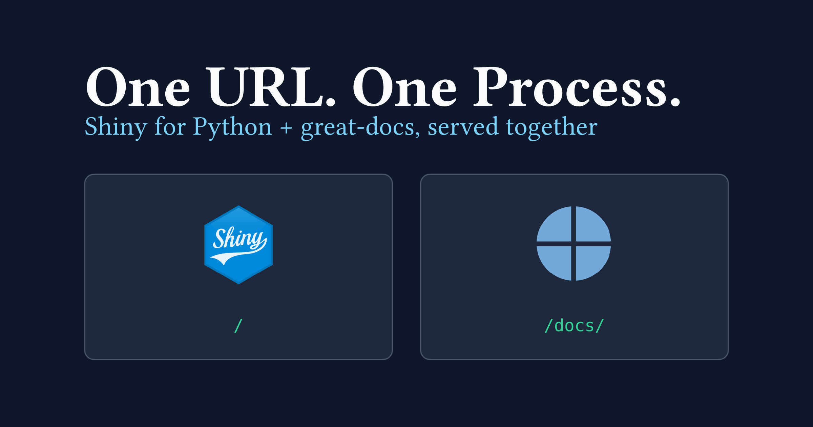

A colleague asked how to embed [great-docs](https://posit-dev.github.io/great-docs/)-generated documentation inside a Shiny for Python app and serve both from a single process.
I built a minimal demo to find out, and shared it a few weeks ago on [ LinkedIn](https://www.linkedin.com/posts/mickaelcanouil_github-mcanouildemo-shiny-great-docs-activity-7471258975955730432-0vI2) and [ Bluesky](https://bsky.app/profile/mickael.canouil.fr/post/3mo4cvjtxf22u), but I thought it deserved a proper write-up, so here it is.

When a Shiny app and its package documentation live as two separate services, you get two URLs to keep in sync and two deployment environments to handle.
This post shows how to put both at the same origin: the app at `/` and the API reference at `/docs/`, so you serve everything from a single process.
The short answer: not that hard, but there is one non-obvious gotcha in how URLs are resolved.

{
  .img-featured
  .img-fluid
  fig-align="center"
  fig-alt=''
  width="600px"
}

The companion repository is [mcanouil/demo-shiny-great-docs](https://github.com/mcanouil/demo-shiny-great-docs).

## The documentation: `great-docs`

[great-docs](https://posit-dev.github.io/great-docs/) is Posit's API documentation tool for Python packages.
You point it at a module, give it a small YAML config, and it generates a Quarto-based site from your docstrings.
The result is close to what [pkgdown](https://pkgdown.r-lib.org/) gives you for R: a landing page, an API reference, and whatever extra pages you add.

The config for this project is short, see the full [great-docs.yml](https://github.com/mcanouil/demo-shiny-great-docs/blob/main/great-docs.yml) in the repository.

```{.yaml filename="great-docs.yml"}
parser: numpy # <1>

authors:
  - name: Mickaël Canouil
    role: Author # <2>

reference:
  - title: Functions
    desc: Utility functions
    contents: # <3>
      - body_mass_distribution
      - load_penguins
      - mass_flipper_corr
      - mass_vs_flipper
      - species_counts
      - summarise_by_species
```

1. Docstring format — `numpy` means NumPy-style sections (`Parameters`, `Returns`, `Examples`). Other options are `google` and `sphinx`.
2. Author metadata appears in the generated site sidebar under Developers.
3. Controls which names appear on the Reference page and in what order.
   The names not listed here are hidden from the public API.

Building the site copies the output into a `docs/` folder the app will serve.

```{.bash filename="scripts/build-docs.sh"}
uv run great-docs build      # <1>
rm -rf docs                  # <2>
cp -R great-docs/_site docs  # <3>
```

1. Runs `great-docs build` inside the project's [`uv`](https://docs.astral.sh/uv/) virtual environment.
2. Removes any stale output before copying fresh files.
3. `great-docs` writes to `great-docs/_site` by default; this renames it to `docs`.

## The app: Shiny for Python

The `penguin_analysis` module loads the dataset with [`polars`](https://pola.rs/), computes summaries, and draws [`plotnine`](https://plotnine.org/) plots.
The Shiny app wraps those functions in an interactive UI.

```{.python filename="app.py"}
app_ui = ui.page_navbar(
    ui.nav_panel(
        "Explore",
        ui.layout_sidebar(
            ui.sidebar(
                ui.input_selectize("species", "Species",
                                   choices=_SPECIES,
                                   selected=_SPECIES,
                                   multiple=True), # <1>
            ),
            ui.output_text("correlation"),
            ui.output_data_frame("table"),
        ),
    ),
    ui.nav_panel("Plots",
        ui.output_plot("scatter"),
        ui.output_plot("distribution"),
    ),
    ui.nav_panel("Summary", ui.output_data_frame("summary")),
    ui.nav_spacer(), # <2>
    ui.nav_control(ui.a("Documentation", href="/docs/", target="_blank")), # <3>
    title="Palmer Penguins",
)
```

1. `multiple=True` lets the user select several species at once; all three are pre-selected so the app is useful immediately on load.
2. Pushes items that follow it to the right end of the navbar.
3. Injects a plain HTML link into the navbar.
   Here, `href="/docs/"` works because both routes share the same origin, so no absolute URL is needed.

The navbar links to `/docs/` so the user can jump from the app to the reference without leaving the same origin.

{
  fig-alt="Screenshot of the Palmer Penguins Shiny app. The navbar has a teal background showing the scatter-plot logo mark (glass-effect square with white and amber dots) followed by 'Palmer Penguins' in white and tabs Explore, Plots, Summary. The active Explore tab is underlined in amber. The left sidebar has a light teal background with a Species filter showing Adelie, Chinstrap, and Gentoo selected. The main area shows 'Body mass vs flipper length correlation: 0.873' and a data table."
  .hero-art
}

## Serving both from one process

Shiny for Python serves static files through its own handler, which matches file paths literally.
That means a URL like `/docs/reference/` returns a 404 because there is no file called `reference` at that path.
What `great-docs` emits are clean directory links, and those 404 under Shiny's handler.

The fix is to wrap the Shiny app in a [Starlette](https://www.starlette.io/) application and mount the `docs/` folder with `StaticFiles(html=True)`.

```{.python filename="app.py"}
from starlette.applications import Starlette
from starlette.routing import Mount
from starlette.staticfiles import StaticFiles

_DOCS_DIR = Path(__file__).parent / "docs"  # <1>

app = Starlette(
    routes=[
        Mount("/docs", app=StaticFiles(directory=_DOCS_DIR, html=True), name="docs"),  # <2>
        Mount("/", app=shiny_app, name="shiny"),  # <3>
    ]
)
```

1. Resolves the `docs/` path relative to `app.py`, not the working directory, so the app starts correctly regardless of where `shiny run` is called from.
2. `html=True` resolves `/docs/reference/` to `docs/reference/index.html` instead of returning a 404.
3. The Shiny app is mounted last.
   Starlette tries routes in order, so the more-specific `/docs` prefix always wins before the catch-all `/`.

::: {.highlight}

**`html=True` is the key detail.**
Without it, Starlette's `StaticFiles` also returns 404 for directory URLs.
With it, any URL that points to a directory resolves to that directory's `index.html`, which is exactly what `great-docs` generates.

:::

Because Starlette and Shiny both speak [ASGI](https://asgi.readthedocs.io/en/latest/), `shiny run app.py` still works after wrapping.

{
  fig-alt="Screenshot of the great-docs site served at /docs/. The navbar shows the brand logo mark (teal square with scatter dots) and a Reference link. The page hero shows the same logo mark and the title 'penguin-analysis'. The main content shows a heading 'demo-shiny-great-docs', a description of the integration, a 'How the integration works' section explaining the StaticFiles html=True trick, and a code block showing the Starlette routing. The right sidebar shows Links, AI/Agents, Developers (Mickaël Canouil), and Community sections."
  .hero-art
}

::: {.callout-note}
The `docs/` folder is generated output and is not committed to the repository.
Run `scripts/build-docs.sh` whenever the module changes.
:::

## Quick start

```bash
uv sync --extra app --extra dev
bash scripts/build-docs.sh
uv run shiny run app.py --port 8000
```

Then `http://localhost:8000` is the app and `http://localhost:8000/docs/` is the documentation.

Happy coding!
