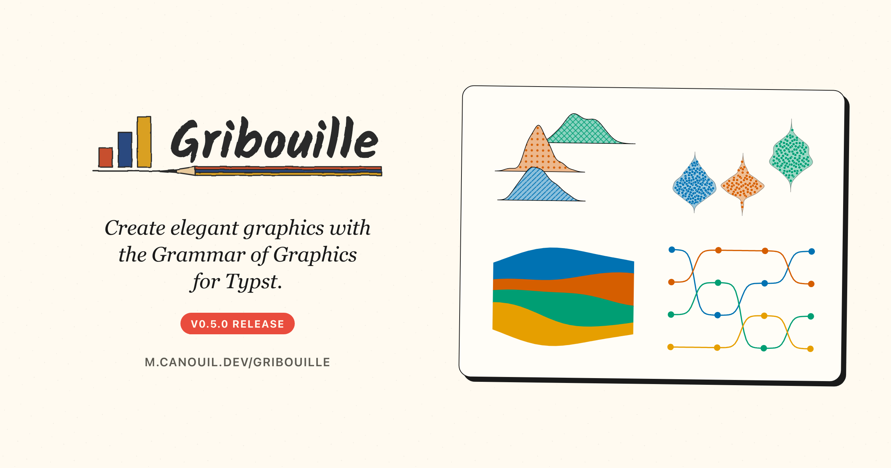

::: {.callout-note}
[Gribouille 0.5.0 is awaiting approval on Typst Universe](https://github.com/typst/packages).
Once it is approved and merged, this post will show and compile the figures correctly.
:::

Another [Gribouille](https://github.com/mcanouil/gribouille) release.
Gribouille 0.5.0 is all about density but not just that.
Kernel density estimation runs natively now, in pure Typst, so densities, violins, two-dimensional densities, and ridgeline plots all draw without leaving the document.
The LOESS smoother lands in the same pass.
In addition to density, the one thing to watch when you upgrade is the scale system: the per-aesthetic `scale-*` constructors collapse into a single keyed `scales()`, so `scale-colour-viridis-d()` becomes `scales(colour: scale-viridis-d())`.

{
  .img-featured
  .img-fluid
  fig-align="center"
  fig-alt=''
  width="600px"
}

::: {.callout-note}

## At a glance

- [Gribouille](https://github.com/mcanouil/gribouille) 0.5.0 on Typst Universe: `#import "@preview/gribouille:0.5.0": *`.
- [`geom-density()`](https://m.canouil.dev/gribouille/reference/geoms/geom-density.html) and [`geom-violin()`](https://m.canouil.dev/gribouille/reference/geoms/geom-violin.html) draw native Gaussian kernel densities, with `bw`, `adjust`, and `trim` control.
- [`geom-density-2d()`](https://m.canouil.dev/gribouille/reference/geoms/geom-density-2d.html) and `geom-density-2d-filled()` trace or shade a two-dimensional density; [`geom-density-ridges()`](https://m.canouil.dev/gribouille/reference/geoms/geom-density-ridges.html) stacks one ridge per group.
- [`geom-smooth()`](https://m.canouil.dev/gribouille/reference/geoms/geom-smooth.html) gains `method: "loess"` with `span` and `degree` control, next to the existing `"lm"`.
- [`geom-beeswarm()`](https://m.canouil.dev/gribouille/reference/geoms/geom-beeswarm.html) lays overplotted points into a deterministic swarm, and `stat-difference` shades the band between two series by which one is on top.
- Streamgraphs (`position-stack(offset:)`), bump charts (`stat-connect(connection: "sigmoid")`), and waffle charts (`stat-waffle`) join the chart types.
- Fills accept native Typst `tiling` patterns, both as a fixed `fill:` and through `scale-manual(values:)`.
-  **Breaking:** the per-aesthetic `scale-*` constructors collapse into a keyed `scales()`; the aesthetic comes from the key, so `scale-colour-viridis-d()` becomes `scales(colour: scale-viridis-d())` and `scale-x-log10()` becomes `scales(x: scale-log10())`. `plot(scales:)` now takes only the `scales()` dictionary.
-  **Breaking:** `linetype` defaults to `auto` on the line-drawing geoms, honouring a mapped linetype scale instead of pinning `"solid"`.

:::

Every figure in this post is a real, freshly compiled plot.

##  Breaking changes {#breaking-changes}

Two changes need your attention before your old code compiles.
Neither changes what a plot looks like, only how you spell the scales.

::: {.callout-warning}

## Migrate these names

- The per-aesthetic `scale-*` constructors are gone. Wrap the aesthetic-agnostic constructor in `scales()` and let the key carry the aesthetic: `scale-colour-viridis-d()` becomes `scales(colour: scale-viridis-d())`, and `scale-x-log10()` becomes `scales(x: scale-log10())`. `plot(scales:)` takes only the `scales()` dictionary, no positional array, and `expand-limits()` returns an aesthetic-keyed dictionary.
- `linetype` now defaults to `auto` on `geom-segment`, `geom-curve`, `geom-spoke`, `geom-errorbar`, `geom-errorbarh`, `geom-linerange`, and `geom-pointrange`. A mapped linetype scale is honoured instead of being overridden by a pinned `"solid"`. Pass `linetype: "solid"` on the geom if you want the old fixed look.

:::

There is one more change, but it is internal.
Every constructor dictionary now stores its concrete type under a single `name:` key.
This only matters if you pattern-match the dictionaries a constructor returns; the way you call them in a plot is unchanged.

## A keyed `scales()`

The old scale names spelled the aesthetic into the function: `scale-colour-viridis-d`, `scale-x-log10`, `scale-fill-manual`.
That meant one constructor per aesthetic, and a long list of near-duplicates.
Now there is one aesthetic-agnostic set, and the aesthetic comes from the key you bind it to inside `scales()`, exactly like [`guides()`](https://m.canouil.dev/gribouille/reference/guides/guides.html).

```{typst}
//| echo: true
//| align: center
//| output-filename: "keyed-scales.svg"
//| alt: "Penguin scatter of body mass against flipper length, points coloured by species on a colour-blind-friendly palette, with the y-axis on a base-10 log scale."
#plot(
  data: penguins,
  mapping: aes(x: "flipper-len", y: "body-mass", fill: "species"),
  layers: (geom-point(
    size: 2pt,
    alpha: 0.8,
    stroke: 1pt,
    colour: rgb("#fafafa")
  ),),
  scales: scales(                                     // <1>
    y: scale-log10(breaks: (3000, 4000, 5000, 6000)), // <2>
    fill: scale-okabe-ito(),                          // <3>
  ),
  labels: labels(
    title: "One scales(), Keyed by Aesthetic",
    x: "Flipper Length (mm)",
    y: "Body Mass (g)",
    fill: "Species",
  ),
  theme: theme-minimal(),
  width: 12cm,
  height: 8cm,
)
```

1. `scales()` is keyed by aesthetic and named only. A stray positional argument is rejected.
2. `scale-x-log10()` is now `scale-log10()` under the `y` key. The same constructor serves the `x` axis.
3. `scale-colour-okabe-ito()` is now `scale-okabe-ito()` under the `colour` key. Use it under `fill` for a fill scale.

`scales()` is more than a tidy wrapper.
You could hand `plot()` a plain named dictionary, `(colour: scale-okabe-ito())`, and it would look the same.
The difference is that `scales()` checks every entry as it binds it, before the plot draws.
A positional argument, an aesthetic key that does not exist, or a value that is not a scale spec each stops with a clear message that lists the valid names.
A plain dictionary would keep a misspelled key like `colur:` and quietly drop the scale, so the plot would render with the wrong colours and no error to point at.
An unknown argument to a `scale-*` constructor is caught at the same moment, reported with the keys that scale accepts for that aesthetic.

::: {.highlight}

**A dictionary swallows a typo; `scales()` rejects it:** a wrong aesthetic key or a non-scale value fails loudly instead of drawing a misleading plot.

:::

## Native density

Density estimation is the heart of this release.
[`geom-density()`](https://m.canouil.dev/gribouille/reference/geoms/geom-density.html) evaluates a Gaussian kernel on a grid and draws the smooth curve, all in Typst, with no external runtime.
The bandwidth is chosen by Silverman's rule and tuned with `adjust`; `trim` cuts the curve to the data range.

```{typst}
//| echo: true
//| align: center
//| output-filename: "density.svg"
//| alt: "Three overlapping filled density curves of penguin flipper length, one per species, on a minimal theme with a species legend on the right."
#plot(
  data: penguins,
  mapping: aes(x: "flipper-len", fill: "species"),
  layers: (
    geom-density(alpha: 0.5, adjust: 1),              // <1>
  ),
  scales: scales(fill: scale-okabe-ito()),
  labels: labels(
    title: "Flipper Length, One Density per Species",
    x: "Flipper Length (mm)",
    y: "Density",
    fill: "Species",
  ),
  theme: theme-minimal(),
  width: 12cm,
  height: 7cm,
)
```

1. `adjust` scales the automatic bandwidth; `bw` pins it outright, and `trim: true` clips the curve to the observed range. Map `aes(weight: ...)` for a weighted density.

The stat exposes the usual after-stat columns, `_density`, `_count`, `_scaled`, and `_n`, so you can map `y` to a count instead of a density when that reads better.

## Violins and beeswarms

A violin is the same density, mirrored and turned on its side.
[`geom-violin()`](https://m.canouil.dev/gribouille/reference/geoms/geom-violin.html) draws one silhouette per group, normalised by `scale`.
[`geom-beeswarm()`](https://m.canouil.dev/gribouille/reference/geoms/geom-beeswarm.html) spreads the raw points into a deterministic, density-shaped swarm, a reproducible alternative to jitter.
Layer the swarm over the violin and every penguin sits inside its own silhouette.

```{typst}
//| echo: true
//| align: center
//| output-filename: "violin.svg"
//| alt: "Three violin silhouettes of penguin body mass, one per species, each holding a beeswarm of the individual penguins as filled circles with a thin white-ish outline, spread sideways by local density, on a minimal theme."
#plot(
  data: penguins,
  mapping: aes(x: "species", y: "body-mass", fill: "species"),
  layers: (
    geom-violin(scale: "width", trim: false, alpha: 0.4),   // <1>
    geom-beeswarm(                                          // <2>
      size: 2pt,
      colour: rgb("#fafafa"),
      stroke: 0.4pt,
      alpha: 0.95,
    ),
  ),
  scales: scales(fill: scale-okabe-ito()),
  labels: labels(
    title: "Every Penguin in Its Violin",
    x: "Species",
    y: "Body Mass (g)",
    fill: "Species",
  ),
  guides: guides(fill: none),
  theme: theme-minimal(),
  width: 12cm,
  height: 8cm,
)
```

1. `scale: "width"` gives every violin the same maximum width; `"area"` (the default) equalises area, and `"count"` scales width by the group size. Overlapping groups dodge with `position: "dodge"`.
2. The swarm spreads the points on the discrete axis directly, no `as-factor` needed; `position-beeswarm(width:, adjust:)` tunes the spread.

## Two dimensions at once

For a scatter that is too dense to read, a two-dimensional density shows where the mass sits.
`geom-density-2d-filled()` shades filled iso-bands of the joint density; [`geom-density-2d()`](https://m.canouil.dev/gribouille/reference/geoms/geom-density-2d.html) draws the iso-lines instead.

```{typst}
//| echo: true
//| align: center
//| output-filename: "density-2d.svg"
//| alt: "A two-dimensional density of penguin body mass against flipper length drawn as filled contour bands, from pale low-density to deep blue-green high-density, with two clusters along the flipper-length to body-mass diagonal."
#plot(
  data: penguins,
  mapping: aes(x: "flipper-len", y: "body-mass"),
  layers: (
    geom-density-2d-filled(),                          // <1>
  ),
  scales: scales(
    x: scale-continuous(expand: (0%, 0%)),
    y: scale-continuous(expand: (0%, 0%)),
    fill: scale-fermenter(palette: "YlGnBu")
  ),
  labels: labels(
    title: "Where the Penguins Cluster",
    x: "Flipper Length (mm)",
    y: "Body Mass (g)",
  ),
  guides: guides(fill: none),
  theme: theme-minimal(),
  width: 12cm,
  height: 8cm,
)
```

1. `bw` sets the per-axis bandwidth (a number or an `(x, y)` pair) and `n` the grid resolution. Map `fill: after-stat("_level")` on `geom-density-2d()` to shade the lines by level.

## Ridgelines

When a plain overlap gets crowded, a ridgeline offsets each density up the panel.
[`geom-density-ridges()`](https://m.canouil.dev/gribouille/reference/geoms/geom-density-ridges.html) draws one ridge per `y` level, with heights normalised across levels so they compare fairly.

```{typst}
//| echo: true
//| align: center
//| output-filename: "ridges.svg"
//| alt: "Three stacked ridgeline densities of penguin body mass, one per species climbing up the panel, each filled by species on a minimal theme."
#plot(
  data: penguins,
  mapping: aes(x: "body-mass", y: "species", fill: "species"),
  layers: (
    geom-density-ridges(scale: 1.5, alpha: 0.85),      // <1>
  ),
  scales: scales(
    y: scale-discrete(expand: (auto, 55%)),            // <2>
    fill: scale-okabe-ito(),
  ),
  labels: labels(
    title: "Body Mass, Ridge by Ridge",
    x: "Body Mass (g)",
    y: "Species",
    fill: "Species",
  ),
  guides: guides(fill: none),
  theme: theme-minimal(),
  width: 12cm,
  height: 8cm,
)
```

1. `scale` is measured in y-level units: `1` lets a ridge just reach the next baseline, and a larger value lets them overlap. The stat supplies the `height` channel the geom draws from, so keep the default stat.
2. The discrete y-scale needs a little headroom on top so the tallest ridge is not clipped.

## A LOESS smoother

Until now, fitted straight lines were the only smoothers [`geom-smooth()`](https://m.canouil.dev/gribouille/reference/geoms/geom-smooth.html) could draw (`method: "lm"`).
Now `geom-smooth()` also takes `method: "loess"`, a local polynomial fit with a pointwise confidence band.

```{typst}
//| echo: true
//| align: center
//| output-filename: "loess.svg"
//| alt: "Penguin scatter of body mass against flipper length with a curved LOESS trend line and a shaded confidence band following the bend in the data."
#plot(
  data: penguins,
  mapping: aes(x: "flipper-len", y: "body-mass"),
  layers: (
    geom-point(size: 2pt, alpha: 0.5),
    geom-smooth(method: "loess", span: 0.75, degree: 2),  // <1>
  ),
  labels: labels(
    title: "A Local Fit, Not a Straight Line",
    x: "Flipper Length (mm)",
    y: "Body Mass (g)",
  ),
  theme: theme-minimal(),
  width: 12cm,
  height: 8cm,
)
```

1. `span` sets the fraction of points in each local window, and `degree` the local polynomial order (`0`, `1`, or `2`). The default `method: "lm"` still draws the straight-line fit.

## Difference bands

`stat-difference` shades the band between two series by which one is on top.
Feed it `ymin` and `ymax`, map `fill: after-stat("_sign")`, and it splits the ribbon at every crossover, filling the gap in the colour of whichever line leads.

```{typst}
//| echo: true
//| align: center
//| output-filename: "difference.svg"
//| alt: "Two wavy series over twelve weeks, one a solid line and one dashed, with the band between them shaded blue where the first leads and orange where the second leads; the colour flips at each crossover."
#let d = range(0, 25).map(i => {
  let x = i / 2
  (x: x, a: 10 + 4 * calc.sin(x * 0.7), b: 10 + 3.2 * calc.cos(x * 0.55))
})

#plot(
  data: d,
  mapping: aes(x: "x", ymin: "a", ymax: "b", fill: after-stat("_sign")),  // <1>
  layers: (
    geom-ribbon(
      stat: stat-difference(levels: ("A leads", "B leads")),  // <2>
      alpha: 0.5,
      stroke: none,
    ),
    geom-line(mapping: aes(y: "a"), linewidth: 1pt),
    geom-line(mapping: aes(y: "b"), linewidth: 1pt, linetype: "dashed"),
  ),
  scales: scales(fill: scale-manual(values: (rgb("#0072B2"), rgb("#D55E00")))),
  labels: labels(title: "Which Series Is on Top", x: "Week", y: "Value", fill: none),
  theme: theme-minimal(),
  width: 12cm,
  height: 7cm,
)
```

1. The two series enter as `ymin` and `ymax`; `fill: after-stat("_sign")` colours each run by which one is higher.
2. `levels:` names the two states, and exact crossovers are inserted as shared vertices so the bands meet cleanly.

## Pattern fills

A `fill` no longer has to be a flat colour.
When colour/fill is not enough or is too much, a pattern can carry the information instead which helps improve accessibility and printability.
Fills now accept native Typst `tiling` patterns, both as a fixed `fill:` and through `scale-manual(values:)`, and the legend swatches draw the patterns too.
This is what keeps a bar chart readable once it is printed in black and white.

```{typst}
//| echo: true
//| align: center
//| output-filename: "patterns.svg"
//| alt: "A bar chart of penguin counts per species, each bar filled with a different Typst tiling pattern, diagonal stripes, dots, and cross-hatch, with a legend whose swatches show the same patterns."
#let cb = (rgb("#0072B2"), rgb("#D55E00"), rgb("#009E73"))

#let stripes = tiling(size: (6pt, 6pt))[            // <1>
  #place(rect(width: 100%, height: 100%, fill: cb.at(0).lighten(60%)))
  #place(line(start: (0%, 100%), end: (100%, 0%), stroke: 1pt + cb.at(0)))
]
#let dots = tiling(size: (7pt, 7pt))[
  #place(rect(width: 100%, height: 100%, fill: cb.at(1).lighten(60%)))
  #place(dx: 2pt, dy: 2pt, circle(radius: 1.5pt, fill: cb.at(1)))
]
#let cross = tiling(size: (7pt, 7pt))[
  #place(rect(width: 100%, height: 100%, fill: cb.at(2).lighten(60%)))
  #place(line(start: (0%, 100%), end: (100%, 0%), stroke: 0.8pt + cb.at(2)))
  #place(line(start: (0%, 0%), end: (100%, 100%), stroke: 0.8pt + cb.at(2)))
]

#plot(
  data: penguins,
  mapping: aes(x: "species", fill: "species"),
  layers: (geom-bar(),),
  scales: scales(fill: scale-manual(values: (stripes, dots, cross))),  // <2>
  labels: labels(
    title: "Bars You Can Read in Greyscale",
    x: "Species",
    y: "Count",
    fill: "Species",
  ),
  theme: theme-minimal(),
  width: 12cm,
  height: 7cm,
)
```

1. Each pattern is a plain Typst `tiling`: a full-tile background box, then the marks on top. A tiling works anywhere a colour does.
2. `scale-manual` binds one pattern per level. The legend swatches render the patterns, not flat colours.

## New chart types

A few new stats and positions turn familiar geoms into charts they could not draw before.

### Streamgraphs

`position-stack` gains a streamgraph baseline.
Pass `offset: "silhouette"` to centre each stack on zero, or `offset: "wiggle"` for the Byron-Wattenberg baseline, and a stacked [`geom-area()`](https://m.canouil.dev/gribouille/reference/geoms/geom-area.html) becomes a streamgraph.

```{typst}
//| echo: true
//| align: center
//| output-filename: "stream.svg"
//| alt: "A four-series streamgraph, each band flowing left to right and centred on a common baseline so the stack swells and narrows over time, every band filled with its own Typst tiling pattern (stripes, dots, cross-hatch, and horizontal lines)."
#let cb = (rgb("#0072B2"), rgb("#D55E00"), rgb("#009E73"), rgb("#E69F00"))

#let pat(i, body) = tiling(size: (7pt, 7pt))[            // <1>
  #place(rect(width: 100%, height: 100%, fill: cb.at(i).lighten(55%)))
  #body
]
#let stripes = pat(0)[#place(line(start: (0%, 100%), end: (100%, 0%), stroke: 1pt + cb.at(0)))]
#let dots = pat(1)[#place(dx: 2pt, dy: 2pt, circle(radius: 1.4pt, fill: cb.at(1)))]
#let cross = pat(2)[
  #place(line(start: (0%, 100%), end: (100%, 0%), stroke: 0.8pt + cb.at(2)))
  #place(line(start: (0%, 0%), end: (100%, 100%), stroke: 0.8pt + cb.at(2)))
]
#let hlines = pat(3)[#place(line(start: (0%, 50%), end: (100%, 50%), stroke: 1pt + cb.at(3)))]

#let series = ()
#for g in ("A", "B", "C", "D") {
  let peak = (A: 8, B: 20, C: 12, D: 4).at(g)
  for x in range(0, 21) {
    series.push((
      x: x,
      y: 2 + 4 * calc.exp(-0.02 * calc.pow(x - peak, 2)),
      grp: g,
    ))
  }
}

#plot(
  data: series,
  mapping: aes(x: "x", y: "y", fill: "grp"),
  layers: (
    geom-area(position: position-stack(offset: "silhouette"), stroke: 0.5pt),  // <2>
  ),
  scales: scales(fill: scale-manual(values: (stripes, dots, cross, hlines))),
  labels: labels(title: "A Streamgraph", x: "Time", y: none, fill: "Series"),
  guides: guides(y: none),
  theme: theme-minimal(),
  width: 12cm,
  height: 7cm,
)
```

1. Each band gets its own `tiling` pattern, so the streamgraph stays legible without relying on colour alone.
2. `offset: "wiggle"` gives the classic streamgraph baseline instead; `"none"` (the default) stacks from zero as before.

#### Bump charts

`stat-connect` gains a `"sigmoid"` connector.
Paired with [`geom-line()`](https://m.canouil.dev/gribouille/reference/geoms/geom-line.html) and a reversed y-scale, it draws a bump chart, one smooth S-curve between each pair of ranks.

```{typst}
//| echo: true
//| align: center
//| output-filename: "bump.svg"
//| alt: "A bump chart of four teams over four rounds, each team a coloured line that eases up and down between integer ranks with a filled circle at every round; rank 1 is at the top."
#let cb = (
  rgb("#0072B2"),
  rgb("#D55E00"),
  rgb("#009E73"),
  rgb("#E69F00"),
)

#let standings = (
  (t: 1, rank: 1, team: "A"), (t: 2, rank: 3, team: "A"),
  (t: 3, rank: 2, team: "A"), (t: 4, rank: 1, team: "A"),
  (t: 1, rank: 2, team: "B"), (t: 2, rank: 1, team: "B"),
  (t: 3, rank: 1, team: "B"), (t: 4, rank: 2, team: "B"),
  (t: 1, rank: 3, team: "C"), (t: 2, rank: 2, team: "C"),
  (t: 3, rank: 4, team: "C"), (t: 4, rank: 3, team: "C"),
  (t: 1, rank: 4, team: "D"), (t: 2, rank: 4, team: "D"),
  (t: 3, rank: 3, team: "D"), (t: 4, rank: 4, team: "D"),
)

#plot(
  data: standings,
  mapping: aes(x: "t", y: "rank", colour: "team", fill: "team"),
  layers: (
    geom-line(stat: stat-connect(connection: "sigmoid"), linewidth: 1.5pt),  // <1>
    geom-point(size: 5pt, stroke: none),                  // <2>
  ),
  scales: scales(
    x: scale-continuous(breaks: (1, 2, 3, 4)),
    y: scale-reverse(breaks: (1, 2, 3, 4)),               // <3>
    colour: scale-manual(values: cb),
    fill: scale-manual(values: cb),
  ),
  labels: labels(title: "A Bump Chart", x: "Round", y: "Rank", colour: "Team", fill: "Team"),
  guides: guides(fill: none),
  theme: theme-minimal(),
  width: 12cm,
  height: 7cm,
)
```

1. `stat-connect(connection: "sigmoid")` eases each line between its ranks; `smooth` sets how sharp the transition is.
2. Mapping `fill` and setting `stroke: none` draws filled circles; `fill` paints the marker body, `colour` its outline.
3. A reversed y-scale puts rank 1 at the top.

#### Waffle charts

`stat-waffle` turns per-group counts into unit cells on a grid.
Map `fill` to the group and draw with [`geom-tile()`](https://m.canouil.dev/gribouille/reference/geoms/geom-tile.html); each square is one observation.

```{typst}
//| echo: true
//| align: center
//| output-filename: "waffle.svg"
//| alt: "A waffle chart of the penguins dataset, one square per bird laid on a grid and coloured by species, the three species filling consecutive runs of cells."
#let cb = (
  rgb("#0072B2"),
  rgb("#D55E00"),
  rgb("#009E73"),
)

#plot(
  data: penguins,
  mapping: aes(fill: "species"),
  layers: (
    geom-tile(                                          // <1>
      stat: stat-waffle(rows: 12),
      width: 0.85,
      height: 0.85,
      stroke: 1pt + rgb("#fafafa"),
    ),
  ),
  scales: scales(
    fill: scale-manual(values: cb)
  ),
  labels: labels(title: "Penguins as a Waffle", x: none, y: none, fill: "Species"),
  guides: guides(x: none, y: none),
  theme: theme-void(),
  width: 12cm,
  height: 7cm,
)
```

1. `rows` sets the grid height in cells and columns grow to hold the total; the page-coloured stroke keeps the cells apart. Map `weight` instead when the data is already counted, one row per group.

## Agents and plugins

Gribouille ships an installable agent skill that teaches a coding assistant to write correct plots, checking every argument against the documentation.
It installs with:

```bash
npx skills add mcanouil/gribouille
```

The repository doubles as a Claude Code plugin marketplace, so you can wire the same skill into Claude Code:

```bash
/plugin marketplace add mcanouil/gribouille
/plugin install gribouille@gribouille
```

## Under the hood

As always, a good share of the release is fixes rather than features.

::: {.highlight}

**Errors fail loudly now:** an unknown aesthetic, theme key, stat, or column stops with a clear message instead of a misleading plot.

:::

The biggest is stricter validation.
An unknown `aes()` channel, such as the US spelling `color`, now fails with the list of valid channels instead of drawing an empty plot.
`theme()` rejects a misspelled element key, an unknown `stat` or scale `transform` fails with a clear message rather than rendering as identity, and mapping an aesthetic to a missing column names the column and lists the ones that exist.

Two rendering fixes are worth calling out.
Abutting opaque fills, such as tiles, hexes, and stacked bars, are now stroked with their own fill colour, which removes the hairline seams that antialiasing used to bleed through between them.
And `stat-quantile` drops its cubic pair enumeration for an exact `O(n^2 log n)` search, so `geom-quantile` scales to thousands of rows.

Facets and compositions also gain spacing control.
`facet-wrap` and `facet-grid` take a `gutter` argument, and a new `theme(panel-spacing:)` default sets the gap for both axes at once (a length, or a `(x:, y:)` dictionary); `compose`'s `gutter` now accepts the same dictionary form.

## Wrap-up

::: {.highlight}

**Kernel density estimation, in pure Typst, plus one keyed `scales()` in place of a constructor per aesthetic.**

:::

Next on the list is more geoms and more worked examples.
If you run into something unexpected, the issue tracker is the right place for it.

- Gribouille
  - Repository: <https://github.com/mcanouil/gribouille>.
  - Documentation: <https://m.canouil.dev/gribouille>.
  - Typst Universe: <https://typst.app/universe/package/gribouille>.
- Typst Render
  - Repository: <https://github.com/mcanouil/quarto-typst-render>.
  - Documentation: <https://m.canouil.dev/quarto-typst-render>.

::: {.callout-tip}

## A note on contributions

Gribouille is an unfunded spare-time project, and the API is still settling.
Bug reports and ideas are very welcome on the issue tracker.
Pull requests are not being accepted for now, for the reasons set out in the [launch post](../2026-05-20-gribouille-grammar-of-graphics-for-typst/index.qmd).
Thanks in advance for your patience.

:::
