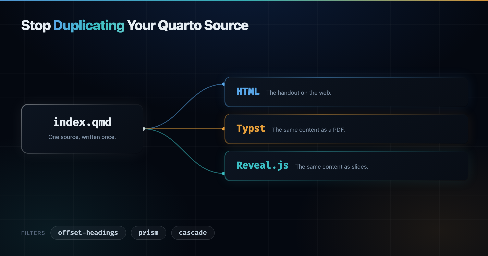

One Quarto source can produce a web page, a PDF, and a slide deck.
The trouble starts when the three outputs need slightly different things, and the usual fix is to write the same content twice.

{
  .img-featured
  .img-fluid
  fig-align="center"
  fig-alt=''
  width="600px"
}

## The Problem

I write training material as one `index.qmd` per module.
Each module produces a handout, an exercise booklet, and a slide deck, in HTML, in PDF through Typst, and in reveal.js.
The prose is the same in all of them, so the source has to be the same too.

Three things get in the way.

First, heading levels do not mean the same thing in each format.
A `##` is a section in the handout and a slide in the deck, and Typst shifts the levels on its own when the document has no level-1 heading.

Then, some attributes only make sense in one format.
A table that fits the page is too tall on a slide, so it needs a smaller font there and nowhere else.

Finally, a slide break has no meaning outside the deck.
A `---` splits a slide in reveal.js, but the continuation slide loses its heading, and the rule itself has nothing to do in the HTML or the PDF.

The usual answer is `content-visible when-format="..."`, which means writing the block once per format.
That is exactly the duplication I wanted to avoid.

::: {.callout-note}

## Three filters

- [`offset-headings`](https://github.com/mcanouil/quarto-offset-headings) (0.4.0) shifts heading levels, per document or per heading.
- [`prism`](https://github.com/mcanouil/quarto-prism) (0.4.1) attaches an attribute to one format only.
- [`cascade`](https://github.com/mcanouil/quarto-revealjs-cascade) (1.0.0) repeats the heading chain after a `---` slide break.

:::

## Installing Them

I manage my extensions with  [Quarto Wizard](https://github.com/mcanouil/quarto-wizard), an extension for Visual Studio Code, Positron, and VSCodium.
It browses the [Quarto Extensions](https://m.canouil.dev/quarto-extensions/) listing, installs an extension into your project, and tells you when one you already have has a newer release.
That last part is why I recommend it over the command line: `quarto add` installs an extension, but nothing then keeps track of what you have and what has moved on.

The buttons below open your editor and ask Quarto Wizard to install the extension into the current project.

:::: {.qw-install}

::: {.qw-item}

`offset-headings`
[[Visual Studio Code](vscode://mcanouil.quarto-wizard/install?repo=mcanouil/quarto-offset-headings){.btn .btn-outline-primary}
[Positron](positron://mcanouil.quarto-wizard/install?repo=mcanouil/quarto-offset-headings){.btn .btn-outline-primary}
[VSCodium](vscodium://mcanouil.quarto-wizard/install?repo=mcanouil/quarto-offset-headings){.btn .btn-outline-primary}]{.btn-group .btn-group-sm role="group" aria-label="Install offset-headings with Quarto Wizard"}

:::

::: {.qw-item}

`prism`
[[Visual Studio Code](vscode://mcanouil.quarto-wizard/install?repo=mcanouil/quarto-prism){.btn .btn-outline-primary}
[Positron](positron://mcanouil.quarto-wizard/install?repo=mcanouil/quarto-prism){.btn .btn-outline-primary}
[VSCodium](vscodium://mcanouil.quarto-wizard/install?repo=mcanouil/quarto-prism){.btn .btn-outline-primary}]{.btn-group .btn-group-sm role="group" aria-label="Install prism with Quarto Wizard"}

:::

::: {.qw-item}

`cascade`
[[Visual Studio Code](vscode://mcanouil.quarto-wizard/install?repo=mcanouil/quarto-revealjs-cascade){.btn .btn-outline-primary}
[Positron](positron://mcanouil.quarto-wizard/install?repo=mcanouil/quarto-revealjs-cascade){.btn .btn-outline-primary}
[VSCodium](vscodium://mcanouil.quarto-wizard/install?repo=mcanouil/quarto-revealjs-cascade){.btn .btn-outline-primary}]{.btn-group .btn-group-sm role="group" aria-label="Install cascade with Quarto Wizard"}

:::

::::

The same three extensions from the command line, if you prefer it:

```bash
quarto add mcanouil/quarto-offset-headings
quarto add mcanouil/quarto-prism
quarto add mcanouil/quarto-revealjs-cascade
```

Each section below then shows the `filters:` entry that turns the extension on.

## Heading Levels

Pandoc already has `shift-heading-level-by`, and Quarto exposes it.
But it runs as a final pass, after every Lua filter has finished.
No filter can see the shifted levels, and the value applies to the whole document, so you cannot move a single heading.

`offset-headings` does the same job as a filter instead.

```yaml
filters:
  - offset-headings
```

You can shift every heading at once:

```yaml
extensions:
  offset-headings:
    by: 1
```

Or one heading, with an attribute:

```markdown
## Section {offset-headings-by="-1"}
```

The offset flows down to the nested headings by default, so a whole branch moves together.
`offset-headings-depth` bounds how far it flows, `offset-headings-max-level` caps the level it can reach, and `offset-headings-recursive="false"` keeps the offset on the attributed heading alone.
The document offset and the per-heading offset always add up, and the result is clamped to `[1, 6]`.

::: {.callout-important}

Quarto sets `shift-heading-level-by: -1` on its own when a document has no level-1 heading: always for Typst, and for PDF when `number-sections` is on and `top-level-division` is not set.
That pass lands after the filter, so your Typst headings end up one level shallower than in HTML, and anything left at level 1 is destroyed.
A Lua filter cannot read or cancel it, so set it explicitly instead:

```yaml
shift-heading-level-by: 0
```

Quarto skips its automatic shift as soon as the key is set, whatever the value.
The filter cannot tell that you have done it, so silence its warning with `quarto-shift-warning: false`.

:::

## Format-Specific Attributes

`prism` reads attributes keyed by format, and keeps the ones that match the format being rendered.

```yaml
filters:
  - prism
```

Each key is written `format:name="value"`.
When the format matches, the attribute is re-emitted as `name="value"`; otherwise it is dropped.
Classes and identifiers are left alone, and unprefixed attributes pass through.

```markdown
::: {revealjs:style="font-size: 2em;" html:style="font-size: 1.2rem;"}
Same paragraph, two sizes.
:::
```

It works on divs, spans, code blocks, and headings.
The format name is matched exactly against the Quarto target format, which includes custom formats.
Under a custom `mcanouil-typst` format, only `mcanouil-typst:` matches, not `typst:`, and PDF goes through Pandoc's `latex` writer, so the prefix there is `latex:`.

Two prefixes save repetition.
`slide:` covers every HTML slide format, and `default:` provides a fallback used only when nothing more specific matched.

```markdown
::: {default:style="color: gray;" html:style="color: crimson;"}
Crimson in HTML, gray everywhere else.
:::
```

The order is exact format, then group alias, then `default:`, then the unprefixed value.

A dropped attribute is silent by design, since a future format with that name would pick it up.
That also hides a typo such as `revaeljs:style`, so turn the warning on while you write:

```yaml
extensions:
  prism:
    warn-on-drop: true
```

## Slide Breaks

`cascade` repeats the current heading chain whenever a `---` starts a continuation slide.

```yaml
filters:
  - cascade
```

You write the heading once and split as often as you need.
The rule is removed from the non-reveal.js formats, so the same source still reads as continuous prose in the handout and the PDF.
Set `keep-hrule: true` if you want the rule kept there.

`.no-cascade` on a heading keeps it off the continuation slides, `depth` limits how many levels of the chain are repeated, and `cascade-depth` overrides that depth for one chain.
I covered the slide side of it in more detail in [a previous post on reveal.js extensions](../2026-04-21-quarto-revealjs-extensions/index.qmd).

## Putting Them Together

The demo below is one `demo.qmd` rendered to the three formats, with nothing format-specific in the body other than attributes.

The project file declares the three filters and the three outputs.

```{.yaml include="assets/_demo/_quarto.yml" start-line=5 end-line=14 filename="_quarto.yml"}
```

The order matters, and it is the order of the `filters:` list, since all three register at `pre-ast`.
`prism` runs first, so the attributes it promotes are plain attributes by the time the others look at them.
`cascade` runs last, so it sees the final heading levels when it builds the chain to repeat.

```{.yaml include="assets/_demo/_quarto.yml" start-line=16 end-line=26 filename="_quarto.yml"}
```

Both filters then meet on the same heading.

```{.markdown include="assets/_demo/demo.qmd" start-line=7 end-line=9 filename="demo.qmd"}
```

`prism` turns `revealjs:offset-headings-by` into `offset-headings-by` on the deck and drops it elsewhere.
`offset-headings` then promotes the heading and its subsection by one level, so the section becomes a title slide and its subsections become slides.
In the handout and the PDF, the same two headings stay at level 2 and level 3.

The code block shrinks on the deck only.

```{.markdown include="assets/_demo/demo.qmd" start-line=13 end-line=16 filename="demo.qmd"}
```

The `---` splits the slide, and `cascade` puts `### From a CSV file` back on top of the continuation.

```{.markdown include="assets/_demo/demo.qmd" start-line=18 end-line=25 filename="demo.qmd"}
```

The table gets a width in the prose formats and a smaller font on the deck, from a single wrapper.

```{.markdown include="assets/_demo/demo.qmd" start-line=39 end-line=47 filename="demo.qmd"}
```

Here are the three outputs, rendered from that one file.

The HTML handout, with the headings at their written levels and no slide break in sight.

::: {style="text-align: center;"}

{
  .hero-art
  .slide-deck
  loading="lazy"
  title="HTML handout rendered from the demo source"
}

:::

The PDF, through Typst, with the same heading levels as the HTML.

::: {style="text-align: center;"}

{
  .hero-art
  .slide-deck
  loading="lazy"
  title="Typst PDF rendered from the demo source"
}

:::

The deck, with the promoted headings and the repeated heading on the continuation slide.

::: {style="text-align: center;"}

{
  .hero-art
  .slide-deck
  loading="lazy"
  title="Reveal.js slidedeck rendered from the demo source"
}

:::

Open them full size: [HTML](assets/output/demo.html){target="_blank" rel="noopener noreferrer"}, [Typst PDF](assets/output/demo.pdf){target="_blank" rel="noopener noreferrer"}, [Reveal.js](assets/output/demo-slides.html){target="_blank" rel="noopener noreferrer"}.

::: {.highlight}

**The differences between formats become attributes, not copies of the content.**

:::

## Gotchas

::: {.callout-warning}

Three things caught me out while writing real modules with these filters.

- Quarto's own conditional-content filter rewrites `.content-visible` and `.content-hidden` divs and strips custom attributes from them, so a `prism` attribute placed on that fence disappears without a word.
  Put it on an inner div instead.
- `prism` does not process `.panel-tabset` fences, so wrap the tabset in a plain div and put the attribute there.
- The first child of a section heading should be a heading, not prose.
  Otherwise `cascade` reads the slide level wrongly and repeats the wrong heading on the continuation slides.

:::

## Wrapping Up

Each of these filters started as an annoyance in a real document, and each one removed a block of duplicated content.
Together they let one source stay one source.

Happy writing!
