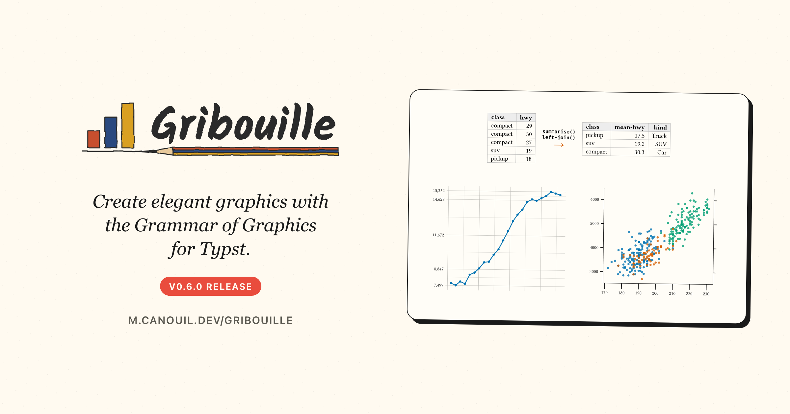

Two weeks after 0.5.0, here is [Gribouille](https://github.com/mcanouil/gribouille) 0.6.0.
This one is about the data before the plot and the numbers along the axis.
A set of wrangling verbs brings grouped aggregation, reshaping, and joining to the row-store data model, so the preparation stays in the document.
Automatic breaks now come from the extended Wilkinson search, which puts ticks on rounder numbers closer to the data, and four `breaks-*` helpers let you place them yourself.
The one thing to watch when you upgrade is the tick theming: `tick-length` and `tick-labels` are gone, replaced by a single `element-tick`.

{
  .img-featured
  .img-fluid
  fig-align="center"
  fig-alt=''
  width="600px"
}

::: {.callout-note}

## At a glance

- [Gribouille](https://github.com/mcanouil/gribouille) 0.6.0 on Typst Universe: `#import "@preview/gribouille:0.6.0": *`.
- [`summarise()`](https://m.canouil.dev/gribouille/reference/helpers/summarise.html) and [`count()`](https://m.canouil.dev/gribouille/reference/helpers/count.html) aggregate a dataset per group, one output row per group.
- [`pivot-longer()`](https://m.canouil.dev/gribouille/reference/helpers/pivot-longer.html) and [`pivot-wider()`](https://m.canouil.dev/gribouille/reference/helpers/pivot-wider.html) melt columns into a name/value pair and spread them back.
- [`left-join()`](https://m.canouil.dev/gribouille/reference/helpers/left-join.html) and the other four joins combine two datasets on their shared key columns; `bind-rows()` and `bind-cols()` stack or glue them.
- `select()`, `rename()`, `relocate()`, `drop-na()`, `distinct()`, and `slice-max()`/`slice-min()` handle the column and row work that a bare `.filter()` states awkwardly.
- The verbs are **experimental**, and the [Wrangling data](https://m.canouil.dev/gribouille/guides/wrangle.html) guide says when native Typst is enough on its own.
- Automatic continuous breaks come from the extended Wilkinson search, and [`breaks-width()`](https://m.canouil.dev/gribouille/reference/scales/breaks-width.html), [`breaks-pretty()`](https://m.canouil.dev/gribouille/reference/scales/breaks-pretty.html), [`breaks-extended()`](https://m.canouil.dev/gribouille/reference/scales/breaks-extended.html), and [`breaks-quantile()`](https://m.canouil.dev/gribouille/reference/scales/breaks-quantile.html) build the `breaks:` closure for you.
-  **Breaking:** tick marks are themed through the `axis-ticks` family with the new [`element-tick(colour:, stroke:, length:)`](https://m.canouil.dev/gribouille/reference/themes/element-tick.html); `tick-length` and `tick-labels` are removed.
-  **Breaking:** the internal summary-dispatch kernel gives up the `summarise` name to the new verb; `stat-summary(fun:)` is unchanged.

:::

Every figure in this post is a real, freshly compiled plot.

##  Breaking changes {#breaking-changes}

Two names change, and only one of them is likely to be in your documents.

::: {.callout-warning}

## Migrate these names

- Tick marks are one theme record now. `element-tick(colour:, stroke:, length:)` carries the mark length, so `tick-length` and its per-axis and per-side variants are removed: write `axis-ticks: element-tick(length: 0.2cm)` instead. `tick-labels` is removed too, because tick labels live in `axis-text`, so hide them per side with `axis-text-y-right: element-blank()`. To drop the marks and the space they reserve, `axis-ticks: element-blank()` is the one switch.
- `summarise` is the wrangling verb described below. The summary-dispatch kernel that used to carry that name is internal now. If you passed a summary by name or by closure to `stat-summary(fun:)` or `stat-summary-bin(fun:)`, nothing changes.

:::

## Wrangling data

A Gribouille dataset is a row-store, an array of dictionaries with one dictionary per row.
That is a plain Typst array, so a good part of the preparation is already a one-liner: `data.filter(...)` keeps rows, `data.map(...)` derives a column, `data.sorted(key: ...)` orders them.
What Typst leaves open is grouped aggregation, reshaping, and joining, and that is what the new verbs do.
They all take a row-store and return a row-store, so the result goes straight into `#plot` with nothing in between.

::: {.callout-warning}

## These verbs are experimental

Their interfaces can change without notice while the design settles, and they may end up in a dedicated Typst data-wrangling package rather than in Gribouille.
The plotting API and the native array methods are not affected.

:::

[`summarise()`](https://m.canouil.dev/gribouille/reference/helpers/summarise.html) collapses each group to one row.
The grouping is per call, through `by:`, so there is no grouped state to remember to undo.
Each aggregation is a closure that receives the group's rows and returns one cell, so anything you can compute over the rows is fair game.

```{typst}
//| echo: true
//| align: center
//| output-filename: "summarise.svg"
//| alt: "Bar chart of the mean highway fuel economy of each vehicle class, sorted from pickup at about 17 miles per gallon up to compact at about 30, with the number of vehicles in the class printed above each bar."
#let by-class = summarise(
  mpg,
  mean-hwy: rows => rows.map(row => row.hwy).sum() / rows.len(),  // <1>
  n: rows => rows.len(),
  by: "class",                                                    // <2>
).sorted(key: row => row.mean-hwy)                                // <3>

#plot(
  data: by-class,
  mapping: aes(x: "class", y: "mean-hwy"),
  layers: (
    geom-col(fill: okabe-ito.at(4)),
    geom-text(mapping: aes(label: "n"), anchor: "south", size: 8pt),  // <4>
  ),
  scales: scales(
    x: scale-discrete(limits: by-class.map(row => row.class)),    // <3>
  ),
  labels: labels(
    title: "Fuel Economy by Vehicle Class",
    x: "Vehicle Class",
    y: "Mean Highway mpg",
  ),
  theme: theme-minimal(),
  width: 12cm,
  height: 7cm,
)
```

1. Every named argument is an aggregation: a closure over the group's rows returning a single cell. A mean, a count, or a ratio of two columns all fit the same shape.
2. `by:` takes one column name or an array of them; without it the whole dataset collapses to a single row.
3. The output is an ordinary row-store, so `.sorted()` orders it, and feeding that order back as the discrete `limits` keeps the bars sorted.
4. `n` is one of the aggregated columns, so it can be mapped like any other.

When the aggregation is just a tally, [`count()`](https://m.canouil.dev/gribouille/reference/helpers/count.html) is the short form: it groups by the columns you name, adds an `n` column, and `sort: true` orders the groups from most to least frequent.

Two columns that measure the same thing are usually easier to plot once melted into one value column with a label column beside it.
[`pivot-longer()`](https://m.canouil.dev/gribouille/reference/helpers/pivot-longer.html) does that, and [`pivot-wider()`](https://m.canouil.dev/gribouille/reference/helpers/pivot-wider.html) spreads them back.

```{typst}
//| echo: true
//| align: center
//| output-filename: "pivot.svg"
//| alt: "Box plots of miles per gallon for city and highway economy, faceted into one panel per cylinder count; the highway box sits above the city box in every panel, and both drop as the number of cylinders grows."
#let long = pivot-longer(
  mpg,
  ("cty", "hwy"),           // <1>
  names-to: "metric",       // <2>
  values-to: "mpg",
)

#plot(
  data: long,
  mapping: aes(x: "metric", y: "mpg", fill: "metric"),
  layers: (geom-boxplot(),),
  facet: facet-wrap("cyl"),  // <3>
  scales: scales(fill: scale-okabe-ito()),
  labels: labels(
    title: "City Against Highway, by Cylinder Count",
    x: "Metric",
    y: "Miles per Gallon",
    fill: "Metric",
  ),
  guides: guides(fill: none),
  theme: theme-minimal(),
  width: 12cm,
  height: 7cm,
)
```

1. The columns to melt. Each row of `mpg` becomes two rows here, one per measurement.
2. `names-to` names the column holding the old column names, `values-to` the one holding their values.
3. The columns that were not melted, `cyl` among them, are carried through, so they can still facet or colour the plot.

Enriching a dataset with a lookup table is a join, not a dictionary read per row.
Build the lookup as its own small row-store and [`left-join()`](https://m.canouil.dev/gribouille/reference/helpers/left-join.html) it on the shared key.

```{typst}
//| echo: true
//| align: center
//| output-filename: "join.svg"
//| alt: "The same bar chart of mean highway economy per vehicle class, sorted ascending, with the bars coloured by a joined vehicle kind: the pickup and SUV classes sit at the low end, the minivan in the middle, and the car classes at the high end."
#let by-class = summarise(
  mpg,
  mean-hwy: rows => rows.map(row => row.hwy).sum() / rows.len(),
  by: "class",
).sorted(key: row => row.mean-hwy)

#let kind = (                                    // <1>
  (class: "compact", kind: "Car"),
  (class: "subcompact", kind: "Car"),
  (class: "midsize", kind: "Car"),
  (class: "2seater", kind: "Car"),
  (class: "minivan", kind: "Van"),
  (class: "suv", kind: "SUV"),
  (class: "pickup", kind: "Truck"),
)

#let enriched = left-join(by-class, kind, by: "class")   // <2>

#plot(
  data: enriched,
  mapping: aes(x: "class", y: "mean-hwy", fill: "kind"),
  layers: (geom-col(),),
  scales: scales(
    x: scale-discrete(limits: enriched.map(row => row.class)),
    fill: scale-okabe-ito(),
  ),
  labels: labels(
    title: "Economy by Class and by Kind",
    x: "Vehicle Class",
    y: "Mean Highway mpg",
    fill: "Kind",
  ),
  theme: theme-minimal(),
  width: 12cm,
  height: 7cm,
)
```

1. The lookup is a row-store like any other, written inline here, read from a CSV just as well.
2. Every row of the left dataset is kept and gains the lookup's extra columns. `inner-join` keeps only the matched rows, `full-join` keeps both sides, and `semi-join`/`anti-join` filter the left dataset without adding columns.

::: {.highlight}

**Every verb takes a row-store and returns a row-store:** the result of a summarise, a pivot, or a join goes straight into `#plot` with no adapter in between.

:::

One more thing before the plot, for real files.
A CSV arrives as strings, and missing values are spelled in as many ways as there are people producing the files.
[`as-numeric()`](https://m.canouil.dev/gribouille/reference/core/as-numeric.html) now takes an `na:` list of sentinel values, blanking them before it parses, so a placeholder does not survive as a number.

```typst
#let raw = csv("vehicles.csv", row-type: dictionary)
#let clean = drop-na(as-numeric(raw, "hwy", na: ("NA", "-99")), "hwy")
```

The [Wrangling data](https://m.canouil.dev/gribouille/guides/wrangle.html) guide walks the whole path, from coercion to the plot, and it also says which tasks need no verb at all.

## Breaks that land on round numbers

Until now, automatic breaks came from a fixed 1/2/5 ladder: pick the step from that list, cover the range.
It is simple, and it is regularly a bit off, either too far from the data or with more ticks than anyone asked for.
0.6.0 replaces it with the extended Wilkinson search[^wilkinson], which scores candidate tick sequences on three things at once: how simple the numbers are, how well they cover the data, and how close the count lands to the target.
There is nothing to change in your code, plots come out with rounder ticks that sit closer to the data.

[^wilkinson]: Talbot, J., Lin, S., and Hanrahan, P. (2010). An Extension of Wilkinson's Algorithm for Positioning Tick Labels on Axes. IEEE Transactions on Visualization and Computer Graphics, 16(6), 1036-1043.

The same search is available as [`breaks-extended(n:)`](https://m.canouil.dev/gribouille/reference/scales/breaks-extended.html) when you want a different tick count.
It is one of four helpers that build a closure for the `breaks:` and `minor-breaks:` arguments of a continuous scale.
The closure is called with the values the scale trained on, once per panel, and returns the positions, so free-scale facets each get their own.

```{typst}
//| echo: true
//| align: center
//| output-filename: "breaks.svg"
//| alt: "Line chart with a marker per month of the number of unemployed people in the United States from January 2008 to December 2009, rising from about 7,500 thousand to over 15,000 thousand, with y-axis ticks at the quartiles of the series and minor gridlines every 500."
#plot(
  data: economics,
  mapping: aes(x: "date", y: "unemploy"),
  layers: (
    geom-line(colour: okabe-ito.at(5), linewidth: 1.5pt),
    geom-point(size: 2pt, fill: okabe-ito.at(5), stroke: none),
  ),
  scales: scales(
    x: scale-date(date-format: "[year]-[month repr:numerical]"),
    y: scale-continuous(
      breaks: breaks-quantile(),                                 // <1>
      minor-breaks: breaks-width(500),                           // <2>
      labels: format-comma(digits: 0),                           // <3>
    ),
  ),
  labels: labels(
    title: "Ticks Where the Data Sits",
    x: "Date",
    y: "Unemployed (thousands)",
  ),
  theme: theme-minimal(),
  width: 12cm,
  height: 7cm,
)
```

1. `breaks-quantile(probs:)` puts the ticks at sample quantiles, the quartiles by default, so the axis reports where the mass of the data sits instead of drawing a regular grid.
2. `minor-breaks:` takes the same closures. `breaks-width(width, offset:)` places a line every `width`, anchored on `offset`, so the positions stay on round multiples however the range moves.
3. The tick labels are formatted by `format-comma()`, unrelated to where the ticks sit. `breaks-pretty(n:)` is the fourth helper, for round positions at a target count.

A closure and an explicit array of breaks are not treated the same way, and the difference matters.
An explicit array widens the axis so every requested tick stays visible, while closure breaks are clipped to the trained domain, since the closure has seen the data and cannot ask for anything outside it.

A related fix landed with them.
A scale trained on whole numbers only, such as years or counts, now keeps whole automatic breaks, so a narrow range like 2020 to 2023 no longer labels half-steps.

## Ticks, in one element

Tick marks used to be described in two places: their colour and stroke in `axis-ticks`, their length in a separate `tick-length` with its own per-axis and per-side variants.
They are one record now.
[`element-tick(colour:, stroke:, length:)`](https://m.canouil.dev/gribouille/reference/themes/element-tick.html) carries all three, on `axis-ticks` and on its per-axis, per-side, and minor variants.

```{typst}
//| echo: true
//| align: center
//| output-filename: "ticks.svg"
//| alt: "Scatter plot of penguin body mass against flipper length with long tick marks on the x-axis, half-length ticks on the y-axis, and a duplicated y-axis on the right carrying its marks but no labels."
#plot(
  data: penguins,
  mapping: aes(x: "flipper-len", y: "body-mass", fill: "species"),
  layers: (geom-point(size: 2pt, alpha: 0.8, stroke: none),),
  scales: scales(
    y: scale-continuous(secondary: dup-axis()),        // <1>
    fill: scale-okabe-ito(),
  ),
  labels: labels(
    title: "One Record per Tick Mark",
    x: "Flipper Length (mm)",
    y: "Body Mass (g)",
    fill: "Species",
  ),
  theme: theme-minimal(
    axis-line: element-line(stroke: 0.5pt),
    axis-ticks: element-tick(length: 0.25cm, stroke: 0.8pt),  // <2>
    axis-ticks-y: element-tick(length: 50%),                  // <3>
    axis-text-y-right: element-blank(),                       // <4>
  ),
  width: 12cm,
  height: 7cm,
)
```

1. `dup-axis()` repeats the axis on the opposite side, and its `breaks:` and `labels:` are honoured now; the secondary axis used to draw the primary ones whatever you asked for.
2. Length, colour, and stroke sit in the same record, set once on `axis-ticks` for every side.
3. A ratio scales the length inherited from the parent surface, exactly as `size` and `stroke` do elsewhere, so the y marks come out half as long without naming an absolute value.
4. Tick labels live in `axis-text`, so hiding them per side is the usual `element-blank()`, and the width they reserved goes back to the panel.

Minor marks follow the same record through `axis-ticks-minor`.
The sub-decade ticks that [`guide-axis-logticks()`](https://m.canouil.dev/gribouille/reference/guides/guide-axis-logticks.html) adds on a log axis used to be hardcoded at half length in the major stroke; they are themable now, and they inherit the major record, so the default look is unchanged.

::: {.highlight}

**One record, one switch:** `element-tick` holds the colour, the stroke, and the length, and `axis-ticks: element-blank()` turns the marks off without reserving any depth.

:::

## Under the hood

The usual share of fixes rides along.

The one you are most likely to notice is vertical alignment of labels.
Legend entries, vertical colourbar tick labels, and y-axis tick labels now centre on the cap-height and baseline band instead of the glyph bounds.
A label carrying a descender, `Chinstrap` next to `Adelie`, no longer sits a little higher than its neighbours.

On the documentation side, every `scale-*` reference page lists the keys its `..args` accepts, with type, accepted values, and default, including `oob`, which was not documented anywhere before.
The theming guide gains a "Ticks and their labels" section, and the [Wrangling data](https://m.canouil.dev/gribouille/guides/wrangle.html) guide is new.
The navbar GitHub icon became a widget with the live star and fork counts and a project menu.

One change to the site is worth a line of its own.
The stable documentation is now rendered wholly from the release tag, instead of taking its pages from `main` against a pinned source.
Each site documents the API it ships with, which is the point.
The trade-off is that a documentation fix reaches the stable site at the next release rather than immediately.

## Wrap-up

::: {.highlight}

**Prepare the data in the document, and let the axis pick better numbers.**

:::

Next on the list is more geoms and more worked examples.
If you run into something unexpected, the issue tracker is the right place for it.

- Gribouille
  - Repository: <https://github.com/mcanouil/gribouille>.
  - Documentation: <https://m.canouil.dev/gribouille>.
  - Typst Universe: <https://typst.app/universe/package/gribouille>.
- Typst Render
  - Repository: <https://github.com/mcanouil/quarto-typst-render>.
  - Documentation: <https://m.canouil.dev/quarto-typst-render>.

::: {.callout-tip}

## A note on contributions

Gribouille is an unfunded spare-time project, and the API is still settling.
Bug reports and ideas are very welcome on the issue tracker.
Pull requests are not being accepted for now, for the reasons set out in the [launch post](../2026-05-20-gribouille-grammar-of-graphics-for-typst/index.qmd).
Thanks in advance for your patience.

:::
