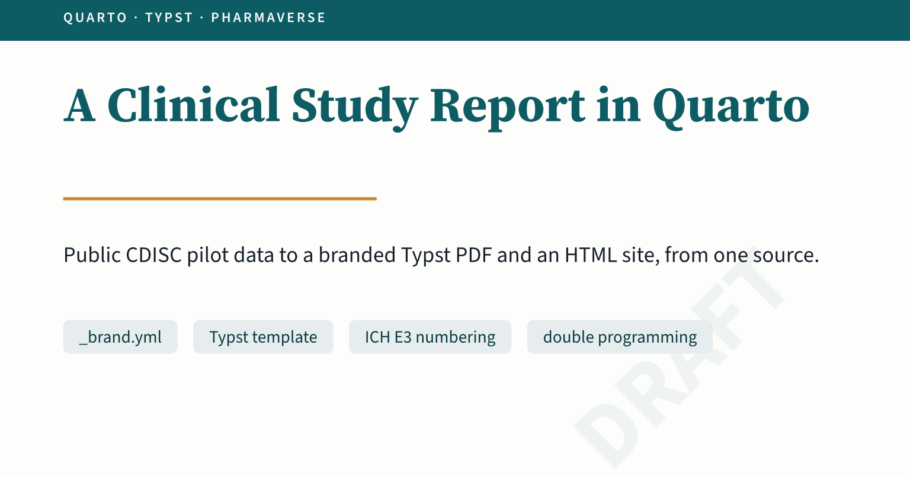
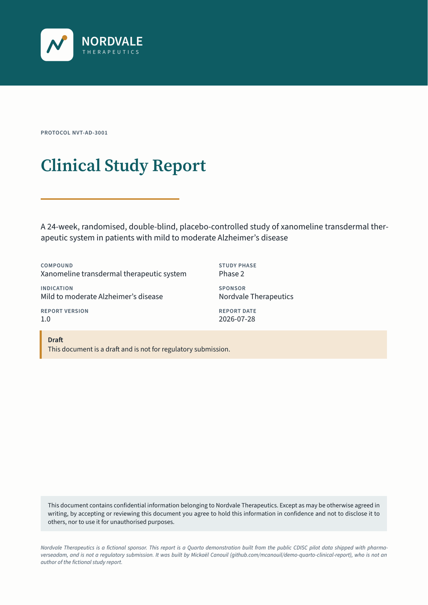
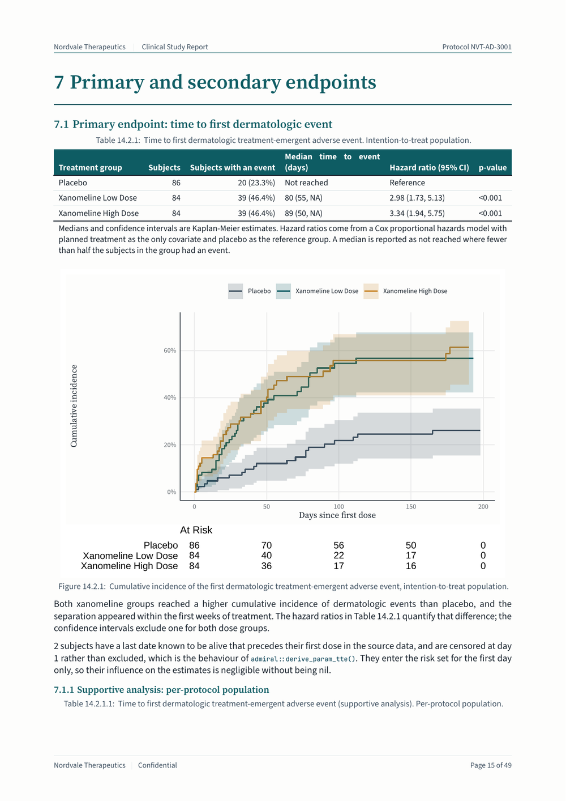
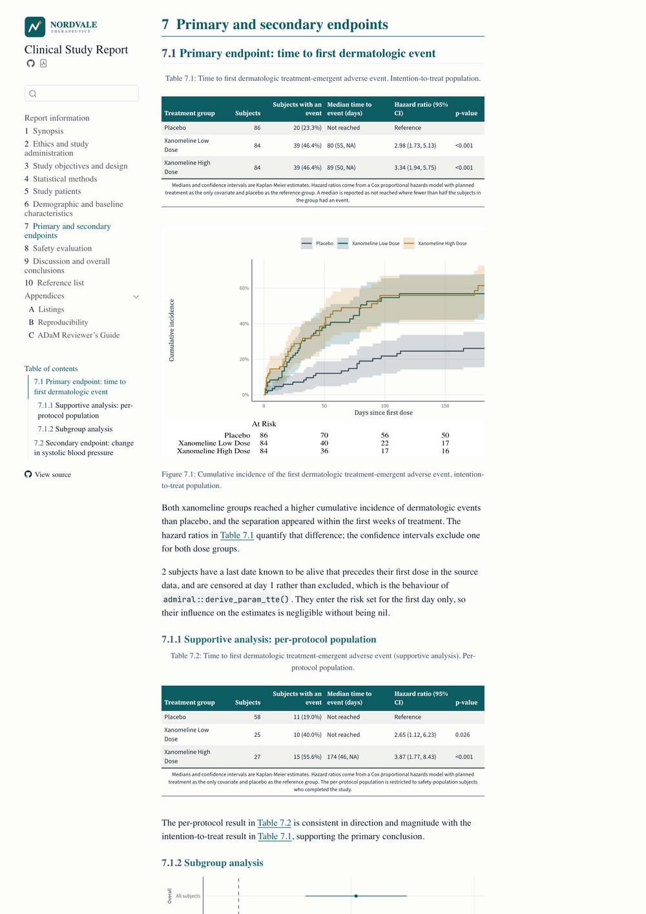
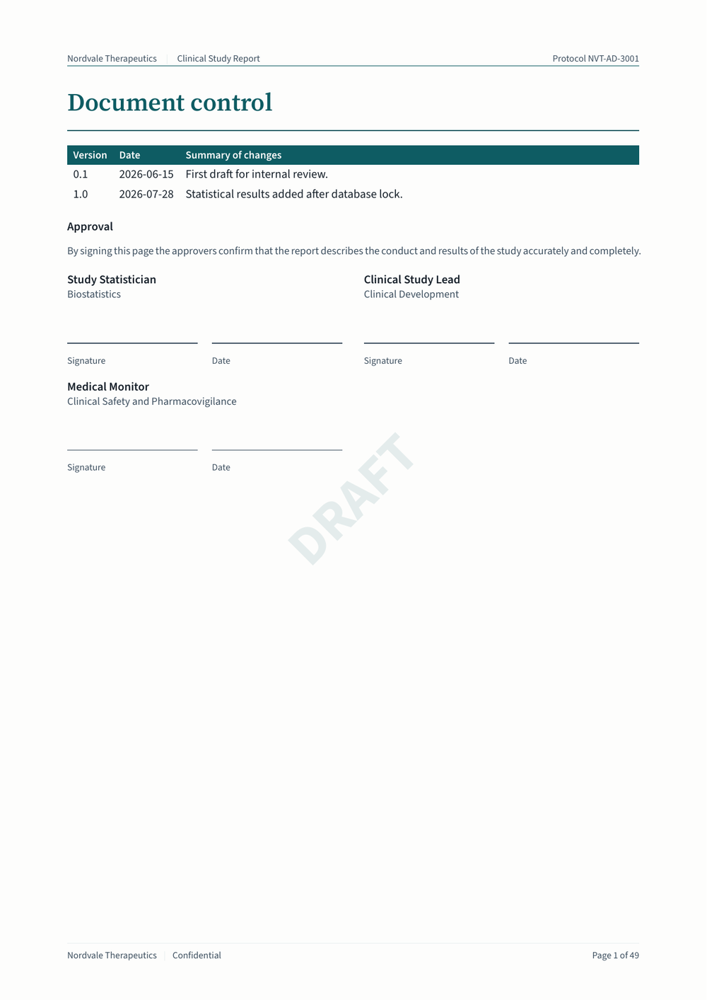
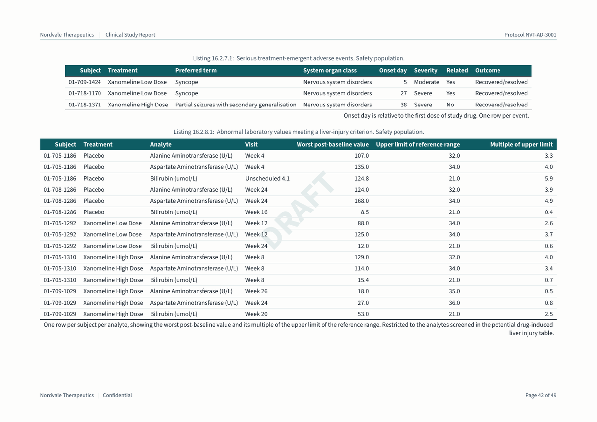
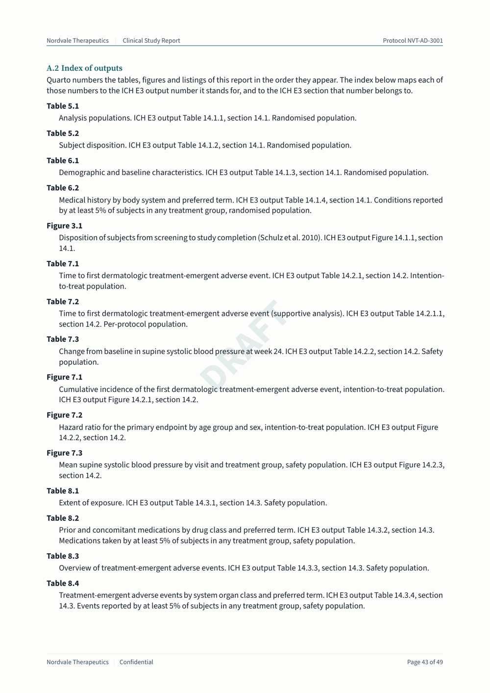

A clinical study report is a long document with numbered tables, a signed approval page, and firm rules about what goes where.
I wanted to show how much of one Quarto can carry on its own.
So I built one from public data, and put the whole project on GitHub.

{
  .img-featured
  .img-fluid
  fig-align="center"
  fig-alt=''
  width="600px"
}

## What the Report Is

`demo-quarto-clinical-report` is an abbreviated clinical study report, written in the section order of ICH E3[^iche3].
It has a synopsis, ethics, design, statistical methods, study patients, demographics, endpoints, safety, conclusions, and three appendices.
The PDF is 50 pages, cover included, with 30 numbered tables, listings, and figures.

Two things before anything else.
Nordvale Therapeutics is a fictional sponsor, invented for the demo.
The data are the public CDISC pilot study `CDISCPILOT01` shipped with `pharmaverseadam`, and the report is not a regulatory submission.

{
  fig-alt="Cover page of the clinical study report. A dark teal band across the top holds the Nordvale Therapeutics logo. Below it, the protocol number, the title Clinical Study Report, an amber rule, the study subtitle, and a two-column grid of fields: compound, study phase, indication, sponsor, report version, and report date. An amber-edged panel reads Draft, this document is a draft and is not for regulatory submission. A confidentiality panel and a disclaimer sit at the bottom."
  style="width:250px"
  .hero-art
}

[^iche3]: ICH E3, Structure and Content of Clinical Study Reports, see <https://database.ich.org/sites/default/files/E3_Guideline.pdf>.

## One Source, Two Formats

The project carries one extension, `_extensions/nordvale/clinical`, and that extension contributes two formats.

```{.yaml filename="_extensions/nordvale/clinical/_extension.yml"}
contributes:
  formats:
    common:                                    # <1>
      toc: true
      toc-depth: 3
      number-sections: true
      lang: en-GB
    typst:                                     # <2>
      template-partials:
        - typst-template.typ
        - typst-show.typ
      filters:
        - path: appendices.lua
          at: post-quarto
      papersize: a4
      section-numbering: "1.1.1"
      font-paths:                              # <3>
        - _extensions/nordvale/clinical/fonts
    html:                                      # <4>
      theme:
        - cosmo
        - brand
        - clinical.scss
      filters:
        - inline-svglite.lua
```

1. What both formats agree on, merged into each one.
2. The two template partials that build the pages, and `appendices.lua`, which letters the appendix chapters and numbers the floats by chapter.
3. The fonts travel with the extension, so the PDF does not depend on what is installed.
4. The theme, and `inline-svglite.lua`, which inlines the figures the `svglite` device draws so the page stylesheet resolves the brand fonts for them, as described in [The Brand Reaches the Figures](#the-brand-reaches-the-figures).

A document then asks for `clinical-typst` or `clinical-html`, and gets the sponsor identity with it.

```{typst}
//| label: fig-flow
//| fig-cap: "One set of sections, one extension, two renderings."
//| echo: false
//| alt: "Flow diagram. On the left, three stacked boxes: sections/*.qmd, R/tlf.R, and _brand.yml. An arrow points right to a taller box labelled Quarto with the nordvale/clinical extension. Another arrow points right to two stacked boxes: clinical-typst giving a PDF, and clinical-html giving a website."
//| width: 14cm
//| height: 6cm
#let fg = if _typst_render_foreground != none { _typst_render_foreground } else { rgb("#111827") }
#let bg = if _typst_render_background != none { _typst_render_background } else { white }
#let teal = color.mix((rgb("#0E5C63"), 65%), (fg, 35%))
#let amber = color.mix((rgb("#C8862B"), 70%), (fg, 30%))
#let muted = color.mix((fg, 65%), (bg, 35%))
#let box-fill = color.mix((bg, 90%), (fg, 10%))
#let box-stroke = color.mix((fg, 20%), (bg, 80%)) + 0.5pt

#let node(body, detail: "", stroke: box-stroke) = rect(
  fill: box-fill, stroke: stroke, radius: 3pt,
  inset: (x: 9pt, y: 8pt), width: 100%, height: 100%,
)[
  #align(center + horizon)[
    #stack(spacing: 4pt,
      text(size: 9pt, fill: fg)[#body],
      text(size: 7pt, fill: muted)[#detail],
    )
  ]
]

#let arr = align(center + horizon, text(size: 14pt, fill: muted)[→])

#layout(avail => {
  let row = (avail.height - 24pt) / 3
  grid(
    columns: (1fr, 30pt, 1.15fr, 30pt, 1fr),
    rows: (avail.height,),
    align: horizon,
    stack(spacing: 12pt,
      block(height: row)[#node(raw("sections/*.qmd"), detail: "the ICH E3 chapters")],
      block(height: row)[#node(raw("R/tlf.R"), detail: "one function per output")],
      block(height: row)[#node(raw("_brand.yml"), detail: "colours, fonts, logos")],
    ),
    arr,
    node([Quarto], detail: "with the nordvale/clinical extension", stroke: teal + 1.2pt),
    arr,
    stack(spacing: 12pt,
      block(height: row * 1.5)[#node(raw("clinical-typst"), detail: "a branded PDF", stroke: amber + 1pt)],
      block(height: row * 1.5)[#node(raw("clinical-html"), detail: "a searchable site", stroke: teal + 1pt)],
    ),
  )
})
```

The two renderings are not a screenshot of each other.
They are the same chapter, computed once, laid out twice.

::: {layout-ncol="2"}
{fig-alt="Page 15 of the PDF. A numbered heading reads 7 Primary and secondary endpoints, followed by Table 7.1 with a dark teal header row, a source note under it, and a Kaplan-Meier figure with a risk table." .hero-art}

{fig-alt="The same chapter on the HTML site. A left sidebar lists the chapters and appendices, and the main column shows Table 7.1 with the same teal header row and the same Kaplan-Meier figure." .hero-art}
:::

## The Typst Template

`typst-template.typ` defines one function, `clinical()`, with the document metadata as its arguments.
`typst-show.typ` is the piece that maps Quarto metadata onto that function, including the brand colours and the logo Quarto resolves from `_brand.yml`.

The cover page is a page of its own, with the band reaching the paper edge.

```{.typst filename="_extensions/nordvale/clinical/typst-template.typ"}
page(
  margin: (x: 0mm, y: 0mm),                    // <1>
  header: none,
  footer: none,
  numbering: none,
  background: none,
)[
  #block(width: 100%, height: 42mm, fill: primary, inset: (x: 20mm, y: 14mm))[   // <2>
    #if logo != none {
      logo
    } else {
      text(fill: paper, size: 20pt, weight: "semibold")[#sponsor]                // <3>
    }
  ]
]
```

1. No margin on this page, so a filled block can reach the edge of the paper.
2. The band itself, coloured with the brand primary, with its own inset for the logo.
3. A sponsor with no logo still gets a cover, with the name set in the same place.

Then comes the document control page, which is the part a regulated document needs and a blog post rarely shows.
It carries the revision history and the approval block, and both are written as metadata rather than as prose.

```{.yaml filename="_metadata-csr.yml"}
status: draft                                       # <1>
approvals:                                          # <2>
  - name: Study Statistician
    role: Biostatistics
  - name: Clinical Study Lead
    role: Clinical Development
  - name: Medical Monitor
    role: Clinical Safety and Pharmacovigilance
revisions:                                          # <3>
  - version: "0.1"
    date: 2026-06-15
    summary: First draft for internal review.
  - version: "1.0"
    date: 2026-07-28
    summary: Statistical results added after database lock.
```

1. The one key that decides whether the document is a draft.
2. One entry per approver, in the order they appear on the page.
3. The revision history, printed as a table above the signatures.

The template turns each approval into a signature block.

```{.typst filename="_extensions/nordvale/clinical/typst-template.typ"}
#let signature-block(name, role, rule: gray) = block(
  width: 100%,
  inset: (top: 10pt, bottom: 6pt),
)[
  #text(size: 10pt, weight: "semibold")[#name]                                       // <1>
  #linebreak()
  #text(size: 9pt, fill: rule)[#role]
  #v(26pt)                                                                           // <2>
  #grid(
    columns: (1fr, 1fr),
    column-gutter: 12pt,
    [#line(length: 100%, stroke: 0.6pt + rule) #text(size: 8pt, fill: rule)[Signature]],  // <3>
    [#line(length: 100%, stroke: 0.6pt + rule) #text(size: 8pt, fill: rule)[Date]],
  )
]
```

1. The name and the role, taken from one entry of `approvals`.
2. The gap a pen needs, which is the only reason this block exists.
3. Two ruled lines, one for the signature and one for the date.

{
  fig-alt="Page one of the report body. A heading reads Document control, followed by a table of two revisions with a teal header row, then an Approval section with three signature blocks, each showing a name, a role, and ruled lines for signature and date. A faint diagonal DRAFT watermark crosses the page. The footer reads Page 1 of 49."
  style="width:250px"
  .hero-art
}

::: {.callout-note}

## The words the template writes itself

The title of the table of contents comes from `quarto.language`, which is why the extension asks for Quarto 1.10.18 or later.
Everything else the template writes is English in the source: "Signature", "Date", "Draft", "Confidential", and "Page N of M".
A key under `language` that Quarto does not ship passes validation and is merged over the defaults.
It is then dropped before templates see it, so it reads back as an empty string, with no warning.
I reported that as [quarto-dev/quarto-cli#14772](https://github.com/quarto-dev/quarto-cli/issues/14772), and the fix proposed in [quarto-dev/quarto-cli#14773](https://github.com/quarto-dev/quarto-cli/pull/14773) which might land only in Quarto 1.11.

:::

Two more pieces of furniture come from the same metadata.
The running footer numbers the pages as X of Y, which Typst gives you with the final value of the page counter.

```typst
[Page #counter(page).display() of #counter(page).final().first()]
```

The watermark is one comparison, read once at the top of the template.

```typst
let is-draft = lower(status) == "draft"
```

::: {.highlight}

**One key decides the whole document:** `status: draft` puts the watermark on every page and the draft notice on the cover.
Setting it to `final` removes both, and there is nothing else to edit.

:::

The last piece is orientation.
Two listings are wider than a portrait page, so the appendix wraps those two in a `::: {.landscape}` div, and only those.

{
  fig-alt="A landscape page from the appendix. Listing A.4 lists serious treatment-emergent adverse events, with columns for subject, treatment, preferred term, system organ class, onset day, severity, relatedness, and outcome. Listing A.5 below it lists abnormal laboratory values meeting a liver-injury criterion. The DRAFT watermark sits behind the tables."
  style="width:450px"
  .hero-art
}

## The Brand Reaches the Figures

`_brand.yml` holds nine named colours and three font families.
The fonts are declared with `source: file`, and point at files bundled in the extension.
The PDF then looks the same on my laptop and on a runner.
Typst finds them through `font-paths`, and the HTML theme reads them from the brand.

The page furniture is the easy half.
Figures and tables are the other half, because `ggplot2` and `gt` know nothing about a Quarto brand.

This project uses the approach I described in [Branded Figures and Tables in R and Python with Quarto](/posts/2026-04-15-quarto-brand-figures-tables/), with its companion repository [mcanouil/demo-quarto-brand-renderings](https://github.com/mcanouil/demo-quarto-brand-renderings) as the reference implementation.
Read that post for the principle, and for the Python side.
Only the names change here: `get_brand_info()` became `brand_raw()` and `brand()`, `theme_brand()` became `theme_nordvale()`, and `gt_brand()` became `gt_style_nordvale()`.
`configure_brand_fonts()` kept its name.

Quarto publishes the resolved brand in an environment variable at render time, so the helpers read it from there.

```{.r filename="R/brand.R"}
brand_raw <- function() {
  execute_info <- Sys.getenv("QUARTO_EXECUTE_INFO", unset = "")   # <1>
  if (nzchar(execute_info)) {
    info <- jsonlite::fromJSON(execute_info)
    brand <- info[["format"]][["render"]][["brand"]]               # <2>
    if (!is.null(brand) && length(brand) > 0L) {
      mode <- if ("light" %in% names(brand)) "light" else names(brand)[[1L]]   # <3>
      return(brand[[mode]][["data"]])
    }
  }
  yaml::read_yaml(brand_file())                                    # <4>
}
```

1. Quarto sets this variable for every chunk it executes, and it holds the render context as JSON.
2. The brand Quarto resolved, after every `_brand.yml` in the project has been merged.
3. The report is printed, so the light mode is the one to take.
4. Outside a render there is no variable, so the helpers read the file and still work in a plain R session and in the tests.

From there, `theme_nordvale()` styles the plots, `treatment_colours()` fixes one colour per treatment group, and `gt_style_nordvale()` styles the tables.
That last one stays inside the subset of `gt` options Quarto can translate to Typst: fonts, colours, borders, and alignment.

One HTML detail is worth the filter it took.
The figures are drawn with `svglite`, and a standalone SVG file has to carry the fonts itself to display them.
`inline-svglite.lua` puts the SVG content into the page instead of a link to the file.
The page stylesheet then resolves the brand fonts, and the graphics device does not have to embed them.

## Every Output Has a Number

Quarto numbers a table by chapter, so the first table of chapter 7 is Table 7.1.
ICH E3 numbers the same table 14.2.1, in the section for efficacy data.
Both numbers are needed at once: a reader follows the cross-reference, a reviewer looks up the E3 number.

`R/tlf-index.R` is where every output number lives, and no other file in the project states one.

```{.r filename="R/tlf-index.R"}
tlf_entry_spec(
  key = "tte",                                                            # <1>
  ref = "tbl-tte",                                                        # <2>
  kind = "Table",
  number = "14.2.1",                                                      # <3>
  section = "14.2",
  title = "Time to first dermatologic treatment-emergent adverse event",  # <4>
  subtitle = "Intention-to-treat population",
  source_note = "Medians and confidence intervals are Kaplan-Meier estimates. ..."   # <5>
)
```

1. The name the R code calls the output by. `tlf_entry()` stops with an error on a key it does not know, so a typo fails the render instead of printing an empty caption.
2. The cross-reference identifier, which is what Quarto numbers.
3. The ICH E3 number and the E3 section, which is what a reviewer looks for. Neither is printed next to the output itself; both are printed in the index of outputs, at the end of the listings appendix.
4. The title and the population, which `tlf_caption()` writes under the output.
5. The source note, which `tlf_output()` attaches to the table itself.

A section then wraps the output in a cross-reference div and asks the index for the caption.

````{.markdown filename="sections/07-efficacy.qmd"}
::: {#tbl-tte}

```{r}
#| label: tte

tlf_output(tlf_tte_summary(adtte), "tte")
```

`{r} tlf_caption("tte")`

:::
````

The div supplies the number, so no caption in the project states one.
The appendix ties the two numbering schemes together.
`tlf_catalogue()` prints the whole index as a definition list, where each term is a cross-reference.
Quarto resolves its own number, and the description carries the ICH E3 number, the E3 section, and the population.
That page is the only place the `number` and `section` fields are printed, and it is what makes them worth keeping in the index.

{
  fig-alt="A page headed A.2 Index of outputs. Each entry is a term such as Table 7.1 with a description under it reading, for example, Time to first dermatologic treatment-emergent adverse event. ICH E3 output Table 14.2.1, section 14.2. Intention-to-treat population."
  style="width:250px"
  .hero-art
}

Changing an output number is a one-line edit in one file, and every mention of it follows.

## Book or One Long Document

The same sections are rendered two ways, chosen with a Quarto profile.
`_quarto-book.yml` builds a book with a sidebar and a search box.
`_quarto-doc.yml` renders `csr.qmd`, which is nothing but includes, as one long document, alongside the companion statistical analysis plan.

```sh
quarto render                 # the book, in _book/
quarto render --profile doc   # the single document, in _doc/
```

The study metadata that both share sits in `_metadata.yml`.
The per-document keys do not, and that is deliberate.
A shared `_metadata.yml` is always merged, and merging concatenates list values instead of replacing them.
Put those keys in the shared file, and the approvals of the analysis plan join the approvals of the report.
They live in `_metadata-csr.yml` instead, which the report loads, while `sap.qmd` sets its own.

## Checking the Numbers

A report of computed numbers needs something to check those numbers.
The project has three test files, and the workflow runs them before it renders anything.

`test-invariants.R` checks the properties every table quietly relies on.
The population flags nest as the methods chapter claims.
A reason for discontinuation is present exactly for the subjects who did not complete.
No subject is lost between the source data and the analysis datasets.

`test-independent-test.R` recomputes every headline number the prose states, from the source packages rather than from the derived datasets.
If `R/00-adam.R` gets a filter wrong, the test disagrees instead of restating the mistake.

`test-double-programming.R` refits the models by a second route and compares the results with the strings the report prints.
It catches a wrong estimate, a wrong reference group, or a transposed confidence interval, which no structural test can see.

The reproducibility appendix carries the rest of the traceability.
It holds the analysis results datasets `gtsummary` keeps behind each table, a define.xml-style metadata excerpt, and the empty table shells next to the locked table.
It also holds the session information, and an `renv` lockfile snapshotted in explicit mode from `DESCRIPTION`.

## What I Would Watch Out For

Four things are worth knowing before you start.
None of them are hard once you know where to look, and each one can cost an afternoon if you do not.

**Floats numbered by chapter.**
Typst numbers figures from one counter, and Quarto zeroes that counter at each chapter.
Typst is never told which chapter it is in, so every chapter opened with "Table 1".
`appendices.lua` reads the chapter from the heading counter and prefixes the float number with it.
The same filter gives the appendices their letters.

**Tables that do not break.**
Quarto wraps every cross-referenced float in a `figure`, and a `figure` block is not breakable.
A table taller than the space left overflowed the page instead of continuing on the next one.
One show rule fixes it, and Typst then repeats the header rows on each page.

```typst
show figure.where(kind: "quarto-float-tbl"): set block(breakable: true)
```

Plots stay unbreakable, so an image never parts from its caption.

**Counting before filtering.**
A few subjects in the pilot data have a last date known to be alive that precedes their first dose.
The report discloses how many, and that count is taken from the unfiltered derivation on purpose.
Taken after the filter, the count can report zero one day, and turn a disclosure into a false statement.

**Defaults that are not neutral.**
`emmeans::contrast(method = "trt.vs.ctrl")` applies a Dunnett-style multiplicity adjustment by default.
That adjustment widens the intervals beyond what the statistical methods chapter and the analysis plan describe.
The secondary endpoint is descriptive here, so the call passes `adjust = "none"` and says so.

## Render It Yourself

You need Quarto 1.10.18 or later, for the `quarto.language` variables the Typst template reads, and R 4.4 or later.

```sh
Rscript -e 'renv::restore()'
quarto render
```

The repository is at [mcanouil/demo-quarto-clinical-report](https://github.com/mcanouil/demo-quarto-clinical-report), and the rendered report is published at <https://m.canouil.dev/demo-quarto-clinical-report/>.
Here is the whole PDF, the one the workflow publishes on every push to `main`.

::: {style="text-align: center;"}

{
  .hero-art
  .slide-deck
  loading="lazy"
  title="The clinical study report, rendered from Quarto to a Typst PDF"
}

:::

Open it full size: [Typst PDF](https://m.canouil.dev/demo-quarto-clinical-report/Clinical-Study-Report.pdf){target="_blank" rel="noopener noreferrer"}, [HTML book](https://m.canouil.dev/demo-quarto-clinical-report/){target="_blank" rel="noopener noreferrer"}.

Take the template, keep the structure, and put your own sponsor on the cover.

Happy publishing!
