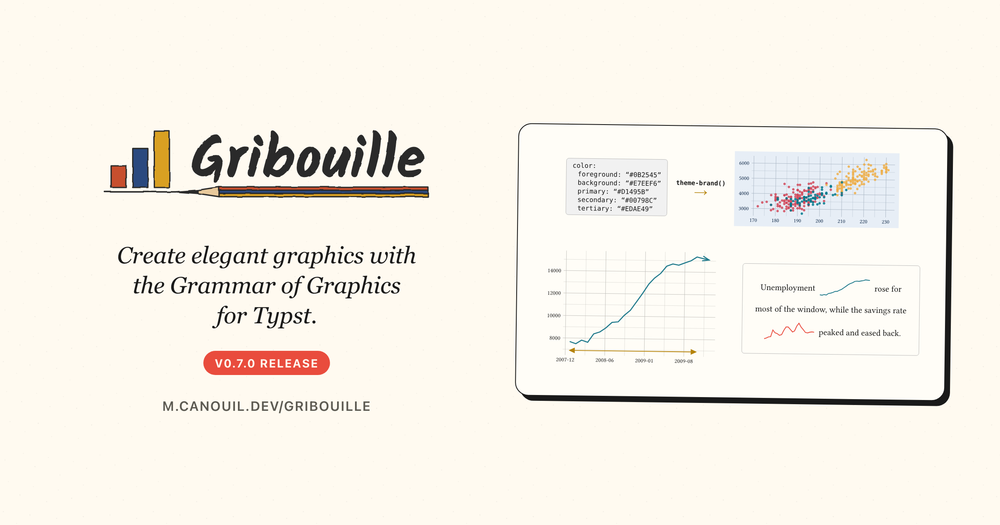

[Gribouille](https://github.com/mcanouil/gribouille) 0.7.0 is about two things: the colours a plot uses, and the room it takes.
A theme can now be built from a parsed [`_brand.yml`](https://posit-dev.github.io/brand-yml/), so the figures in a document follow the same brand as the prose around them.
The rest of the release is layout.
A plot draws at any size that gives it room to draw, it keeps to the `width` and `height` you set, and it says how much room it needs when it cannot.
The one thing to watch when you upgrade is that some plots which used to draw past their canvas now fail instead.

{
  .img-featured
  .img-fluid
  fig-align="center"
  fig-alt=''
  width="600px"
}

::: {.callout-note}

## At a glance

- [Gribouille](https://github.com/mcanouil/gribouille) 0.7.0 on Typst Universe: `#import "@preview/gribouille:0.7.0": *`. Typst 0.15.0 or newer.
- [`theme-brand()`](https://m.canouil.dev/gribouille/reference/themes/theme-brand.html) turns a [`_brand.yml`](https://posit-dev.github.io/brand-yml/) into a theme, and any theme now carries a `palette` that discrete colour and fill scales use by default.
- [`arrow()`](https://m.canouil.dev/gribouille/reference/helpers/arrow.html) puts arrowheads on `geom-segment`, `geom-curve`, `geom-spoke`, `geom-path`, `geom-line`, and `geom-step`.
- A plot keeps to the `width` and `height` you set, down to one that fits in a line of prose. Tick labels, strip bands, and side legends take their room from inside the canvas.
- [`breaks-log()`](https://m.canouil.dev/gribouille/reference/scales/breaks-log.html) breaks a log scale on powers of ten, [`format-log()`](https://m.canouil.dev/gribouille/reference/helpers/format-log.html) writes `1000` as `10^3`, and [`guide-axis-logticks()`](https://m.canouil.dev/gribouille/reference/guides/guide-axis-logticks.html) adds two rows of smaller ticks below.
- A boxplot of sixty-four thousand rows draws in about 2 seconds, where every earlier version took nearly thirty.
-  **Breaking:** `arrow` on the three text geoms takes an `arrow()` specification in place of a boolean, and `arrow-length` is gone.
-  **Breaking:** a plot whose labels, strips, or legends cannot fit its canvas fails with the room it needs instead of drawing past the edge.

:::

Every figure in this post is a real, freshly compiled plot.

##  Breaking changes {#breaking-changes}

Four things change, and only the first is a rename.
In the other three, a plot used to draw the wrong thing and now says so.

::: {.callout-warning}

## Migrate these names

- Arrowheads are a specification now. `arrow: true` on `geom-text`, `geom-label`, and `geom-typst` becomes `arrow: arrow()`, and `arrow-length: 6pt` becomes `arrow: arrow(length: 6pt)`. The `arrow-length` parameter is removed.
- Tick labels turn by -90 to 90 degrees, on `guide-axis()`, `guide-axis-logticks()`, `guide-axis-theta()`, and `axis-text`. Past a quarter turn they read upside down, so anything outside that range fails.
- The theta axis of a `coord-radial()` plot reads its ticks and its arc from the scale that carries the sweep, `y` on a pie rather than `x`. Its minor ticks move to `axis-ticks-minor`, so a theme that styled the angular axis through `axis-line` alone must set `axis-ticks` too.
- A plot that cannot fit the size it was asked for fails, saying how much room is missing and what to change. That covers tick labels reaching past the panel, a strip label wider than its panel, and a legend on a plot side.

:::

## A theme from your brand

[`brand.yml`](https://posit-dev.github.io/brand-yml/) is a small standard for writing a brand's colours, fonts, and logos in one YAML file that several tools read.
Quarto reads it, Shiny reads it, and the figures were the part that did not follow.
[`theme-brand()`](https://m.canouil.dev/gribouille/reference/themes/theme-brand.html) closes that gap.

It takes the dictionary Typst's `yaml()` returns, not a path, because Typst reads a relative path from the file that calls `yaml`.
So you read the file, and `theme-set()` makes the result the default for every plot below it:

```typst
#theme-set(theme-brand(yaml("_brand.yml")))
```

The brand's `foreground`, `background`, and `primary` become the theme's `ink`, `paper`, and `accent`, and the gridlines, axis lines, and strips follow from that pair as they do under `theme-minimal()`.
The roles left over, `secondary`, `tertiary`, `success`, `info`, `warning`, and `danger`, make the palette, in that order, with any repeated colour dropped.

The figure below writes the brand as a Typst dictionary, with the keys the standard defines, so you can read it here.

```{typst}
//| echo: true
//| align: center
//| output-filename: "brand.svg"
//| alt: "Scatter plot of penguin body mass against flipper length on the brand's pale blue paper with navy ink, solid points filled by species in the brand's red, teal, and amber, with a species legend on the right."
#let brand = (
  color: (
    palette: (                                          // <1>
      slate: "#0B2545",
      mist: "#E7EEF6",
      midnight: "#0A1622",
      frost: "#DCE6F2",
    ),
    foreground: (light: "slate", dark: "frost"),        // <2>
    background: (light: "mist", dark: "midnight"),
    primary: (light: "#D1495B", dark: "#FF7A8A"),
    secondary: "#00798C",                               // <3>
    tertiary: "#EDAE49",
  ),
)

#plot(
  data: penguins,
  mapping: aes(x: "flipper-len", y: "body-mass", fill: "species"),
  layers: (geom-point(size: 2pt, alpha: 0.85, stroke: none),),
  labels: labels(
    title: "Body Mass Against Flipper Length",
    x: "Flipper Length (mm)",
    y: "Body Mass (g)",
    fill: "Species",
  ),
  theme: theme-brand(brand),                            // <4>
  width: 12cm,
  height: 7cm,
)
```

1. A semantic colour may be a hex string, the name of a `color.palette` entry, or an alias of another entry. All three resolve.
2. A colour may also carry `light` and `dark` variants, as a brand that supports both schemes does.
3. A colour with no variants is used in both modes.
4. `mode: "light"` or `mode: "dark"` picks which side of those variants to use, and `"light"` is the default. This post sets it from the page colour in its preamble, so the figure follows the colour-scheme toggle.

::: {.highlight}

**One brand, one document.** The prose and the plots read their colours from the same file.

:::

The palette `theme-brand()` derives is nothing special: `palette` is a theme key like any other, so any theme takes one.

```typst
#theme-set(theme-minimal(
  palette: (rgb("#D1495B"), rgb("#00798C"), rgb("#EDAE49")),
))
```

Set it once and every discrete colour and fill scale in the document draws from it, which saves repeating `scale-colour-manual(values: ...)` on each plot.
Three rules cover the rest:

- A scale that sets its own `palette:` keeps it.
- The default is `palette: auto`, which is the Okabe-Ito palette, as before.
- Continuous scales are not affected, and stay on viridis.

Brand colours are chosen to sit well together, and data colours need the opposite, so when a brand's roles are too close to tell apart, pass `palette: none`:

```typst
#theme-brand(brand, palette: none)
```

The plot then keeps the brand's paper, ink, and accent, and draws the data in Okabe-Ito.

::: {.callout-warning}

## Accessibility: A brand is not checked for contrast

Nothing verifies that the brand's foreground and background contrast with each other.
A brand that pairs two dark colours gives you a theme you cannot read, and Gribouille draws it exactly as asked.

:::

## Arrowheads on the lines

A line often shows a direction.
Until now, showing it meant drawing the head yourself, in Typst, on top of the plot.
Six line geoms take an `arrow` instead: `geom-segment`, `geom-curve`, `geom-spoke`, `geom-path`, `geom-line`, and `geom-step`.
The three text geoms take it too, in place of the plain `arrow: true` they had before.

[`arrow()`](https://m.canouil.dev/gribouille/reference/helpers/arrow.html) describes the head.
`length` is how long each wing is, `angle` how far the wings open from the line, `ends` which end carries the head, and `type` whether it is an open V or a filled triangle.

```{typst}
//| echo: true
//| align: center
//| output-filename: "arrow.svg"
//| alt: "Line chart of the number of unemployed in thousands from January 2008 to December 2009, rising from about 7,700 to a peak of 15,352 in October 2009 and carrying an open arrowhead at its last point, with a gold double-headed arrow spanning 21 months along the bottom of the panel."
#let teal = rgb("#1F7A8C")
#let gold = rgb("#B5830A")

#plot(
  data: economics,
  mapping: aes(x: "date", y: "unemploy"),
  layers: (
    geom-line(
      linewidth: 1pt,
      colour: teal,
      arrow: arrow(length: 8pt, angle: 20deg),           // <1>
    ),
    geom-segment(
      data: ((x: "2008-01-01", y: 6900, xend: "2009-10-01", yend: 6900),),
      mapping: aes(x: "x", y: "y", xend: "xend", yend: "yend"),
      colour: gold,
      linewidth: 0.8pt,
      arrow: arrow(length: 6pt, ends: "both", type: "closed"),  // <2>
    ),
    geom-text(
      data: ((x: "2008-11-01", y: 6900, label: "21 months"),),
      mapping: aes(x: "x", y: "y", label: "label"),
      colour: gold,
      size: 9pt,
      nudge-y: 600,
    ),
  ),
  scales: scales(x: scale-date(date-format: "[year]-[month repr:numerical]")),
  labels: labels(
    title: "Unemployment Through the 2008 Recession",
    x: "Date",
    y: "Unemployed (thousands)",
  ),
  theme: theme-minimal(),
  width: 12cm,
  height: 7cm,
)
```

1. The default `ends: "last"` puts one head at the end of the line. On a multi-point geom the ends are the ends of the whole group, not of every join, so a twenty-four-point line carries one head and not twenty-three.
2. `ends: "both"` heads each end, and `type: "closed"` fills the triangle instead of stroking a V.

The head takes the colour and the thickness of the line it sits on, so it stays in step when a mapped `colour` or `linewidth` changes it.
It also stays solid under a dashed `linetype`, because a dashed head looks like a rendering fault, not like a style.

## Plots that fit the size you asked for

This is the long part of the release, and the one you are most likely to notice.
A Gribouille plot has always taken a `width` and a `height`, and it did not always keep to them.
A long tick label, a strip band, or a legend on the side needs room outside the panel, and when one of them needed more than the plot had kept back, the plot drew it anyway and grew past the size you asked for.

Two things change.
A plot now draws at any size that gives it room to draw, so a figure can be genuinely small.
Only an empty canvas, or one asked for at a negative width or height, fails on size alone.

```{typst}
//| echo: true
//| align: center
//| width: 13cm
//| output-filename: "fit.svg"
//| alt: "Two lines of prose, each carrying a small line chart no taller than the surrounding words: a rising unemployment sparkline in teal and a jagged savings-rate sparkline in gold that peaks and eases back. Below them, the same unemployment series drawn full width with labelled axes."
#let teal = rgb("#1F7A8C")
#let gold = rgb("#B5830A")

#let spark(column, colour) = plot(                         // <1>
  data: economics,
  mapping: aes(x: "date", y: column),
  layers: (geom-line(linewidth: 0.8pt, colour: colour),),
  scales: scales(x: scale-date()),
  theme: theme-void(),                                     // <2>
  width: 2.2cm,
  height: 0.7cm,
)

Unemployment #box(baseline: 30%, spark("unemploy", teal)) rose for most of the
window, while the savings rate #box(baseline: 30%, spark("psavert", gold))
peaked and eased back.

#v(0.4cm)

#plot(
  data: economics,
  mapping: aes(x: "date", y: "unemploy"),
  layers: (geom-line(linewidth: 1pt, colour: teal),),
  scales: scales(x: scale-date(date-format: "[year]-[month repr:numerical]")),
  labels: labels(x: "Date", y: "Unemployed (thousands)"),
  theme: theme-minimal(),
  width: 12cm,
  height: 5cm,
)
```

1. A plot is ordinary Typst content, so wrapping one in a function gives you a sparkline generator.
2. `theme-void()` strips the axes, and a stripped axis now reserves no room outside the panel, so the whole 2.2 cm by 0.7 cm canvas goes to the line.

::: {.highlight}

**The size you ask for is the size you get.** A plot fits its canvas, or it tells you how much room it needs.

:::

The second change is what happens when the figure does not fit.
Before it draws, the plot counts the room each part needs, from the reach of the tick labels to the width of a side legend, the shared one `compose()` lifts out of its panels included, and shrinks the panel to leave that room.
When shrinking the panel is not enough, it fails instead of drawing past its edge:

```plaintext
error: panicked with: plot: the x-axis tick labels reach 3.05 cm past the panel
on the right and the plot leaves them 1.6 cm. Increase `width`, rotate the
labels with `guides(x: guide-axis(angle: 45))`, shorten the labels with a
`labels:` function on the x scale, or shrink them with
`theme(axis-text: element-text(size: ...))`.
```

A strip label wider than its panel, and a legend that cannot fit, fail the same way, each saying what you can change.

Failing a compile is a blunt thing to do to a document that used to build.
The alternative is worse: a figure that asks for `width: 12cm` and quietly takes fourteen is the kind of defect you find at the very end, in the PDF, once everything else is done.

A few smaller fixes come from the same work.
An axis keeps room for its longest tick mark instead of for a fixed length, and a legend measures its title and its labels instead of guessing their size from the number of characters, so both give a little width back to the panel.
A scale with no levels draws no legend at all, where it used to keep a box holding a title and no keys.

## Log axes that read like logs

An automatic log axis breaks on one, two, and five times a power and writes each break as a plain number, which is a reasonable default but not how a log axis is usually read.
Three pieces let you place and label the breaks as powers instead.

[`breaks-log(n: 5, base: 10)`](https://m.canouil.dev/gribouille/reference/scales/breaks-log.html) puts the breaks on powers of the base, filling the gaps with steps in between when too few powers fall inside the data range, as `scales::breaks_log()` does.
The base is separate from the scale transform, so `base: 2` places powers of two on a `log10` axis.

[`format-log(base: 10, digits: 3)`](https://m.canouil.dev/gribouille/reference/helpers/format-log.html) writes a break as a power with a real superscript, so `1000` reads as `10^3`.
A break that is not an exact power keeps its leading number, as the `3 × 10^4` label does below.

[`guide-axis-logticks()`](https://m.canouil.dev/gribouille/reference/guides/guide-axis-logticks.html) now draws two rows of smaller ticks below the labelled decades, the tick at five times a power coming from the new `axis-ticks-mid` theme entry and drawn longer than its neighbours.
Set `axis-ticks-mid: (length: 50%)` for the old look, where every small tick had the same length.

```{typst}
//| echo: true
//| align: center
//| output-filename: "logticks.svg"
//| alt: "Line chart of a series growing by a third every month over twenty-four months, drawn on a log y-axis whose labels read 10 squared, 3 times 10 squared, 10 cubed, and so on up to 10 to the fifth, with long tick marks at each label, a medium tick between them, and shorter ticks either side."
#let growth = range(0, 25).map(month => (
  month: month,
  users: calc.round(120 * calc.pow(1.32, month)),
))

#plot(
  data: growth,
  mapping: aes(x: "month", y: "users"),
  layers: (geom-line(linewidth: 1pt, colour: rgb("#1F7A8C")),),
  scales: scales(
    y: scale-continuous(
      transform: "log10",
      breaks: breaks-log(),                                  // <1>
      labels: format-log(),                                  // <2>
    ),
  ),
  guides: guides(y: guide-axis-logticks()),                  // <3>
  labels: labels(
    title: "A Series That Grows by a Third Every Month",
    x: "Month",
    y: "Users",
  ),
  theme: theme-minimal(
    axis-line: element-line(stroke: 0.6pt),                  // <4>
    axis-ticks: element-tick(length: 0.25cm, stroke: 0.8pt),
    panel-grid-minor: element-blank(),
  ),
  width: 12cm,
  height: 7cm,
)
```

1. Breaks on powers of ten. Three decades leave too few powers to label on their own, so a step at three times each power fills the gaps.
2. Each label is written as a power.
3. The two rows of smaller ticks between the labels.
4. `theme-minimal()` draws neither an axis line nor tick marks, so the figure turns both on to make the rows visible. `axis-ticks-mid` takes its colour and its stroke from `axis-ticks` and keeps its own length.

A log axis also draws one minor gridline between two decades, where it used to draw a line at every step in between and left the panel banded grey.
`n-minor` sets that count as it does on any other continuous axis, `n-minor: 0` removes the lines, and the steps in between stay where they belong, on the tick marks.

## Polar plots that fit their circle

The radial coordinate system had several defects, all of them about space.

A `coord-radial()` plot now draws tick marks on its angular axis, from the `axis-ticks` theme entry, as a flat axis does.
It also keeps room for the angular tick labels angle by angle, rather than taking the same band off every side of the circle.

::: {.light-content}

{
  fig-alt=''
  fig-align="center"
  .hero-art
}

:::

::: {.dark-content}

{
  fig-alt=''
  fig-align="center"
  .hero-art
}

:::

Both panels ask for a 7 cm by 7 cm canvas, and the dashed frame is drawn at exactly that size.
The 0.6 plot comes out 22 pt wider, about 0.8 cm of chart hanging outside the box the document gave it, and the 0.7 plot measures 7 cm by 7 cm.
The source of that figure is in [`assets/_polar/`](https://github.com/mcanouil/mickael.canouil.fr/tree/main/posts/2026-08-25-gribouille-0-7/assets/_polar), since every cell in this post compiles against one version and this one needs two.

Every panel of a faceted radial plot keeps its own tick labels, on the angle and on the radius.
A radial panel rings them inside its own circle rather than along an edge it shares with a neighbour, so a panel in the middle used to be left with no scale to read against.

A pie built with `coord-radial(theta: "y")` reads its tick marks and its arc from the scale that carries the sweep, which is `y`.
That is the breaking half of the same fix, so check any pie chart you have.

## Faster on large data

Two defects made the cost of a plot grow with the square of the number of rows, and both are gone.
Here are the same two charts compiled under every release.

```{typst}
//| echo: true
//| align: center
//| output-filename: "timings.svg"
//| alt: "Two panels of compile time against row count, on a log scale, one line per minor version. In the scatter panel, versions 0.1 to 0.6 sit together and reach about 15 seconds at 4,000 points, while 0.7 reaches 8. In the boxplot panel, 0.1 to 0.6 sit together and climb to about 28 seconds at 64,000 rows, while 0.7 climbs to 2.2."
#let runs = csv(                                             // <1>
  "assets/_benchmark/results.csv",
  row-type: dictionary,
)
#let runs = as-numeric(as-numeric(runs, "rows"), "seconds")  // <2>

#let median(values) = {
  let sorted = values.sorted()
  sorted.at(int(sorted.len() / 2))
}

#let timings = summarise(                                    // <3>
  runs,
  seconds: group => median(group.map(row => row.seconds)),
  by: ("chart", "rows", "version"),
)

#plot(
  data: timings,
  mapping: aes(x: "rows", y: "seconds", colour: "version", fill: "version"),
  layers: (
    geom-line(linewidth: 0.9pt),
    geom-point(size: 1.6pt, stroke: none),
  ),
  facet: facet-wrap("chart", scales: "free"),
  scales: scales(
    x: scale-continuous(labels: format-comma(digits: 0)),
    y: scale-continuous(transform: "log10"),
    colour: scale-viridis-d(),
    fill: scale-viridis-d(),
  ),
  guides: guides(fill: none),
  labels: labels(
    title: "Compile Time by Version",
    subtitle: "Median of three runs, latest patch of each minor version",
    x: "Rows",
    y: "Seconds",
    colour: "Version",
  ),
  theme: theme-minimal(),
  width: 12cm,
  height: 6.5cm,
)
```

1. The figure reads the measurements rather than repeating them. The document, the timing script, and every run are in [`assets/_benchmark/`](https://github.com/mcanouil/mickael.canouil.fr/tree/main/posts/2026-08-25-gribouille-0-7/assets/_benchmark), three runs per point, all on the same laptop.
2. A CSV cell is a string, so the two numeric columns are converted before they reach a scale.
3. `summarise()` collapses the three runs of each point to their median.

A boxplot of sixty-four thousand rows takes about 28 seconds under every version from 0.1 to 0.6, and 2.2 seconds under 0.7.
The scatter draws one mark per row, so it still grows, and what is left of that growth is the marks rather than the grouping.

Smaller wins come with them: a discrete scale with your own `limits`, the scale resolution of a faceted plot, and the pass that measures titles and labels are all cheaper.
The [benchmarks guide](https://m.canouil.dev/gribouille/guides/benchmarks.html) carries the current numbers, and what they say is to count the marks rather than the rows.

## Documentation

The examples are now grouped by what you want to show, not by the part of the API they use.
The [gallery](https://m.canouil.dev/gribouille/gallery/) is a page of cards leading to six pages about a kind of story and six about a feature, each card says what shape of data it needs, and eighteen new plots on the bundled datasets show it in practice.

## Wrap-up

::: {.highlight}

**Take the colours from the brand, and give the figure the size it was promised.**

:::

Next on the list is more geoms and more worked examples.
If you run into something unexpected, the issue tracker is the right place for it.

- Gribouille
  - Repository: <https://github.com/mcanouil/gribouille>.
  - Documentation: <https://m.canouil.dev/gribouille>.
  - Typst Universe: <https://typst.app/universe/package/gribouille>.
- Typst Render
  - Repository: <https://github.com/mcanouil/quarto-typst-render>.
  - Documentation: <https://m.canouil.dev/quarto-typst-render>.

::: {.callout-tip}

## A note on contributions

Gribouille is an unfunded spare-time project, and the API is still settling.
Bug reports and ideas are very welcome on the issue tracker.
Pull requests are not being accepted for now, for the reasons set out in the [launch post](../2026-05-20-gribouille-grammar-of-graphics-for-typst/index.qmd).
Thanks in advance for your patience.

:::
