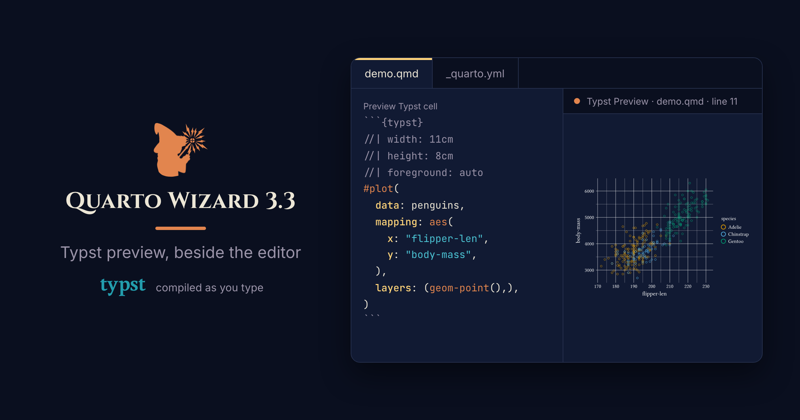{
  .img-featured
  .img-fluid
  fig-align="center"
  fig-alt=''
  width="600px"
}

** Quarto Wizard 3.3** adds a preview for Typst blocks, and publishes the Lua validator that an extension can use to check its own options.
This post shows both.

::: {.highlight}

** Quarto Wizard 3.3** is available from the [VS Code Marketplace](https://marketplace.visualstudio.com/items?itemName=mcanouil.quarto-wizard) and the [Open VSX Registry](https://open-vsx.org/extension/mcanouil/quarto-wizard).

:::

## Preview a Typst Block

Writing Typst inside a Quarto document used to mean rendering the whole document to see one small block.
Quarto Wizard 3.3 compiles the block under the cursor and shows the image beside the editor.
It uses the Typst binary that ships inside Quarto, so there is nothing else to install.

Put the cursor inside a Typst block, then run **Quarto Wizard: Preview Typst Block**, or select the code lens above the block.
The cell below draws the penguins with [Gribouille](https://m.canouil.dev/gribouille/), and the image beside it is what the render produces.

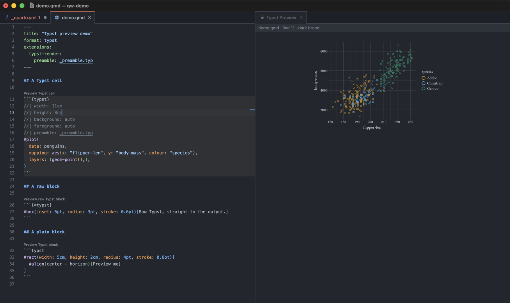{
  .dark-content
  .img-fluid .img-thumbnail .rounded-3 .border-light
  width="600px" fig-align="center" group="quarto-wizard-dark"
  fig-alt=''
}

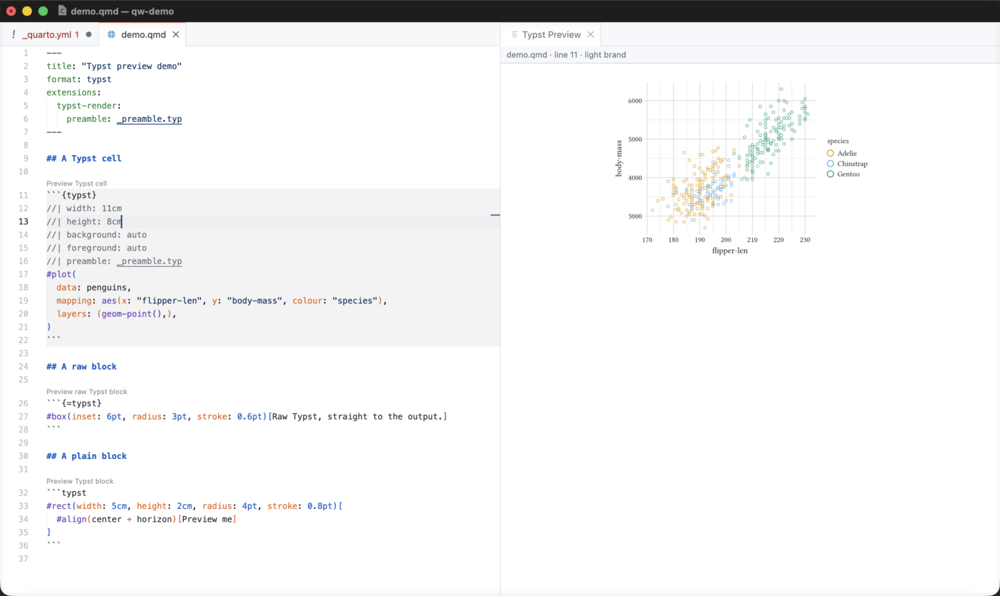{
  .light-content
  .img-fluid .img-thumbnail .rounded-3 .border-light
  width="600px" fig-align="center" group="quarto-wizard-light"
  fig-alt=''
}

The panel then follows the cursor, and it compiles again after each edit.
Move the cursor to another block, of any of the three kinds, and the panel shows that one instead.

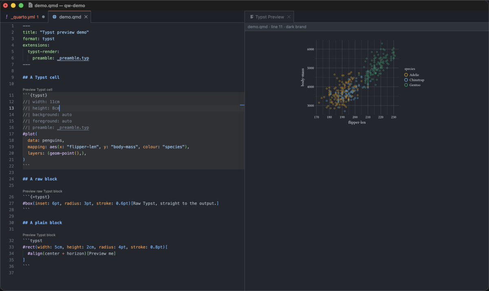{
  .dark-content
  .img-fluid .img-thumbnail .rounded-3 .border-light
  width="600px" fig-align="center" group="quarto-wizard-dark"
  fig-alt=''
}

{
  .light-content
  .img-fluid .img-thumbnail .rounded-3 .border-light
  width="600px" fig-align="center" group="quarto-wizard-light"
  fig-alt=''
}

The panel writes a failure over the last good image of the same block.
The preview therefore does not go empty while you type.

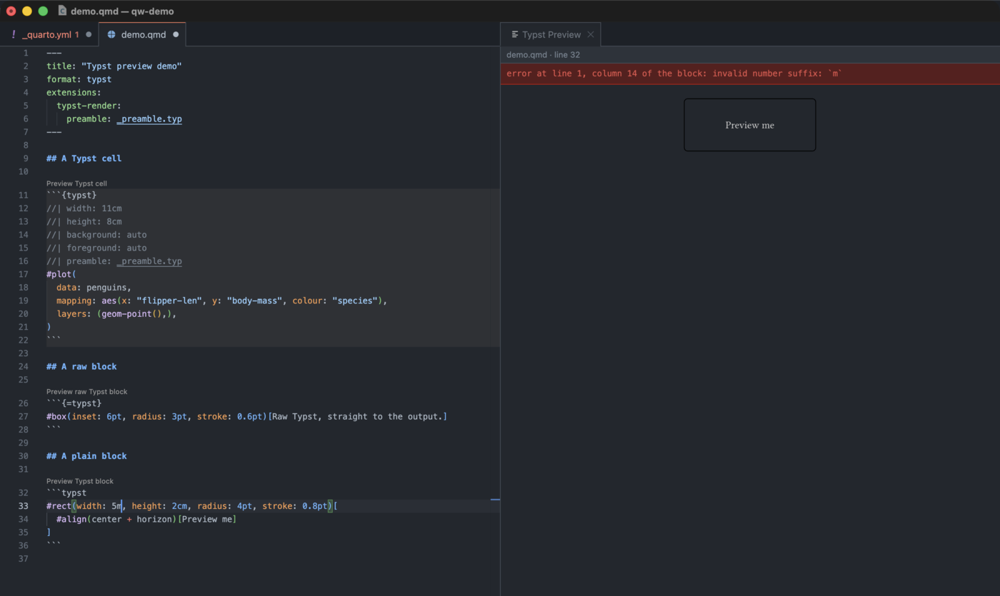{
  .dark-content
  .img-fluid .img-thumbnail .rounded-3 .border-light
  width="600px" fig-align="center" group="quarto-wizard-dark"
  fig-alt=''
}

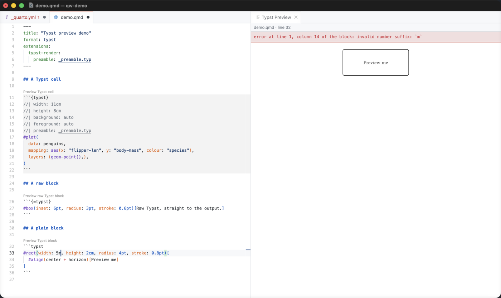{
  .light-content
  .img-fluid .img-thumbnail .rounded-3 .border-light
  width="600px" fig-align="center" group="quarto-wizard-light"
  fig-alt=''
}

The full compiler output goes to the Quarto Wizard log.

::: {.callout-tip}

`quartoWizard.typstPreview.debounceMs` sets how long an edit waits before the preview follows it.
Its default is 300 milliseconds.
Set it to `0` to compile on every keystroke, and raise it when a block is slow to compile.

:::

### Where the Image Appears

`quartoWizard.typstPreview.surface` selects where the image is shown.

- `panel`, the default, shows the image beside the editor.
  The panel scrolls, so a tall image is never cut.
- `hover` shows the image when the pointer rests on a block.
- `off` shows no image, and offers no code lens.

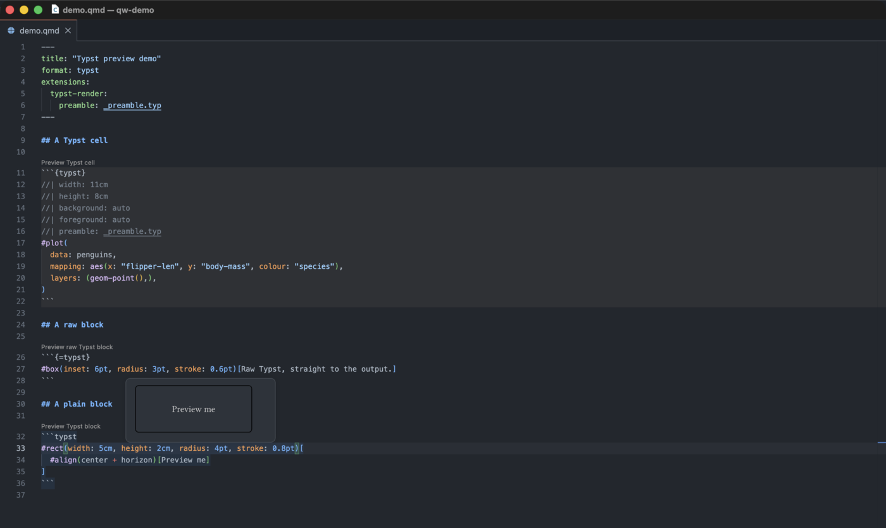{
  .dark-content
  .img-fluid .img-thumbnail .rounded-3 .border-light
  width="500px" fig-align="center" group="quarto-wizard-dark"
  fig-alt=''
}

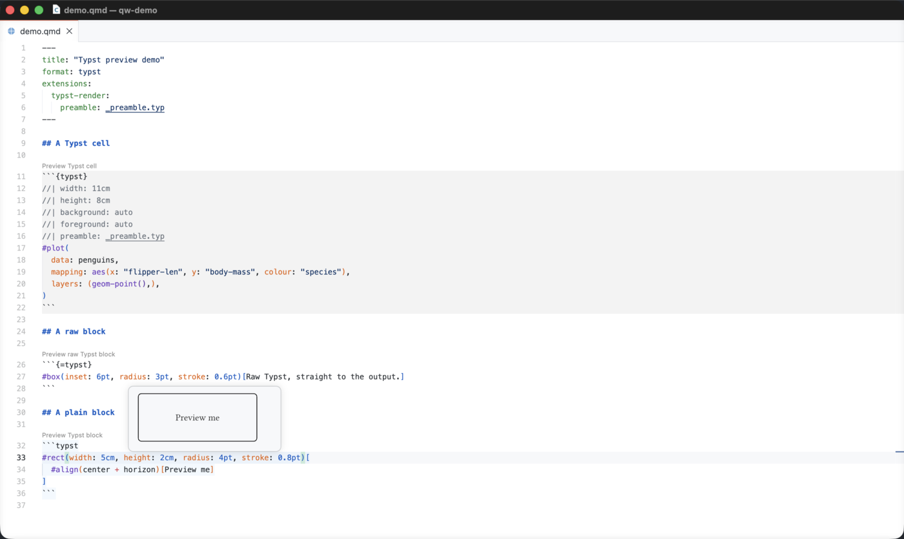{
  .light-content
  .img-fluid .img-thumbnail .rounded-3 .border-light
  width="500px" fig-align="center" group="quarto-wizard-light"
  fig-alt=''
}

A hover cannot scroll, so the image is scaled down to `quartoWizard.typstPreview.maxHeight`.

### Three Kinds of Block

Three fences are spelled almost the same way, and Quarto treats each one differently.
The preview treats them differently too, and the code lens above each block says which kind it is.

| Fence | What Quarto does with it | What the preview compiles |
| --- | --- | --- |
| ` ```typst ` | Highlights it, and never executes it. | The body, under the preview's own page setup and colours. |
| ` ```{=typst} ` | Passes it to the Typst output untouched. | The body, under every raw block above it in the document. |
| ` ```{typst} ` | Executes it through the [typst-render](https://m.canouil.dev/quarto-typst-render/) extension. | The body, under the options and the colours of that extension. |

A `{typst}` cell needs `typst-render` installed in the project.
Without it the preview says so and shows nothing.
An image compiled with guessed options is not the image the render produces, which is worse than no image at all.

Quarto Wizard installs it for you, in the folder you pick:

[Install in VS Code](vscode://mcanouil.quarto-wizard/install?repo=mcanouil/quarto-typst-render){.btn .btn-primary .btn-sm role="button"}
[Install in Positron](positron://mcanouil.quarto-wizard/install?repo=mcanouil/quarto-typst-render){.btn .btn-primary .btn-sm role="button"}

The other two kinds need no extension.

### Colours

A plain block and a raw block take their colours from `quartoWizard.typstPreview.foreground` and `quartoWizard.typstPreview.background`.
Both accept three forms.
`auto`, the default, follows the editor theme.
`none` writes no colour, so Typst uses its own black on white.
Any other value is a Typst colour expression written as it stands, for example `rgb("#ff9800")`.

A `{typst}` cell keeps the colour contract of `typst-render` instead, so the image matches the render and not the editor.
A cell that resolves a colour from a brand needs a side of that brand.
**Quarto Wizard: Switch Typst Preview Brand Mode** shows the other side, and the panel header always says which side it used.

### Paths and the Compile Root

The preview sends the block to Typst through standard input.
A path inside the block therefore resolves against the compile root, and not against the file that holds the block.

The preview uses the root that a render uses.
For a `{typst}` cell, that is the `root` value under `extensions.typst-render`, whose default is the directory of the document.
A cell also compiles with the `font-path`, the `package-path` and the `input` values of the extension.
A plain block and a raw block always use the directory of the document.

### Open the File a Path Points To

A `file:` option and a `preamble:` option name a file.
Hold <kbd>Ctrl</kbd>, or <kbd>Cmd</kbd> on macOS, and select the value to open that file in the editor.

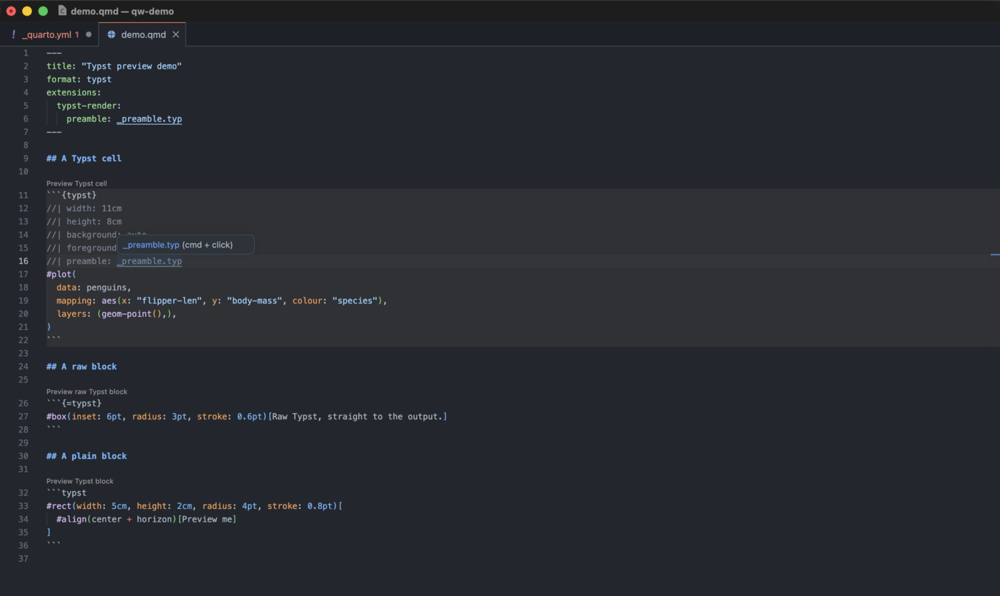{
  .dark-content
  .img-fluid .img-thumbnail .rounded-3 .border-light
  width="500px" fig-align="center" group="quarto-wizard-dark"
  fig-alt=''
}

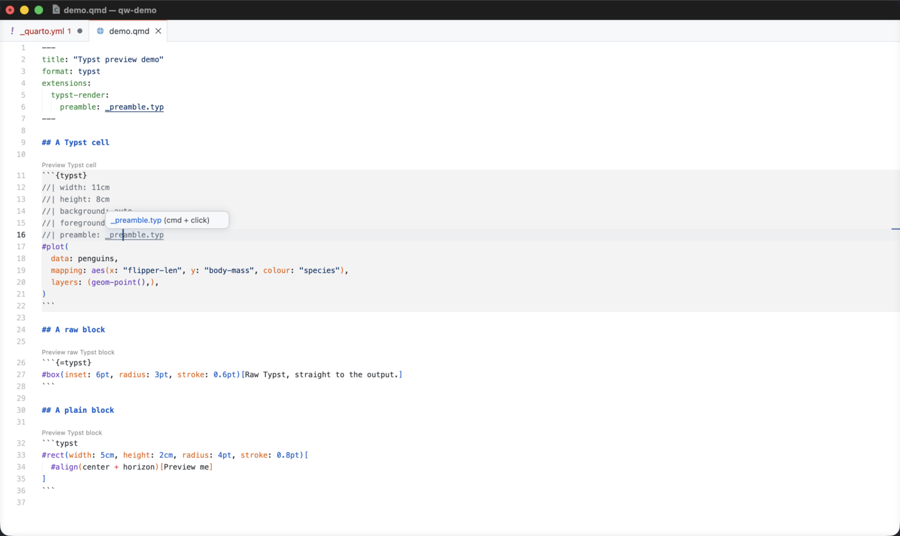{
  .light-content
  .img-fluid .img-thumbnail .rounded-3 .border-light
  width="500px" fig-align="center" group="quarto-wizard-light"
  fig-alt=''
}

The link appears only when the file is there.
A path that leads to no file gets a warning instead.
`file:` works in a cell only, while `preamble:` also works in the front matter of a document, and under `extensions.typst-render` in `_quarto.yml` or `_metadata.yml`.

### The Limits of the Preview

The preview is an authoring aid, and it is not a render.
The limits below are the limits of this first version, and most of them can be lifted later.

::: {.callout-important}

The preview differs from a render in two ways, and it says so beside the image when the difference applies.
A raw block reaches Typst through the document template during a render, and the template contributes imports and rules that the preview does not apply yet.
The preview also compiles one block on its own, so a plain block that uses a value from another block fails.

:::

The preview shows the first page of a block of several pages, it always compiles to SVG, and it does not yet see the payload that the R and Python helpers of `typst-render` produce during a render.

One limit is deliberate and stays.
The preview is off in an untrusted workspace, because it runs a compiler over the content of that workspace.

## One Schema, Two Validators

The other half of 3.3 is for people who write extensions.
It is about `_schema.yml`, the file where an extension declares every option, shortcode argument, format key, attribute and class that it accepts.
If you only use extensions, this part changes nothing for you, beyond better messages from the extensions that adopt it.

Quarto Wizard has read that file for a while, to offer completion, hover documentation and diagnostics.
A value of the wrong type, or a key the extension does not declare, is reported while you write.

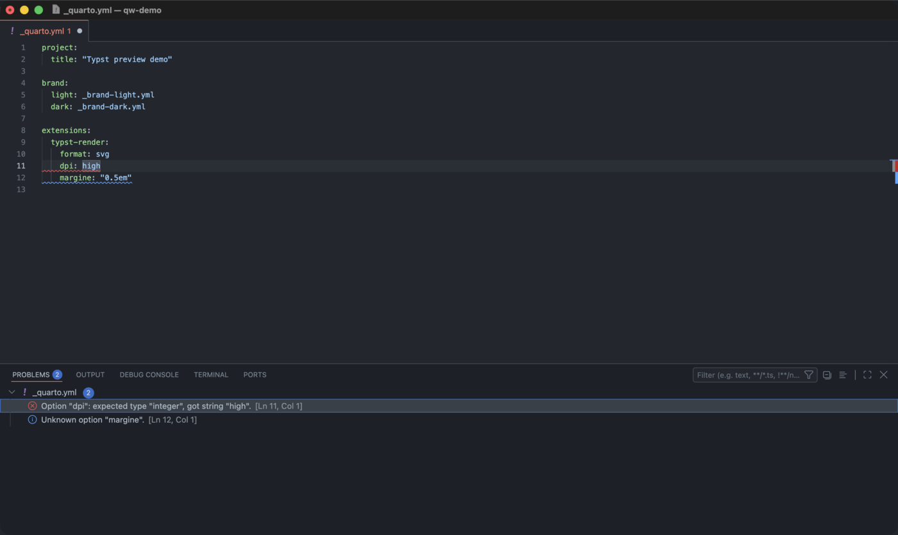{
  .dark-content
  .img-fluid .img-thumbnail .rounded-3 .border-light
  width="600px" fig-align="center" group="quarto-wizard-dark"
  fig-alt=''
}

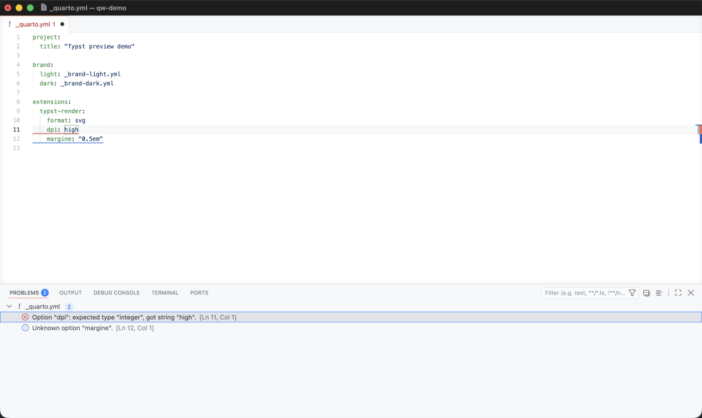{
  .light-content
  .img-fluid .img-thumbnail .rounded-3 .border-light
  width="600px" fig-align="center" group="quarto-wizard-light"
  fig-alt=''
}

That covers the editor only.
Someone who writes an option by hand in `_quarto.yml`, with no editor to help, still reaches the render with a wrong value.
So 3.3 publishes the Lua validator that reads the same file during the render.

::: {.highlight}

**Two artefacts, two jobs:** the meta-schema JSON validates your `_schema.yml` while you write it, and the Lua module validates the metadata of your user while Quarto renders.

:::

The meta-schema is the file you point `$schema` at.

```{.yaml filename="_extensions/my-extension/_schema.yml"}
$schema: https://m.canouil.dev/quarto-wizard/assets/schema/v2/extension-schema.json
options:
  theme:
    type: string
    description: "Colour theme for the extension output."
    default: light
    enum: [light, dark, auto]
  count:
    type: integer
    default: 3
    minimum: 1
    maximum: 100
```

The module is published as [`schema.lua`](https://m.canouil.dev/quarto-wizard/assets/schema/v2/schema.lua){target="_blank" rel="noopener noreferrer"}.
Its version is the version of the vocabulary, so the v2 module implements the v2 meta-schema.
Vendor it into your extension, because a render must not need network access.

```{.lua filename="_extensions/my-extension/my-extension.lua"}
local schema = require(quarto.utils.resolve_path('_modules/schema.lua'):gsub('%.lua$', ''))  -- <1>

local options = schema.validate_options(                                                     -- <2>
  meta,
  'my-extension',
  quarto.utils.resolve_path('_schema.yml')
)
```

1. Load the vendored copy by its absolute path.
   Lua keys its module cache by the name you pass, so `require('_modules.schema')` would hand the second extension of a render the copy of the first one.
2. Read `meta.extensions.my-extension`, test every value against the schema, and return the options with the defaults applied.

Errors and warnings go through the Quarto logger, and a schema that cannot be read never stops the render.
Narrower entry points exist for a shortcode call, for the attributes of an element, and for a format block.
The [Using the Lua Validator](https://m.canouil.dev/quarto-wizard/reference/schema-validator.html) page, added to the Quarto Wizard documentation in this release, describes each one.

The v2 meta-schema also accepts `uniqueItems` now.
The validator already enforced that keyword, so a schema that used it was rejected by the meta-schema and accepted by the module.
Both agree again.

## Other Fixes

- An extension in a repository whose default branch is `master` installs without writing `@master`.
  The branch is read from GitHub when the repository has no release, no tag and no registry entry.
- A Typst block written between two `---` lines that open no front matter is found.
  The rule the preview follows is the rule Pandoc applies.

The [changelog](https://github.com/mcanouil/quarto-wizard/blob/main/CHANGELOG.md) holds the full list.

Happy writing!
