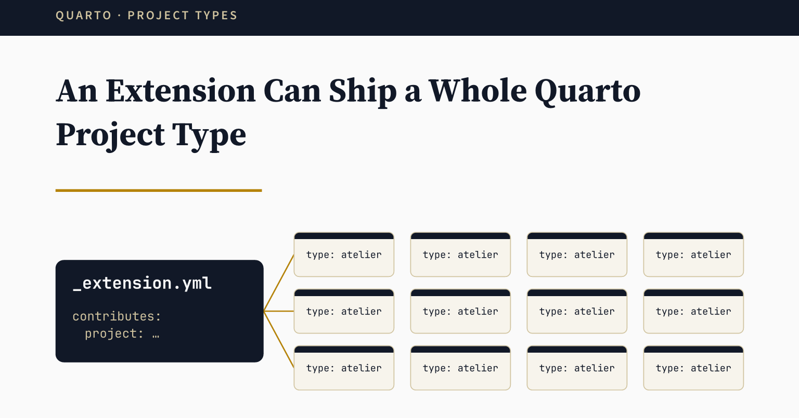

I maintain more than forty Quarto extensions, and each one has its own documentation website.
For a long time, each site had its own copy of the same `_quarto.yml`, and the copies drifted apart.
This post shows how I moved that shared configuration into a Quarto extension that ships a project type.

{
  .img-featured
  .img-fluid
  fig-align="center"
  fig-alt=''
  width="600px"
}

## The Problem

A good Quarto website needs more than a title and a navbar.
You want edit and issue links, Open Graph and Twitter card tags, page navigation, search, a footer, a table of contents, and some accessibility fixes.
That is close to a hundred lines of YAML before you write the first page.

The usual way to get there is to copy `_quarto.yml` from the last site you built.
It works once.
Then you fix something in one site, forget to fix it in the others, and after a year no two sites have the same configuration.

## A Project Type in an Extension

Most Quarto extensions contribute a filter, a shortcode, or a format.
An extension can also contribute a project type[^project-types].
It inherits from one of the base types (`default`, `website`, or `book`), and it sets the default values for `_quarto.yml`.

[^project-types]: See the Quarto documentation on [Project Types](https://quarto.org/docs/extensions/project-types.html).

[`quarto-atelier`](https://github.com/mcanouil/quarto-atelier) is such an extension.
I made it for the documentation websites of my extensions, so I could maintain one configuration instead of forty custom ones.
Its project type is called `atelier`, and it is a `website` underneath.
A site that uses it writes very little:

```{.yaml filename="_quarto.yml"}
project:
  type: atelier

website:
  title: "My Extension"
  site-url: https://example.org/my-extension
  repo-url: https://github.com/example/my-extension
  navbar:
    left:
      - href: index.qmd
        text: Home
```

The title, the URLs, and the navbar items belong to the site.
Everything else comes from the extension.

## What the Site Gets

From those few lines, the site inherits:

- `_site` as the output directory, and edit and issue links to the repository.
- Open Graph and Twitter card tags, with `en_GB` as the locale and a large image card.
- Page navigation, a back to top link, a table of contents, and copy buttons on code blocks.
- An `llms.txt` file, and a search overlay in the navbar.
- A footer, and a theme that reads the site's `_brand.yml` for its colours in light and dark mode.
- A filter that adds the head tags Quarto leaves out, such as `og:url` and the page description.
- Six small HTML scripts, among them a skip link and a few accessibility fixes.

I checked this on a test site with only the lines above.
The rendered page had the `og:locale` and `twitter:card` tags, the skip link, and the GitHub link in the navbar.
The `_site` folder had an `llms.txt` next to the pages.

::: {.highlight}

**One release, every site:** when I change a default in `quarto-atelier`, every site gets it at its next extension update.

:::

Each site keeps its own copy of the extension under `_extensions/`, so the update is not instant.
In each repository, a scheduled GitHub Actions [workflow](https://github.com/mcanouil/quarto-workflows/blob/main/.github/workflows/quarto-extensions-updates.yml) runs [Quarto Extensions Updater](https://github.com/mcanouil/quarto-extensions-updater) once a month, the action I wrote about in [an earlier post](../2025-12-12-quarto-extensions-updater/index.qmd).
It compares the installed extensions with the [Quarto extensions registry](https://m.canouil.dev/quarto-extensions/), using the same core library as [Quarto Wizard](https://github.com/mcanouil/quarto-wizard).
When `quarto-atelier` has a new release, it opens a pull request with the release notes, so every update is a change I can review before it lands.

## Overriding One Value

The site can still change any inherited value.
Quarto merges the defaults of the project type with the site's `_quarto.yml`, and the site wins.

For example, `atelier` puts the search in the navbar as an overlay.
The documentation site of `quarto-badge` has no navbar, only a sidebar.
So it moves the search there:

```{.yaml filename="_quarto.yml"}
website:
  search:
    location: sidebar
    type: textbox
```

The merge works key by key.
On my test site, I replaced only the centre of the footer.
The left part of the footer, which I did not touch, stayed as `atelier` set it.

## Where It Stops

There are two limits to keep in mind.

First, lists are added together, not replaced.
If a site adds its own script to `include-after-body`, it gets that script and the five from `atelier`.
A site cannot remove one inherited script or filter.
If a site needs that, the default does not belong in the shared project type.

Then, every site moves with the extension.
That is the point, but it also means a bad default reaches all of them.
The monthly pull requests are the safety net, because each site takes the change through its own review.

## Why So Few People Do This

Custom project types are rare.
On GitHub, code search finds `type: atelier` in 48 of my repositories, and in none outside them.

I think it is because the feature is easy to miss.
The documentation shows it, but most people meet extensions as filters and formats, and never look further.
If you maintain more than two or three Quarto websites, it is worth a look.

## Try It

Install the extension in your project:

```bash
quarto add mcanouil/quarto-atelier
```

Then set `type: atelier` in `_quarto.yml`.
It needs Quarto 1.9.36 or later.

The source is on [ GitHub](https://github.com/mcanouil/quarto-atelier), and the [documentation site](https://m.canouil.dev/quarto-atelier/) is built with the project type itself.

Happy publishing!
